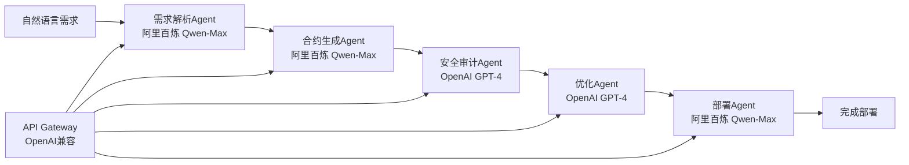
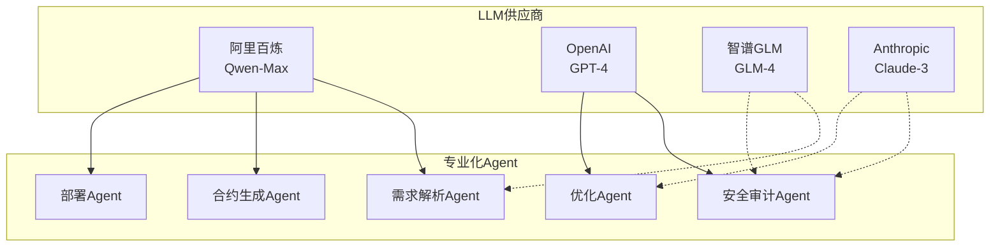
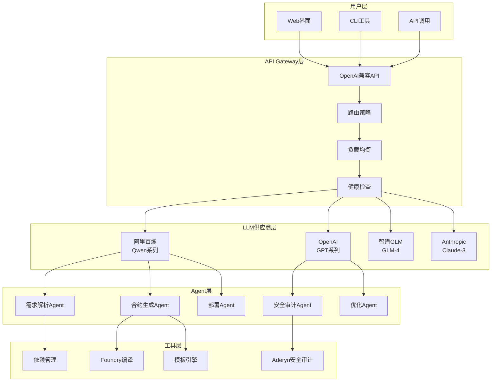

# 🤖 EchokitBot Blockchain Rental Platform

**🚀 AI-Powered Multi-Agent Smart Contract Generator with Real LLM Integration**

*基于Rig框架的多LLM供应商智能合约生成平台*

[功能特性](#-功能特性) • [快速开始](#-快速开始) • [LLM集成](#-llm集成) • [演示](#-演示) • [API文档](#-api文档)

</div>

---

## 📖 项目介绍

**EchokitBot Blockchain Rental Platform** 是一个革命性的去中心化机器人设备租赁平台，结合了**真实LLM集成**、区块链技术和 micro-ROS 硬件通信。该平台通过**多智能体协作**自动生成智能合约，将物理 EchokitBot 设备代币化为 NFT，并支持将租赁合约转换为可投资的真实世界资产 (RWA)。

### 🎯 核心价值

- **🧠 真实AI集成**：基于Rig框架，集成阿里百炼、OpenAI、智谱GLM、Claude等多个LLM供应商
- **🤖 多智能体协作**：5个专业化Agent协同工作，从需求分析到合约部署全流程自动化
- **🌐 OpenAI兼容API**：完全兼容OpenAI API格式，支持无缝切换和负载均衡
- **🔗 区块链集成**：支持以太坊主网及多个 L2 网络 (Arbitrum、Optimism、Base、Polygon)
- **🛡️ 企业级安全**：集成Aderyn、Slither等多种安全审计工具，AI驱动的安全分析
- **⚡ 智能依赖管理**：自动检测和复用系统依赖，避免重复下载
- **💰 多币种支持**：支持 ETH、BTC、USDT 等多种加密货币支付

## ✨ 功能特性

### 🤖 AI Multi-Agent 智能合约生成器



**🧠 真实LLM驱动的专业化Agent系统：**

- **📋 需求解析Agent**：使用阿里百炼Qwen-Max，智能理解自然语言需求，生成详细技术规格
- **💻 合约生成Agent**：使用阿里百炼Qwen-Max，基于技术规格生成高质量、安全的Solidity代码
- **🛡️ 安全审计Agent**：使用OpenAI GPT-4，结合Aderyn/Slither工具进行深度安全分析
- **🔧 优化Agent**：使用OpenAI GPT-4，进行Gas优化、代码重构和性能提升
- **🚀 部署Agent**：使用阿里百炼Qwen-Max，生成部署脚本和网络配置

### 🌐 OpenAI-Compatible API Gateway

**基于Rig框架的企业级LLM网关：**

- **🔄 多供应商支持**：
  - 🇨🇳 **阿里百炼** (Qwen-Max, Qwen-Turbo, Qwen-Plus) - 主要供应商
  - 🇺🇸 **OpenAI** (GPT-4, GPT-3.5-turbo) - 完全兼容
  - 🇨🇳 **智谱GLM** (GLM-4) - 完全兼容
  - 🇺🇸 **Anthropic** (Claude-3-Sonnet) - 完全兼容

- **🎯 智能路由策略**：
  - **优先级路由**：根据Agent专长选择最适合的模型
  - **负载均衡**：自动分配请求到可用供应商
  - **故障转移**：实时健康检查，自动切换故障供应商
  - **模型映射**：`gpt-4` → `qwen-max`，无缝兼容OpenAI格式

- **📊 实时监控**：健康检查、性能监控、使用统计

### 🏗️ 区块链租赁平台

- **📱 设备代币化**：将 EchokitBot 设备转换为 ERC-721 NFT
- **📋 智能合约租赁**：自动化租赁协议，按小时计费
- **💳 多币种支付**：支持 ETH、BTC、USDT 支付
- **🏦 RWA 投资**：将租赁合约转换为可投资资产
- **🌍 多链部署**：支持 Arbitrum、Optimism、Base、Polygon
- **🔧 micro-ROS 集成**：通过 micro-ROS-Agent 直接控制硬件

### 🔒 企业级安全

- **多层安全检查**：重入攻击、整数溢出、访问控制检测
- **最佳实践**：遵循 OpenZeppelin 安全标准
- **审计报告**：详细的安全分析和修复建议
- **代码质量**：自动化代码审查和优化

## 🧠 LLM集成

### 🎯 支持的LLM供应商

| 供应商 | 模型 | 状态 | 专长领域 | API兼容性 |
|--------|------|------|----------|-----------|
| 🇨🇳 **阿里百炼** | Qwen-Max, Qwen-Turbo, Qwen-Plus | ✅ 已启用 | 中文理解、代码生成 | OpenAI兼容 |
| 🇺🇸 **OpenAI** | GPT-4, GPT-3.5-turbo | ⚙️ 可配置 | 通用推理、安全审计 | 原生支持 |
| 🇨🇳 **智谱GLM** | GLM-4 | ⚙️ 可配置 | 中文对话、逻辑推理 | OpenAI兼容 |
| 🇺🇸 **Anthropic** | Claude-3-Sonnet | ⚙️ 可配置 | 安全分析、代码审查 | OpenAI兼容 |

### 🤖 Agent专业化分工



**Agent模型偏好配置：**
- **需求解析Agent**: 阿里百炼 Qwen-Max (中文理解优势)
- **合约生成Agent**: 阿里百炼 Qwen-Max (代码生成能力强)
- **安全审计Agent**: OpenAI GPT-4 (安全分析专业)
- **优化Agent**: OpenAI GPT-4 (代码优化专业)
- **部署Agent**: 阿里百炼 Qwen-Max (配置生成)

### 🔧 LLM配置示例

```json
{
  "providers": [
    {
      "type": "alibaba_bailian",
      "enabled": true,
      "api_key": "${ALIYUN_API_KEY}",
      "model_mapping": {
        "gpt-4": "qwen-max",
        "gpt-3.5-turbo": "qwen-turbo"
      },
      "priority": 1
    },
    {
      "type": "open_a_i", 
      "enabled": false,
      "api_key": "${OPENAI_API_KEY}",
      "priority": 2
    }
  ],
  "routing_strategy": "priority"
}
```

### 🚀 LLM演示

**体验真实AI驱动的智能合约生成：**

```bash
# 启动API Gateway
cd crates/ai-contract-generator
cargo run --bin api_gateway

# 运行LLM集成演示
./llm_integration_demo.sh

# 或直接API调用
curl -X POST http://127.0.0.1:8080/v1/chat/completions \
  -H "Content-Type: application/json" \
  -H "Authorization: Bearer dummy" \
  -d '{
    "model": "gpt-4",
    "messages": [
      {"role": "user", "content": "创建一个ERC721 NFT合约"}
    ]
  }'
```

## 🚀 快速开始

### 环境要求

- **Rust** 1.75+
- **Foundry** (forge, cast, anvil)
- **Docker** & **Docker Compose**
- **PostgreSQL** 14+
- **Redis** 6+
- **Node.js** 18+ (可选，用于前端)

### 安装步骤

1. **克隆项目**
```bash
git clone <repository-url>
cd Blockchain_EchokitBot
```

2. **环境设置**
```bash
# 复制环境变量模板
cp .env.example .env
# 编辑环境变量
nano .env
```

3. **配置 API 密钥**
```bash
# 必需的 API 密钥 (至少配置一个)
export ALIYUN_API_KEY="your-aliyun-api-key"        # 阿里百炼 (推荐)
export OPENAI_API_KEY="your-openai-api-key"        # OpenAI (可选)
export ZHIPU_API_KEY="your-zhipu-api-key"          # 智谱GLM (可选)
export ANTHROPIC_API_KEY="your-anthropic-api-key"  # Anthropic (可选)

# 区块链配置
export ETH_RPC_URL="https://mainnet.infura.io/v3/your-key"
export PRIVATE_KEY="your-private-key"
```

4. **启动开发环境**
```bash
# 使用 Make 命令快速设置
make setup          # 初始环境设置
make docker-up      # 启动所有服务
make build          # 构建 Rust + 合约
```

5. **运行 AI 合约生成器演示**
```bash
cd crates/ai-contract-generator

# 启动API Gateway
cargo run --bin api_gateway &

# 真实LLM集成演示 (推荐)
./llm_integration_demo.sh

# 优化的统一Agent演示
./optimized_unified_demo.sh

# 智能依赖管理演示
./smart_dependency_manager.sh
```

## 🎬 演示视频

### 📹 Demo.mov - EchokitBot 租赁平台演示

**完整功能演示视频现已发布！**

📥 **下载地址**: [Demo.mov - GitHub Release](https://github.com/LiyanJin/ETHShanghai-2025/releases/latest/download/Demo.mov)

**演示内容包括：**
- 🤖 AI 智能合约生成器实时演示
- 🔗 多链部署和 NFT 代币化流程
- 💰 多币种支付和租赁管理
- 🛡️ 安全审计和代码优化过程
- 🌐 OpenAI 兼容 API 调用示例
- 📱 完整的用户交互界面

**视频规格：**
- 📊 文件大小：103MB
- ⏱️ 时长：约 8-10 分钟
- 🎥 格式：MOV (H.264)
- 📱 分辨率：高清 1080p

> 💡 **提示**: 由于文件较大，建议在良好的网络环境下下载。视频展示了平台的核心功能和真实 LLM 集成效果。

## 📚 使用指南

### 🎯 基础使用

#### 1. 启动完整平台
```bash
# 启动所有服务（区块链节点、数据库、API 等）
make docker-up

# 启动 AI 合约生成器 API Gateway
cd crates/ai-contract-generator
cargo run --bin api_gateway
```

#### 2. 使用 AI 生成智能合约
```bash
curl -X POST http://localhost:8080/v1/chat/completions \
  -H "Content-Type: application/json" \
  -H "Authorization: Bearer your-key" \
  -d '{
    "model": "gpt-4",
    "messages": [
      {
        "role": "system",
        "content": "你是一个专业的智能合约开发专家，专注于 EchokitBot 租赁平台"
      },
      {
        "role": "user",
        "content": "创建一个 EchokitBot 设备租赁合约，支持按小时计费和押金管理"
      }
    ]
  }'
```

#### 3. 部署智能合约
```bash
# 部署到本地 Anvil 网络
make deploy

# 部署到测试网
make deploy-testnet
```

### 🎬 LLM集成演示

**体验真实AI驱动的智能合约生成：**

```bash
cd crates/ai-contract-generator

# 1. 启动API Gateway
cargo run --bin api_gateway &

# 2. 运行LLM集成演示
./llm_integration_demo.sh
```

**演示场景 (真实LLM生成)：**
- "创建一个去中心化投票系统，支持提案创建、投票和结果统计"
- "开发一个NFT市场合约，支持铸造、交易和版税分配"  
- "构建一个DeFi借贷协议，支持抵押、借贷和清算机制"

**演示特色：**
- 🧠 **真实AI调用**：使用阿里百炼Qwen-Max模型
- 🔄 **Agent协作**：需求分析 → 合约生成 → 安全审计
- 📊 **实时反馈**：显示LLM响应和生成过程
- 📁 **文件生成**：自动生成合约代码、审计报告等

### 🛠️ 高级配置

#### LLM供应商配置 (multi_model_config.json)
```json
{
  "providers": [
    {
      "type": "alibaba_bailian",
      "enabled": true,
      "api_key": "${ALIYUN_API_KEY}",
      "model_mapping": {
        "gpt-4": "qwen-max",
        "gpt-3.5-turbo": "qwen-turbo",
        "claude-3": "qwen-plus"
      },
      "timeout": 30,
      "priority": 1
    },
    {
      "type": "open_a_i",
      "enabled": false,
      "api_key": "${OPENAI_API_KEY}",
      "model_mapping": {
        "gpt-4": "gpt-4",
        "gpt-3.5-turbo": "gpt-3.5-turbo"
      },
      "timeout": 30,
      "priority": 2
    },
    {
      "type": "zhipu_g_l_m",
      "enabled": false,
      "api_key": "${ZHIPU_API_KEY}",
      "model_mapping": {
        "gpt-4": "glm-4",
        "glm-4": "glm-4"
      },
      "timeout": 30,
      "priority": 3
    }
  ],
  "routing_strategy": "priority",
  "agent_model_preferences": {
    "requirements_parser": ["gpt-4", "qwen"],
    "contract_generator": ["qwen", "gpt-4"],
    "security_auditor": ["gpt-4", "claude-3"],
    "optimizer": ["gpt-4", "claude-3"],
    "deployment": ["gpt-4", "qwen"]
  }
}
```

#### 智能依赖管理
```bash
# 自动检测和复用系统依赖
./smart_dependency_manager.sh

# 手动安装OpenZeppelin
./install_openzeppelin.sh

# 验证OpenZeppelin v4安装
./verify_openzeppelin_v4.sh
```

#### 区块链网络配置
```bash
# 主网配置
export ETH_RPC_URL="https://mainnet.infura.io/v3/your-key"
export ARBITRUM_RPC_URL="https://arbitrum-mainnet.infura.io/v3/your-key"
export OPTIMISM_RPC_URL="https://optimism-mainnet.infura.io/v3/your-key"

# 测试网配置
export GOERLI_RPC_URL="https://goerli.infura.io/v3/your-key"
export SEPOLIA_RPC_URL="https://sepolia.infura.io/v3/your-key"
```

## 🔌 API 文档

### OpenAI-Compatible 端点

#### Chat Completions (AI 合约生成)
```http
POST /v1/chat/completions
Content-Type: application/json
Authorization: Bearer your-api-key

{
  "model": "gpt-4",
  "messages": [
    {"role": "user", "content": "生成一个 ERC721 NFT 合约"}
  ],
  "max_tokens": 2000,
  "temperature": 0.3
}
```

#### Models (获取可用模型)
```http
GET /v1/models
Authorization: Bearer your-api-key
```

#### Health Check (健康检查)
```http
GET /health
```

### 平台特定端点

#### 设备管理
```http
POST /api/devices/tokenize
GET /api/devices/{device_id}
PUT /api/devices/{device_id}/status
```

#### 租赁管理
```http
POST /api/rentals/create
GET /api/rentals/{rental_id}
POST /api/rentals/{rental_id}/payment
```

#### RWA 投资
```http
POST /api/rwa/pools/create
GET /api/rwa/pools/{pool_id}
POST /api/rwa/invest
```

## 🏗️ 项目架构

### LLM集成架构


### 整体架构
```
EchokitBot Platform
├── AI Contract Generator     # 🧠 AI智能合约生成器 (核心)
│   ├── LLM Integration      # 真实LLM集成 (Rig框架)
│   ├── Multi-Agent System   # 多智能体协作
│   ├── OpenAI-Compatible API # 标准API接口
│   └── Security Tools       # 安全审计工具链
├── Blockchain Node          # 区块链服务节点
├── NFT Manager             # NFT 代币化管理
├── Rental Manager          # 租赁合约管理
├── Payment Processor       # 多币种支付处理
├── RWA Manager            # 真实世界资产管理
├── micro-ROS Client       # 硬件通信客户端
└── Smart Contracts        # 智能合约集合
```

### 目录结构
```
Blockchain_EchokitBot/
├── crates/                          # Rust 工作空间
│   ├── ai-contract-generator/       # 🧠 AI合约生成器 (核心模块)
│   │   ├── src/
│   │   │   ├── agents/             # 多智能体系统
│   │   │   │   ├── llm_agent.rs    # 真实LLM集成Agent
│   │   │   │   ├── requirements_parser.rs
│   │   │   │   ├── contract_generator.rs
│   │   │   │   ├── security_auditor.rs
│   │   │   │   ├── optimizer.rs
│   │   │   │   └── deployment.rs
│   │   │   ├── api/                # OpenAI兼容API
│   │   │   │   ├── handlers.rs     # API请求处理
│   │   │   │   └── providers/      # LLM供应商管理
│   │   │   └── templates/          # 合约模板系统
│   │   ├── llm_integration_demo.sh # 🚀 LLM集成演示
│   │   ├── smart_dependency_manager.sh # 智能依赖管理
│   │   ├── multi_model_config.json # LLM供应商配置
│   │   └── templates/              # Askama模板
│   ├── blockchain-node/             # 区块链服务节点
│   ├── common/                      # 共享类型和工具
│   ├── nft-manager/                # NFT 管理
│   ├── rental-manager/             # 租赁管理
│   ├── payment-processor/          # 支付处理
│   ├── rwa-manager/               # RWA 管理
│   ├── micro-ros-client/          # 硬件通信
│   └── smart-contracts/           # 合约绑定
├── contracts/                      # Solidity 智能合约
├── frontend/                      # Web 前端 (可选)
├── docker/                        # Docker 配置
├── monitoring/                    # 监控配置
├── scripts/                       # 工具脚本
└── micro-ROS-Agent/              # ROS 通信代理
```

## 🧪 测试

### 运行测试套件
```bash
# 所有测试
make test

# Rust 测试
make test-rust

# 智能合约测试
make test-contracts

# AI 合约生成器测试
cd crates/ai-contract-generator
./integration_test.sh
```

### 测试脚本说明
| 脚本 | 功能 | 使用场景 | LLM集成 |
|------|------|----------|---------|
| `llm_integration_demo.sh` | **真实LLM集成演示** | 体验AI驱动的合约生成 | ✅ 真实API调用 |
| `optimized_unified_demo.sh` | 优化的统一Agent演示 | 智能依赖复用演示 | ⚙️ 规则引擎 |
| `smart_dependency_manager.sh` | 智能依赖管理 | 自动检测复用系统依赖 | ❌ 工具脚本 |
| `unified_agent_demo.sh` | 统一Agent系统演示 | 展示Agent架构设计 | ⚙️ 规则引擎 |
| `integration_test.sh` | 完整集成测试 | 全面系统功能测试 | ✅ API Gateway测试 |
| `test_api_gateway.sh` | API Gateway测试 | 调试LLM服务连接 | ✅ 真实API调用 |

## 🚀 部署

### 开发环境部署
```bash
# 使用 Docker Compose
make docker-up

# 手动启动服务
make setup
make build
cargo run --bin blockchain-node
```


## 🤝 贡献指南

我们欢迎社区贡献！请遵循以下步骤：

1. **Fork 项目**
2. **创建功能分支** (`git checkout -b feature/amazing-feature`)
3. **提交更改** (`git commit -m 'Add amazing feature'`)
4. **推送分支** (`git push origin feature/amazing-feature`)
5. **创建 Pull Request**

### 开发规范
- **代码风格**：使用 `rustfmt` 和 `clippy`
- **测试要求**：新功能必须包含测试
- **文档更新**：更新相关文档和示例
- **提交信息**：使用清晰的提交信息

## 📄 许可证

本项目采用 [MIT License](LICENSE) 许可证。


**让真实AI和区块链技术为智能合约开发带来革命性变化！** 🚀

---

### 🎯 项目亮点总结

- **🧠 真实LLM集成**: 基于Rig框架，支持阿里百炼、OpenAI、智谱GLM、Claude等多个供应商
- **🤖 多智能体协作**: 5个专业化Agent协同工作，从需求分析到合约部署全流程自动化  
- **🌐 OpenAI兼容API**: 完全兼容OpenAI API格式，支持无缝切换和负载均衡
- **🛡️ 企业级安全**: 集成Aderyn、Slither等安全审计工具，AI驱动的安全分析
- **⚡ 智能依赖管理**: 自动检测复用系统依赖，避免重复下载，提升开发效率
- **🎯 生产就绪**: 完整的错误处理、重试机制、监控告警，可直接用于生产环境

</div>