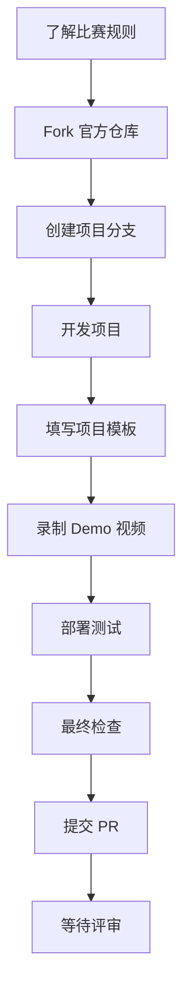

# ETHShanghai 2025 参赛选手操作流程指南

## 📋 总体流程概览



## 🚀 详细操作步骤

### 第一阶段：准备阶段（比赛开始前）

#### 1. 了解比赛规则
- [ ] 访问 [ETHShanghai 2025 官网](https://ethshanghai.org)
- [ ] 阅读赛道说明：AI × ETH、DeFi × Infra、公共物品 × 开源建设
- [ ] 了解评审标准：技术执行 35%、创新 30%、实用影响 15%、用户体验 10%、进展 10%
- [ ] 确认关键日期：最终提交截止 2025-10-20 24:00（北京时间）


#### 2. 奖金与奖励（Prizes）
    
    总奖金池：$15,500

    🥇 一等奖：$2,000
    🥈 二等奖：$1,500 *2 
    🥉 三等奖：$1,000 *2

    💰 特别奖项：
    Chain for Good 专项奖一等奖：$300 
    Chain for Good 专项奖二等奖：$150
    Chain for Good 专项奖三等奖：$50 

    峰会展示机会：一等奖获奖团队将登上 ETHShanghai 2025 峰会主舞台

    🚢 ETHPanda 远航计划：
    为助力更多青年开发者参与 ETHShanghai Hackathon，ETHPanda 特别推出「远航计划」，预计资助 30+ 青年开发者，每人最高可获得 $200 交通补助。
    👉 如果你是渴望远航的青年 Builder，这将是你进入ETHShanghai Hackathon 舞台的绝佳机会！


#### 3. Fork 官方仓库
```bash
# 访问官方仓库
https://github.com/ethpanda-org/ETHShanghai-2025

# 点击 Fork 按钮创建自己的副本
# 或使用命令行
git clone https://github.com/ethpanda-org/ETHShanghai-2025.git
cd ETHShanghai-2025
```

### 第二阶段：项目开发阶段（比赛期间）

#### 4. 创建项目目录
```bash
# 在你的 Fork 仓库中创建项目目录
mkdir projects/[你的团队名]-[项目名]
cd projects/[你的团队名]-[项目名]

# 创建推荐目录结构
mkdir contracts frontend backend deployments scripts docs
touch README.md
```

#### 5. 初始化项目
```bash
# 复制官方 README 模板到你的项目目录
cp ../../README.md ./README.md

# 开始填写项目信息
```

#### 6. 开发与实现
- [ ] 按照你的技术栈实现核心功能
- [ ] 编写智能合约（如需要）
- [ ] 开发前端界面（如需要）
- [ ] 实现后端服务（如需要）
- [ ] 编写测试用例

### 第三阶段：提交准备阶段（截止前 1-2 天）

#### 7. 完善项目文档
按照 README.md 模板填写以下内容：
- [ ] 项目概述（名称、介绍、目标用户、问题与解决方案）
- [ ] 架构与实现（总览图、关键模块、技术栈）
- [ ] 合约与部署信息（网络、地址、验证链接）
- [ ] 运行与复现说明（环境要求、启动命令）
- [ ] 团队与联系信息

#### 8. 录制 Demo 视频
- [ ] 视频时长：≤ 3分钟
- [ ] 语言：中文
- [ ] 内容：展示核心功能与完整流程
- [ ] 格式：MP4 或 WebM
- [ ] 上传到：YouTube、Bilibili 或其他视频平台
- [ ] 获取分享链接

#### 9. 部署与测试
- [ ] 部署智能合约到测试网（如需要）
- [ ] 获取合约地址和验证链接
- [ ] 准备在线演示环境
- [ ] 测试一键启动脚本
- [ ] 验证所有功能正常工作

### 第四阶段：最终提交阶段（截止日前）

#### 10. 最终检查清单
- [ ] README 按模板填写完整
- [ ] 本地可一键运行，关键用例可复现
- [ ] 测试网合约地址与验证链接已提供
- [ ] Demo 视频链接可访问
- [ ] 如未完全开源，已在"可验证边界"清晰说明
- [ ] 联系方式与可演示时段已填写

#### 11. 提交到官方仓库

```bash
# 在你的 Fork 仓库中提交更改
git add .
git commit -m "Add project: [项目名称]"
git push origin main

# 在 GitHub 上创建 Pull Request 到官方仓库
```


#### 12. 提交登记
- [ ] 在官方人员提供的 form 表单中完成项目登记
- [ ] 填写项目链接和 Demo 视频链接
- [ ] 确认提交状态


## 📝 提交材料清单

### 必需材料
- [ ] 完整的项目代码
- [ ] 填写完整的 README.md
- [ ] Demo 视频（≤3 分钟，中文）
<!-- - [ ] 项目 GitHub 链接 -->

### 可选材料
- [ ] 在线演示链接
- [ ] 合约部署信息和验证链接
- [ ] Pitch Deck（不计入评分）
- [ ] 技术架构图

## ⚠️ 注意事项

1. **原创性**： 禁止抄袭或拼接他人项目
2. **合规性**： 不得涉及赌博、ICO 或违法违规内容
3. **开源性**： 如因商业原因无法完全开源，需在"可验证边界"中明确说明
4. **时间**： 严格按时提交，逾期不候
5. **质量**： 确保代码质量和文档完整性


## 🎯 评分标准提醒

- **技术执行** (35%)： 代码质量、架构设计、测试覆盖
- **创新性** (30%)： 技术创新、解决方案新颖性
- **实用影响** (15%)： 解决实际问题的能力
- **用户体验** (10%)： 界面友好性、操作便捷性
- **进展** (10%)： 项目完成度、功能实现度

---

**祝各位参赛选手在 ETHShanghai 2025 中取得优异成绩！** 🏆
