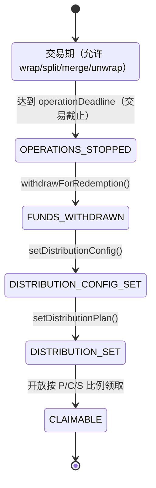
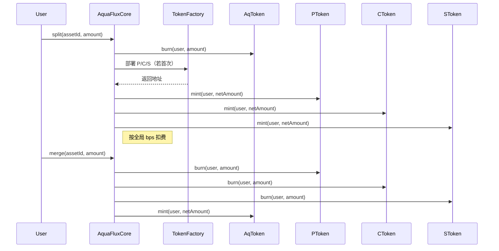

# AquaFlux — 结构化RWA的DeFi协议

> 一份底层资产（债券/存单/应收账款）→ 三个代币（P/C/S）表述。将真实世界收益分拆、组合、在 DeFi 中自由路由，并内置首损保护。

---

## TL;DR

- **是什么**：AquaFlux是一个专注于RWA赛道的创新DeFi协议，通过其独特的三代币模型将债券等传统金融资产在链上拆分和重构，显著提升资产的流动性、收益可定制性和风险管理能力，并构建全新的时间维度金融产品。
- **核心机制**：三代币模型：`PToken`（本金）、`CToken`（票息）、`SToken`（保护/首损）；由时间锁治理，内置费用计提与到期分配。
- **为什么**：让固定收益更可组合。用户可分别交易本金、票息与风险；协议对费用与到期现金流进行透明、可审计的分配。
- **怎么做**：`AquaFluxCore` 负责全生命周期：`register → verify → wrap → split ↔ merge → unwrap`，到期后 `withdrawForRedemption → setDistributionConfig → setDistributionPlan → claim`。

---

## 目录结构（合约子仓）

- `contracts/core/AquaFluxCore.sol`：核心注册与生命周期编排（UUPS 可升级），包含费用会计、状态机、到期分配。
- `contracts/core/TokenFactory.sol`：EIP‑1167代理工厂，按资产部署 `AQ / P / C / S` 代币实例。
- `contracts/token/`：
  - `AqToken.sol`：包裹底层资产（未分拆前）。
  - `PToken.sol`：本金分层。
  - `CToken.sol`：票息分层。
  - `SToken.sol`：首损/保护分层。
- `contracts/governance/`：
  - `AquaFluxTimelock.sol`：时间锁治理（参数/升级）。
  - `SimpleMultiSig.sol`：简单多签辅助治理操作。
- `contracts/utils/DateUtils.sol`：日期/名称格式化（如带到期后缀）。
- `contracts/interfaces/`：协议接口（`IAquaFluxCore`、`ITokenFactory`、`IBaseToken` 等）。
- `contracts/test/MockERC20.sol`：本地测试用模拟底层资产。
- `scripts/deploy.js`, `scripts/upgrade.js`：部署/升级脚本。
- `hardhat.config.ts`：编译/网络/校验配置（启用 viaIR 优化，0.8.24）。

---

## 架构概览

### 角色与权限（AccessControl）

- `DEFAULT_ADMIN_ROLE`：协议初始化管理员（分配角色）。
- `TIMELOCK_ROLE`：可全局/升级暂停、参数变更、费用调整。
- `VERIFIER_ROLE`：资产审核（`verify`）。
- `OPERATOR_ROLE`：单资产级暂停/恢复（风控操作）。

### 费用与会计（Fees & Accounting）

- 全局按操作的费率（bps）：`wrap`、`split`、`merge`、`unwrap`（0 表示关闭）。
- 每资产费用累计：`assetFeesCollected`、`assetFeesByOperation`、`assetFeeBalances`。
- 每资产底层余额追踪：`assetUnderlyingBalances`（净用户资产，费用已扣）。

### 资产生命周期状态机



### 用户高阶流程（Protocol Flow）

```mermaid
flowchart TD
    A[register(asset params)] --> B[verify(asset)]
    B --> C[wrap(underlying → AqToken)]
    C --> D[split Aq → P/C/S]
    D <--> E[merge P/C/S → Aq]
    E --> F[unwrap Aq → underlying]

    subgraph Maturity
      G[deadline reached]
      H[withdrawForRedemption]
      I[setDistributionConfig]
      J[setDistributionPlan]
      K[claim rewards]
    end

    F --> G
    G --> H --> I --> J --> K
```

### Split / Merge 时序



---

## 核心合约与职责（Key Contracts）

### `AquaFluxCore.sol`

- 资产登记与强约束：
  - `operationDeadline < maturity`。
  - `couponAllocationC + couponAllocationS == 10000`（100%）。
  - 所有 bps ≤ 10000；字符串/地址校验。
- 生命周期：
  - `wrap`/`unwrap`：底层与 `AqToken` 的转换，精确追踪净额与费用。
  - `split`/`merge`：`AqToken` 与 `P/C/S` 的 1:1:1 铸造/销毁（考虑费用）。
  - 资产级暂停（`OPERATOR_ROLE`），全局暂停（`TIMELOCK_ROLE`）。
- 到期与分配：
  - `withdrawForRedemption`：截止后提取净底层至发行方/代理进行线下兑付。
  - `setDistributionConfig`：设置分配代币（如 USDC）、资金地址与总额。
  - `setDistributionPlan`：固定 P/C/S 当时的总供给与分配；`S` 另含 `protocolFeeReward`（奖励费用）。
  - `claimMaturityReward` / `claimAllMaturityRewards`：按固定供给比例发放；用户代币会被销毁避免重领。
- 费用：
  - `setGlobalFeeRate(op, bps)` 设置；按资产与操作累计与提取。
  - `withdrawProtocolFees`：提取累计协议费用（安全检查不超过合约余额）。
- 可升级与安全：
  - UUPS 升级，`_authorizeUpgrade` 由 `TIMELOCK_ROLE` 限制。
  - 使用 `ReentrancyGuard`、`Pausable`、`SafeERC20`。

### `TokenFactory.sol`

- 为 `AQ/P/C/S` 设置实现地址并按资产克隆部署（EIP‑1167）。
- 使用 `salt = keccak256(tokenType, assetId)` 确保可预测地址；提供 `predictTokenAddress`。
- 初始化克隆 `(name, symbol, assetId, admin)`；记录每资产的已部署代币地址。
- 角色：`ADMIN_ROLE`（设置实现），`DEPLOYER_ROLE`（部署实例）。

### 代币（`AqToken` / `PToken` / `CToken` / `SToken`）

- `AqToken`：包裹头寸（分拆前）；`wrap` 铸造，`split/unwrap` 销毁。
- `PToken`：到期主兑付份额。
- `CToken`：票息分配份额。
- `SToken`：首损承担；在分配时获得 `protocolFeeReward` 激励。

### 治理（选配合约）

- `AquaFluxTimelock.sol`：时间锁治理升级与参数（配合 `TIMELOCK_ROLE`）。
- `SimpleMultiSig.sol`：多签辅助将关键操作迁移至多人审批。

---

## 不变式与安全性质（Invariants）

- 交易窗口：仅当 `block.timestamp < operationDeadline` 才允许 `wrap/split/merge/unwrap`。
- 分配完整性：`couponAllocationC + couponAllocationS == 100%`，注册与变更均校验。
- 费用上限：任何费率 `≤ 10000 bps`，0 表示关闭。
- 会计一致性：`assetUnderlyingBalances + assetFeeBalances` 不超过真实合约余额；提取前校验。
- 到期按比例：按分配计划固定时的总供给计算；领取时销毁用户代币以防重领。
- 访问控制：敏感操作必须具备相应角色；升级仅限时间锁角色。

---

## 快速开始（Hardhat）

### 依赖

- Node.js 18+、`pnpm`。
- （可选）Sepolia RPC（如 Alchemy）与私钥，用于测试网部署。

### 安装

```bash
pnpm install
```

### 编译与测试

```bash
pnpm compile
pnpm test
```

### 环境变量

在仓库根目录创建 `.env`：

```ini
ALCHEMY_API_KEY=your_alchemy_key
TEST_PRIVATE_KEY=0x...
ETHERSCAN_API_KEY=your_etherscan_key
```

`hardhat.config.ts` 已配置 `sepolia` 网络与合约校验。

### 部署（示例）

```bash
# 启动本地节点（可选）
npx hardhat node

# 另开终端部署（示例脚本）
pnpm hardhat run scripts/deploy.js --network sepolia

# 若未自动校验，可手动
pnpm hardhat verify --network sepolia <DEPLOYED_ADDRESS> <constructor_args...>
```

> 部署后先调用 `TokenFactory.setImplementation` 设置 `AQ/P/C/S` 的实现地址，再进行首次 `split`。

---

## 演示脚本与评审引导（Hackathon）

1) 在 Sepolia（或本地）部署；确保工厂已设置四类代币实现。
2) 通过 `register` 登记资产（底层地址、`maturity`、`operationDeadline`、coupon bps、C/S 分配、S 费用奖励 bps、标准化名称/metadata）。
3) 管理员通过 `verify` 审核资产。
4) 用户 `wrap` 注入底层 → 获得 `AqToken`。
5) `split` 分拆为 `P/C/S`（1:1:1），演示转让/交易，再 `merge` 回 `AqToken`，最后 `unwrap` 取回底层。
6) 到期流程：到达 `operationDeadline` 后 `withdrawForRedemption` 将净底层提取至发行人做线下兑付。
7) 由治理注入/指定分配资金：`setDistributionConfig(distributionToken, distributionAddress, totalAmount)`。
8) 设定到期分配：`setDistributionPlan(p,c,s,protocolFeeReward)`（将固定当时三类代币总供给）。
9) 用户按持仓领取：`claimMaturityReward` 或 `claimAllMaturityRewards`；演示销毁避免重复领取。

评审要点速查：
- `Register → Verify → Wrap → Split ↔ Merge → Unwrap` 全链路可演示，且截止后禁止操作。
- 费用按操作计提，`withdrawProtocolFees` 可提取；到期 `S` 享受额外 `protocolFeeReward`。
- 到期分配根据固定供给按比例，余额与授权检查充分，用户代币销毁防重领。

---

## 安全与信任假设（Security & Trust）

- 使用 `ReentrancyGuard`、`Pausable`、`SafeERC20`，严格输入校验与 bps 上限。
- 由 `TIMELOCK_ROLE` 执行升级/参数变更；单资产暂停由 `OPERATOR_ROLE` 执行。
- 到期资金分配为半可信流程：发行方/代理需向 `distributionAddress` 充值并授权；合约按比例分配并销毁用户代币。
- 线下兑付：到截止后，底层资金可转出进行合规兑付。
- 无默认外部价格预言机；票息与分配为参数驱动。

---


## 许可（License）

MIT © AquaFlux contributors
