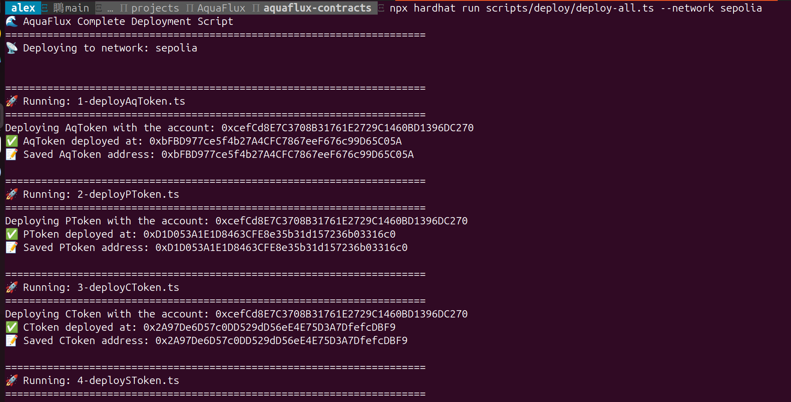

# AquaFlux 部署脚本说明

本目录包含 AquaFlux 协议的模块化部署脚本系统。

## 📁 文件结构

```
scripts/deploy/
├── utils.ts                    # 地址管理工具函数
├── addresses.json              # 已部署合约地址存储（按网络分组）
├── 1-deployAqToken.ts         # 部署 AqToken 实现合约
├── 2-deployPToken.ts          # 部署 PToken 实现合约
├── 3-deployCToken.ts          # 部署 CToken 实现合约
├── 4-deploySToken.ts          # 部署 SToken 实现合约
├── 5-deployTokenFactory.ts    # 部署 TokenFactory 合约
├── 6-deployAquaFluxTimelock.ts # 部署 Timelock 治理合约
├── 7-deployAquaFluxCore.ts    # 部署 AquaFluxCore 主合约（UUPS Proxy）
├── deploy-all.ts              # 一键完整部署脚本
└── README.md                  # 本文件
```

## 🔄 部署流程和依赖关系

```
1-4: Token 实现合约 (AqToken, PToken, CToken, SToken)
         ↓
5: TokenFactory 合约
         ↓
6: AquaFluxTimelock 合约
         ↓
7: AquaFluxCore 合约 (依赖 TokenFactory + Timelock)
```

## 🚀 使用方法

### 方式一：完整部署（推荐）

一键部署所有合约：

```bash
# 部署到本地测试网络
npx hardhat run scripts/deploy/deploy-all.ts

# 部署到 Sepolia 测试网
npx hardhat run scripts/deploy/deploy-all.ts --network sepolia
```



### 方式二：分步部署

按顺序单独运行每个脚本：

```bash
# 1. 部署 Token 实现合约
npx hardhat run scripts/deploy/1-deployAqToken.ts --network sepolia
npx hardhat run scripts/deploy/2-deployPToken.ts --network sepolia
npx hardhat run scripts/deploy/3-deployCToken.ts --network sepolia
npx hardhat run scripts/deploy/4-deploySToken.ts --network sepolia

# 2. 部署 TokenFactory
npx hardhat run scripts/deploy/5-deployTokenFactory.ts --network sepolia

# 3. 部署 Timelock
npx hardhat run scripts/deploy/6-deployAquaFluxTimelock.ts --network sepolia

# 4. 部署 AquaFluxCore
npx hardhat run scripts/deploy/7-deployAquaFluxCore.ts --network sepolia
```

### 方式三：从中间步骤继续部署

如果某个步骤失败，可以从失败的步骤继续：

```bash
# 例如：如果步骤 5 失败，修复问题后从步骤 5 继续
npx hardhat run scripts/deploy/5-deployTokenFactory.ts --network sepolia
npx hardhat run scripts/deploy/6-deployAquaFluxTimelock.ts --network sepolia
# ...
```

## 📝 地址管理系统

### addresses.json 结构

所有已部署的合约地址会自动保存到 `addresses.json`，按网络分组：

```json
{
  "sepolia": {
    "AqToken": {
      "address": "0x1234...",
      "deployedAt": "2025-10-20T12:00:00.000Z",
      "txHash": "0xabcd..."
    },
    "TokenFactory": {
      "address": "0x5678...",
      "deployedAt": "2025-10-20T12:01:00.000Z"
    }
    // ...
  },
  "mainnet": {
    // ...
  }
}
```

### 工具函数

在 `utils.ts` 中提供了以下工具函数：

- `saveAddress(contractName, address, txHash?)` - 保存合约地址
- `loadAddress(contractName)` - 读取合约地址（可能为 undefined）
- `requireAddress(contractName)` - 读取合约地址（不存在则抛出错误）
- `displayAddresses()` - 显示当前网络的所有已部署合约
- `getNetworkName()` - 获取当前网络名称

## ⚙️ 环境配置

确保 `.env` 文件包含以下配置：

```env
# 部署者私钥
TEST_PRIVATE_KEY=your_private_key_here

# Alchemy API 密钥
ALCHEMY_API_KEY=your_alchemy_key_here

# Etherscan API 密钥（用于验证合约）
ETHERSCAN_API_KEY=your_etherscan_key_here
```

## 🔍 验证合约

部署完成后，可以在 Etherscan 上验证合约：

```bash
# 验证单个合约
npx hardhat verify --network sepolia <CONTRACT_ADDRESS> [CONSTRUCTOR_ARGS]

# 例如：验证 AqToken
npx hardhat verify --network sepolia 0x1234...
```

对于 UUPS Proxy 合约（如 AquaFluxCore），需要验证 Proxy 和 Implementation：

```bash
# Hardhat 会自动处理 OpenZeppelin 的 Proxy 验证
npx hardhat verify --network sepolia <PROXY_ADDRESS>
```

## 🎯 关键特性

✅ **模块化设计** - 每个合约独立部署，便于调试和重新部署
✅ **自动地址管理** - 部署地址自动保存和读取，无需手动复制粘贴
✅ **多网络支持** - 同一套脚本支持本地、测试网、主网
✅ **依赖检查** - 自动验证依赖合约是否已部署
✅ **错误处理** - 清晰的错误信息和部署状态提示
✅ **可重入性** - 可以从任意步骤继续部署

## 🔧 自定义配置

### 修改 Timelock 延迟时间

编辑 `6-deployAquaFluxTimelock.ts`:

```typescript
const MIN_DELAY = 20; // 修改为你需要的延迟时间（秒）
```

### 修改治理角色

编辑相应脚本中的 proposers 和 executors 配置。

## 📚 部署后的下一步

1. **测试功能**：使用测试脚本验证部署是否正确
2. **验证合约**：在区块链浏览器上验证所有合约
3. **文档更新**：更新项目文档中的合约地址

## ⚠️ 注意事项

- **不要将 `.env` 文件提交到 Git**
- **妥善保管私钥**
- **在主网部署前，务必在测试网充分测试**
- **部署到主网前，仔细检查所有配置参数**
- **addresses.json 可以提交到 Git，方便团队共享已部署的合约地址**

## 🐛 常见问题

### Q: 如何清空已保存的地址？

A: 直接编辑 `addresses.json`，删除对应网络的配置，或删除整个文件重新开始。

### Q: 如何在不同网络使用相同的脚本？

A: 使用 `--network` 参数指定网络，脚本会自动在 `addresses.json` 中为每个网络维护独立的地址。

### Q: 部署失败了怎么办？

A: 检查错误信息，修复问题后从失败的步骤继续运行即可。已成功部署的合约不会重复部署。

### Q: 如何重新部署某个合约？

A: 删除 `addresses.json` 中对应的合约记录，然后重新运行该脚本。注意需要同时重新部署依赖该合约的其他合约。
