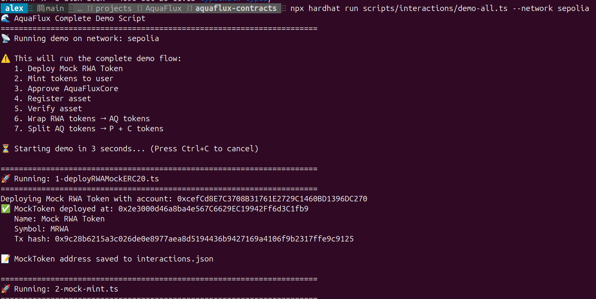

# AquaFlux Interactions 交互演示脚本

本目录包含 AquaFlux 协议的完整交互演示脚本，展示从部署 Mock RWA Token 到完整的资产操作流程。

## 📁 文件结构

```
scripts/interactions/
├── utils.ts                      # 工具函数（地址管理）
├── interactions.json             # 交互数据存储（MockToken、assetId 等）
├── 1-deployRWAMockERC20.ts      # 部署 Mock RWA Token
├── 2-mock-mint.ts               # Mint Mock Token 给用户
├── 3-mock-approve.ts            # 授权 AquaFluxCore 使用 Token
├── 4-aquaFluxCoreRegister.ts    # 注册 RWA 资产
├── 5-aquaFluxCoreVerify.ts      # 验证资产
├── 6-aquaFluxCoreWrap.ts        # Wrap: RWA Token → AQ Token
├── 7-aquaFluxCoreSplit.ts       # Split: AQ Token → P Token + C Token
├── demo-all.ts                  # 一键运行所有演示
└── README.md                    # 本文件
```

## 📋 前置条件

在运行交互脚本之前，**必须先完成合约部署和配置**：

```bash
# 1. 部署所有合约
npx hardhat run scripts/deploy/deploy-all.ts --network sepolia

# 2. 配置合约
npx hardhat run scripts/setup/setup-all.ts --network sepolia
```

交互脚本会自动从 `../deploy/addresses.json` 读取已部署的合约地址。

## 🔄 演示流程

### 完整流程图

```
1. Deploy Mock RWA Token
   ↓ 创建测试用的 RWA Token

2. Mint Mock Tokens
   ↓ 向用户账户铸造 1,000,000 个 Token

3. Approve AquaFluxCore
   ↓ 授权 AquaFluxCore 使用 10,000 个 Token

4. Register Asset
   ↓ 注册 RWA 资产到 AquaFluxCore
   ↓ 获得 assetId

5. Verify Asset
   ↓ 验证资产（需要 VERIFIER_ROLE）

6. Wrap RWA Tokens
   ↓ 100 RWA Tokens → ~99.75 AQ Tokens (扣除手续费)

7. Split AQ Tokens
   ↓ 50 AQ Tokens → ~49.925 P Tokens + ~49.925 C Tokens

✅ 演示完成！
```

### 各步骤说明

#### 1. Deploy Mock RWA Token
- **作用**: 创建一个测试用的 ERC20 Token 作为 RWA 资产
- **输出**: MockToken 地址保存到 `interactions.json`
- **Token**: Mock RWA Token (MRWA)

#### 2. Mint Mock Tokens
- **作用**: 向用户账户铸造 1,000,000 个 MRWA
- **依赖**: 步骤 1
- **检查**: 显示用户余额

#### 3. Approve AquaFluxCore
- **作用**: 授权 AquaFluxCore 合约使用 10,000 个 MRWA
- **依赖**: 步骤 1
- **检查**: 显示授权额度

#### 4. Register Asset
- **作用**: 将 RWA Token 注册为 AquaFlux 资产
- **参数**:
  - Maturity: 30 天后
  - Operation Deadline: 29 天后
  - Coupon Rate: 12% (1200 bps)
  - C Token Ratio: 80% (8000 bps)
  - S Token Ratio: 20% (2000 bps)
  - Fee to S Ratio: 50% (5000 bps)
- **输出**: assetId 保存到 `interactions.json`

#### 5. Verify Asset
- **作用**: 验证资产，允许用户进行 wrap 操作
- **依赖**: 步骤 4
- **权限**: 需要 VERIFIER_ROLE

#### 6. Wrap RWA Tokens
- **作用**: 将 100 个 RWA Tokens 包装为 AQ Tokens
- **依赖**: 步骤 5
- **手续费**: 0.25% (25 bps)
- **结果**: ~99.75 AQ Tokens

#### 7. Split AQ Tokens
- **作用**: 将 50 个 AQ Tokens 分割为 P Tokens 和 C Tokens
- **依赖**: 步骤 6
- **手续费**: 0.15% (15 bps)
- **结果**:
  - P Tokens (Principal): ~49.925
  - C Tokens (Coupon): ~49.925

## 🚀 使用方法

### 方式一：一键演示（推荐）

运行所有步骤的完整演示：

```bash
# 本地测试网络
npx hardhat run scripts/interactions/demo-all.ts

# Sepolia 测试网
npx hardhat run scripts/interactions/demo-all.ts --network sepolia
```



### 方式二：分步执行

单独运行每个步骤：

```bash
# 1. 部署 Mock Token
npx hardhat run scripts/interactions/1-deployRWAMockERC20.ts --network sepolia

# 2. Mint tokens
npx hardhat run scripts/interactions/2-mock-mint.ts --network sepolia

# 3. Approve
npx hardhat run scripts/interactions/3-mock-approve.ts --network sepolia

# 4. Register asset
npx hardhat run scripts/interactions/4-aquaFluxCoreRegister.ts --network sepolia

# 5. Verify asset
npx hardhat run scripts/interactions/5-aquaFluxCoreVerify.ts --network sepolia

# 6. Wrap
npx hardhat run scripts/interactions/6-aquaFluxCoreWrap.ts --network sepolia

# 7. Split
npx hardhat run scripts/interactions/7-aquaFluxCoreSplit.ts --network sepolia
```

## 📊 数据管理

### interactions.json 结构

所有交互数据会自动保存到 `interactions.json`：

```json
{
  "sepolia": {
    "mockToken": {
      "address": "0x1234...",
      "name": "Mock RWA Token",
      "symbol": "MRWA",
      "deployedAt": "2025-10-20T12:00:00.000Z"
    },
    "assetId": "0xabcd...",
    "registeredAt": "2025-10-20T12:01:00.000Z",
    "verifiedAt": "2025-10-20T12:02:00.000Z",
    "wrapAmount": "100",
    "splitAmount": "50"
  }
}
```

### 工具函数

`utils.ts` 提供以下功能：

- `loadDeployedAddress()` - 从 `../deploy/addresses.json` 读取已部署合约地址
- `saveInteractionsData()` - 保存交互数据
- `getInteractionData()` - 读取交互数据
- `requireInteractionData()` - 读取交互数据（不存在则抛出错误）
- `displayInteractionsData()` - 显示当前网络的所有交互数据
- `clearInteractionsData()` - 清空当前网络的交互数据

## 🎯 注意事项

1. **执行顺序**: 脚本之间有依赖关系，必须按顺序执行
2. **前置部署**: 必须先运行 `deploy/` 和 `setup/` 脚本
3. **权限要求**: 验证资产需要 VERIFIER_ROLE 权限
4. **Gas 费用**: 确保账户有足够的 ETH 支付 Gas
5. **网络一致**: 所有操作必须在同一网络进行

## 🔍 常见问题

### Q: 提示找不到合约地址怎么办？

A: 请先运行部署和配置脚本：
```bash
npx hardhat run scripts/deploy/deploy-all.ts --network sepolia
npx hardhat run scripts/setup/setup-all.ts --network sepolia
```

### Q: 验证资产失败？

A: 确保：
- 部署者账户有 VERIFIER_ROLE 权限
- 资产已成功注册（检查 assetId）
- 使用正确的网络

### Q: Wrap 或 Split 失败？

A: 检查：
- 资产是否已验证
- 用户是否有足够的 Token 余额
- 是否已授权 AquaFluxCore
- 操作是否在 operationDeadline 之前

### Q: 如何重新开始演示？

A: 可以直接再次运行 demo-all.ts，它会覆盖之前的数据。或者手动清理：
```bash
# 删除 interactions.json 中对应网络的数据
# 或直接删除整个文件重新开始
```

### Q: 如何查看中间数据？

A: 查看 `interactions.json` 文件，或者在脚本中添加：
```typescript
import { displayInteractionsData } from "./utils";
displayInteractionsData();
```

## 📚 下一步

演示完成后，你可以：

1. **查看 Token 余额**: 检查你的 AQ、P、C Token 余额
2. **尝试其他操作**: Merge, Unwrap 等
3. **测试到期流程**: 等待资产到期，测试赎回流程
4. **集成前端**: 将这些操作集成到你的 dApp 中

## 💡 扩展建议

可以添加更多演示脚本：

- `8-merge.ts` - 合并 P + C → AQ
- `9-unwrap.ts` - 解包 AQ → RWA
- `10-maturity-redeem.ts` - 到期赎回演示
- `11-fee-collection.ts` - 手续费收集演示

## 🐛 调试技巧

1. **查看详细日志**: 所有脚本都有详细的控制台输出
2. **检查交易**: 每个交易都会显示 tx hash，可在区块链浏览器查看
3. **查看数据文件**: `interactions.json` 记录了所有中间数据
4. **分步执行**: 出问题时使用分步执行，方便定位问题
