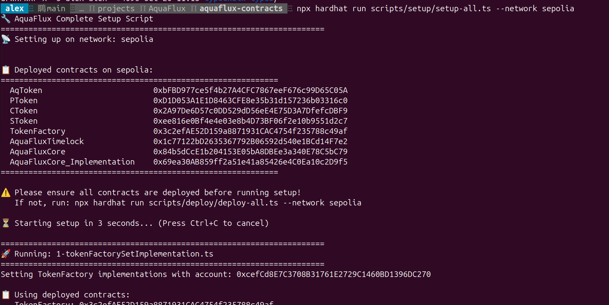

# AquaFlux Setup 配置脚本说明

本目录包含 AquaFlux 协议部署后的配置脚本，用于初始化合约参数和权限设置。

## 📁 文件结构

```
scripts/setup/
├── utils.ts                                # 工具函数（从 deploy/addresses.json 读取地址）
├── 1-tokenFactorySetImplementation.ts      # 配置 TokenFactory 的 Token 实现地址
├── 2-tokenFactoryGrantRoleDeployerRole.ts  # 授予 AquaFluxCore DEPLOYER_ROLE 权限
├── 3-aquaFluxCoreSetGlobalFeeRate.ts       # 通过 Timelock 设置全局费率
├── setup-all.ts                            # 一键运行所有配置
└── README.md                               # 本文件
```

## 📋 前置条件

在运行配置脚本之前，**必须先完成合约部署**：

```bash
# 部署所有合约
npx hardhat run scripts/deploy/deploy-all.ts --network sepolia
```

配置脚本会自动从 `../deploy/addresses.json` 读取已部署的合约地址。

## 🔄 配置流程

### 1. TokenFactory 设置 Token 实现

**脚本**：`1-tokenFactorySetImplementation.ts`

**作用**：
- 设置 TokenFactory 的 4 种 Token 实现地址（AQ, P, C, S）
- TokenFactory 使用 EIP-1167 Clone 模式部署 Token 实例

**操作**：
```typescript
TokenFactory.setImplementation("AQ", AqTokenAddress);
TokenFactory.setImplementation("P", PTokenAddress);
TokenFactory.setImplementation("C", CTokenAddress);
TokenFactory.setImplementation("S", STokenAddress);
```

### 2. 授予 DEPLOYER_ROLE 权限

**脚本**：`2-tokenFactoryGrantRoleDeployerRole.ts`

**作用**：
- 授予 AquaFluxCore 合约在 TokenFactory 中的 DEPLOYER_ROLE
- 允许 AquaFluxCore 通过 TokenFactory 部署新的 Token 实例

**操作**：
```typescript
TokenFactory.grantRole(DEPLOYER_ROLE, AquaFluxCoreAddress);
```

### 3. 设置全局费率（通过 Timelock 治理）

**脚本**：`3-aquaFluxCoreSetGlobalFeeRate.ts`

**作用**：
- 通过 Timelock 治理机制设置 AquaFluxCore 的全局费率
- 包含 4 种操作的费率：wrap, split, merge, unwrap

**默认费率**：
- Wrap: 25 bps (0.25%)
- Split: 15 bps (0.15%)
- Merge: 15 bps (0.15%)
- Unwrap: 25 bps (0.25%)

**流程**：
1. Schedule 交易到 Timelock
2. 等待 Timelock 延迟（20 秒）
3. Execute 交易
4. 验证新费率

**⏳ 注意**：此脚本需要约 **85 秒**（4 个操作 × 21 秒）才能完成。

## 🚀 使用方法

### 方式一：一键配置（推荐）

```bash
# 一键运行所有配置脚本
npx hardhat run scripts/setup/setup-all.ts --network sepolia
```



### 方式二：分步配置

```bash
# 1. 设置 TokenFactory 实现
npx hardhat run scripts/setup/1-tokenFactorySetImplementation.ts --network sepolia

# 2. 授予 DEPLOYER_ROLE
npx hardhat run scripts/setup/2-tokenFactoryGrantRoleDeployerRole.ts --network sepolia

# 3. 设置全局费率（需要约 85 秒）
npx hardhat run scripts/setup/3-aquaFluxCoreSetGlobalFeeRate.ts --network sepolia
```

## 📊 配置依赖图

```
部署合约 (deploy/)
    ↓
1. TokenFactory.setImplementation()
    ↓
2. TokenFactory.grantRole(DEPLOYER_ROLE, AquaFluxCore)
    ↓
3. AquaFluxCore.setGlobalFeeRate() (通过 Timelock)
    ↓
配置完成 ✅
```

## 🔍 验证配置

配置完成后，可以通过以下方式验证：

### 验证 TokenFactory 实现

```bash
# 使用 Hardhat console
npx hardhat console --network sepolia

> const factory = await ethers.getContractAt("TokenFactory", "0x...")
> await factory.getImplementation("AQ")
> await factory.getImplementation("P")
> await factory.getImplementation("C")
> await factory.getImplementation("S")
```

### 验证 DEPLOYER_ROLE

```bash
> const DEPLOYER_ROLE = ethers.keccak256(ethers.toUtf8Bytes("DEPLOYER_ROLE"))
> await factory.hasRole(DEPLOYER_ROLE, "AquaFluxCore地址")
```

### 验证费率

```bash
> const core = await ethers.getContractAt("AquaFluxCore", "0x...")
> await core.getGlobalFeeRate("wrap")
> await core.getGlobalFeeRate("split")
> await core.getGlobalFeeRate("merge")
> await core.getGlobalFeeRate("unwrap")
```

## ⚙️ 自定义配置

### 修改费率

编辑 `3-aquaFluxCoreSetGlobalFeeRate.ts`：

```typescript
// 修改为你需要的费率（单位：bps，1 bps = 0.01%）
await setFeeRateViaGovernance("wrap", 50);   // 0.5% wrap fee
await setFeeRateViaGovernance("split", 30);  // 0.3% split fee
await setFeeRateViaGovernance("merge", 30);  // 0.3% merge fee
await setFeeRateViaGovernance("unwrap", 50); // 0.5% unwrap fee
```

### 修改 Timelock 延迟

如果你在部署时修改了 Timelock 的 MIN_DELAY，需要同步修改 `3-aquaFluxCoreSetGlobalFeeRate.ts` 中的等待时间：

```typescript
// 修改为 MIN_DELAY + 1 秒（单位：毫秒）
await new Promise((resolve) => setTimeout(resolve, 21000));
```

## ⚠️ 注意事项

1. **必须先部署**：配置脚本依赖 `deploy/addresses.json`，必须先运行部署脚本
2. **网络一致**：部署和配置必须在同一网络上进行
3. **账户权限**：运行配置的账户必须有相应的管理员权限
4. **Timelock 延迟**：第 3 步需要等待 Timelock 延迟，耗时较长（约 85 秒）
5. **Gas 费用**：确保账户有足够的 ETH 支付 Gas 费用

## 🐛 常见问题

### Q: 提示找不到地址怎么办？

A: 请先运行部署脚本：
```bash
npx hardhat run scripts/deploy/deploy-all.ts --network sepolia
```

### Q: Timelock 执行失败？

A: 可能的原因：
- Timelock 延迟时间不够（检查 MIN_DELAY 配置）
- 账户没有 proposer 或 executor 权限
- 交易已经被执行过

### Q: 如何跳过某个配置步骤？

A: 使用分步配置方式，只运行需要的脚本。

### Q: 配置后如何重新配置？

A: 直接重新运行对应的配置脚本即可。对于费率设置，需要再次经过 Timelock 流程。

## 📚 下一步

配置完成后，你可以：

1. **测试基本功能**：使用测试脚本验证 wrap/split/merge/unwrap 功能
2. **运行演示脚本**：如果有 demo 脚本，可以演示完整的业务流程
3. **验证合约**：在区块链浏览器上验证合约代码
4. **开始集成**：在前端或其他系统中集成 AquaFlux 协议
