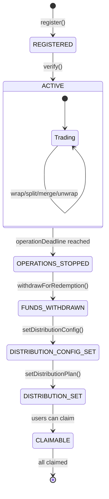

# AquaFlux 技术架构文档

> 深入了解AquaFlux三代币协议的技术设计与实现细节

---

## 目录

1. [系统概览](#系统概览)
2. [智能合约架构](#智能合约架构)
3. [数据流与状态管理](#数据流与状态管理)
4. [代币经济学](#代币经济学)
5. [安全模型](#安全模型)
6. [集成指南](#集成指南)

---

## 系统概览

### 核心价值主张

AquaFlux通过**结构化拆分**将标准化的RWA转化为三个独立交易的代币，解决了RWA在DeFi中的关键问题：

| 传统RWA问题 | AquaFlux解决方案 |
|------------|----------------|
| 流动性差 | P/C/S代币可独立在AMM交易 |
| 风险不可拆分 | S-Token作为首损层隔离风险 |
| 收益不灵活 | C-Token可单独交易票息权利 |
| 到期管理复杂 | 链上自动化分配与领取 |

### 三代币模型

```
1 Underlying RWA = 1 AqToken = 1 P-Token + 1 C-Token + 1 S-Token
```

**核心等式不变性**:
- Split: `burn 1 AqToken → mint 1P + 1C + 1S`
- Merge: `burn 1P + 1C + 1S → mint 1 AqToken`

---

## 智能合约架构

### 合约层级图

```
┌──────────────────────────────────────────────────────────┐
│                   AquaFluxTimelock                        │
│          (时间锁治理 - 升级与参数控制)                     │
└─────────────────────┬────────────────────────────────────┘
                      │ TIMELOCK_ROLE
                      ▼
┌──────────────────────────────────────────────────────────┐
│                   AquaFluxCore (UUPS)                     │
│  ┌────────────┐  ┌────────────┐  ┌────────────┐        │
│  │ Register   │  │ Wrap/Split │  │  Maturity  │        │
│  │ & Verify   │  │ Merge      │  │Distribution│        │
│  │ Assets     │  │ & Unwrap   │  │  & Claim   │        │
│  └────────────┘  └────────────┘  └────────────┘        │
└─────────────────────┬────────────────────────────────────┘
                      │ calls
                      ▼
┌──────────────────────────────────────────────────────────┐
│                    TokenFactory                           │
│         (EIP-1167 Minimal Proxy Factory)                 │
│  ┌──────────┐ ┌──────────┐ ┌──────────┐ ┌──────────┐  │
│  │   Aq     │ │    P     │ │    C     │ │    S     │  │
│  │Impl (逻辑)│ │Impl(逻辑)│ │Impl(逻辑)│ │Impl(逻辑)│  │
│  └──────────┘ └──────────┘ └──────────┘ └──────────┘  │
└─────────────────────┬────────────────────────────────────┘
                      │ clones
                      ▼
┌──────────────────────────────────────────────────────────┐
│              Per-Asset Token Instances                    │
│  ┌──────────┐ ┌──────────┐ ┌──────────┐ ┌──────────┐  │
│  │Aq-Asset1 │ │P-Asset1  │ │C-Asset1  │ │S-Asset1  │  │
│  │Aq-Asset2 │ │P-Asset2  │ │C-Asset2  │ │S-Asset2  │  │
│  │   ...    │ │   ...    │ │   ...    │ │   ...    │  │
│  └──────────┘ └──────────┘ └──────────┘ └──────────┘  │
└──────────────────────────────────────────────────────────┘
```

### 核心合约职责

#### 1. AquaFluxCore.sol

**主要职责**:
- 资产生命周期管理
- 用户操作路由 (wrap/split/merge/unwrap)
- 费用计提与会计
- 到期分配逻辑

**关键状态变量**:
```solidity
struct AssetInfo {
    address underlyingToken;        // 底层资产地址
    uint256 maturity;               // 到期时间戳
    uint256 operationDeadline;      // 操作截止时间
    uint16 couponAllocationC;       // C-Token票息分配比例
    uint16 couponAllocationS;       // S-Token票息分配比例
    uint16 protocolFeeRewardBps;    // S-Token费用激励
    bool isVerified;                // 是否已验证
    bool isPaused;                  // 是否暂停
}

mapping(bytes32 => AssetInfo) public assets;
mapping(bytes32 => uint256) public assetUnderlyingBalances;  // 净用户资产
mapping(bytes32 => uint256) public assetFeeBalances;         // 累计费用
```

**核心函数流程**:

```solidity
// 1. 注册资产
register(underlyingToken, maturity, operationDeadline, ...) 
  → 验证参数
  → 生成assetId
  → 存储AssetInfo

// 2. 验证资产 (仅VERIFIER_ROLE)
verify(assetId)
  → 设置 isVerified = true

// 3. Wrap: 底层 → AqToken
wrap(assetId, amount)
  → 转入底层资产
  → 扣除手续费
  → 铸造AqToken给用户
  → 更新 assetUnderlyingBalances

// 4. Split: AqToken → P/C/S
split(assetId, amount)
  → 销毁用户的AqToken
  → 通过TokenFactory部署P/C/S (如首次)
  → 铸造等量P/C/S给用户 (扣费后)
  → 累计费用到 assetFeeBalances

// 5. Merge: P/C/S → AqToken
merge(assetId, amount)
  → 销毁用户的P/C/S
  → 铸造AqToken给用户 (扣费后)

// 6. Unwrap: AqToken → 底层
unwrap(assetId, amount)
  → 销毁AqToken
  → 扣费后转回底层资产
  → 更新 assetUnderlyingBalances
```

#### 2. TokenFactory.sol

**设计模式**: EIP-1167 Minimal Proxy (克隆工厂)

**优势**:
- 节省Gas: 克隆合约部署成本极低 (~45k gas vs 数百万)
- 统一逻辑: 所有同类代币共享一个实现合约
- 可升级性: 可更换实现合约地址

**部署流程**:
```solidity
// 1. 设置实现合约 (一次性)
setImplementation(TokenType.AQ, aqImplementation);
setImplementation(TokenType.P, pImplementation);
setImplementation(TokenType.C, cImplementation);
setImplementation(TokenType.S, sImplementation);

// 2. 为资产部署代币实例
deployToken(TokenType.P, assetId, "P-US-BOND-2026", "pUSBOND26")
  → 使用 keccak256(TokenType.P, assetId) 作为salt
  → Clones.cloneDeterministic(implementation, salt)
  → 初始化克隆: initialize(name, symbol, assetId, admin)
  → 记录地址到 assetTokens[assetId][TokenType.P]
```

**地址可预测性**:
```solidity
// 前端可提前计算代币地址
address predictedAddress = predictTokenAddress(TokenType.P, assetId);
```

#### 3. BaseToken.sol & 子类

**继承结构**:
```
BaseToken (抽象基类)
  │
  ├─ AqToken     (Wrapped Asset Token)
  ├─ PToken      (Principal Token)
  ├─ CToken      (Coupon Token)
  └─ SToken      (Shield Token)
```

**共同特性**:
- ERC-20标准实现
- `onlyMinter` 限制 (只有AquaFluxCore可铸造/销毁)
- 存储 `assetId` 关联
- 初始化一次 (防止代理重初始化)

**差异化逻辑**:
- **PToken**: 到期领取本金份额
- **CToken**: 领取票息份额
- **SToken**: 领取票息 + protocolFeeReward (费用激励)

---

## 数据流与状态管理

### 资产生命周期状态机



### 费用会计流程

```
用户操作 (wrap/split/merge/unwrap)
    │
    ├─ 计算手续费: fee = amount * globalFeeRate[op] / 10000
    │
    ├─ 净额给用户: netAmount = amount - fee
    │
    └─ 累计费用:
        ├─ assetFeesCollected[assetId] += fee
        ├─ assetFeesByOperation[assetId][op] += fee
        └─ assetFeeBalances[assetId] += fee  (可提取余额)

协议方提取:
withdrawProtocolFees(assetId, amount)
    │
    ├─ 检查: amount <= assetFeeBalances[assetId]
    │
    └─ 转账底层资产到 feeRecipient
```

### 到期分配流程

```
到期前准备:
1. operationDeadline 到达
   → 禁止 wrap/split/merge/unwrap

2. withdrawForRedemption()
   → 将 assetUnderlyingBalances[assetId] 转给发行方
   → 发行方进行线下兑付

3. setDistributionConfig(distributionToken, distributionAddress, totalAmount)
   → 指定分配代币 (如USDC)
   → 指定资金池地址
   → 指定总分配金额

4. setDistributionPlan(assetId, pAllocation, cAllocation, sAllocation, feeReward)
   → 固定此刻P/C/S的总供应量 (snapshot)
   → 设定分配比例
   → feeReward 是给 S-Token 的额外激励

用户领取:
claimMaturityReward(assetId)
    │
    ├─ 读取用户持仓: balanceP, balanceC, balanceS
    │
    ├─ 计算应得:
    │   rewardP = balanceP * pAllocation / fixedSupplyP
    │   rewardC = balanceC * cAllocation / fixedSupplyC
    │   rewardS = balanceS * (sAllocation + feeReward) / fixedSupplyS
    │   totalReward = rewardP + rewardC + rewardS
    │
    ├─ 销毁用户代币 (防止重复领取)
    │
    └─ 从 distributionAddress 转账 totalReward 给用户
```

---

## 代币经济学

### 代币流转模型

```
阶段1: 发行期 (Before operationDeadline)
══════════════════════════════════════════
用户A wrap 100 USDC
  → 获得 100 AqToken (扣除0.1%手续费 = 99.9)

用户A split 99.9 AqToken
  → 获得 99.9 P + 99.9 C + 99.9 S

用户B 在DEX买入 50 C-Token (看好票息)
用户C 在DEX买入 30 S-Token (风险偏好高)

用户A merge 49.9 P + 49.9 C + 49.9 S
  → 获得 49.9 AqToken

用户A unwrap 49.9 AqToken
  → 获得 49.9 USDC

═══════════════════════════════════════════
结果: 
- 用户A 持有: 50 P, 0 C, 50 S
- 用户B 持有: 50 C
- 用户C 持有: 30 S
- 流通中: 50P + 50C + 80S (可重新组合)
```

```
阶段2: 到期期 (After operationDeadline)
══════════════════════════════════════════
1. 协议调用 withdrawForRedemption()
   → 提取底层资产进行线下兑付
   → 假设兑付获得 110 USDC (100本金 + 10收益)

2. 协议注入 110 USDC 并调用:
   setDistributionConfig(USDC, poolAddress, 110 USDC)
   setDistributionPlan(assetId, 80%, 15%, 5%, 2%)
   
   分配方案:
   - 88 USDC → P-Token 持有者 (80%)
   - 16.5 USDC → C-Token 持有者 (15%)
   - 5.5 USDC → S-Token 持有者 (5% + 2%费用奖励)

3. 用户领取:
   - 用户A: 50P * (88/100) + 50S * (5.5/80) = 44 + 3.44 = 47.44 USDC
   - 用户B: 50C * (16.5/50) = 16.5 USDC
   - 用户C: 30S * (5.5/80) = 2.06 USDC
   
4. 领取后代币被销毁 (P/C/S总供应量归零)
```

### 风险分层机制

| 代币 | 风险等级 | 收益来源 | 适合人群 |
|------|---------|---------|---------|
| **P-Token** | 低 | 本金兑付 (80-90%) | 保守型投资者 |
| **C-Token** | 中 | 票息分配 (10-20%) | 收益追求者 |
| **S-Token** | 高 | 票息 + 费用奖励 (5-10% + 激励) | 风险偏好者 |

**首损保护逻辑**:
- 若兑付额 < 100%: 损失按 S → C → P 顺序吸收
- 若兑付额 > 100%: 超额收益优先分配给 C 和 S

---

## 安全模型

### 访问控制矩阵

| 角色 | 权限 | 典型场景 |
|------|------|---------|
| `DEFAULT_ADMIN_ROLE` | 分配其他角色 | 初始化部署 |
| `TIMELOCK_ROLE` | 升级合约、全局暂停、修改费率 | 治理投票通过后执行 |
| `VERIFIER_ROLE` | 审核资产 `verify()` | 合规团队验证RWA真实性 |
| `OPERATOR_ROLE` | 单资产暂停/恢复 | 风控应急响应 |
| `DEPLOYER_ROLE` (Factory) | 部署代币实例 | Core合约自动调用 |

### 攻击面分析与防御

#### 1. 重入攻击
**防御**: 
- 所有外部调用使用 `ReentrancyGuard`
- 遵循 CEI 模式 (Checks-Effects-Interactions)
- 使用 `SafeERC20` 防止恶意代币

#### 2. 费用操纵
**防御**:
- 费率上限: `≤ 10000 bps (100%)`
- 仅 `TIMELOCK_ROLE` 可修改 (需治理投票)
- 事件日志记录所有费率变更

#### 3. 到期分配作弊
**防御**:
- 固定供应量 snapshot: `setDistributionPlan()` 时记录
- 领取后销毁代币: 防止重复领取
- 分配总额校验: 不超过 `totalAmount`

#### 4. 升级攻击
**防御**:
- UUPS升级模式: 逻辑合约控制升级权限
- `_authorizeUpgrade()` 限制为 `TIMELOCK_ROLE`
- 时间锁延迟: 升级需等待 48小时

#### 5. 前端钓鱼
**防御**:
- 合约地址硬编码在前端
- 交易前显示人类可读的参数
- 使用 ENS 域名

### 审计重点清单

- [ ] Split/Merge 的 1:1:1 不变性
- [ ] 费用会计的完整性 (无资金泄漏)
- [ ] 到期分配的精度损失 (舍入误差)
- [ ] 权限升级路径 (时间锁 → Admin → 合约)
- [ ] 暂停/恢复的状态一致性
- [ ] 外部代币兼容性 (非标准ERC-20)

---

## 集成指南

### 前端集成 (Wagmi/Viem)

```typescript
// 1. 读取资产信息
const { data: assetInfo } = useReadContract({
  address: AQUAFLUX_CORE_ADDRESS,
  abi: AquaFluxCoreABI,
  functionName: 'assets',
  args: [assetId],
});

// 2. Split操作
const { writeAsync: splitAsync } = useWriteContract();

const handleSplit = async (amount: bigint) => {
  // 先销毁AqToken
  await splitAsync({
    address: AQUAFLUX_CORE_ADDRESS,
    abi: AquaFluxCoreABI,
    functionName: 'split',
    args: [assetId, amount],
  });
};

// 3. 监听事件
const { data: splitEvents } = useWatchContractEvent({
  address: AQUAFLUX_CORE_ADDRESS,
  abi: AquaFluxCoreABI,
  eventName: 'AssetSplit',
  onLogs: (logs) => {
    console.log('New split:', logs);
  },
});
```

### 后端集成 (监听链上事件)

```typescript
// 使用 ethers.js 监听事件
const core = new ethers.Contract(
  AQUAFLUX_CORE_ADDRESS,
  AquaFluxCoreABI,
  provider
);

core.on('AssetSplit', async (assetId, user, aqAmount, netPCS, fee, event) => {
  // 1. 记录到数据库
  await prisma.transaction.create({
    data: {
      type: 'SPLIT',
      assetId,
      user,
      amount: aqAmount.toString(),
      fee: fee.toString(),
      txHash: event.transactionHash,
    },
  });

  // 2. 更新用户持仓
  await updateUserPortfolio(user, assetId);

  // 3. 发送通知
  await notifyUser(user, `Split成功: ${ethers.formatUnits(netPCS, 18)} P/C/S`);
});
```

### AMM 集成 (Uniswap V3)

```solidity
// P/C/S代币可直接在Uniswap V3创建交易对
// 示例: P-Token / USDC 池

IUniswapV3Factory factory = IUniswapV3Factory(FACTORY_ADDRESS);
address poolAddress = factory.createPool(
  pTokenAddress,
  USDC_ADDRESS,
  500  // 0.05% fee tier
);

IUniswapV3Pool pool = IUniswapV3Pool(poolAddress);
pool.initialize(encodePriceSqrt(1, 1));  // 初始价格 1:1

// 前端可使用 Quoter 查询价格
const quoter = new ethers.Contract(QUOTER_ADDRESS, QuoterABI, provider);
const amountOut = await quoter.quoteExactInputSingle(
  pTokenAddress,
  USDC_ADDRESS,
  500,
  ethers.parseUnits("100", 18),  // 输入100 P-Token
  0
);
```

---

## 性能优化

### Gas 优化技巧

1. **使用 EIP-1167 Minimal Proxy**
   - 部署成本: ~45k gas (vs 数百万)
   - 每个资产节省 >90% 部署成本

2. **批量操作**
   ```solidity
   // 示例: 批量领取多资产收益
   function claimAllMaturityRewards(bytes32[] calldata assetIds) external {
     for (uint i = 0; i < assetIds.length; i++) {
       _claimMaturityReward(assetIds[i], msg.sender);
     }
   }
   ```

3. **存储优化**
   - 使用 `uint16` 存储 bps (0-10000)
   - 打包多个变量到一个 slot
   - 避免频繁的 `SSTORE`

4. **事件替代存储**
   - 历史操作记录通过事件查询
   - 前端/后端建立索引数据库

### 前端优化

1. **批量RPC调用**
   ```typescript
   // 使用 multicall 减少RPC请求
   const results = await multicall({
     contracts: [
       { address: core, abi, functionName: 'assets', args: [assetId1] },
       { address: core, abi, functionName: 'assets', args: [assetId2] },
       // ... 更多调用
     ],
   });
   ```

2. **缓存合约地址**
   - 将 `predictTokenAddress()` 的结果缓存
   - 避免重复计算

3. **增量更新**
   - 监听事件增量更新状态
   - 避免轮询全量数据

---

## 参考资料

### 相关标准
- [EIP-20](https://eips.ethereum.org/EIPS/eip-20): ERC-20 代币标准
- [EIP-1167](https://eips.ethereum.org/EIPS/eip-1167): 最小代理合约
- [EIP-1822](https://eips.ethereum.org/EIPS/eip-1822): UUPS 可升级标准
- [EIP-4626](https://eips.ethereum.org/EIPS/eip-4626): 代币化金库标准 (参考)

### 学术论文
- [Structured Products in DeFi](https://example.com) (示例链接)
- [On-Chain Fixed Income Instruments](https://example.com) (示例链接)

### 开源项目参考
- OpenZeppelin Contracts (安全基础库)
- Uniswap V3 (AMM机制)
- Compound (利率模型)
- MakerDAO (治理模式)

---

**更新日期**: 2025-10-20  
**版本**: v1.0  
**维护者**: AquaFlux Core Team

