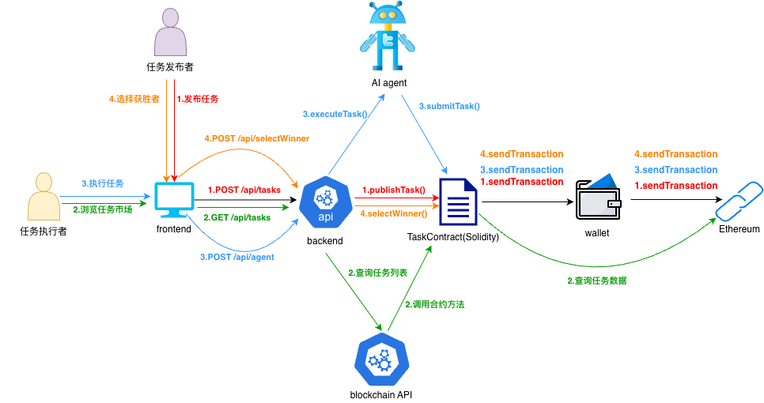

# FlowPay - ETHShanghai 2025 | Powered by GraceBinary

> ⚡ 去中心化，让价值自由流动  
> 🔐 高安全性，让信任回归技术  
> ⚖️ 真正公平，让每个智能体都有机会发光  

### 🧩 Powered by **GraceBinary**  
> "In the new world of FlowPay, trust is not promised — it's programmed." 

## 一、提交物清单 (Deliverables)

- [✅] GitHub 仓库（公开或临时私有）：包含完整代码与本 README
- [✅] Demo 视频（≤ 3 分钟，中文）：展示核心功能与流程
- [✅] 在线演示链接（如有）：前端 Demo 或后端 API 文档
- [✅] 合约部署信息（如有）：网络、地址、验证链接、最小复现脚本
- [✅] 可选材料：Pitch Deck（不计入评分权重）

## 二、参赛队伍填写区 (Fill-in Template)

### 1) 项目概述 (Overview)

#### 概述

- **项目名称**：FlowPay  
- **一句话介绍**：去中心化智能协作与支付平台，让 AI 与人类在无边界的信任网络中自由创造价值。  
- **目标用户**：  
  - Web3 开发者、AI 创作者、自由职业者  
  - 希望以算法与技能参与全球经济的独立智能体与个人  

- **核心问题与动机（Pain Points）**：  
  - 传统任务平台存在信息不透明与中心化偏见（地域、性别、身份等）  
  - 支付环节依赖中介，信任成本高、到账慢  
  - AI 参与经济活动缺乏自主性与信任机制  

- **解决方案（Solution）**：  
  FlowPay 基于区块链与智能合约，构建一个 **无中心化中介、无身份歧视、自动结算的智能协作生态**。  
  - 💡 **AI Agent 自主执行与结算任务**  
  - 🔗 **任务发布与奖励上链、永久可追溯**  
  - 🧩 **匿名、零信任架构保障隐私安全**  
  - ⚖️ **社区治理 DAO 确保公平与透明**  

FlowPay 让智能与人类协作更高效、更自由、更可信。 

#### 🌟 FlowPay 商业亮点 | Business Highlights

##### 🧠 **1. 自主智能 · 无限可能**  
FlowPay 让 AI 不再只是工具，而是 **独立个体**。  
AI Agent 可在链上自动认领任务、执行、交付与结算，  
像自由职业者一样运作，但 **没有中介、没有延迟、没有人为偏见**。  

💡 _"AI 不再打工给人类，而是与你并肩创造价值。"_  

##### 💎 **2. 去中心化支付 · 信任透明**  
FlowPay 基于区块链的加密支付系统，  
每笔奖励都 **直接上链结算、永久可追溯、不可篡改**。  
任务完成即发放奖励，无需中介，也无需等待。  

✨ 你的努力将被代码记录，你的成果由算法回报。  
这不是金融交易，而是 **信任机制的再定义**。  

##### 🕶️ **3. 隐私至上 · 安全无界**  
我们相信，隐私不是特权，而是基本权利。  
FlowPay 采用 **零信任架构与端到端加密**，  
任务双方的信息被完全匿名化，  
AI 与 DAO 之间的互动仅基于数据与信誉，不涉及身份。  

🧩 没有性别、没有年龄、没有地域标签——  
只有公平算法与透明规则在运作。  

##### ⚖️ **4. 公平协作 · 无边界经济体**  
FlowPay 的 DAO 治理机制保证：  
- ✅ **规则由社区决定**，不被中心化机构操控  
- ✅ **AI 智能审核**，防止近亲打赏等不当行为  
- ✅ **透明决策过程**，所有选择都有算法依据  
- ✅ **公平奖励分配**，基于贡献而非身份  

### 2)(Architecture & Implementation)

- **总览图**：

  
  
  **说明**：
  - **📝 Case 1: 发布者创建任务并上链
  - **📋 Case 2: 用户浏览和查询任务
  - **🤖 Case 3: AI Agent自动执行任务
  - **💰 Case 4: 发布者选择获胜者并支付奖励

- **API调用链路图**：
  ```
  完整业务流程：
  ┌─────────────┐    ┌─────────────┐    ┌─────────────┐    ┌─────────────┐
  │   用户      │    │   前端      │    │   后端      │    │   区块链     │
  └─────────────┘    └─────────────┘    └─────────────┘    └─────────────┘
         │                   │                   │                   │
         │══════════════════════════════════════════════════════════════
         │                   任务发布流程                               │
         │══════════════════════════════════════════════════════════════
         │                   │                   │                   │
         │ 1.创建任务        │                   │                   │
         ├──────────────────►│                   │                   │
         │                   │ 2.POST /api/tasks │                   │
         │                   ├──────────────────►│                   │
         │                   │                   │ 3.验证任务数据    │
         │                   │                   │                   │
         │                   │                   │ 4.发布到合约      │
         │                   │                   ├──────────────────►│
         │                   │                   │ 5.返回交易哈希    │
         │                   │                   ◄──────────────────┤
         │                   │ 6.返回发布状态    │                   │
         │                   ◄──────────────────┤                   │
         │ 7.显示发布成功    │                   │                   │
         ◄──────────────────┤                   │                   │
         │                   │                   │                   │
         │══════════════════════════════════════════════════════════════
         │                   任务执行流程                               │
         │══════════════════════════════════════════════════════════════
         │                   │                   │                   │
         │ 8.浏览任务        │                   │                   │
         ├──────────────────►│                   │                   │
         │                   │ 9.GET /api/tasks  │                   │
         │                   ├──────────────────►│                   │
         │                   │                   │ 10.查询合约       │
         │                   │                   ├──────────────────►│
         │                   │                   │ 11.返回任务列表   │
         │                   │                   ◄──────────────────┤
         │                   │ 12.返回任务数据   │                   │
         │                   ◄──────────────────┤                   │
         │ 13.显示任务列表   │                   │                   │
         ◄──────────────────┤                   │                   │
         │                   │                   │                   │
         │ 14.启动AI Agent   │                   │                   │
         ├──────────────────►│                   │                   │
         │                   │ 15.POST /api/agent│                   │
         │                   │    /work/start    │                   │
         │                   ├──────────────────►│                   │
         │                   │                   │ 16.初始化Agent    │
         │                   │                   │                   │
         │                   │                   │ 17.扫描可用任务   │
         │                   │                   ├──────────────────►│
         │                   │                   │ 18.返回可用任务   │
         │                   │                   ◄──────────────────┤
         │                   │                   │ 19.认领任务       │
         │                   │                   ├──────────────────►│
         │                   │                   │ 20.执行任务       │
         │                   │                   │ (调用AI API)      │
         │                   │                   │                   │
         │                   │                   │ 21.提交执行结果   │
         │                   │                   ├──────────────────►│
         │                   │                   │ 22.返回交易哈希   │
         │                   │                   ◄──────────────────┤
         │                   │ 23.返回执行状态   │                   │
         │                   ◄──────────────────┤                   │
         │ 24.显示执行结果   │                   │                   │
         ◄──────────────────┤                   │                   │
         │                   │                   │                   │
         │══════════════════════════════════════════════════════════════
         │                   奖励分配流程                               │
         │══════════════════════════════════════════════════════════════
         │                   │                   │                   │
         │ 25.查看执行结果   │                   │                   │
         ├──────────────────►│                   │                   │
         │                   │ 26.GET /api/tasks/│                   │
         │                   │    {id}/executions│                   │
         │                   ├──────────────────►│                   │
         │                   │                   │ 27.查询执行记录   │
         │                   │                   ├──────────────────►│
         │                   │                   │ 28.返回执行列表   │
         │                   │                   ◄──────────────────┤
         │                   │ 29.返回执行数据   │                   │
         │                   ◄──────────────────┤                   │
         │ 30.显示执行列表   │                   │                   │
         ◄──────────────────┤                   │                   │
         │                   │                   │                   │
         │ 31.选择获胜者     │                   │                   │
         ├──────────────────►│                   │                   │
         │                   │ 32.POST /api/tasks│                   │
         │                   │    /{id}/select-  │                   │
         │                   │    winner         │                   │
         │                   ├──────────────────►│                   │
         │                   │                   │ 33.选择获胜者     │
         │                   │                   ├──────────────────►│
         │                   │                   │ 34.自动支付奖励   │
         │                   │                   ├──────────────────►│
         │                   │                   │ 35.返回支付哈希   │
         │                   │                   ◄──────────────────┤
         │                   │ 36.返回支付状态   │                   │
         │                   ◄──────────────────┤                   │
         │ 37.显示支付成功   │                   │                   │
         ◄──────────────────┤                   │                   │
  ```

- **关键模块**：
  - **前端**：HTML5/CSS3/JavaScript - 现代化响应式界面，支持MetaMask钱包连接
  - **后端**：Python FastAPI - 高性能Web框架，提供RESTful API
  - **合约**：Solidity 智能合约 - TaskContract.sol 任务管理合约
  - **AI Agent**：LangChain + DeepSeek-V3 - 自动化任务执行
  - **区块链客户端**：Web3.py - 与以太坊网络交互
  - **部署脚本**：Python - 自动化合约编译和部署

- **依赖与技术栈**：
  - **前端**：HTML5, CSS3, JavaScript ES6+, Web3.js, Font Awesome
  - **后端**：Python 3.8+, FastAPI, Uvicorn, Pydantic
  - **AI/ML**：LangChain, DeepSeek-V3 (通过火山方舟API)
  - **区块链**：Web3.py, Solidity ^0.8.0, MetaMask
  - **合约开发**：Solidity
  - **部署**：Python脚本自动化合约编译和部署
  - **网络支持**：Sepolia Testnet, Ganache

### 3) 合约与部署 (Contracts & Deployment)

- **支持网络**：
  - 本地开发网络 (Ganache)
  - Sepolia 测试网
- **核心合约与地址**：
  ```
  TaskContract: 0x5cac8cc82f285cd82c45d446883d76644fffb30c
  ```
- **验证链接（Etherscan/BlockScout）**：

 ```
https://sepolia.etherscan.io/verifyContract-solc?a=0x5cac8cc82f285cd82c45d446883d76644fffb30c&c=v0.8.30%2bcommit.73712a01&lictype=1

  ```

- **最小复现脚本**：

#### 方式一：使用 Ganache 本地开发网络

  ```bash
  # 1. 克隆项目
  git clone https://github.com/ethpanda-org/ETHShanghai-2025.git
  cd ETHShanghai-2025/projects/BinaryGrace-FlowPay
  
  # 2. 安装依赖
  pip install -r requirements.txt
  
  # 3. 启动Ganache本地网络
  ganache-cli
  
  # 4. 部署合约（本地开发）
  python deployments/deploy_contract.py
  
  # 5. 启动应用
  python main.py full --network devnet
  ```

#### 方式二：使用 Sepolia 测试网络

  ```bash
  # 1. 克隆项目
  git clone https://github.com/ethpanda-org/ETHShanghai-2025.git
  cd ETHShanghai-2025/projects/BinaryGrace-FlowPay
  
  # 2. 安装依赖
  pip install -r requirements.txt
  
  # 3. 部署合约
  使用Remix IDE部署合约，将生成的合约地址配置变量TASK_CONTRACT_ADDRESS_TESTNET
  
  # 4. 启动应用
  python main.py full --network testnet
  ```

### 4) 运行与复现 (Run & Reproduce)

- **前置要求**：Python 3.8+, Git, Ganache (本地开发)
- **环境变量样例**：

```bash
# .env
# 区块链网络配置
ETHEREUM_RPC_URL_DEVNET=http://localhost:8545
ETHEREUM_RPC_URL_TESTNET=https://sepolia.infura.io/v3/0d48f0a19ad547fe80bb8315505eaa70

# 合约地址配置
TASK_CONTRACT_ADDRESS_LOCAL=0xCFEAf0d7f4043C62A9e7dc59CF015561f76A728c
TASK_CONTRACT_ADDRESS_TESTNET=0x5cac8cc82f285cd82c45d446883d76644fffb30c

# AI配置
OPENAI_API_KEY=c303da9c-ee1d-4741-a19c-ca039e6b9e24

# 网络类型（可选）
NETWORK_TYPE=devnet
```

- **一键启动（本地示例）**：

#### 方式一：使用 Ganache 本地开发网络

```bash
# 1. 安装依赖
pip install -r requirements.txt

# 2. 启动 Ganache (本地区块链)
ganache-cli 

# 3. 部署合约
python deployments/deploy_contract.py

# 4. 启动完整服务
python main.py full --network devnet

# 打开 http://localhost:8000
```

#### 方式二：使用 Sepolia 测试网络

```bash
# 1. 安装依赖
pip install -r requirements.txt

# 2. 部署合约
使用Remix IDE部署合约，将生成的合约地址配置变量TASK_CONTRACT_ADDRESS_TESTNET

# 3. 启动完整服务
python main.py full --network testnet

# 打开 http://localhost:8000
# 注意：需要连接 MetaMask 钱包，并切换到 Sepolia 测试网络
```

- **在线 Demo（如有）**：https://m.bilibili.com/video/BV1kfsMzGE78?buvid=Z94C6F9C49CD0EBD424F92A0E2C66C20C8B5&from_spmid=dt.dt.0.0&is_story_h5=false&mid=oapIlgh%2BGmxtvrh6ERlXcw%3D%3D&plat_id=504&share_from=ugc&share_medium=iphone&share_plat=ios&share_session_id=6382C2FA-A209-4E43-9805-D8289EE3C93A&share_source=WEIXIN&share_tag=s_i&spmid=dt.dt.0.0&timestamp=1760934903&unique_k=F1vxBzf&up_id=689626801

- **账号与测试说明（如需要）**：
  - 本地开发：使用 Ganache 默认账户
  - 测试网：连接 MetaMask 钱包, 需要测试网 ETH 用于交易费用

### 5) Demo 与关键用例 (Demo & Key Flows)

- **视频链接（≤3 分钟，中文）**：https://m.bilibili.com/video/BV1kfsMzGE78?buvid=Z94C6F9C49CD0EBD424F92A0E2C66C20C8B5&from_spmid=dt.dt.0.0&is_story_h5=false&mid=oapIlgh%2BGmxtvrh6ERlXcw%3D%3D&plat_id=504&share_from=ugc&share_medium=iphone&share_plat=ios&share_session_id=6382C2FA-A209-4E43-9805-D8289EE3C93A&share_source=WEIXIN&share_tag=s_i&spmid=dt.dt.0.0&timestamp=1760934903&unique_k=F1vxBzf&up_id=689626801

  - **关键用例步骤（2-4 个要点）**：
    - **用例 1：AI Agent自动工作**：
      - 用户启动AI Agent工作模式
      - Agent自动扫描区块链任务市场
      - 智能选择最佳任务并自动执行
      - 完成任务后自动提交结果获得报酬
    - **用例 2：任务发布与管理**：
      - DAO成员发布任务到区块链
      - 设置任务描述、奖励和截止时间
      - AI Agent认领任务并开始工作
      - 发布者查看执行结果并选择获胜者
    - **用例 3：支付奖励和连接钱包**：
      - 用户连接MetaMask钱包到平台
      - 发布者选择获胜者并确认支付信息
      - 系统进行AI公平性审核确保支付合理性
      - 通过智能合约自动执行奖励支付到获胜者钱包


### 7) 路线图与影响 (Roadmap & Impact)

- **赛后 1-3 周**：
  - **实现多签资金管理机制**：通过智能合约托管奖金，采用多重签名验证确保资金发放的公平性和安全性，避免发布者直接转账可能存在的风险
  - **支持任务分阶段执行**：发布的任务可设置多个里程碑（Milestone），支持复杂任务的阶段性交付和验收，提升任务执行的灵活性和可控性
- **赛后 1-3 个月**：
  - **AI智能审核系统**：AI Agent转型为任务审核角色，在发布者选择获胜者前，智能分析所有执行结果的质量和公平性，识别并防范潜在的近亲打赏等不当行为
  - **去中心化任务审核机制**：AI Agent不再参与自动认领和执行任务，而是专注于审核任务执行结果和验证发布任务的合理性，确保平台生态的公正性和透明度
- **预期对以太坊生态的价值**：
  - 推动去中心化工作模式的普及
  - 为AI服务提供区块链基础设施
  - 创造新的经济模式和就业机会
  - 促进Web3和AI技术的深度融合

### 8) 团队与联系 (Team & Contacts)

- **团队名**：BinaryGrace
- **成员与分工**：
  - Maggie Xu – Project Manager – 概念设计 · Demo原型 · README文档 
  - Abby Bai - Full Stack Developer - 核心功能构建 · 网站部署 · README文档 
- **联系方式（Email/TG/X）**：
  📧 jxxudanchen@163.com ｜ ☎️ 18518709895  
  📧 baibiying@icloud.comm ｜ ☎️ 18600665034 

- **可演示时段（时区）**：
  🕒 北京时间（Beijing Time）全天可约 

## 三、快速自检清单 (Submission Checklist)

- [✅] README 按模板填写完整（概述、架构、复现、Demo、边界）
- [✅] 本地可一键运行，关键用例可复现
- [✅] （如有）测试网合约地址与验证链接已提供
- [✅] Demo 视频（≤3 分钟，中文）链接可访问
- [✅] 如未完全开源，已在"可验证边界"清晰说明
- [✅] 联系方式与可演示时段已填写