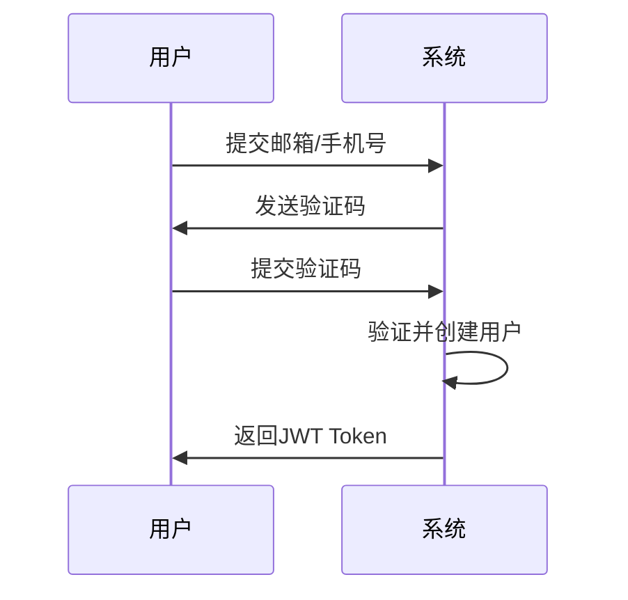
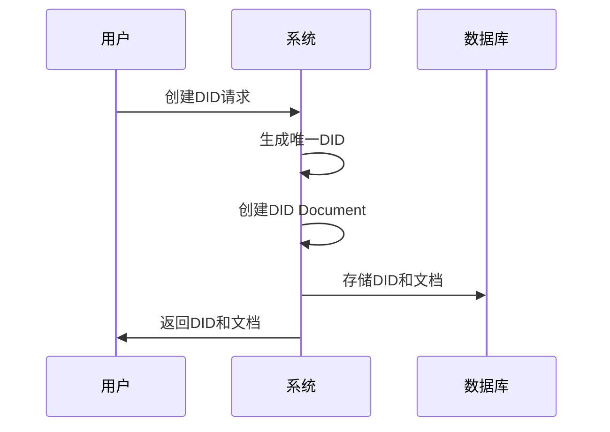
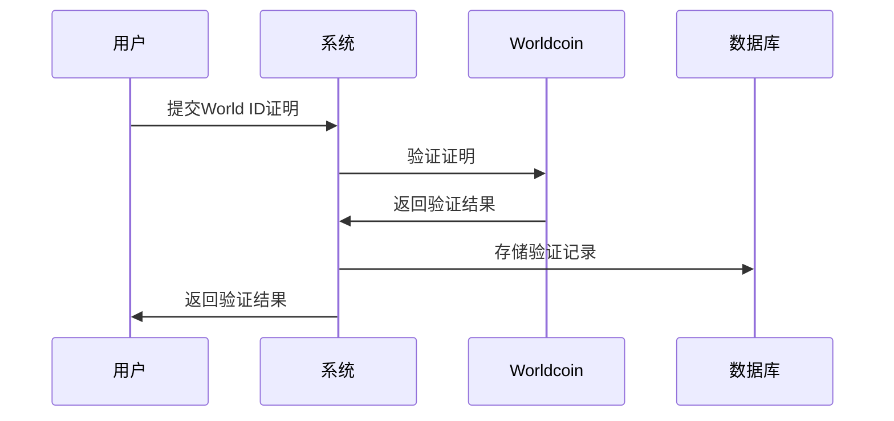

# CrediNet 项目总览

## 🎯 项目定位

CrediNet 是一个企业级的去中心化信用网络系统，为Web3应用提供完整的身份认证、DID管理、身份验证、用户授权、信用评分和SBT发放解决方案。

## 🏗️ 系统架构

### 整体架构

```
┌───────────────────────────────────────────────────────────────┐
│                     CrediNet 系统                              │
├───────────────────────────────────────────────────────────────┤
│                                                               │
│  ┌─────────┐ ┌─────────┐ ┌─────────┐ ┌─────────┐ ┌─────────┐ ┌─────────┐ │
│  │ 模块1   │ │ 模块2   │ │ 模块3   │ │ 模块4   │ │ 模块5   │ │ 模块6   │ │
│  │身份认证  │ │DID管理  │ │身份验证  │ │用户授权  │ │信用评分  │ │SBT发放  │ │
│  └─────────┘ └─────────┘ └─────────┘ └─────────┘ └─────────┘ └─────────┘ │
│       │             │              │             │            │
│       └─────────────┴──────────────┴─────────────┘            │
│                          │                                    │
│                  ┌───────────────┐                            │
│                  │  共享组件层    │                             │
│                  │  - 数据库      │                            │
│                  │  - JWT认证     │                            │
│                  │  - 错误处理    │                            │
│                  └───────────────┘                            │
│                          │                                    │
│                  ┌───────────────┐                            │
│                  │  数据持久层     │                            │
│                  │  SQLite (10表) │                            │
│                  └───────────────┘                            │
└───────────────────────────────────────────────────────────────┘
```

### 模块职责

| 模块 | 职责 | API端点 | 依赖 |
|------|------|---------|------|
| **Auth** | 用户认证和授权 | 4个 | Shared |
| **DID** | DID生成和管理 | 8个 | Shared |
| **Identity** | 第三方身份验证 | 12个 | Shared |
| **Authorization** | 数据源授权管理 | 10个 | Shared |
| **Credit** | 信用评分和画像 | 9个 | Shared, Authorization |
| **SBT** | SBT发放和管理 | 12个 | Shared, Credit |
| **Shared** | 公共服务和工具 | - | - |

## 📦 模块设计

### 模块1: 身份认证 (Auth)

**设计目标**: 提供安全可靠的用户认证机制

**核心组件**:
- `AuthService` - 验证码管理和用户认证
- JWT中间件 - 令牌验证和权限控制
- 验证码存储 - 内存缓存（可扩展为Redis）

**数据流**:
```
用户 → 发送验证码 → 验证码存储 → 用户登录 → JWT生成 → 访问API
```

### 模块2: DID管理 (DID)

**设计目标**: 符合W3C标准的DID管理系统

**核心组件**:
- `DidService` - DID生成和文档管理
- 版本控制系统 - 完整的历史记录
- 区块链接口 - 可扩展的链上注册

**数据流**:
```
用户ID → 生成DID → 创建Document → 存储版本 → 可选链上注册
```

### 模块3: 身份验证 (Identity)

**设计目标**: 多源身份验证和绑定管理

**核心组件**:
- World ID验证器 - 人类唯一性证明
- VC验证器 - 可验证凭证验证
- OAuth管理器 - 社交平台绑定
- 钱包管理器 - 多链地址关联

**数据流**:
```
用户 → 提交证明/授权 → 验证 → 存储绑定 → 查询身份信息
```

### 模块4: 用户授权 (Authorization) ⭐ 新增

**设计目标**: 用户自主控制数据源使用权限

**核心组件**:
- `AuthorizationService` - 授权管理和状态控制
- 授权日志系统 - 完整的审计追踪
- 权限范围定义 - 数据使用合规保证

**数据流**:
```
用户 → 选择数据源 → 设置授权 → 记录日志 → 实时生效
```

## 🗄️ 数据库设计

### ER图概览

```
users (用户)
  ├─→ dids (DID)
  │    └─→ did_documents (DID文档版本)
  │         └─→ blockchain_registrations (区块链注册)
  ├─→ worldid_verifications (World ID)
  ├─→ verifiable_credentials (可验证凭证)
  ├─→ oauth_bindings (OAuth绑定)
  ├─→ wallet_addresses (钱包地址)
  ├─→ user_authorizations (用户授权) ⭐
  └─→ authorization_logs (授权日志) ⭐
```

### 表设计原则

1. **规范化**: 第三范式设计
2. **完整性**: 外键约束
3. **唯一性**: 唯一索引
4. **可扩展**: 预留扩展字段

## 🔄 业务流程

### 用户注册流程



### DID创建流程



### 身份验证流程



## 🔧 技术选型

### 为什么选择Rust？
- ✅ 高性能和内存安全
- ✅ 强类型系统
- ✅ 优秀的异步支持
- ✅ 丰富的生态系统

### 为什么选择Axum？
- ✅ 基于Tokio的高性能
- ✅ 类型安全的路由
- ✅ 优雅的中间件系统
- ✅ 良好的错误处理

### 为什么选择SQLite？
- ✅ 零配置
- ✅ 轻量级
- ✅ 可靠性高
- ✅ 易于迁移到PostgreSQL

## 🔒 安全设计

### 认证安全
- **验证码**: 5分钟有效期，单次使用
- **JWT**: HMAC-SHA256签名，24小时过期
- **权限**: 基于角色的访问控制

### 数据安全
- **加密**: 敏感数据加密存储
- **完整性**: 外键约束保证一致性
- **唯一性**: 防止重复绑定

### 通信安全
- **HTTPS**: 生产环境强制HTTPS
- **CORS**: 跨域请求控制
- **限流**: API请求频率限制

## 📈 可扩展性

### 水平扩展
- 无状态JWT认证
- 数据库连接池
- 异步非阻塞IO

### 功能扩展
- 模块化设计易于添加新功能
- 插件化的验证器
- 可配置的第三方服务

### 性能优化
- Redis缓存层
- 数据库读写分离
- CDN静态资源加速

## 🔄 集成方案

### 前端集成
```javascript
// 1. 用户登录
const response = await fetch('/auth/login', {
  method: 'POST',
  body: JSON.stringify({ contact, code })
});
const { token, user_id } = await response.json();

// 2. 创建DID
const didResponse = await fetch('/did', {
  method: 'POST',
  headers: { 'Authorization': `Bearer ${token}` },
  body: JSON.stringify({ user_id, public_key })
});

// 3. World ID验证
const worldidResponse = await fetch('/identity/worldid/verify', {
  method: 'POST',
  body: JSON.stringify({ user_id, proof, action, signal })
});
```

### 区块链集成
- 支持以太坊、Polygon等EVM链
- 可扩展到Solana、Bitcoin等
- 智能合约接口预留

### 第三方服务集成
- Worldcoin API
- OAuth平台（GitHub、Twitter等）
- 邮件/短信服务
- 区块链节点

## 🚀 部署架构

### 单机部署
```
Nginx → Rust服务 → SQLite
```

### 分布式部署
```
负载均衡 → [Rust服务1, Rust服务2, ...] → PostgreSQL主从
                                          ↓
                                        Redis缓存
```

## 📊 监控和日志

### 建议的监控指标
- API响应时间
- 错误率
- 并发连接数
- 数据库查询性能
- 内存使用情况

### 日志级别
- ERROR: 系统错误
- WARN: 警告信息
- INFO: 关键操作
- DEBUG: 调试信息

## 🔮 未来规划

### 短期（1-3个月）
- 集成真实的第三方服务
- 实现防刷机制
- 添加审计日志

### 中期（3-6个月）
- 真实区块链集成
- 性能优化
- 管理后台

### 长期（6-12个月）
- 信用评分引擎
- 跨链DID解析
- 隐私计算集成

## 📞 技术支持

- 📖 [完整文档](README.md)
- 🐛 [问题反馈](https://github.com/...)
- 💬 技术交流群

---

**文档版本**: v1.0.0  
**最后更新**: 2025-10-11