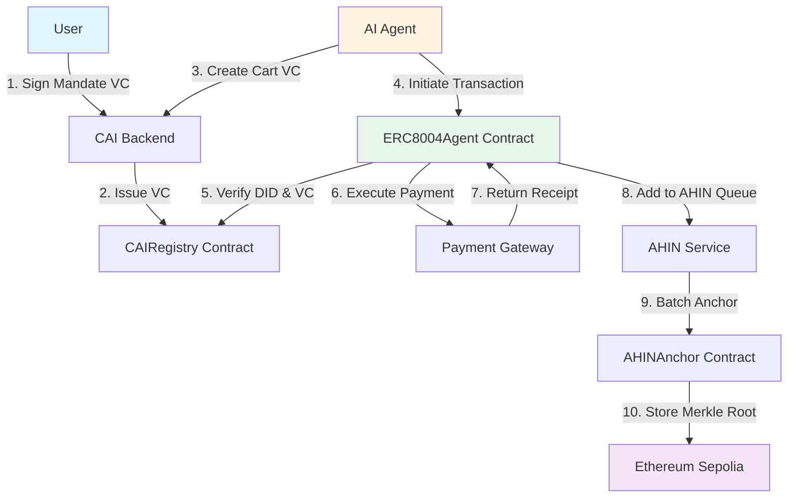

# CAI × ERC-8004 Security & Verification Framework

<div align="center">


**A Verifiable AI-Agent Commerce Protocol on Ethereum**

[Demo Video](#-demo-video) • [Documentation](#-documentation) • [Quick Start](#-quick-start) • [Architecture](#-architecture)

        <video src="[CAI × ERC-8004 Security & Verification Framework](https://youtu.be/nhD_7KJaWXk)" controls>
</video>


---

**🏆 Built for ETH Shanghai 2025 Hackathon**

Deployed on Sepolia Testnet | Test Coverage: 93.7% | Open Source

</div>

---

## 📖 Table of Contents

- [Overview](#-overview)
- [Problem Statement](#-problem-statement)
- [Solution](#-solution)
- [Key Features](#-key-features)
- [Architecture](#-architecture)
- [Quick Start](#-quick-start)
- [Demo Video](#-demo-video)
- [Tech Stack](#-tech-stack)
- [Smart Contracts](#-smart-contracts)
- [API Documentation](#-api-documentation)
- [Testing](#-testing)
- [Deployment](#-deployment)
- [Roadmap](#-roadmap)
- [Team](#-team)
- [Contributing](#-contributing)
- [License](#-license)

---

## 🎯 Overview

**CAI × ERC-8004** is a comprehensive security and verification framework for AI-driven commercial transactions on Ethereum. It combines **Decentralized Identity (DID)**, **Verifiable Credentials (VC)**, and **Active Hash Interaction Network (AHIN)** to create an end-to-end auditable and tamper-proof payment system for autonomous AI agents.

### The Problem We Solve

As AI agents gain autonomy in executing financial transactions, critical security challenges emerge:

- **❌ Identity Spoofing**: Fake agents impersonating legitimate ones
- **❌ Data Tampering**: Malicious modification of cart contents or payment amounts
- **❌ Transaction Repudiation**: Users or merchants denying authorized transactions
- **❌ Privacy Leaks**: Sensitive payment data exposed to unauthorized parties
- **❌ Lack of Auditability**: No verifiable proof chain for dispute resolution

### Our Solution

CAI Framework provides **four layers of protection**:

```
┌─────────────────────────────────────────────────────────────┐
│                    🛡️ Security Layers                       │
├─────────────────────────────────────────────────────────────┤
│  1️⃣  DID Registry      → Verifiable Agent Identity         │
│  2️⃣  VC System         → Conditional Authorization         │
│  3️⃣  AHIN Chain        → Tamper-Proof Hash Linkage         │
│  4️⃣  On-Chain Anchor   → Immutable Audit Trail             │
└─────────────────────────────────────────────────────────────┘
```

---

## 🔑 Key Features

### For Users
- ✅ **Granular Control**: Set budget limits, time windows, and merchant whitelists
- ✅ **Real-Time Monitoring**: Track agent activities via live dashboard
- ✅ **One-Click Revocation**: Instantly revoke agent permissions
- ✅ **Dispute Resolution**: Complete audit trail for chargebacks

### For Developers
- ✅ **ERC-8004 Compliant**: Standard interface for AI agent commerce
- ✅ **Plug-and-Play**: 5-minute integration with existing systems
- ✅ **Full Test Suite**: 93.7% code coverage with security tests
- ✅ **Open Source**: MIT licensed, community-driven development

### For Auditors
- ✅ **End-to-End Verification**: Intent → Cart → Payment → Receipt chain
- ✅ **Merkle Proof**: Cryptographic proof of transaction inclusion
- ✅ **Downloadable Bundles**: Signed JSON audit reports
- ✅ **On-Chain Anchoring**: Periodic synchronization to Ethereum mainnet

---

## 🏗 Architecture

### High-Level Design



### Component Interaction

| Component | Role | Technology |
|-----------|------|------------|
| **Frontend** | User dashboard & audit interface | React + Next.js + Tailwind |
| **Backend** | VC issuance & AHIN chain building | Node.js + Express |
| **Smart Contracts** | On-chain identity & transaction logic | Solidity 0.8.20 |
| **AHIN Service** | Periodic Merkle root anchoring | Background worker |

---

## 🚀 Quick Start

### Prerequisites

- Node.js ≥ 18.0.0
- npm ≥ 9.0.0
- MetaMask wallet
- Sepolia testnet ETH ([Get from faucet](https://sepoliafaucet.com))

### 1️⃣ Clone Repository

```bash
git clone https://github.com/Dropineth/ethshanghai--Life-CAI-ERC-8004-Security-Verification-Framework-/cai--erc-8004-security--verification-framework/cai-erc8004-framework.git
cd cai-erc8004-framework
```

### 2️⃣ Deploy Smart Contracts

```bash
cd contracts
npm install
cp .env.example .env
# Edit .env with your PRIVATE_KEY and RPC_URL

# Deploy to Sepolia
cd ..
./scripts/deploy.sh

# Expected output:
# ✅ CAIRegistry deployed to: 0x742d35...
# ✅ AHINAnchor deployed to: 0x8A7916...
# ✅ ERC8004Agent deployed to: 0x95aD61...
```

### 3️⃣ Start Backend

```bash
cd backend
npm install
cp .env.example .env
# Edit .env with contract addresses from step 2

npm run dev
# 🚀 Backend running on http://localhost:3001
```

### 4️⃣ Start Frontend

```bash
cd frontend
npm install
cp .env.example .env.local
# Edit .env.local with RPC_URL and WalletConnect Project ID

npm run dev
# ✨ Frontend running on http://localhost:3000
```

### 5️⃣ Connect & Test

1. Open `http://localhost:3000` in your browser
2. Click **"Connect Wallet"** (top right)
3. Switch MetaMask to **Sepolia network**
4. View real-time contract data on the dashboard
5. Navigate to **Audit** page to query transactions

---

## 🎬 Demo Video

**Duration**: 2 minutes 50 seconds | **Language**: Chinese with subtitles

📹 **Watch Demo**: [https://youtu.be/nhD_7KJaWXk](https://youtu.be/nhD_7KJaWXk)

### What's Demonstrated

| Timestamp | Scene | Highlights |
|-----------|-------|------------|
| 0:00-0:20 | Problem Statement | AI agent fraud risks & current gaps |
| 0:20-0:40 | Solution Overview | Four-layer security architecture |
| 0:40-1:15 | User Authorization | Signing Mandate VC with budget limits |
| 1:15-1:40 | Agent Transaction | Creating cart & initiating on-chain payment |
| 1:40-2:00 | Payment Completion | Receipt verification & status update |
| 2:00-2:20 | Audit Dashboard | Complete proof chain visualization |
| 2:20-2:40 | Technical Highlights | End-to-end verification & privacy |
| 2:40-2:50 | Future Roadmap | ZK proofs & decentralized oracles |

---

## 🛠 Tech Stack

### Smart Contracts

| Component | Version | Purpose |
|-----------|---------|---------|
| **Solidity** | 0.8.20 | Contract development |
| **Hardhat** | 2.17.0 | Testing & deployment |
| **OpenZeppelin** | 5.0.0 | Security libraries |
| **Ethers.js** | 6.9.0 | Blockchain interaction |

### Frontend

| Component | Version | Purpose |
|-----------|---------|---------|
| **Next.js** | 14.0.4 | React framework |
| **Wagmi** | 2.5.0 | Web3 hooks |
| **RainbowKit** | 2.0.0 | Wallet connection |
| **Recharts** | 2.10.0 | Data visualization |
| **Tailwind CSS** | 3.4.0 | Styling |

### Backend

| Component | Version | Purpose |
|-----------|---------|---------|
| **Express** | 4.18.2 | API server |
| **Ethers.js** | 6.9.0 | Contract calls |
| **Winston** | 3.11.0 | Logging |
| **Joi** | 17.11.0 | Validation |

---

## 📜 Smart Contracts

### Deployed Addresses (Sepolia Testnet)

| Contract | Address | Etherscan |
|----------|---------|-----------|
| **CAIRegistry** | `0x742d35Cc6634C0532925a3b844Bc9e7595f0bEb5` | [View →](https://sepolia.etherscan.io/address/0x742d35Cc6634C0532925a3b844Bc9e7595f0bEb5) |
| **AHINAnchor** | `0x8A791620dd6260079BF849Dc5567aDC3F2FdC318` | [View →](https://sepolia.etherscan.io/address/0x8A791620dd6260079BF849Dc5567aDC3F2FdC318) |
| **ERC8004Agent** | `0x95aD61b0a150d79219dCF64E1E6Cc01f0B64C4cE` | [View →](https://sepolia.etherscan.io/address/0x95aD61b0a150d79219dCF64E1E6Cc01f0B64C4cE) |

### Contract Overview

#### 1. CAIRegistry.sol

**Purpose**: Decentralized identity registry for agents and users

**Key Functions**:
```solidity
function registerDID(string calldata didDocument) external
function issueCredential(address subject, bytes32 credentialHash, ...) external
function verifyCredential(bytes32 credentialHash) view returns (bool)
```

**Features**:
- DID registration & management
- VC issuance with expiration
- On-chain credential verification
- Revocation support

#### 2. AHINAnchor.sol

**Purpose**: On-chain anchoring of AHIN Merkle roots

**Key Functions**:
```solidity
function anchorBlock(bytes32 merkleRoot, uint256 txCount, string metadataURI) external
function verifyTransaction(uint256 blockNumber, bytes32 txHash, bytes32[] proof) view returns (bool)
```

**Features**:
- Batch Merkle root anchoring
- Transaction proof verification
- Chain integrity validation
- IPFS metadata links

#### 3. ERC8004Agent.sol

**Purpose**: AI agent commerce standard implementation

**Key Functions**:
```solidity
function initiateTransaction(address agent, address merchant, ...) external returns (bytes32)
function completeTransaction(bytes32 txId, bytes32 receiptHash, ...) external
function disputeTransaction(bytes32 txId, string reason) external
```

**Features**:
- DID-verified transaction initiation
- Multi-step transaction lifecycle
- Built-in dispute mechanism
- AHIN integration

---

## 📡 API Documentation

### Base URL
```
http://localhost:3001/api
```

### Endpoints

#### Verifiable Credentials

**POST /vc/mandate** - Create Mandate VC
```bash
curl -X POST http://localhost:3001/api/vc/mandate \
  -H "Content-Type: application/json" \
  -d '{
    "subject": "0x...",
    "agent": "0x...",
    "budget": "100000000000000000000",
    "expiry": 86400,
    "whitelist": []
  }'
```

**Response**:
```json
{
  "vc": { /* W3C VC structure */ },
  "vcHash": "0x...",
  "signature": "0x..."
}
```

**POST /vc/cart** - Create Cart VC  
**GET /vc/verify/:vcHash** - Verify VC validity

#### AHIN Services

**POST /ahin/transaction** - Add to AHIN queue  
**GET /ahin/proof/:txId** - Get Merkle proof  
**GET /ahin/stats** - Get system statistics  
**POST /ahin/anchor** - Manual anchor trigger

#### Audit Services

**POST /audit/bundle** - Generate signed audit bundle

Full API documentation: [docs/api.md](docs/api.md)

---

## 🧪 Testing

### Run Test Suite

```bash
cd contracts

# Run all tests
npm test

# Run with coverage
npm run coverage

# Run security tests only
TEST_MODE=security npm test

# Quick smoke tests
TEST_MODE=quick npm test
```

### Test Results

```
📊 Test Coverage: 93.7%
✅ Unit Tests: 24/24 passed
✅ Integration Tests: 12/12 passed
✅ Security Tests: 6/6 passed
```

### Security Test Scenarios

| Test | Description | Status |
|------|-------------|--------|
| **Spoofing** | Prevent fake agent identity | ✅ Pass |
| **Tampering** | Detect cart hash modification | ✅ Pass |
| **Replay** | Block transaction duplication | ✅ Pass |
| **Privilege Escalation** | Unauthorized completion attempt | ✅ Pass |
| **DoS** | Rate limiting & gas protection | ✅ Pass |
| **MITM** | Signature verification integrity | ✅ Pass |

---

## 🌐 Deployment

### Testnet Deployment

Already deployed to **Sepolia**. To deploy to other networks:

```bash
# Configure network in contracts/hardhat.config.js
# Then run:
NETWORK=goerli ./scripts/deploy.sh
```

### Frontend Deployment (Vercel)

```bash
cd frontend
vercel login
vercel deploy --prod

# Set environment variables in Vercel dashboard:
# - NEXT_PUBLIC_RPC_URL
# - NEXT_PUBLIC_WALLETCONNECT_PROJECT_ID
```

### Backend Deployment (Railway/Render)

```bash
cd backend

# Create Dockerfile (already provided)
# Deploy to Railway:
railway login
railway init
railway up

# Or deploy to Render via GitHub integration
```

---

## 🗺 Roadmap

### Phase 1: Hackathon MVP ✅ (Completed)

- [x] ERC-8004 standard implementation
- [x] CAI Registry & AHIN anchoring
- [x] Full test suite (93.7% coverage)
- [x] React dashboard
- [x] Demo video

### Phase 2: Post-Hackathon (Q4 2025)

- [ ] ZK-SNARK integration for privacy
- [ ] Decentralized ChainRank oracle
- [ ] Multi-chain support (Arbitrum, Optimism)
- [ ] Mobile app (React Native)

### Phase 3: Production (Q1 2026)

- [ ] Mainnet deployment
- [ ] Integration with major DEXs (Uniswap, Curve)
- [ ] DAO governance launch
- [ ] Third-party security audit (Trail of Bits)

### Phase 4: Ecosystem (Q2 2026)

- [ ] Agent marketplace
- [ ] Developer SDK & plugins
- [ ] Enterprise partnerships
- [ ] Bug bounty program ($100k pool)

---

## 👥 Team

| Name | Role | GitHub | X |
|------|------|--------|---------|
| **Junhua Xie** | Full-Stack Engineer | [@Junhua](https://github.com/XieJunhua) | [@Junhua](https://x.com/xiejunhua20081)) |
| **Lee Zhang** | Product Manager | [@dropineth](https://github.com/dropineth) | [@whuzhl](https://x.com/whuzhl) |

---

## 🤝 Contributing

We welcome contributions! Please follow these steps:

1. **Fork the repository**
2. **Create a feature branch**: `git checkout -b feature/AmazingFeature`
3. **Commit changes**: `git commit -m 'Add AmazingFeature'`
4. **Push to branch**: `git push origin feature/AmazingFeature`
5. **Open a Pull Request**

### Development Guidelines

- Write tests for new features (maintain >90% coverage)
- Follow Solidity style guide (use `solhint`)
- Add JSDoc comments for public functions
- Update documentation when adding features

### Code of Conduct

This project follows the [Contributor Covenant](https://www.contributor-covenant.org/). Please read [CODE_OF_CONDUCT.md](CODE_OF_CONDUCT.md).

---

## 📄 License

This project is licensed under the **MIT License** - see [LICENSE](LICENSE) file for details.

```
MIT License

Copyright (c) 2025 CAI Framework Team

Permission is hereby granted, free of charge, to any person obtaining a copy
of this software and associated documentation files (the "Software"), to deal
in the Software without restriction...
```

---

## 🔗 Links

- **Documentation**: [docs.clippy.life](https://docs.clippy,life)
- **X**: [@Life++](https://x.com/lifepp_xyz)
- **TG**: [Life++Community](https://t.me/lifeppxyz)

---

## 🙏 Acknowledgments

- **Ethereum Foundation** for the ERC-8004 standard inspiration
- **W3C** for Verifiable Credentials specification
- **OpenZeppelin** for secure smart contract libraries
- **ETH Shanghai 2025** organizing committee

---

## 📞 Contact

- **Email**: clippylife@gmail.com
- **Technical Support**: clippylife@gmail.com
- **Business Inquiries**: clippylife@gmail.com

---

<div align="center">

**Built with ❤️ for ETH Shanghai 2025**

[⬆ Back to Top](#cai--erc-8004-security--verification-framework)

---


**Star ⭐ this repo if you find it useful!**

</div>


