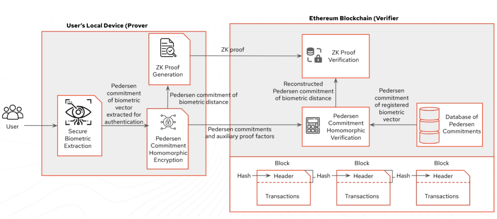
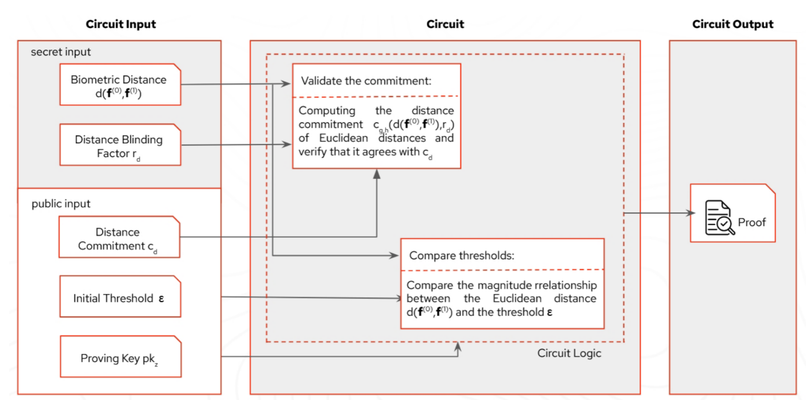

# OwnFace - ETHShanghai 2025

> Own Your Face Before Own Your Data

## 一、提交物清单 (Deliverables)

- [x] GitHub 仓库（公开）：https://github.com/Coooder-Crypto/OwnFace
- [ ] Demo 视频（≤ 3 分钟，中文）：录制中，预计提交时间 5 月底
- [ ] 在线演示链接：计划部署至 Vercel（待上链参数稳定）
- [x] 合约部署信息：见下文“合约与部署”
- [ ] 可选材料：Pitch Deck（准备中）

## 二、参赛队伍填写区 (Fill-in Template)

### 1) 项目概述 (Overview)

- **项目名称**：OwnFace
- **一句话介绍**：基于零知识证明的生物特征自主管理与链上验证，让用户在不暴露原始人脸数据的情况下完成身份证明。
- **目标用户**：Web3 钱包与 dApp、需要 KYC/人脸验证的去中心化应用、希望托管自有生物特征的个人用户。
- **核心问题与动机（Pain Points）**：传统人脸识别依赖中心化服务，存在隐私泄露与二次滥用风险；Web3 世界缺少无需明文生物数据的可信登录方式。
- **解决方案（Solution）**：前端收集向量并与钱包签名交互，后端负责向量量化与零知识证明生成，合约存储 Pedersen 承诺与验证 Groth16 证明，在保持隐私的同时提供可审计的上链记录。

### 2) 架构与实现 (Architecture & Implementation)



- **关键模块**：
  - 前端：Next.js 15 + React 19，集成 RainbowKit / wagmi 完成钱包连接，提供摄像头采集、文件上传、链上交易状态展示。
  - 后端：Node.js (Express + TypeScript)，完成嵌入向量量化、Poseidon 哈希、Pedersen 承诺、Groth16 证明生成与验证，并提供 REST API。
  - 合约：Solidity（Hardhat），`OwnFaceRegistry` 负责注册信息与认证记录，`Groth16Verifier` 完成 zk 证明校验。
  - 电路：Circom 2 + snarkjs，距离比较电路输出阈值判定、公私信号。
- **依赖与技术栈**：
  - 前端：Next.js、React、Tailwind、wagmi、viem、RainbowKit、React Query。
  - 后端：Express、zod、@noble 库、circomlibjs、snarkjs、tsx、TypeScript。
  - 合约：Solidity 0.8.24、Hardhat、TypeScript scripts。
  - 部署：Sepolia 测试网、Vercel（计划中）、自托管 Node。



### 3) 合约与部署 (Contracts & Deployment)

- **网络**：Sepolia 测试网
- **核心合约与地址**：
  ```
  OwnFaceRegistry (recorder=backend signer):
  0x9F361ac7525F8c6f4306585F048Ebd7Bc75D4354

  Groth16Verifier (Distance)：
  0xB28A3296ad9Add5BDB0C82b386229a34bAa17b1d
  ```
- **验证链接**：部署后将提交至 Etherscan（预计 5 月底完成验证）
- **最小复现脚本**：
  ```bash
  # 进入合约目录
  cd contract
  npm install

  # 编译
  npx hardhat compile

  # 本地网络部署（Anvil/Hardhat）
  npx hardhat run scripts/deploy-verifier.ts --network localhost

  # 测试网部署（需要设置 .env，含 RPC 与私钥）
  npm run deploy:verifier:sepolia
  ```

### 4) 运行与复现 (Run & Reproduce)

- **前置要求**：
  - Node.js 18+
  - npm 或 pnpm
  - Git、Circom 2（可选，用于重新编译电路）
  - 可访问的 Sepolia RPC 与测试网账户

- **环境变量样例**：

```bash
# frontend/.env.local
NEXT_PUBLIC_SEPOLIA_RPC_URL=https://sepolia.infura.io/v3/<YOUR_KEY>
NEXT_PUBLIC_WALLETCONNECT_PROJECT_ID=<walletconnect_id>
NEXT_PUBLIC_REGISTRY_ADDRESS=0x9F361ac7525F8c6f4306585F048Ebd7Bc75D4354
NEXT_PUBLIC_VERIFIER_ADDRESS=0xB28A3296ad9Add5BDB0C82b386229a34bAa17b1d
NEXT_PUBLIC_API_BASE_URL=http://localhost:4000

# backend/.env（可选）
PORT=4000
PROVER_THREADS=4

# contract/.env
SEPOLIA_RPC_URL="https://sepolia.infura.io/v3/<YOUR_KEY>"
DEPLOYER_PRIVATE_KEY="0x..."
ETHERSCAN_API_KEY=""
```

- **一键启动（本地示例）**：

```bash
# 克隆并安装
git clone --recurse-submodules https://github.com/Coooder-Crypto/OwnFace.git
cd OwnFace

# 后端
cd backend
npm install
npm run circuits:build   # 如需重新生成电路
npm run dev              # 默认监听 http://localhost:4000

# 前端
cd ../frontend
npm install
npm run dev              # 打开 http://localhost:3000
```

- **在线 Demo（如有）**：部署计划中，预计使用 Vercel Preview + 专用 RPC。
- **账号与测试说明**：
  - 使用任意邮箱格式作为 `userId` 即可注册。
  - Demo 环境提供内置 mock embedding，亦支持上传 16 维 JSON/CSV。
  - 需连接 Sepolia 钱包（建议使用测试账户）完成链上写入。

### 5) Demo 与关键用例 (Demo & Key Flows)

- **视频链接**：制作中（脚本已完成）
- **关键用例步骤**：
  1. **注册承诺**：用户上传/拍摄 embedding → 后端量化+Pedersen 承诺 → 前端发起 `register` 交易 → 合约记录向量哈希与 nonce。
  2. **生成证明**：前端提交新的 embedding → 后端计算候选向量并生成 Groth16 证明 & Poseidon transcript。
  3. **链上认证**：前端发起 `authenticate` 交易 → 合约验签证明 → 更新链上验证快照，前端展示结果与交易链接。
  4. **监控指标**：`/metrics` 接口返回注册数、认证数与平均证明耗时，用于运营看板。

### 6) 可验证边界 (Verifiable Scope)

- **可复现内容**：前端、后端、合约、Circom 电路及生成脚本均已开源，可在本地重新构建并运行。
- **暂未公开内容**：实际生产环境的 RPC、私钥与数据库凭据；将以环境变量形式在评审前单独提供临时访问凭证。
- **注意事项**：当前演示版本使用内存存储，不持久化用户数据；可通过替换 `storage.ts` 接口接入外部数据库。

### 7) 路线图与影响 (Roadmap & Impact)

- **赛后 1-3 周**：
  - 完成合约 Etherscan 验证与自动化部署脚本。
  - 将后端存储迁移至 SQLite/PostgreSQL，提供多节点同步方案。
  - 补充 Demo 视频、技术白皮书草稿。
- **赛后 1-3 个月**：
  - 引入移动端轻客户端 SDK，实现离线嵌入采集与签名。
  - 将 mock 证明替换为可配置的真实 prover 服务，支持 GPU/云编排。
  - 与合作 dApp 对接第一批业务场景（金融 KYC / DAO 访问控制）。
- **预期对以太坊生态的价值**：
  - 提供模块化的 zk 生物认证基建，降低应用集成门槛。
  - 让用户以自主管理的方式完成链上身份验证，符合隐私合规与数据主权趋势。
  - 推动 zk 与生物识别组合的开放标准，丰富链上身份体系。

### 8) 团队与联系 (Team & Contacts)

- **团队名**：OwnFace Core
- **成员与分工**：
  - Coooder - 全栈工程师 - 架构设计、前端/合约集成
  - 0xBiometric - 密码学工程师 - 电路与 zk 证明实现
  - Sora - 产品设计师 - 产品体验、内容运营
- **联系方式**：
  - GitHub Issues：https://github.com/Coooder-Crypto/OwnFace/issues
  - Telegram：@ownface_xyz（若频道暂未启用，可通过 Issues 联系）
- **可演示时段（UTC+8）**：每日 10:00 - 22:00，可根据评审需求预约

## 三、快速自检清单 (Submission Checklist)

- [x] README 按模板填写完整（概述、架构、复现、Demo、边界）
- [ ] 本地可一键运行，关键用例可复现（当前仍需手动部署 prover 依赖）
- [x] 测试网合约地址与部署方式已提供
- [ ] Demo 视频（≤ 3 分钟，中文）链接可访问
- [x] 如未完全开源，已在“可验证边界”说明细节
- [x] 联系方式与可演示时段已填写
