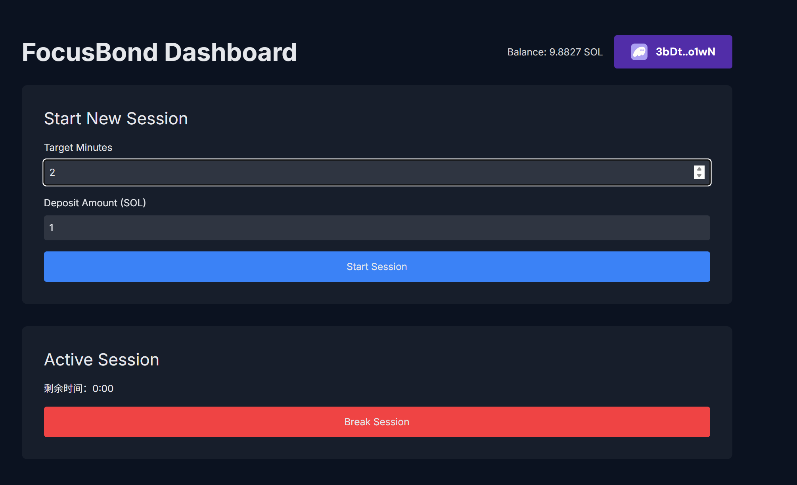
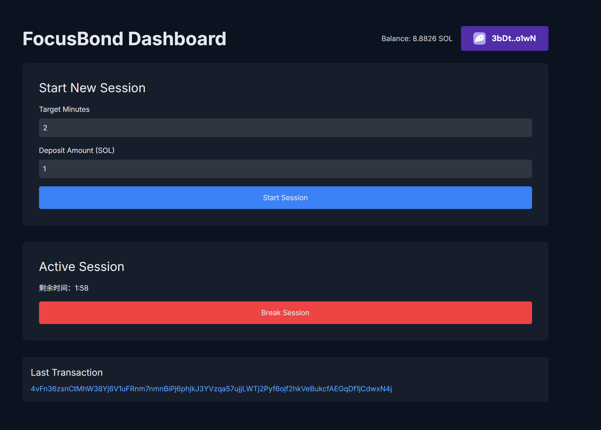
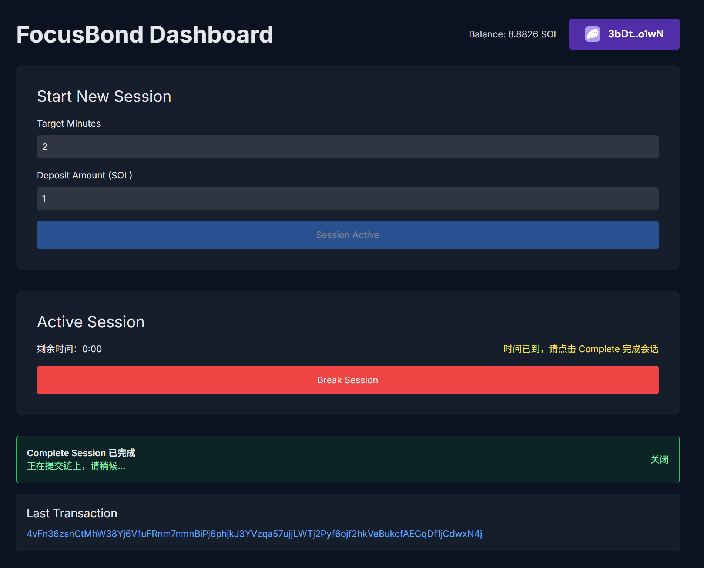
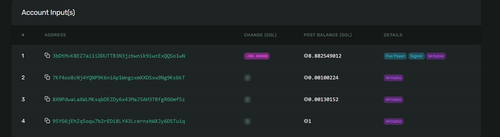

# 配置文件修改说明
1. anchor 版本修改为 0.31
2. 程序地址改为从 target/deploy/keyt-pair.json 中生成公钥

3. 修改 rpc 配置：solana config set --url https://devnet.helius-rpc.com/?api-key=53640935-b640-4f76-8f1c-69fe63b34c6f ，
并且修改 toml 配置文件

4. 前端运行  $ .../apps/web: pnpm run dev

5. github 未提交相关包，但 package.json 中应该有记录，编译和运行失败可以把日志发给AI安装相应的包或者修改配置文件，代码无需做改动

# 逻辑问题

1. 用户点击一次 start session 后进入倒计时，禁止再次点击，重新登录后加载倒计时状态；目前退出重新登录还未实现加载先前倒计时状态

2. 后续更新未定

# 效果

完成后目前没有给出奖励也没退还押金