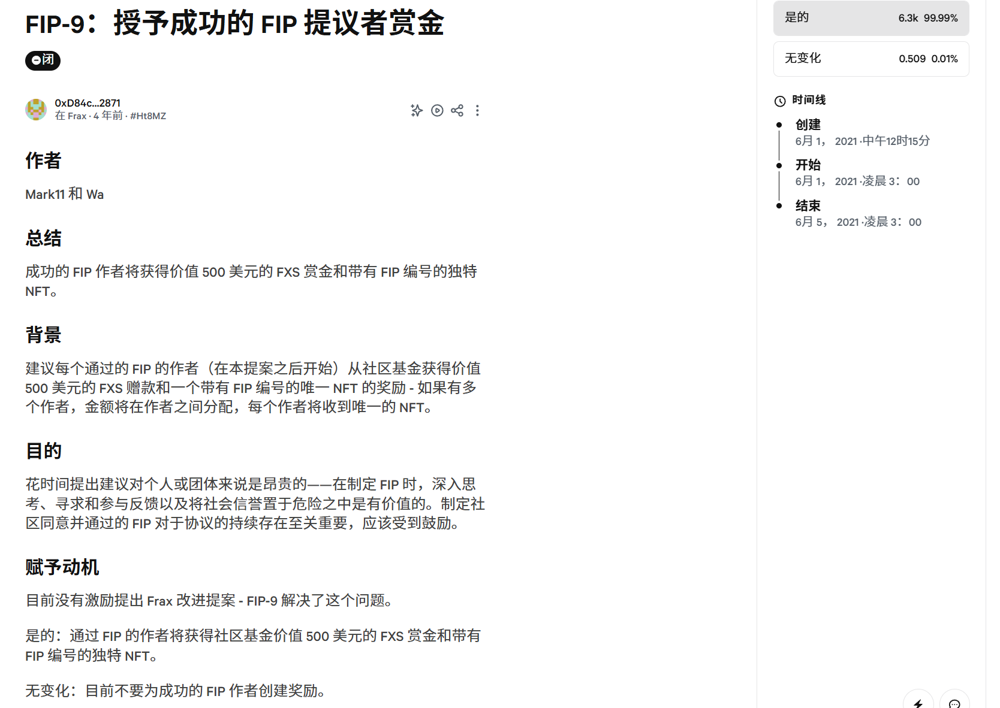

### 项目简介

我们旨在打造一个链上治理优化平台，使用AI动态分析项目状况和历史提案，结合本身项目分类，全自动提出治理提案并交由用户投票，且最终在源项目上发起。这不仅解决了以太坊各项目提案缺少、治理思路缺乏的困境，也提高了质押用户参与投票治理的积极性，并为以太坊生态活跃度的提升做出贡献。

-------

### 具体介绍

我们的设计灵感来源于以太坊生态各项目日益减少的提案数量和枯竭且集中的代币质押情况。治理应该属于每一个协议使用者和社区共建者，而非仅仅提供了代币质押的巨鲸。每个人都可以提出创新性的，更适合协议发展的建议，而我们则决定借助AI和数据分析的力量，提出更好的提案帮助项目进行改进，且增进各用户的治理参与度。

对于当前的以太坊生态来说，我们可以发现各项目的治理提案数量正随着时间减少，投票用户也面临缩减和从散户向大户的转变。我们以某协议为例，可以看到国库资金、tvl与提案数量有着明显的正相关关系。因此，激励项目方产生优质的提案内容，和激励用户积极参与提案投票治理，对于整个项目的可持续发展以及以太坊生态的活跃度都有极大的帮助。同时，该项目的一个历史提案就旨在奖励优秀提案者并给予赏金和NFT奖励，可见项目本身对于契合协议发展的提议是有需求的，有动力的。

为此，我们打造了一个链上治理优化平台，使用AI动态分析项目状况和历史提案，结合本身项目分类，全自动提出治理提案并交由用户投票，且最终在源项目上发起。这不仅解决了以太坊各项目提案缺少、治理思路缺乏的困境，也提高了质押用户参与投票治理的积极性，并为以太坊生态活跃度的提升做出贡献。

具体到提案生成过程中，我们构建了AI多智能体全自动进行项目分析，随后生成有针对性的治理提案。具体过程上，我们将分为以下几个多智能体进行处理。

我们首先有一个Agent进行数据规整和洞察提炼，得到趋势分析。AI会先根据收集的有关项目现状发展信息（如DefiLlama上的TVL、Revenue、Volume、Treasury资金、CEX/DEX上的流动性和CMC上的Market Cap、Price Change等信息），做出项目的基本面判断。

接着，我们设计一个Agent考虑项目的发展状况，包括项目所处阶段、代币解锁压力，同时参考项目的官方文档、白皮书等，得到对当前项目更细致、个性化的提案认知。

我们还设计了一个用来阅读项目代码的Agent，主要关注项目历史代码仓库的提交更改等信息，从而对项目设计有更深入的了解。

同时，还有一个Agent负责用RAG对历史提案进行检索，选择和当前协议状况相似性高的优秀提案进行学习，并同时参考市场上同类型的协议提案，得到更精准规范的提案要求（500个提案找出10个以内进行in-context learning）

最后，我们将有一个Agent通过收集其他Agent的分析或提示信息，考虑当前的市场热点和发展情况，生成符合提案规范的，有依据的提案并自动化在我们的平台用合约发起供用户投票。

在投票权限上，我们有多元的设计。项目方可以通过分发NFT的方式或者设置最低质押门槛来防止滥用投票，并将投票权给予真实的社区参与者。对于用户而言，投票参与治理也是链上活跃度和链上身份的象征。

在项目的真实可用性上，这是一个项目方和用户双赢的设计。

对项目方来说，可以选择将原先的投票APY拆分一部分部署到我们的平台上，或者选择给出额外的token/NFT，来激励用户支持对AI生成的创新性提案促进项目发展。进一步说，他们可以享受到AI对于项目的全面分析以及提出的有建设性的创新提案，以及用户参与到协议治理的热度。

对于用户来说，可以支持更多创新性的提案。我们将和项目方进行合作，我们部署的合约会具有超级权限，在它们获得足够多的投票且经过设置的冷静期之后，可以直接在项目端发起提案，最后再经过正式的提案过程之后就可以被执行。除此之外，他们还可以获得来自于项目方和我们平台的额外激励。

我们以多智能体AI与数据驱动，自动生成并发起高质量治理提案，提升投票参与度，促成协议与用户协同演进，重振以太坊治理活力。
