# Nomad Pay
Nomad Pay is a crypto-financial tool that combines payments, income, and wallet management, providing digital nomads with an integrated solution for cross-border asset management and daily payments.

# NomadPay: The Web3 Payment & Yield Hub for Digital Nomads

NomadPay is a **decentralized financial hub** designed for **digital nomads** and **remote workers**, providing them with a unified platform to handle **payments**, **yield** on savings, and crypto **wallet management**. Combining Ethereum-based stablecoin payments, DeFi yields, and a simple wallet interface, NomadPay is the “crypto-powered Alipay” for global nomads.

---

## 🚀 Project Vision

NomadPay aims to empower digital nomads with tools to:
- Pay instantly with stablecoins anywhere in the world.Include local QR code（VietQR，QRPH，QRIS）
- Earn high-yield interest on crypto savings via DeFi protocols.
- Manage all their financial activities in one simple platform.

**Mission:** To provide an easy-to-use, crypto-powered financial suite that simplifies payments, optimizes yields, and helps nomads live and work freely without borders.

---

## 🔑 Core Features

1. **Web3 Login (MetaMask/Torus)**  
   Users log in securely with their Ethereum wallet.

2. **Stablecoin Payment Integration**  
   Pay globally with USDC/USDT, using Ethereum and Layer 2 (L2) networks for lower fees and faster transactions.

3. **Yield Generation with DeFi**  
   Automatically invest in stablecoin DeFi pools (Aave, Compound, Yearn) based on user risk preferences.

4. **Wallet Hub**  
   All-in-one dashboard to track payments, yield performance, and balances.

---

## 🌍 Problem We're Solving

Digital nomads often struggle with:
- High transaction fees and slow processing for cross-border payments.
- Limited yield opportunities for digital savings.
- A lack of cohesive financial tools designed for mobile and multi-country lifestyles.

---

## 🚀 How NomadPay Solves It

**NomadPay** combines **stablecoin payments**, **DeFi yield generation**, and **wallet management** into a seamless experience, enabling users to:
- Deposit funds and earn interest on stablecoins.
- Pay anywhere with stablecoins using Ethereum’s decentralized infrastructure.
- Easily manage financial assets from one unified interface.

---

## 🧠 Tech Stack

- **Frontend:** React (Web)
- **Backend:** Ethereum, Layer 2 solutions (Optimism, Arbitrum)
- **Smart Contracts:** Solidity (Aave/Compound/Yearn integration)
- **Wallet Integration:** MetaMask, Torus
- **Payment:** USDC/USDT
- **Yield Protocols:** Aave, Compound, Yearn

---

## 🛠 Product Flow (Mermaid Diagram)

```mermaid
flowchart TD
A[User deposits USDC/USDT via App] --> RiskProfile[Risk Assessment]

RiskProfile --> Strategy[Fund Allocation Strategy]
A --> Buffer[Buffer Layer for Instant Payments<br/>Hold 5-20% of Funds]
A --> RiskDisclosure[Risk Disclosure]

Buffer --> D[Register/Generate Fiat24 U-Card NFT Account + Visa Virtual Card]

%% Three parallel strategies
Strategy --> Conservative[Conservative Strategy<br/>Staking & Lending DeFi<br/>Aave/Compound<br/>APY 3-8%]
Strategy --> Balanced[Balanced Strategy<br/>Yield Farming<br/>Yearn and similar protocols<br/>APY 6-12%]
Strategy --> Aggressive[Aggressive Strategy<br/>Major Cryptocurrencies<br/>BTC/ETH and other majors<br/>Variable returns, higher risk]

%% Risk disclosure connects to all strategies
RiskDisclosure -.-> Conservative
RiskDisclosure -.-> Balanced
RiskDisclosure -.-> Aggressive

%% Strategy results converge
Conservative --> Yield[Yield Accumulation]
Balanced --> Yield
Aggressive --> Yield

%% Payment process
D --> PaymentDecision{Payment Trigger}
PaymentDecision -->|Small Payment ≤50 USD| SmallPayment[Direct Payment from Buffer<br/>Instant Confirmation]
PaymentDecision -->|Large Payment >50 USD| LargePayment[Automatically Withdraw from DeFi Pool]

SmallPayment --> Spend[Offline Payments<br/>AEON Pay QR Code or U-Card/ATM Instant Fiat Spending]
LargePayment --> Spend

Spend --> Rebalance[Rebalance Funds<br/>Auto-replenish Buffer Layer when Funds Run Low]
Rebalance --> Buffer

%% AI monitoring and strategy updates
Yield --> AIMonitor[AI Monitoring APY Fluctuations and Risks<br/>Suggest Switching Pools or Adjusting Strategy]
AIMonitor --> StrategyUpdate[Strategy Update Suggestion<br/>Execute after User Confirmation]
StrategyUpdate --> Conservative
StrategyUpdate --> Balanced
StrategyUpdate --> Aggressive
```

