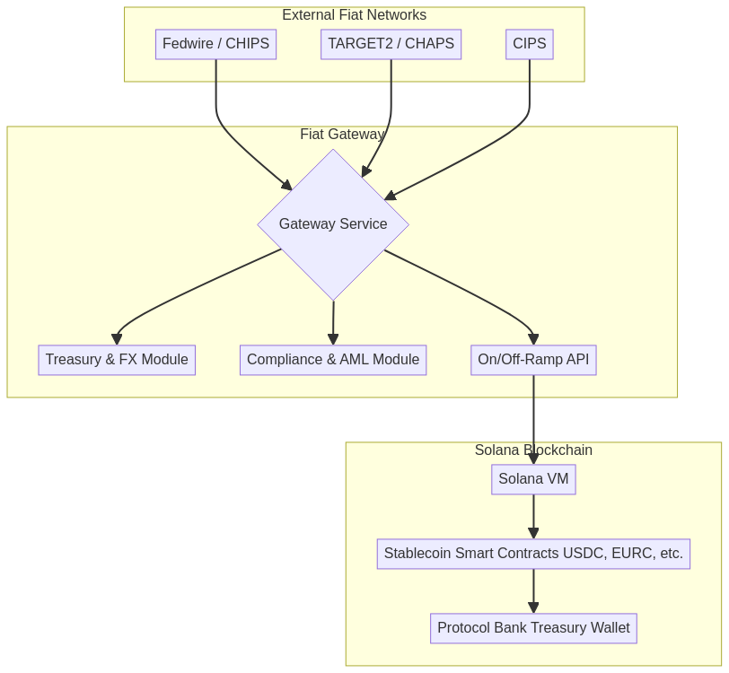
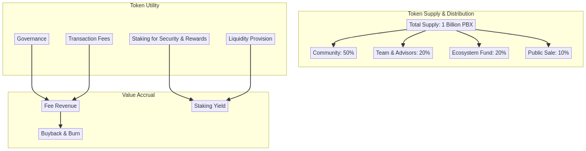
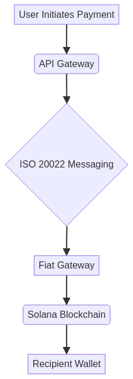
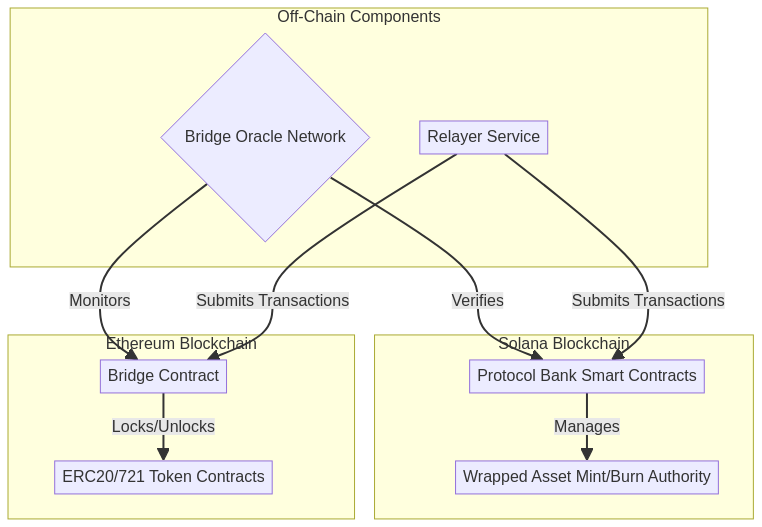

# Protocol Bank: A Comprehensive Whitepaper

---

'''
# Protocol Bank Whitepaper v2.0: The Future of Global Payments

## Abstract

Protocol Bank is a decentralized, blockchain-based platform designed to revolutionize the global payments landscape. By providing a secure, efficient, and low-cost alternative to traditional correspondent banking, Protocol Bank aims to become a leading competitor to SWIFT. The platform will integrate with major global payment systems, including CHIPS, CHAPS, Fedwire, TARGET2, and CIPS, to facilitate seamless cross-border transactions in major currencies. Leveraging the power of the Solana blockchain, Protocol Bank will offer real-time settlement, enhanced transparency, and significantly lower transaction costs.

## 1. The Challenge of Global Payments: A Fragmented and Inefficient System

The current infrastructure for global payments, built on a decades-old network of correspondent banks and messaging systems like SWIFT, is fundamentally broken. It is a fragmented patchwork of national systems, each with its own rules, operating hours, and technical standards. This fragmentation creates a system that is slow, expensive, and opaque, posing significant challenges for both individuals and businesses operating in the global economy.

This legacy system creates several critical pain points that Protocol Bank is designed to solve:

- **Exorbitant Fees:** A simple cross-border transaction can involve multiple intermediary (correspondent) banks, each levying a fee. These fees can accumulate to as much as 5-10% of the transaction value, a cost disproportionately borne by small businesses and individuals. This value leakage is a direct result of the system's inherent inefficiencies.

- **Glacial Settlement Times:** Payments can take anywhere from 2 to 5 business days to settle. This delay is a direct consequence of the system's reliance on batch processing and the need to coordinate across different time zones and national clearing cycles. For businesses, this ties up critical working capital and creates uncertainty.

- **Complete Lack of Transparency:** Once a payment is initiated, it enters a 'black box.' Senders and receivers have little to no visibility into the payment's status, its location in the correspondent chain, or the exact fees being deducted along the way. This opacity makes reconciliation difficult and erodes trust.

- **High Operational & Compliance Overhead:** Financial institutions must maintain complex relationships and pre-fund accounts (nostro/vostro accounts) with multiple correspondent banks across the globe. This ties up vast amounts of capital and creates significant operational and compliance overhead, further driving up costs.

- **High Costs:** Intermediary banks charge high fees for processing cross-border payments, which are ultimately passed on to the end-user.
- **Slow Settlement Times:** It can take several days for a cross-border payment to be settled, due to the number of intermediaries involved and the reliance on batch processing.
- **Lack of Transparency:** It is often difficult to track the status of a cross-border payment, and there is a lack of transparency regarding the fees charged by each intermediary.
- **Operational Risk:** The complexity of the correspondent banking system creates a number of operational risks, including the risk of errors, delays, and fraud.

## 2. The Protocol Bank Solution: A Unified Network for Global Value

Protocol Bank is engineered from the ground up to replace the outdated correspondent banking model with a modern, decentralized, and unified payment network. Our solution directly addresses the core inefficiencies of the legacy system by seamlessly bridging traditional finance and the digital asset economy.

### 2.1. Connecting the World's Clearing Networks

At the heart of Protocol Bank is a network of secure, bidirectional gateways that connect directly to the world's most critical real-time gross settlement (RTGS) and wholesale payment systems. By establishing direct or near-direct access to these financial highways, we bypass the convoluted correspondent banking chain entirely.

Our integration strategy targets the key arteries of global finance:

- **Fedwire & CHIPS (USA):** Providing direct access to the U.S. Dollar, the world's primary reserve currency.
- **TARGET2 (Europe):** Unlocking instant settlement for the Euro across the European Union.
- **CHAPS (UK):** Enabling real-time payments in Pound Sterling.
- **CIPS (China):** Creating a modern, efficient channel for the Chinese Yuan (RMB), a critical component of global trade.

This network of gateways allows Protocol Bank to act as a single, global clearing house for cross-border transactions, settling payments in minutes, not days.

### 2.2. Natively Supporting Fiat and Digital Currencies

Protocol Bank is designed for a world where both traditional fiat currencies and digital assets coexist. Our platform achieves this through a sophisticated hybrid architecture:

- **Fiat On/Off-Ramps:** Through our gateways, we can receive and send payments directly in native fiat currencies (USD, EUR, GBP, RMB, etc.).
- **Stablecoin Settlement Core:** On-chain, transactions are settled using fully-backed, 1:1 stablecoins (e.g., USDC, EURC) on the high-performance Solana blockchain. When a user initiates a USD payment, for example, the funds are received via the Fedwire gateway, instantly converted to USDC, and settled on-chain. The reverse process occurs for payouts.
- **Digital Asset Interoperability:** For users in the crypto economy, Protocol Bank provides seamless interoperability with major digital assets like Bitcoin (BTC) and Ethereum (ETH) through secure cross-chain bridges and wrapped assets. This allows for true global liquidity, connecting the fiat and crypto worlds in a single, fluid network.

Protocol Bank addresses these challenges by providing a decentralized, blockchain-based platform for cross-border payments. The platform is built on the following core principles:

- **Decentralization:** By leveraging the power of the Solana blockchain, Protocol Bank eliminates the need for intermediaries, resulting in faster, cheaper, and more secure transactions.
- **Interoperability:** Protocol Bank is designed to be interoperable with both traditional financial systems and other blockchain ecosystems. This is achieved through a multi-chain strategy that includes support for wrapped assets, cross-chain bridges, and Ethereum Improvement Proposals (EIPs).
- **Scalability:** The platform is built on the high-performance Solana blockchain, which is capable of processing thousands of transactions per second with low latency.
- **Security:** Protocol Bank implements robust security measures to protect against fraud and cyber-attacks. These include the use of multi-signature wallets, hardware security modules (HSMs), and regular security audits.
- **Compliance:** The platform is designed to be fully compliant with international standards and regulations, including Know Your Customer (KYC), Anti-Money Laundering (AML), and the ISO 20022 standard for financial messaging.

## 3. Technical Architecture

Protocol Bank's technical architecture is comprised of the following key components:

- **Multi-Chain Strategy:** While Solana serves as the primary settlement layer, Protocol Bank will support a variety of other blockchains, including Ethereum and BNB Chain. This will be achieved through the use of wrapped assets and secure cross-chain bridges.
- **Messaging Layer:** A secure and reliable messaging layer, based on the ISO 20022 standard, will be used to facilitate communication between financial institutions.
- **Settlement Layer:** The settlement layer, built on the Solana blockchain, will use smart contracts to automate the clearing and settlement process. Key features include atomic swaps, automated market makers (AMMs), and streaming payments.
- **Foreign Exchange (FX) Engine:** A real-time FX engine will provide competitive exchange rates for cross-currency transactions by aggregating liquidity from multiple providers.
- **API Gateway:** A comprehensive set of RESTful APIs will allow financial institutions to easily integrate with the Protocol Bank platform.

## 4. Integration with Global Payment Systems

Protocol Bank will integrate with the following major global payment systems:

- **CHIPS (Clearing House Interbank Payments System):** For large-value USD payments.
- **CHAPS (Clearing House Automated Payment System):** For large-value GBP payments.
- **Fedwire:** For real-time gross settlement of USD payments.
- **TARGET2:** For real-time gross settlement of EUR payments.
- **CIPS (Cross-Border Interbank Payment System):** For cross-border RMB payments.

This will enable Protocol Bank to offer a truly global payments solution, allowing users to send and receive payments in major currencies with ease.

## 5. Conclusion

Protocol Bank represents a significant step forward in the evolution of cross-border payments. By combining the best of traditional finance with the power of blockchain technology, Protocol Bank will provide a faster, cheaper, and more transparent alternative to the existing system. We believe that Protocol Bank has the potential to become a leading competitor to SWIFT and to revolutionize the way that money is moved around the world.
'''

## High-Level Architecture

## Fiat Gateway Architecture

## Cross-Chain Bridge Architecture

## Detailed Transaction Flow

## 5. Technical Specifications

This section provides a detailed technical specification of the Protocol Bank platform.

### 5.1. System Components

#### 5.1.1. Solana Smart Contracts

The core logic of Protocol Bank is implemented as a set of smart contracts on the Solana blockchain. These contracts are written in Rust and are designed to be highly efficient and secure.

- **Registry Contract:** This contract maintains a registry of all participating financial institutions, as well as their associated public keys and other metadata.
- **Settlement Contract:** This contract is responsible for the clearing and settlement of transactions. It implements a variety of features, including atomic swaps, automated market makers (AMMs), and streaming payments.
- **Treasury Contract:** This contract manages the protocol's treasury, which is used to fund development, incentivize participation, and provide a backstop in case of a shortfall event.

#### 5.1.2. Fiat Gateways

Fiat gateways are responsible for connecting the Protocol Bank platform to traditional financial systems. Each gateway is a standalone service that implements the following components:

- **Gateway Service:** This service listens for incoming payment messages from the respective fiat network (e.g., Fedwire, TARGET2) and initiates the corresponding on-chain transaction.
- **Treasury & FX Module:** This module manages the gateway's treasury and provides real-time foreign exchange (FX) rates.
- **Compliance & AML Module:** This module performs Know Your Customer (KYC) and Anti-Money Laundering (AML) checks on all incoming and outgoing transactions.
- **On/Off-Ramp API:** This API allows users to easily on-ramp and off-ramp fiat currencies to and from the Protocol Bank platform.

#### 5.1.3. Cross-chain Bridges

Cross-chain bridges are used to facilitate the transfer of assets between the Solana blockchain and other blockchain ecosystems, such as Ethereum and BNB Chain. Protocol Bank will utilize a combination of existing bridge solutions and a custom-built bridge for specific use cases.

### 5.2. ISO 20022 Messaging

Protocol Bank uses the ISO 20022 standard for all financial messaging. This ensures interoperability with traditional financial systems and allows for the seamless exchange of rich payment data.

### 5.3. Security

Security is a top priority for Protocol Bank. The platform implements a variety of security measures to protect against fraud and cyber-attacks, including:

- **Multi-signature Wallets:** All critical functions, such as managing the protocol's treasury and upgrading smart contracts, are controlled by a multi-signature wallet.
- **Hardware Security Modules (HSMs):** Private keys are stored in hardware security modules (HSMs) to protect against theft and unauthorized access.
- **Regular Security Audits:** The platform undergoes regular security audits by independent third-party auditors to identify and address potential vulnerabilities.

## 6. Protocol Bank Tokenomics (PBX)

### 6.1. Introduction to the PBX Token

The Protocol Bank Token (PBX) is the native utility and governance token of the Protocol Bank ecosystem. It is a critical component of the platform, designed to incentivize participation, secure the network, and facilitate decentralized governance. The PBX token is an ERC-20 token on the Solana blockchain, ensuring high-speed, low-cost transactions.

### 6.2. Token Utility

The PBX token has the following core utilities:

- **Governance:** PBX holders can participate in the governance of the Protocol Bank platform. This includes proposing and voting on changes to the protocol, such as adjusting fees, adding new features, and managing the community treasury.
- **Staking:** Users can stake their PBX tokens in the Protocol Bank Safety Module. In return for securing the network, stakers receive a share of the protocol's revenue and other rewards.
- **Transaction Fees:** A portion of the transaction fees generated by the platform will be used to buy back and burn PBX tokens, creating a deflationary effect and increasing the value of the remaining tokens.
- **Liquidity Provision:** Users who provide liquidity to the Protocol Bank's automated market makers (AMMs) will be rewarded with PBX tokens.

### 6.3. Token Supply and Distribution

The total supply of PBX is capped at 1 billion tokens. The tokens will be distributed as follows:

| Category | Allocation | Vesting Schedule |
| :--- | :--- | :--- |
| **Community** | 50% (500,000,000 PBX) | 4-year linear vesting |
| **Team & Advisors** | 20% (200,000,000 PBX) | 1-year cliff, then 3-year linear vesting |
| **Ecosystem Fund** | 20% (200,000,000 PBX) | 4-year linear vesting |
| **Public Sale** | 10% (100,000,000 PBX) | No vesting |

### 6.4. Value Accrual

The PBX token is designed to accrue value through the following mechanisms:

- **Fee Revenue:** A portion of the fees generated by the platform will be distributed to PBX stakers.
- **Buyback and Burn:** A portion of the transaction fees will be used to buy back and burn PBX tokens, reducing the total supply and increasing the value of the remaining tokens.
- **Staking Yield:** PBX stakers will earn a competitive yield on their staked tokens, further incentivizing participation in the network.

