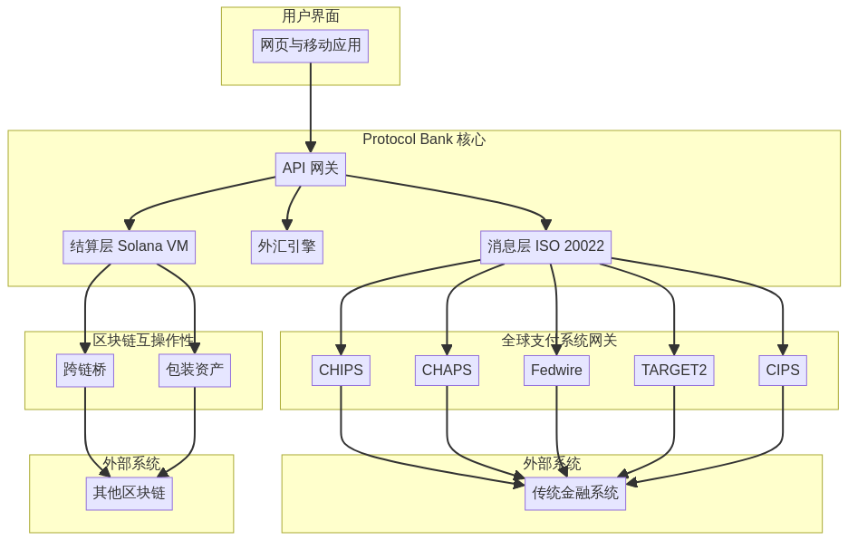
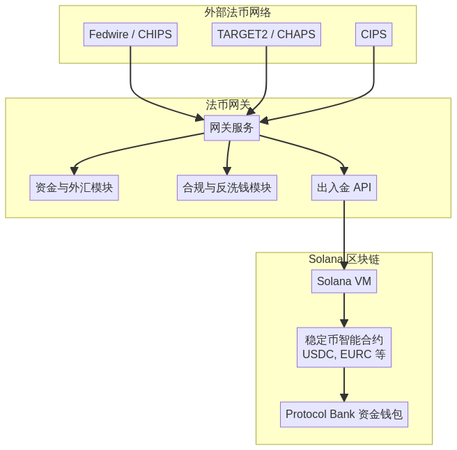
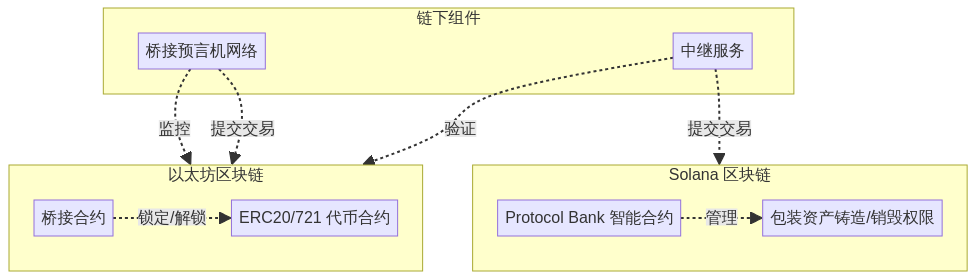
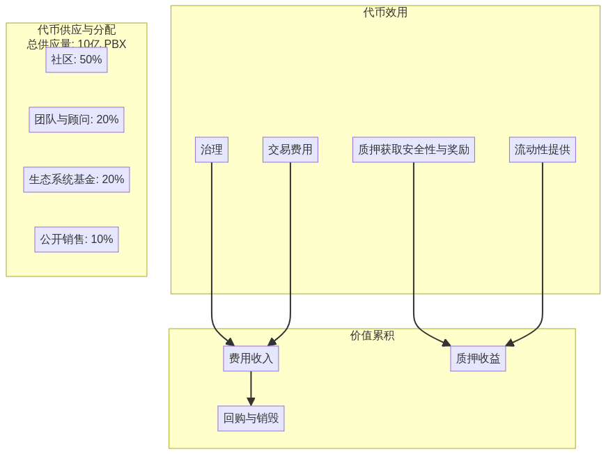

# 协议银行：全面白皮书

---

'''
# 协议银行白皮书 v2.0：全球支付的未来

## 摘要

协议银行（Protocol Bank）是一个去中心化的区块链（blockchain）平台，旨在彻底革新全球支付格局。通过提供一种安全、高效且低成本的传统代理银行（correspondent banking）替代方案，协议银行目标成为SWIFT的主要竞争者。该平台将整合包括CHIPS、CHAPS、Fedwire、TARGET2和CIPS在内的主要全球支付系统，实现主要货币的无缝跨境交易。借助Solana区块链的强大能力，协议银行将提供实时结算、增强透明度以及显著降低的交易成本。

## 1. 全球支付的挑战：一个支离破碎且低效的系统

当前全球支付基础设施建立在数十年前的代理银行网络和如SWIFT这类消息系统之上，结构上存在根本性缺陷。它是一个由各国系统组成的碎片化拼凑体，每个系统拥有自己的规则、运营时间和技术标准。这种碎片化导致系统运行缓慢、成本高昂且缺乏透明度，给全球经济中的个人和企业带来了重大挑战。

这一传统系统带来了协议银行旨在解决的几个关键痛点：

- **高额费用：** 一笔简单的跨境交易可能涉及多个中间代理银行，每家都会收取费用。这些费用累计可能高达交易金额的5-10%，这笔成本主要由小企业和个人承担。这种价值流失直接源于系统固有的低效率。

- **缓慢的结算时间：** 付款结算可能需要2至5个工作日。这种延迟直接源于系统依赖批量处理以及跨时区和国家清算周期的协调需求。对企业而言，这占用了关键的营运资金并带来不确定性。

- **完全缺乏透明度：** 一旦付款发起，就进入了“黑箱”状态。付款发起方和接收方几乎无法了解付款状态、其在代理链中的位置或沿途被扣除的具体费用。这种不透明性使对账变得困难并削弱信任。

- **高昂的运营与合规成本：** 金融机构必须与全球多个代理银行维持复杂关系并预先资金账户（nostro/vostro账户）。这占用了大量资本并带来了显著的运营与合规负担，进一步推高成本。

'''

- **高成本：** 中介银行对跨境支付收取高额费用，最终由终端用户承担。
- **结算时间缓慢：** 由于涉及多个中介机构且依赖批量处理，跨境支付的结算可能需要数天时间。
- **缺乏透明度：** 跨境支付的状态通常难以追踪，各中介机构收取的费用缺乏透明度。
- **操作风险：** 代理银行系统的复杂性带来了多种操作风险，包括错误、延误和欺诈的风险。

## 2. 协议银行解决方案：全球价值统一网络

协议银行（Protocol Bank）从零开始设计，旨在用现代化、去中心化且统一的支付网络取代过时的代理银行（Correspondent Banking）模式。我们的解决方案直接针对传统系统的核心低效问题，通过无缝连接传统金融与数字资产经济，实现创新突破。

### 2.1. 连接全球清算网络

协议银行的核心是一张安全的双向网关网络，直接连接全球最关键的实时全额结算系统（RTGS，Real-Time Gross Settlement）和批发支付系统。通过建立对这些金融高速公路的直接或近乎直接访问，我们完全绕过了复杂的代理银行链条。

我们的集成策略瞄准全球金融的关键动脉：

- **Fedwire & CHIPS（美国）：** 提供对全球主要储备货币——美元的直接访问。
- **TARGET2（欧洲）：** 实现欧元在欧盟范围内的即时结算。
- **CHAPS（英国）：** 支持英镑的实时支付。
- **CIPS（中国）：** 构建现代高效的人民币（RMB）通道，作为全球贸易的重要组成部分。

这张网关网络使协议银行能够作为单一的全球清算所，跨境交易结算时间缩短至分钟级，而非数天。

### 2.2. 原生支持法币与数字货币

协议银行设计之初即考虑到传统法定货币（Fiat Currency）与数字资产（Digital Assets）共存的未来。我们的平台通过复杂的混合架构实现这一目标：

- **法币进出通道（Fiat On/Off-Ramps）：** 通过我们的网关，能够直接接收和发送本地法币支付（美元USD、欧元EUR、英镑GBP、人民币RMB等）。
- **稳定币结算核心（Stablecoin Settlement Core）：** 在链上，交易通过完全支持的1:1稳定币（例如USDC、EURC）在高性能的Solana区块链上结算。例如，当用户发起美元支付时，资金通过Fedwire网关接收，立即转换为USDC，并在链上完成结算。支付时则执行相反流程。
- **数字资产互操作性（Digital Asset Interoperability）：** 对于加密经济中的用户，Protocol Bank通过安全的跨链桥和包装资产（wrapped assets），实现与比特币（Bitcoin, BTC）、以太坊（Ethereum, ETH）等主流数字资产的无缝互操作。这使得真正的全球流动性成为可能，将法币与加密世界连接在一个流畅的网络中。

Protocol Bank通过提供一个去中心化的、基于区块链的跨境支付平台来解决这些挑战。该平台基于以下核心原则构建：

- **去中心化（Decentralization）：** 利用Solana区块链的强大能力，Protocol Bank消除了中介的需求，实现更快、更低成本且更安全的交易。
- **互操作性（Interoperability）：** Protocol Bank设计为可与传统金融系统及其他区块链生态系统互操作。通过多链策略支持包装资产、跨链桥以及以太坊改进提案（Ethereum Improvement Proposals, EIPs）实现。
- **可扩展性（Scalability）：** 平台基于高性能的Solana区块链，能够以低延迟处理每秒数千笔交易。
- **安全性（Security）：** Protocol Bank实施强有力的安全措施以防范欺诈和网络攻击，包括多重签名钱包、多硬件安全模块（Hardware Security Modules, HSMs）及定期安全审计。
- **合规性（Compliance）：** 平台设计完全符合国际标准和法规，包括了解你的客户（Know Your Customer, KYC）、反洗钱（Anti-Money Laundering, AML）以及金融消息标准ISO 20022。

## 3. 技术架构

Protocol Bank的技术架构由以下关键组件组成：

- **多链策略 (Multi-Chain Strategy)：** 虽然 Solana 作为主要的结算层，Protocol Bank 还将支持包括以太坊 (Ethereum) 和币安智能链 (BNB Chain) 在内的多种其他区块链。这将通过使用封装资产 (wrapped assets) 和安全的跨链桥 (cross-chain bridges) 实现。
- **消息层 (Messaging Layer)：** 基于 ISO 20022 标准的安全可靠消息层将用于促进金融机构之间的通信。
- **结算层 (Settlement Layer)：** 构建于 Solana 区块链上的结算层将使用智能合约 (smart contracts) 自动化清算和结算流程。主要功能包括原子交换 (atomic swaps)、自动做市商 (AMMs, Automated Market Makers) 和流式支付 (streaming payments)。
- **外汇引擎 (Foreign Exchange, FX Engine)：** 实时外汇引擎将通过聚合多个流动性提供者的资金，为跨币种交易提供具有竞争力的汇率。
- **API 网关 (API Gateway)：** 一套全面的 RESTful API 将允许金融机构轻松集成 Protocol Bank 平台。

## 4. 与全球支付系统的集成

Protocol Bank 将集成以下主要全球支付系统：

- **CHIPS（清算所银行间支付系统，Clearing House Interbank Payments System）：** 用于大额美元支付。
- **CHAPS（清算所自动支付系统，Clearing House Automated Payment System）：** 用于大额英镑支付。
- **Fedwire：** 用于美元支付的实时全额结算。
- **TARGET2：** 用于欧元支付的实时全额结算。
- **CIPS（跨境银行间支付系统，Cross-Border Interbank Payment System）：** 用于跨境人民币支付。

这将使 Protocol Bank 能够提供真正的全球支付解决方案，方便用户轻松发送和接收主要货币的支付。

## 5. 结论

Protocol Bank 代表了跨境支付演进的重要一步。通过结合传统金融的优势与区块链技术的力量，Protocol Bank 将提供比现有系统更快、更便宜且更透明的替代方案。我们相信，Protocol Bank 有潜力成为 SWIFT 的主要竞争者，彻底改变全球资金流动的方式。
'''

## 高级架构

## 法币网关架构

## 跨链桥架构

## 详细交易流程

## 5. 技术规格

本节提供 Protocol Bank 平台的详细技术规格。

### 5.1. 系统组件

#### 5.1.1. Solana 智能合约

Protocol Bank 的核心逻辑作为一组智能合约部署在 Solana 区块链上。这些合约采用 Rust 语言编写，设计目标是高效且安全。

- **注册合约（Registry Contract）：** 该合约维护所有参与金融机构的注册信息，以及它们关联的公钥和其他元数据。
- **结算合约（Settlement Contract）：** 该合约负责交易的清算和结算。它实现了多种功能，包括原子交换（atomic swaps）、自动做市商（AMMs，Automated Market Makers）和流式支付（streaming payments）。
- **国库合约（Treasury Contract）：** 该合约管理协议的国库，用于资助开发、激励参与以及在短缺事件发生时提供后备支持。

#### 5.1.2. 法币网关（Fiat Gateways）

法币网关负责将协议银行平台（Protocol Bank）连接到传统金融系统。每个网关都是一个独立服务，包含以下组件：

- **网关服务（Gateway Service）：** 该服务监听来自相应法币网络（如Fedwire、TARGET2）的入账支付消息，并发起相应的链上交易。
- **国库与外汇模块（Treasury & FX Module）：** 该模块管理网关的国库，并提供实时外汇（FX）汇率。
- **合规与反洗钱模块（Compliance & AML Module）：** 该模块对所有进出交易执行客户身份识别（KYC，Know Your Customer）和反洗钱（AML，Anti-Money Laundering）检查。
- **入金/出金API（On/Off-Ramp API）：** 该API允许用户轻松地将法币入金和出金至协议银行平台。

#### 5.1.3. 跨链桥（Cross-chain Bridges）

跨链桥用于促进Solana区块链与其他区块链生态系统（如以太坊和BNB链）之间的资产转移。协议银行将结合现有桥接解决方案和定制桥接以满足特定用例需求。

### 5.2. ISO 20022 消息标准

协议银行采用ISO 20022标准进行所有金融消息传递。这确保了与传统金融系统的互操作性，并允许丰富支付数据的无缝交换。

### 5.3. 安全性

安全是协议银行的首要任务。平台实施多种安全措施以防范欺诈和网络攻击，包括：

- **多签钱包（Multi-signature Wallets）：** 所有关键功能，如管理协议国库和升级智能合约，均由多签钱包控制。
- **硬件安全模块（HSMs，Hardware Security Modules）：** 私钥存储于硬件安全模块中，以防止被盗和未经授权访问。
- **定期安全审计（Regular Security Audits）：** 平台定期由独立第三方审计机构进行安全审计，以识别和修复潜在漏洞。

## 6. 协议银行代币经济学（Protocol Bank Tokenomics，PBX）

### 6.1. PBX 代币简介

Protocol Bank 代币（PBX）是 Protocol Bank 生态系统的原生实用及治理代币。它是平台的关键组成部分，旨在激励参与、保障网络安全并促进去中心化治理。PBX 代币是基于 Solana 区块链的 ERC-20 代币，确保交易高速且成本低廉。

### 6.2. 代币用途

PBX 代币具有以下核心用途：

- **治理 (Governance)：** PBX 持有者可以参与 Protocol Bank 平台的治理，包括提议和投票决定协议变更，如调整费用、添加新功能及管理社区金库。
- **质押 (Staking)：** 用户可以将 PBX 代币质押于 Protocol Bank 安全模块（Safety Module）。作为对网络安全的贡献，质押者将获得协议收入及其他奖励的分成。
- **交易费用 (Transaction Fees)：** 平台产生的部分交易费用将用于回购并销毁 PBX 代币，形成通缩效应，提升剩余代币的价值。
- **流动性提供 (Liquidity Provision)：** 向 Protocol Bank 的自动做市商（AMMs）提供流动性的用户将获得 PBX 代币奖励。

### 6.3. 代币总量及分配

PBX 代币总供应量上限为 10 亿枚，分配如下：

| 类别 | 分配比例 | 解锁计划 |
| :--- | :--- | :--- |
| **社区 (Community)** | 50%（5亿 PBX） | 4 年线性解锁 |
| **团队及顾问 (Team & Advisors)** | 20%（2亿 PBX） | 1 年悬崖期，随后 3 年线性解锁 |
| **生态基金 (Ecosystem Fund)** | 20%（2亿 PBX） | 4 年线性解锁 |
| **公开销售 (Public Sale)** | 10%（1亿 PBX） | 无解锁期 |

### 6.4. 价值积累

PBX 代币通过以下机制实现价值积累：

- **费用收入 (Fee Revenue)：** 平台产生的部分费用将分配给 PBX 质押者。
- **回购与销毁 (Buyback and Burn)：** 部分交易费用将用于回购并销毁 PBX 代币，减少总供应量，提升剩余代币价值。
- **质押收益 (Staking Yield)：** PBX 质押者将获得具有竞争力的质押收益，进一步激励网络参与。