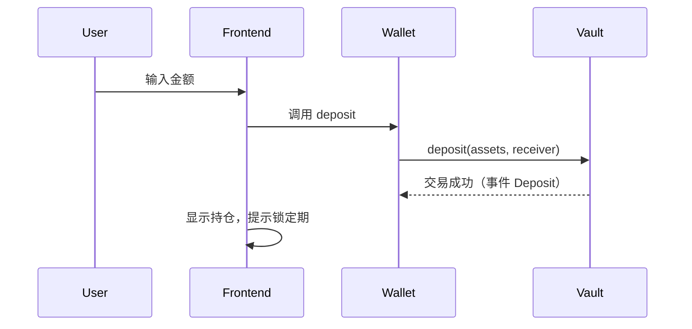
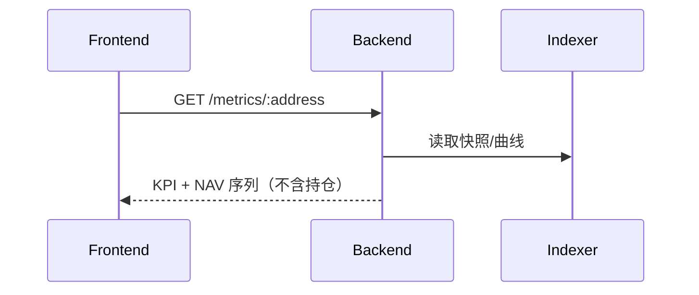

# VaultCraft 架构解析（v0 → v1)

本文件阐述前端/后端/链上职责、技术栈、数据流，并提供 Mermaid 图示，帮助团队对齐边界与扩展方向。

---

## 1. 总图（System Overview）

```mermaid
flowchart LR
  subgraph Frontend[Frontend]
    UI[Next.js/Tailwind UI]
    WAL[Wallet (wagmi/viem)]
  end

  subgraph Backend[Backend Services]
    API[FastAPI (REST/WS)]
    IDX[Indexer / NAV Snapshot]
    MET[Metrics Engine]
    EXEC[Exec Service<br/>(Router + Hyper SDK)]
    PRICE[Price Router]
    ALERT[Alert Manager]
  end

  subgraph OnChain[EVM Chain]
    V[Vault (ERC4626-lite)]
    AD[Adapters (Spot/Perps/Polymarket...)]
  end

  UI <--> WAL
  UI --> API
  WAL <--> V
  API <--> EXEC
  EXEC --> AD
  EXEC --> IDX
  EXEC --> PRICE
  IDX --> MET
  MET --> UI
  IDX --> UI
  EXEC --> ALERT
  IDX --> ALERT
```

- Frontend：呈现与交互（读链 + 调后端），生成“订单票据”并触发 `execute`；钱包签名用于链上申赎、授权与可选登录。
- Backend：
  - Indexer：订阅链上事件与外部 Ack，聚合 NAV 快照、指标输入与 Merkle 承诺。
  - Exec Service：根据 `execution_channel` 路由到链上 Adapter 或 Hyper SDK（及未来其它 venues），并写回仓位快照。
  - Price Router：抽象行情源（Hyper SDK → REST → 回退）供指标与 NAV 使用。
  - Metrics：计算年化、波动、回撤、相关性、手续费曲线等。
  - Alert Manager：根据 NAV、事件状态与阈值触发 webhook / 电话告警。
- On‑chain：Vault 份额、绩效费、手续费曲线白名单、适配器白名单；资金托管在 Vault，不做跨 Venue 聚合仓位。

---

## 2. 功能归属（v0）

- 前端（Next.js + Tailwind）
  - 发现/详情/我的/申赎 UI
  - 读链（ps、totalAssets、isPrivate、lockMinSeconds、performanceFeeP）
  - 调后端获取指标与事件（可选）
- 后端（FastAPI）
  - 指标计算（/metrics），事件（/events），静态金库元数据（/vaults）
  - v1：Exec Service 调 Hyperliquid + 对账与承诺
- 链上（Solidity）
  - 申赎/锁定/HWM 绩效费/白名单适配器/可暂停
  - 事件：Deposit/Withdraw/PerformanceFeeMinted/NavSnapshot/ParamChange

---

## 3. Hyper Testnet 集成（建议）

- 采用 Hyper Testnet 作为 v1/v2 核心 perp venue；行情优先走官方 SDK，失败回落 REST，再降级为演示价格。
- 执行路径：
  1) 经理端在 GUI 填写“订单票据”，指定 `execution_channel`（`onchain` 或 `off_venue`）。
  2) Frontend 调用 `/api/v1/exec/*`；Exec Service 根据渠道选择链上 Adapter 或 Hyper SDK。
  3) SDK Ack/Fills 与链上事件由 Indexer 监听写入 NAV 快照、Merke 承诺与事件列表。
  4) Alert Manager 根据回报、NAV 变化触发 webhook/电话；StatusBar 展示实时状态。
- 资产托管：资金一直留在 Vault；Hyper 仅作为杠杆 venue。对外沟通强调“可验证镜像执行”。

---

## 4. 多市场扩展与私募隐私（规划）

- 目标资产：Polymarket（预测市场）、主要美股、贵金属（PAXG/XAUT/合成 XAU）、期权、DeFi 对冲工具。
- 方案（阶段化）：
  - v1：保持现有 Hyper 集成；新增只读数据源与指标模块，为多市场奠定数据口径。
  - v2：为每类市场提供 Router/Adapter，实现 `execution_channel` 可选；仍不集中托管仓位，仅限权路由。
  - 安全边界：平台负责额度/白名单与承诺，对账异常触发 reduce-only / 拒单 / 排队；无集中清算风险。
- WhisperFi 私募增强：对私募 Vault 引入 WhisperFi 权限层，投前只展示摘要、投后仅 NAV/PnL，执行数据加密存储并保留审计凭证。
- 架构补充：
  - Venue Registry：维护 `venue_whitelist`、费用模型与风险包。
  - Strategy Composer：允许新 Vault 引用现有 Vault 作为构建模块（按比例建仓、自动化策略组合）。
  - Alert & Reporting：扩展指标 API、Webhook、语言包（含中文）以支撑多市场演示。

---

## 5. 数据流（典型）

### 5.1 申购


### 5.2 NAV 展示（私募）


---

## 6. 技术栈与特色

- 前端：Next.js 14 + Tailwind，组件化设计系统，Mermaid 文档演示
- 后端：FastAPI + uv 环境 + SQLAlchemy/SQLite，易于迁移到 Postgres
- 链上：Solidity 0.8.23，Foundry/Hardhat 双栈；ERC20 份额 + 最小 4626 风格
- DevEx：PowerShell + uv + Hardhat 任务 + 高覆盖测试

---

## 7. 路线图（里程碑）

- v0：Public/Private、最短锁定、HWM 绩效费、最小后端指标、Discover/Detail/Portfolio。
- v1：Hyper Testnet Exec（链上 + off-venue）、私募 NAV 曲线、Alert/Webhook、Manager 标签页体验、Merke 承诺。
- v2：多市场 Router（Polymarket/美股/贵金属/期权）、WhisperFi 私募增强、手续费率曲线、Vault 组合器、跨语言前端、指标/风控扩展。
