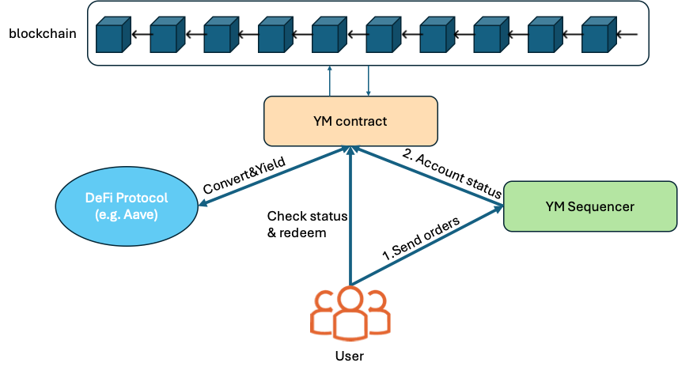
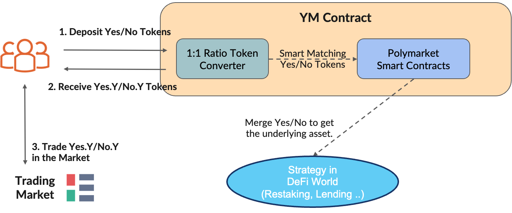
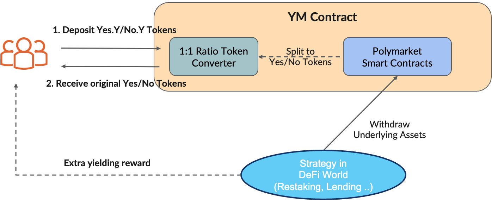
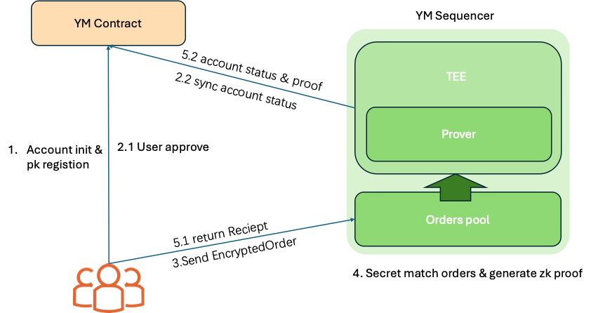

# Yield Market
## 项目概述
当前，预测市场赛道的头部项目 Poly Market 虽热度高涨，但在资金效率、隐私保护与产品可玩性方面仍存在显著短板，这些痛点不仅制约用户体验，更限制了预测市场生态的进一步成熟：

- 资金效率不足：Poly Market 中大量用户的闲置资金长期 “沉睡”，既无法为用户创造额外收益，也未被有效整合到 DeFi 生态的资金循环中，与 DeFi “资本高效利用” 的核心逻辑相悖，造成用户预期收益的实质性损失。
- 隐私保护缺失：所有挂单以完全透明的方式在链上公开，恶意用户可通过监控订单簿实施 “抢跑交易” 或 “恶意跟单”，不仅损害普通用户交易利益，更可能引发 “市场踩踏”—— 当某类订单集中暴露时，其他用户因恐慌盲目跟随，破坏市场理性定价与良性运转。
- 产品形态单一：仅支持现货交易，缺乏杠杆、衍生品等进阶玩法，难以满足用户多样化的风险偏好与交易需求，限制了产品对更广泛用户群体的吸引力。

为系统性解决上述问题，我们提出 Yield Market 方案，从三方面对 Poly Market 升级补足：

- 资金利用率优化：自建金库并深度集成 Aave、Compound 等成熟 DeFi 协议，为闲置资金开辟 “生息通道”，在保障用户资金可随时参与预测交易的前提下，最大化提升资金利用率，让用户从闲置资产中获取额外收益。
- 隐私交易保障：创新实现 “秘密挂单” 机制，使订单核心信息在撮合前对第三方完全隐藏，从技术层面阻断恶意抢跑与盲目跟单的可能性，推动预测市场向更理性、公平的方向发展。
- 玩法维度拓展：引入杠杆交易等进阶功能，允许用户根据对市场的判断放大收益（或风险），丰富产品可玩性与策略空间，吸引更多追求多元交易体验的用户参与。

## 架构与实现

### 技术栈
下面补充本项目建议并实际使用的技术栈说明，按模块与用途分类，便于开发、部署与维护。

智能合约（YM Contract）
- 语言：Solidity (>=0.8.x)
- 框架：Hardhat（合约编译、测试、部署、脚本化）
- 常用库：OpenZeppelin（ERC20/AccessControl/安全库）、@nomicfoundation/hardhat-toolbox（测试/验证/链上交互工具）
- 测试：Mocha + Chai（通过 Hardhat 运行），以及脚本化的集成测试（如与本仓库 test/ 下的脚本）

前端（YM frontend）
- 框架：Next.js（App Router / TypeScript）
- 语言：TypeScript + React
- 钱包与链交互：wagmi、ethers.js
- UI：TailwindCSS（或项目中已有的 globals.css）、Headless UI（可选）
- 状态与数据：React Context（`contexts/market-context.tsx`）、自定义 hooks（`hooks/` 目录）

测试、CI/CD 与部署
- CI：GitHub Actions（编译合约、运行测试、静态分析、部署脚本）
- 合约验证：@nomicfoundation/hardhat-verify（自动验证到 Polygonscan）
- 合约静态分析：Slither、MythX 或 Securify（安全审计工具链）
- 部署脚本：Hardhat 脚本（见 `test/scripts/`）和 npm 脚本（`package.json` 中）

工具链与开发辅助
- 包管理：npm / pnpm（推荐 pnpm 用于 monorepo）；lockfile 固定版本
- 代码质量：ESLint + Prettier + TypeScript，Solidity 格式化使用 prettier-plugin-solidity
- 合约交互：ethers.js，TypeChain（生成 TypeScript 合约类型）

依赖与版本建议（示例）
- Node.js: 18.x 或 20.x
- Hardhat: ^2.12.0
- ethers: ^5.7.0 或 ethers v6（如选择，请同步项目中的使用方式）
- solc / solidity: ^0.8.17
- TypeScript: ^5.x

安全与运维注意事项
- 私钥管理：生产私钥请使用硬件钱包或 Vault（HashiCorp Vault / cloud KMS）管理，CI 中切勿保存明文私钥
- TEE 与 ZKP 安全性：对 TEE 环境进行定期审计，ZKP 电路与证明器需覆盖边界条件与状态一致性证明
- 流量与负载：Sequencer 的撮合高并发场景需做压力测试并做好退路（降级服务或延迟队列）

如果需要，我可以把上面的技术栈转换为英文版并补充具体的 package.json 依赖示例或 GitHub Actions CI 配置。
### 总览图
Yield Market


我们的项目主要有两个模块分别是 YM Contract 和 YM Sequencer，其中两个模块与用户，区块链以及链上其他defi应用的交互大致如上图所示，接下来我介绍图中每个实体的作用：

- **YM Contract**：实现Yield Market的核心功能，包括用户账户状态维护，代币兑换，资产兑换，资产生息等功能。能让用户从闲置资产中获取额外收益；
- **YM Sequencer**：实现 Yield Market 隐私保护的核心模块，实现了秘密挂单机制，使得订单核心信息在撮合前对第三方完全隐藏；
- **User**：参与市场预测的用户，会通过usdc购买yes/no的代币，实现市场预测的押注；
- **Strategy in defi world**：其他的defi应用，在本项目中主要用于质押生息的操作；
- **blockchain**：分布式账本，是一切链上应用的基础。

### 关键模块
我们的YM contract和YM Sequencer两个模块十分重要我们分别从获取额外收益与隐私保护两个角度对模块进行拆解，并详细说明

#### 资金利用率优化
从资金利用率优化角度看主要涉及YM Contract、User和外部defi生息协议三部分： 

首先用户从Yeild Market交易完成后，将购买获得的 Yes/No 代币可以选则按照1:1的比例兑换 Yes.Y/No.Y 代币，**这些代币可以继续进行交易**，此时 YM Contract 调用原有的 Poly Market的 token merge 功能获取相关联的资产（例如USDC）

YM Contract获取资产后将其存入aave的借贷池中进行生息，等待预测市场被确定后，用户可以使用 Yes.Y/No.Y 兑换为原本的 Yes/No 此时 YM Contract 会调用 token split 方法实现资产代币（USDC）的分解

最终，USDC在这段时间产生的利息通过 YES/NO 代币进行了体现，使得参与市场的玩家实现了在等待过程中依然可以赚取额外收益。

#### 隐私保护
从隐私保护角度看主要涉及YM Contract、User和YM Sequencer三部分



1. **临时账户初始化与公钥绑定**：用户首先通过零知识证明（ZKP）技术，向自己的临时账户转移指定数量的 USDC 资产。同时，用户会将临时账户对应的公钥注册到 TEE 可访问的系统中，为后续 “订单签名验证” 与 “交易结果接收” 建立身份锚点。
2. **链上授权与状态同步**：
   2.1 **用户授权**：用户向 Market 合约发起交易，授权合约可从其临时账户中划转指定数量的 USDC，用于后续预测交易。这一步是链上 “资金可用性” 的前置保障，确保 TEE 撮合时用户有足够资产完成交易。
   2.2 **TEE 状态同步**：TEE 会持续监听链上合约的事件与状态变化，实时同步用户临时账户的 USDC 余额、授权额度等信息。通过 “主动感知 + 实时同步”，TEE 能在撮合前验证 “用户是否有足够资金完成订单”，避免无效撮合与链上状态冲突。
3. **加密订单传输**：用户使用 TEE 公开的公钥，对订单核心内容（如交易方向、拟交易金额、报价等）进行加密，生成 EncryptedOrder 结构；同时，用户用自己临时账户的私钥对订单进行签名，证明订单的真实性。加密后的订单被发送至 TEE —— 由于采用非对称加密，只有持有 TEE 私钥的机密环境能解密订单，第三方（包括项目方）无法窥探订单内容。
4. **TEE 撮单并生产ZKP**：TEE会对接收的订单按照时间片进行划分，**并对同一时间片的订单进行shuffle处理**（这是为了保证预测市场中用户交易不会因为交易发送速度而逊色于机器人，保证市场公平性）。接着TEE分批从Orders pool中对加密订单进行读取，实行最先时间先匹配的原则，进行订单撮合。同时为了加速系统吞吐量，在系统流程上采用**多级流水线并行加速proof生成**，在电路生成上采用查找表技术，MPC等技术，实现安全快速的证明生成。
5. **链上确认与用户反馈**：
   5.1 **链上状态更新**：TEE 将撮合结果（如成交后的用户临时账户余额）与对应的 ZKP 证明一起提交给链上 Contract。Contract 会验证 ZKP 的有效性，若验证通过，则执行状态更新（如扣除成交 USDC、 mint 对应条件代币等），确保**链上状态与 TEE 撮合结果一致**。
   5.2 **用户收据反馈**：同时，TEE 会生成**交易收据（Receipt）**，包含成交状态、最新账户余额、实际成交金额与价格等信息，加密后返回给用户。用户可通过收据确认交易结果，并基于收据中的 “最新状态” 更新本地对临时账户的认知，为后续交易做准备。

通过上述流程，实现了 “订单隐私保护（传输与撮合阶段保密）、结果可验证（链上通过 ZKP 确认）、用户体验完整（收据反馈交易状态）” 的三重目标。以下是上述流程提到的相关数据结构：

```
// 「用户→TEE」的加密订单结构（前端构造，通过公钥加密核心内容）
struct EncryptedOrder {
    bytes32 tempAccountId;  // 用户临时账户唯一标识（明文，用于TEE路由与关联）
    bytes encryptedContent; // 用 TEE 公钥加密的订单核心信息
    uint256 timestamp;      // 订单创建时间戳（防重放攻击）
    bytes userSignature;    // 用户对订单的数字签名（验证订单真实性，防止伪造）
}

// TEE 解密后得到的**明文订单结构**（仅在 TEE 内部可见，原始订单隐私性保障）
struct Order {
    address userTempAddress; // 用户临时钱包地址
    bool side;                   // 交易方向：`true` 代表购买 "yes" 条件代币，`false` 代表购买 "no" 条件代币
    uint256 amount;              // 拟交易的 USDC 数量（需与授权金额匹配）
    uint256 price;               // 每单位条件代币的报价（USDC 计价）
    uint256 expiration;          // 订单过期时间戳（超出该时间，TEE 将不再撮合此订单）
    bytes32 marketId;            // 预测市场的唯一标识（如某事件的哈希值，用于区分不同预测场景）
}

#### 2. 交易收据（Receipt）
// 「TEE→用户」的成交凭证，同时用于合约验证状态更新的合法性
struct Receipt {
    bool isSuccess;           // 交易是否成功撮合（`true` 表示成交，`false` 表示失败，如订单过期、余额不足等）
    bytes32 tempAccountId;    // 关联的用户临时账户ID（与订单一致）
    uint256 newBalance;       // 交易后临时账户的 USDC 余额（用户可据此更新本地状态）
    uint256 filledAmount;     // 实际成交的 USDC 金额（若部分成交，可能小于订单 `amount`）
    uint256 filledPrice;      // 实际成交价格（每单位条件代币，撮合后确定的最终价格）
    bytes32 marketId;         // 所属预测市场ID（与订单一致）
    uint256 timestamp;        // 收据生成时间戳（用于排序与防篡改）
    bytes zkpProof;           // ZKP 证明数据（由 TEE 内 Prover 生成，供合约验证撮合逻辑的合法性）
}
```


## 合约与部署信息

### 网络

**Polygon 主网** 

### 地址

| 市场问题 | 金库地址 | 状态 |
|---------|----------|------|
| Will Israel first announce ceasefire on October 8? | `0x0d7e185C1D26A1fDC4286f56477e61816c79b08F` | 活跃 |
| Will the price of Solana be above $280 on October 10? | `0x0fD635B6610E1C3F6487822E4bE1308cB8DF3546` | 活跃 |
| Will the price of Solana be greater than $280 on October 10? | `0x81706629922f48780204Ef40E56E079bd8c7fC02` | 活跃 |

### 验证链接

可在 [PolygonScan](https://polygonscan.com/) 上验证

- **验证步骤:**
1. 使用 `@nomicfoundation/hardhat-verify` 插件
2. 配置相应网络的 API Key
3. 运行 `npx hardhat verify --network <network> <contract-address>`

## 运行与复现
**编译合约:**
```bash
npm run compile
# 或
npx hardhat compile
```

**部署金库:**
```bash
# 部署所有市场的金库
npm run deploy:vaults
# 或
ALLOW_TEST_SCRIPTS=true npx hardhat run test/scripts/deploy-ym-vaults.js --network localhost

# 部署特定市场
MARKET_ID="588fa06c-fb08-4eb4-87c3-eda1b33704c8" ALLOW_TEST_SCRIPTS=true npx hardhat run test/scripts/deploy-ym-vaults.js --network localhost
```
**运行测试:**
```bash
npm test
# 或
npx hardhat test
```

**集成测试:**
```bash
# Polygon 集成测试
npx hardhat test test/PolygonIntegrationTest.js --network localhost

# 提取支付测试
npx hardhat test test/WithdrawalPayoutTest.js --network localhost
```

## 团队与联系

X:@YieldMarketDefi
tg: