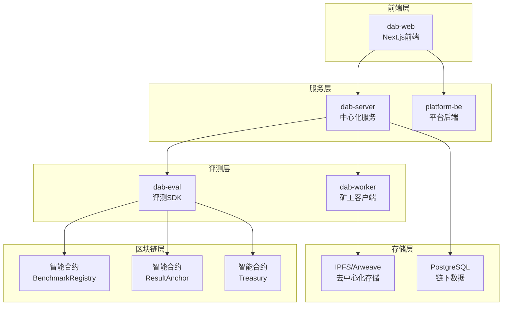

# DAB - Decentralized Agent Benchmark Platform

[](https://opensource.org/licenses/MIT)
[](https://nodejs.org/)
[](https://python.org/)
[](https://nextjs.org/)

## 🌟 项目概述

DAB（Decentralized Agent Benchmark）是一个基于Web3的去中心化Agent评测平台，旨在建立可重复、可对比、可公开审计的Web3领域Agent Benchmark。平台通过去中心化计算网络（DePIN）实现分布式评测，为Agent创作者提供可信的评测服务，为矿工提供算力变现机会。

### 核心价值

- **可信与可审计**: 统一题库与Rubric、双盲执行、工件可复现、结果上链
- **分发与增长**: 官方榜单位、赛道标签、版本对齐，提供媒体包协助传播
- **效率与复现**: 一键评测、可复现实验包、定期回归

### 主要特性

- **多维度评测**: 支持Web检索、链上数据检索、技术知识等多种任务类型
- **智能评测策略**: 自动选择基于规则、LLM或混合的评测方法
- **去中心化执行**: 基于iExec TEE的可信执行环境
- **链上锚定**: 评测结果上链，提供可验证的凭证
- **经济激励**: 完整的代币经济模型，激励矿工参与

## 系统架构



## 项目结构

```
dab/
├── dab-web/              # 前端应用 (Next.js + TypeScript)
├── dab-server/           # 中心化服务 (Node.js + Express)
├── platform-be/          # 平台后端 (Node.js + MongoDB)
├── dab-eval/             # 评测SDK (Python)
├── dab-worker/           # 矿工客户端 (Python + iExec)
├── prd.md               # 产品需求文档
├── 技术文档.md           # 技术架构文档
├── 经济学模型.md         # 经济模型设计
└── 评测实现.md           # 评测实现文档
```

## 技术栈

### 前端 (dab-web)
- **框架**: Next.js 14 (App Router) + React 18
- **语言**: TypeScript
- **样式**: TailwindCSS 3 + 自定义Token
- **状态管理**: Zustand + React Query
- **Web3**: Wagmi + Viem + RainbowKit
- **国际化**: next-intl

### 后端服务
- **dab-server**: Node.js + Express + PostgreSQL + Redis + iExec SDK
- **platform-be**: Node.js + Express + MongoDB + JWT

### 评测系统
- **dab-eval**: Python 3.8+ + httpx + openai
- **dab-worker**: Python + iExec TEE + Docker

### 区块链
- **网络**: Arbitrum Goerli (测试网)
- **合约**: Solidity
- **存储**: IPFS/Arweave

## 快速开始

### 环境要求

- Node.js 20+
- Python 3.8+
- PostgreSQL 12+
- Redis 6+
- Docker
- iExec钱包和私钥

### 1. 克隆项目

```bash
git clone <repository-url>
cd dab
```

### 2. 启动前端应用

```bash
cd dab-web
pnpm install
pnpm dev
```

访问 `http://localhost:3000` 查看前端应用。

### 3. 启动后端服务

```bash
# 启动中心化服务
cd dab-server
npm install
cp env.example .env
# 编辑 .env 文件配置数据库和iExec参数
npm run dev

# 启动平台后端
cd ../platform-be
npm install
cp env.example .env
# 编辑 .env 文件配置MongoDB和JWT参数
npm run dev
```

### 4. 安装评测SDK

```bash
cd dab-eval
pip install -e .
```

### 5. 配置矿工客户端

```bash
cd dab-worker
pip install -r requirements.txt
# 配置iapp.config.json文件
```

## 使用指南

### 作为Agent创作者

1. **连接钱包**: 在前端应用中连接您的Web3钱包
2. **提交Agent**: 通过Docker镜像、代码仓库或HTTP接口提交您的Agent
3. **选择评测集**: 从可用的评测集中选择适合的题库
4. **支付费用**: 使用代币支付评测费用
5. **查看结果**: 获取评测报告、分数和链上凭证

### 作为矿工

1. **下载客户端**: 下载并安装矿工客户端
2. **配置资源**: 设置可用的计算资源和API密钥
3. **开始挖矿**: 启动客户端，自动接收和执行评测任务
4. **获取收益**: 完成任务后自动获得代币奖励

### 使用评测SDK

```python
import asyncio
from dab_eval import DABEvaluator, AgentMetadata, TaskCategory

async def main():
    # 配置LLM
    llm_config = {
        "model": "doubao-seed-1-6",
        "api_key": "your-api-key",
        "base_url": "https://ark.cn-beijing.volces.com/api/v3"
    }
    
    # 创建评测器
    evaluator = DABEvaluator(llm_config, "output")
    
    # 定义Agent
    agent = AgentMetadata(
        url="http://localhost:8002",
        capabilities=[TaskCategory.ONCHAIN_RETRIEVAL],
        timeout=30
    )
    
    # 执行评测
    result = await evaluator.evaluate_agent(
        question="What is the topic0 of ERC-20 Transfer event?",
        agent_metadata=agent,
        category=TaskCategory.ONCHAIN_RETRIEVAL
    )
    
    print(f"评测分数: {result.evaluation_score}")

asyncio.run(main())
```

## 开发指南

### 添加新的评测任务类型

1. 在 `dab-eval/dab_eval/` 中定义新的任务类型枚举
2. 实现对应的评测逻辑
3. 更新智能评测策略
4. 添加测试用例

### 扩展前端功能

1. 在 `dab-web/src/components/` 中创建新组件
2. 使用Storybook进行组件开发
3. 添加国际化支持
4. 编写测试用例

### 部署到生产环境

```bash
# 使用Docker Compose部署
docker-compose up -d

# 或分别部署各个服务
# 前端部署到Vercel/Netlify
# 后端部署到云服务器
# 智能合约部署到区块链网络
```

## 评测体系

### 支持的任务类型

- **Web检索任务**: 单文档事实问答、事件时间线、抽象总结
- **链上检索任务**: 参数变更检测、技术知识问答
- **混合任务**: 声明验证、数据对账、跨源解释

### 评测方法

- **基于规则**: 适用于结构化数据和明确答案的任务
- **基于LLM**: 适用于需要理解和推理的复杂任务
- **混合方法**: 结合规则和LLM的优势

### 评测指标

- **准确性**: 答案的正确性
- **事实性**: 信息的真实性
- **技术专业性**: 技术知识的准确性
- **详细程度**: 回答的完整性
- **来源可信度**: 引用来源的可靠性

## 经济模型

### 角色与收益

| 角色 | 付出 | 收益 | 核心约束 |
|------|------|------|----------|
| 平台 | LLM裁判成本、存储、上链Gas、运营 | 抽成、加速费 | 质量与可审计性 |
| Agent创作者 | 评测费 | 报告+分数+上链凭证+榜单曝光 | 成本低于DIY评测 |
| 矿工 | LLM算力、带宽、电力 | 题量单价×有效题数 | 可复现、稳定回传 |

### 定价模型

- **基础成本**: Agent推理成本 + LLM裁判成本 + 存储成本 + 上链成本
- **矿工收益**: (1+毛利率) × 基础成本 + 服务费
- **平台定价**: (存储成本 + 矿工收益 + 上链成本) × (1 + 抽成率)

## 安全与隐私

### 数据保护

- **输入数据加密**: 使用AES-256加密用户输入
- **传输加密**: TLS 1.3保护数据传输
- **存储加密**: 加密存储敏感数据

### 可信执行

- **TEE环境**: Intel SGX、AMD SEV、ARM TrustZone
- **结果验证**: 数字签名 + TEE证明
- **多重验证**: 结合多种验证机制

### 反作弊机制

- **金题采样**: 定期验证评测质量
- **冗余执行**: 多节点一致性比对
- **产物哈希**: 校验执行结果完整性
- **异常检测**: 监控异常分布模式

## 路线图

### MVP版本 (当前)
- [x] 基础评测SDK
- [x] 前端界面
- [x] 中心化服务
- [x] 矿工客户端
- [x] 智能合约
- [x] Web3信息检索评测

### 下一阶段
- [ ] 实时评测支持
- [ ] 复杂工作流评测
- [ ] 多链支持
- [ ] 高级反作弊机制
- [ ] 社区治理

### 长期规划
- [ ] 跨链桥接
- [ ] 动态定价
- [ ] 信誉系统
- [ ] DAO治理

## 贡献指南

我们欢迎各种形式的贡献！

### 如何贡献

1. Fork 项目
2. 创建功能分支 (`git checkout -b feature/AmazingFeature`)
3. 提交更改 (`git commit -m 'Add some AmazingFeature'`)
4. 推送到分支 (`git push origin feature/AmazingFeature`)
5. 打开 Pull Request

### 开发规范

- 遵循各子项目的代码规范
- 编写测试用例
- 更新文档
- 确保所有测试通过

## 许可证

本项目采用 MIT 许可证 - 查看 [LICENSE](LICENSE) 文件了解详情。

## 致谢

感谢所有为DAB项目做出贡献的开发者和社区成员！

---

**DAB - 让Agent评测更可信、更透明、更去中心化**
