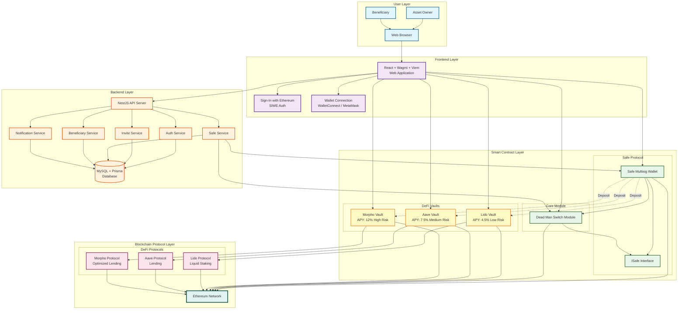

# Family Key

<div align="center">

**Decentralized Trust & Inheritance Solution for Crypto Assets**

[](https://www.typescriptlang.org/)
[](https://reactjs.org/)
[](https://vitejs.dev/)
[](LICENSE)

</div>

---

> **Languages:** [中文](README.md) | English

---

## 📖 Overview 

Leave a key to your family; don’t let crypto be lost forever.

Family Key is a decentralized smart-contract family fund designed so your family can safely inherit crypto if an accident happens. Built on Safe smart accounts and our Dead Man’s Switch module, it removes centralized intermediaries while keeping the experience humane and practical.

### Pain Points

- Crypto wealth is concentrated on-chain; accidents can cause major family losses.
- Families aren’t crypto‑savvy; delegating seed/wallet custody is unsafe and error‑prone.
- Centralized custody requires single‑point trust and often fees/taxes; anti‑decentralization.

### Solution

1. Use Safe smart account as the base, integrating our Dead Man’s Switch module.
2. Owner periodically refreshes heartbeat; once it stops, beneficiary gains smart wallet permissions.
3. Beneficiary logs in via email/phone (Privy); zero crypto barrier; auto‑generated self‑custody wallet.
4. Humanized experience with invites and expiry reminders (Email/SMS/Push).

### APIs & Sequence

- `checkIn()`: Owner refreshes heartbeat and clears `claimReadyAt`.
- `startClaim()`: Beneficiary triggers challenge period and sets `claimReadyAt`.
- `cancelClaim()`: Owner cancels inheritance during challenge period and checks in.
- `finalizeClaim()`: Beneficiary performs Safe `swapOwner` to transfer ownership.
- `status()`: Read `lastCheckIn`, `heartbeatInterval`, `claimReadyAt`.

---

## 🏗️ System Architecture

### Tech Stack

#### Frontend Framework
- **React 18.2** - Modern UI library
- **TypeScript 5.4** - Type-safe JavaScript superset
- **Vite 5.4** - High-performance build tool

#### Web3 Integration
- **Wagmi 2.10** - React hooks for Ethereum
- **Viem 2.9** - Lightweight Ethereum interaction library
- **Ethers.js 5.7** - Wallet and smart contract interactions
- **Safe Protocol Kit 5.2** - Safe multi-signature wallet SDK

#### Authentication & Authorization
- **Privy 1.74** - Web3 identity and authentication
- **SIWE 2.2** - Sign-In with Ethereum protocol

#### Additional Dependencies
- **@tanstack/react-query 5.51** - Data fetching and caching
- **Alchemy SDK 3.6** - Blockchain data services
- **QRCode 1.5** - QR code generation
- **MetaMask Delegation Toolkit 0.13** - Delegation toolkit for MetaMask

### Blockchain Network

- **Network**: Base Sepolia Testnet
- **Chain ID**: 84532
- **RPC URL**: Configure via the `VITE_RPC_URL` environment variable

### Smart Contract Deployment

- **Module Name**: `familykey-contract/src/DeadManSwitchModule.sol`
- **Network**: Base Sepolia Testnet
- **Contract Address**: [`0xB1c97e9dFd770f9481d5065898e3B2CCa149242f`](https://base-sepolia.blockscout.com/address/0xB1c97e9dFd770f9481d5065898e3B2CCa149242f)

### Architecture Diagram



---

## 🚀 Getting Started

### Prerequisites

- **Node.js** >= 16.0.0
- **npm**, **yarn**, or **pnpm**
- **MetaMask** or another Web3 wallet browser extension

### Installation

1. **Clone the repository**

```bash
git clone <repository-url>
cd familykey-frontend
```

2. **Install dependencies**

```bash
npm install
# or
yarn install
# or
pnpm install
```

3. **Configure environment variables**

Create a `.env` file with the following values:

```env
# RPC endpoint URL
VITE_RPC_URL=https://sepolia.base.org

# Backend API base URL
VITE_API_URL=http://localhost:3000

# Privy App ID (optional, enhances authentication)
VITE_PRIVY_APP_ID=your-privy-app-id
```

4. **Start the development server**

```bash
npm run dev
```

The app runs at `http://localhost:5173`.

5. **Build for production**

```bash
npm run build
```

Production artifacts are generated in the `dist/` directory.

6. **Preview the production build**

```bash
npm run preview
```

---

## 🤝 Team & Contact

Family Key has 2 core members, responsible for product frontend and contract backend. Both have 3 years of Web3 experience and have won awards at ETH Beijing and ETH Hong Kong. We believe blockchain can make the world better, and decentralization is a great endeavor.

We welcome collaborations, feedback, and updates:
- Open an Issue on GitHub to report bugs or share ideas
- Email `bitgoodwill@gmail.com`

---

## 📁 Project Structure

```
familykey-frontend/
├── public/                      # Static assets
│   ├── eth.svg                  # Ethereum icon
│   ├── family_together*.png     # Family illustrations
│   └── *.png                    # Feature and case screenshots
├── src/
│   ├── abi/                     # Smart contract ABIs
│   │   ├── deadmanSwitch.ts     # Dead Man's Switch module ABI
│   │   └── safeContracts.ts     # Safe contract ABI
│   ├── config/                  # Configuration
│   │   ├── api.ts               # API configuration
│   │   └── wagmi.ts             # Wagmi configuration
│   ├── ui/                      # UI components
│   │   ├── auth/                # Authentication components
│   │   │   └── SiweAuthProvider.tsx  # SIWE auth provider
│   │   ├── App.tsx              # Root app component
│   │   ├── Home.tsx             # Landing page
│   │   ├── Owner.tsx            # Owner management page
│   │   ├── Beneficiary.tsx      # Beneficiary page
│   │   ├── Claim.tsx            # Inheritance claim page
│   │   ├── Notify.tsx           # Notifications page
│   │   ├── Logo.tsx             # Logo component
│   │   ├── NotificationToast.tsx  # Toast notifications
│   │   ├── i18n.tsx             # Internationalization setup
│   │   ├── wallets.ts           # Wallet detection helpers
│   │   └── theme.css            # Theme styles
│   ├── main.tsx                 # Application entry point
│   └── vite-env.d.ts            # Vite environment types
├── index.html                   # HTML entry point
├── deck.html                    # Project deck page
├── logo.html                    # Logo showcase page
├── package.json                 # Dependencies and scripts
├── tsconfig.json                # TypeScript configuration
├── vite.config.ts               # Vite configuration
├── vercel.json                  # Vercel deployment config
└── README.md                    # Project documentation (Chinese)
```

---

## 🎯 Core Features

### 1. Owner (Settlor) Features

#### Connect Wallet & Sign In
- Supports multiple browser wallets (MetaMask, Coinbase Wallet, etc.)
- Secure login via SIWE (Sign-In with Ethereum)
- Auto-detects wallet and prompts users to switch to the Base Sepolia network

#### Invite Beneficiaries
- Generates unique invitation links
- Produces QR-code posters for invitations
- Supports copying links, downloading, and copying invitation images
- Tracks invitation statuses (Pending / Accepted)

#### Create Family Trusts
1. Choose registered beneficiaries
2. Configure heartbeat interval (default 7 days)
3. Set challenge period duration (default 2 days)
4. Deploy the Safe multi-sig wallet and inheritance module with one click

**Deployment flow**:
- Step 1: Deploy Safe Proxy (requires signature)
- Step 2: Backend deploys the Dead Man's Switch module
- Step 3: Enable the module (requires signature)

#### Heartbeat Check-ins
- Perform regular check-ins to prove activity
- Display remaining time until the next heartbeat deadline
- Status indicator highlights the current inheritance state

#### Fund Management
- View trust balance in ETH and USD
- Deposit crypto assets into the trust
- Copy the trust address for transfers
- Real-time asset pricing (via CoinGecko API)

### 2. Beneficiary Features

#### Accept Invitations
- Access the platform through invitation links
- Register and sign in with email
- Link a wallet address

#### Claim Inheritance
- Inheritance flow starts automatically when the owner misses multiple heartbeats
- Owner can still cancel the process during the challenge period
- Assets transfer after the challenge period concludes

### 3. Notification System

- Real-time alerts for important events
- Browser push notifications
- Email notifications (backend support)

### 4. Internationalization

- Simplified Chinese
- English
- One-click language switching

---

## 🔧 Development Guide

### Code Conventions

TypeScript runs in strict mode to ensure type safety:

```typescript
{
  "strict": true,
  "target": "ES2020",
  "lib": ["ES2020", "DOM", "DOM.Iterable"]
}
```

### Component Development

All UI components live under `src/ui/` and follow these conventions:

- Use functional components and React Hooks
- Define prop types with TypeScript
- Manage styles via CSS classes (`theme.css`)

### Smart Contract Integration

Smart contract interactions rely on:

1. **Wagmi hooks** - Wallet connections and on-chain reads
2. **Ethers.js** - Crafting and sending transactions
3. **Safe Protocol Kit** - Managing Safe wallet operations

Example:

```typescript
import { useAccount, useConnect } from 'wagmi';
import { ethers } from 'ethers';

// Connect wallet
const { address, isConnected } = useAccount();
const { connectAsync, connectors } = useConnect();

// Send transaction
const provider = new ethers.providers.Web3Provider(window.ethereum);
const signer = provider.getSigner();
const tx = await contract.someMethod();
```

### State Management

**TanStack Query** (formerly React Query) powers data fetching and caching:

```typescript
const overviewQuery = useQuery<OverviewResponse>({
  queryKey: ['owner-overview', ownerAddress],
  queryFn: async () => {
    const res = await fetch(`/api/safes/overview?owner=${ownerAddress}`);
    return res.json();
  },
  refetchInterval: 15000, // Refresh every 15 seconds
});
```

---

## 🧪 Testing

### Local Testing

1. **Secure testnet ETH**
   - Visit the [Base Sepolia faucet](https://www.coinbase.com/faucets/base-ethereum-sepolia-faucet)
   - Or use the [Alchemy faucet](https://sepoliafaucet.com/)

2. **Exercise the full flow**
   - Owner: connect wallet → invite beneficiaries → create trust → deposit assets → heartbeat check-ins
   - Beneficiary: accept invitation → register → wait for inheritance conditions → complete claim

### Debugging Tips

- Use browser devtools to inspect console logs
- Inspect the Network tab for API requests
- Track transactions on [Base Sepolia Explorer](https://sepolia.basescan.org/)

---

## 📦 Build & Deployment

### Build Optimizations

Vite powers the build pipeline with the following optimizations:

```typescript
{
  build: {
    minify: 'esbuild',            // Minify bundles
    rollupOptions: {
      output: {
        manualChunks: {
          'ethers': ['ethers']    // Separate heavy dependencies
        }
      }
    }
  }
}
```

### Deploying on Vercel

A `vercel.json` is included for one-click Vercel deployments:

```json
{
  "rewrites": [
    { "source": "/(.*)", "destination": "/" }
  ]
}
```

Deployment steps:
1. Connect the GitHub repository to Vercel
2. Configure environment variables
3. Trigger automatic deployment

### Custom Deployment

The production-ready files in `dist/` can be hosted anywhere:

- Netlify
- GitHub Pages
- AWS S3 + CloudFront
- IPFS (decentralized hosting)

---

## 🔐 Security Considerations

### Smart Contract Security

- Leverages audited Safe contracts (industry standard)
- Dead Man's Switch module enforces the challenge period and avoids mishaps
- All critical actions require on-chain signatures

### Frontend Security

- Never stores private keys on the frontend
- Uses SIWE for identity verification
- API requests authenticated via JWT tokens
- Locally validates user addresses and signatures

### Best Practices

- Perform heartbeat check-ins regularly
- Keep wallet private keys secure
- Double-check beneficiary addresses
- Validate on testnet before moving to mainnet

---

## 🌐 Environment Variables

| Variable | Description | Required | Default |
|----------|-------------|----------|---------|
| `VITE_RPC_URL` | Base Sepolia RPC endpoint | Yes | `https://sepolia.base.org` |
| `VITE_API_URL` | Backend API base URL | Yes | `http://localhost:3000` |
| `VITE_PRIVY_APP_ID` | Privy application ID | No | - |

---

## 📚 Resources

### Official Documentation
- [Safe Docs](https://docs.safe.global/)
- [Wagmi Docs](https://wagmi.sh/)
- [Viem Docs](https://viem.sh/)
- [Base Network Docs](https://docs.base.org/)

### Tools & Services
- [Base Sepolia Explorer](https://sepolia.basescan.org/)
- [Base Sepolia Faucet](https://www.coinbase.com/faucets/base-ethereum-sepolia-faucet)
- [Alchemy](https://www.alchemy.com/) - Blockchain development platform
- [Safe App](https://app.safe.global/) - Safe multi-signature interface

### Learning Resources
- [Ethereum Developer Docs](https://ethereum.org/developers)
- [Solidity Docs](https://docs.soliditylang.org/)
- [Web3 University](https://www.web3.university/)

---

## 🤝 Contributing

We welcome contributions, issue reports, and suggestions!

### Reporting Issues

Please open a GitHub issue and include:
- Problem description
- Reproduction steps
- Expected behavior
- Actual behavior
- Environment details (browser, wallet version, etc.)

### Submitting Code

1. Fork the repository
2. Create a feature branch (`git checkout -b feature/AmazingFeature`)
3. Commit your changes (`git commit -m 'Add some AmazingFeature'`)
4. Push the branch (`git push origin feature/AmazingFeature`)
5. Open a Pull Request

---

## 📄 License

This project is released under the [MIT License](LICENSE). You may use, copy, modify, and distribute the code, provided that the original copyright and license notices remain.

---


## 🙏 Acknowledgments

Thanks to the projects and services below:

- [Safe](https://safe.global/) - Secure multi-signature wallet solution
- [Base](https://base.org/) - High-performance Layer 2 network
- [Wagmi](https://wagmi.sh/) - Excellent React Web3 developer experience
- [Vite](https://vitejs.dev/) - Fast build toolchain
- [React](https://reactjs.org/) - Powerful UI framework

---

<div align="center">

**Built with ❤️ for a decentralized future**

[⬆ Back to Top](#family-key-frontend)

</div>
