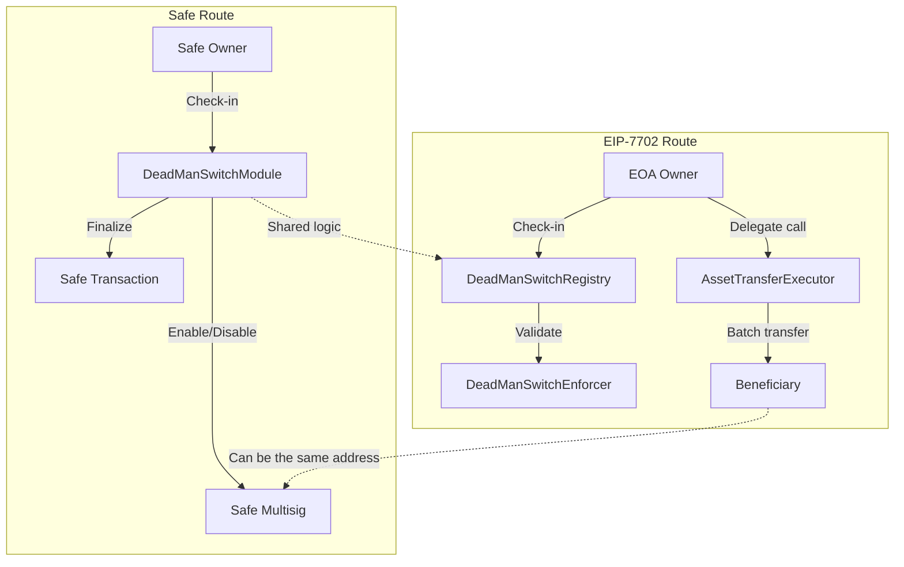

# FamilyKey Contract

<div align="center">

**Core smart contracts for decentralized crypto inheritance**

[](https://docs.soliditylang.org/)
[](https://book.getfoundry.sh/)
[](https://safe.global/)
[](./LICENSE)

</div>

---

> **Language:** English | [中文](README.md)

---

## 📖 Overview

FamilyKey Contract powers the on-chain inheritance flow of the FamilyKey protocol. It implements a Dead Man's Switch that coordinates heartbeat check-ins, challenge periods, and asset settlement. Two complementary tracks are provided:

- **Safe module track**: extends Safe multisig accounts with heartbeat monitoring and ownership transfer logic.
- **EIP-7702 track**: leverages EIP-7702 delegated execution so EOAs can adopt programmable inheritance without migrating to multisig.

Both tracks share the same security model and lifecycle to support diverse account abstractions.

### Highlights
- 🔁 **Automated inheritance**: heartbeat, expiry detection, challenge period, and settlement run entirely on-chain.
- 🧩 **Modular architecture**: Safe module and EIP-7702 contracts are decoupled and can be deployed independently.
- 🪙 **Multi-asset support**: native ETH and arbitrary ERC-20 transfers, including batch operations.
- 🛡️ **Defense in depth**: beneficiary authentication, challenge protection, and a tightly scoped state machine.
- 🧪 **Robust tests**: Foundry suites cover full happy-path flows and edge conditions.

---

## 🧱 Architecture



---

## 🧩 Contract Modules

| Module | Description | Key Functions |
|--------|-------------|---------------|
| `DeadManSwitchModule.sol` | Safe module handling heartbeat, challenge window, ownership transfer | `checkIn`, `startClaim`, `cancelClaim`, `finalizeClaim` |
| `DeadManSwitchRegistry.sol` | State hub for the EIP-7702 flow | `createSwitch`, `checkIn`, `startClaim`, `markFinalized` |
| `DeadManSwitchEnforcer.sol` | EIP-7702 caveat enforcer validating delegated executions | `isValidDelegation`, `enforce` |
| `AssetTransferExecutor.sol` | Executor that migrates ETH and ERC-20 balances | `transferAllETH`, `transferAllERC20`, `batchTransfer` |
| `interfaces/*` | Interfaces for Safe modules, EIP-7702, and executors | Interfaces |
| `mocks/*` | Test helpers and mock contracts | `MockToken`, `MockRegistry` |

---

## 🔄 Lifecycle

### Safe module flow
1. The Safe owner calls `checkIn` on a regular schedule.
2. If `heartbeatInterval` is missed, the beneficiary calls `startClaim`.
3. During the `challengePeriod`, the owner may `cancelClaim`.
4. After the challenge window ends, the beneficiary finalizes inheritance via `finalizeClaim`.

### EIP-7702 flow
1. The owner registers a configuration through `DeadManSwitchRegistry.createSwitch`.
2. Regular `checkIn` updates keep the switch active.
3. Once the heartbeat expires, the beneficiary calls `startClaim` and waits out the challenge window.
4. The owner signs an EIP-7702 delegation empowering `AssetTransferExecutor` to migrate funds.
5. The executor settles assets and marks completion with `markFinalized`.

---

## ⚙️ Getting Started

```bash
# Install dependencies
forge install

# Copy environment variables (if provided)
cp .env.example .env

# Build contracts
forge build

# Run tests
forge test

# Inspect coverage
forge coverage
```

Deployment scripts reside in `script/`. Configure RPC endpoints and private keys according to the target chain.

---

## 🧪 Testing

- `DeadManSwitchModule.t.sol`: Safe heartbeat, challenge, and authorization tests.
- `DeadManSwitchEIP7702.t.sol`: registry, enforcer, and executor coordination tests.
- Mock contracts simulate ERC-20 tokens, time travel, and auxiliary flows.

Run `forge test -vv` for detailed traces.

---

## 🔐 Security Practices

- **Challenge protection**: allows the original owner to revert an accidental trigger.
- **State machine discipline**: transitions must follow the expected lifecycle.
- **Least privilege delegation**: executors gain access only when inheritance is ready.
- **Immutable parameters**: critical configuration is immutable after creation.
- **Reentrancy resistance**: state updates occur before asset transfers.

> ⚠️ Conduct full audits and staged rollouts before any mainnet deployment. The project is primarily a research and experimentation reference.

---

## 🛰️ Account Abstraction & Standards

### EIP-7702 in context
- Permits EOAs to delegate a bytecode payload for a single transaction, enabling “one-off programmable accounts”.
- The signed `Delegation` payload constrains scope and lifetime of delegated execution.
- FamilyKey uses `DeadManSwitchEnforcer` to ensure delegations are only valid for inheritance operations.

### ERC-4337 at a glance
- Introduces `UserOperation`, `EntryPoint`, and bundlers for protocol-agnostic account abstraction.
- Supports social recovery, gas sponsorship, batching, and other advanced patterns.
- FamilyKey-compatible smart accounts can leverage this repo to automate heartbeats and claims.

### Working together
- ERC-4337 smart accounts call Safe module or registry interfaces to maintain liveness and trigger claims.
- EIP-7702 brings temporary programmability to legacy EOAs during the migration period.
- Together they form the foundation for programmable inheritance across account types.

---

## 🛣️ Roadmap

- [x] Safe module implementation and tests
- [x] EIP-7702 implementation and tests
- [x] Batch asset executor
- [ ] Multi-beneficiary and proportional distribution
- [ ] Formal verification & third-party audits
- [ ] End-to-end integration with backend and frontend

---

## 📚 Resources

- [Safe Docs](https://docs.safe.global/)
- [EIP-7702: Transaction Forwarding for EOA](https://eips.ethereum.org/EIPS/eip-7702)
- [ERC-4337: Account Abstraction via Entry Point](https://eips.ethereum.org/EIPS/eip-4337)
- [Foundry Book](https://book.getfoundry.sh/)
- [Base Network Docs](https://docs.base.org/)

---

## 🤝 Contributing

We welcome issues, pull requests, and audit feedback:
- Provide clear reproduction steps and expected behavior.
- Run `forge fmt` and `forge test` before submitting patches.
- Keep contract comments and docs aligned with code changes.

---

## 📄 License

Distributed under the [MIT](./LICENSE) license.

---

<div align="center">

**Built with ❤️ for resilient crypto inheritance**

[⬆ Back to top](#familykey-contract)

</div>
