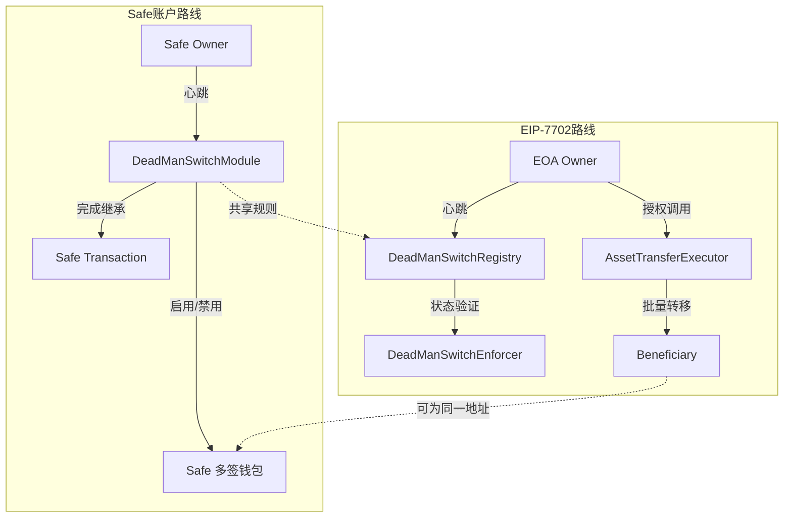

# FamilyKey Contract

<div align="center">

**去中心化加密资产继承的核心智能合约**

[](https://docs.soliditylang.org/)
[](https://book.getfoundry.sh/)
[](https://safe.global/)
[](./LICENSE)

</div>

---

> **语言：** 中文 | [English](README.en.md)

---

## 📖 项目简介

FamilyKey Contract 是 FamilyKey 资产继承方案的链上核心，实现了 Dead Man's Switch（死亡开关）机制以及灵活的资产转移逻辑。项目围绕两条关键路线构建：

- **Safe 模块方案**：扩展 Safe 多签账户，通过模块控制心跳、挑战期与所有权转移。（已实现，前端可体验）
- **EIP-7702 方案**：利用 EIP-7702 赋予 EOA 可编程能力，实现无需多签的账户委托与资产迁移（待验证）。

两条路线共享统一的继承逻辑与安全约束，满足不同账户体系的接入需求。

### 核心亮点
- 🔁 **自动化继承流程**：心跳签到、过期检测、挑战期、转移执行全链上自动化。
- 🧩 **模块化设计**：Safe 模块与 EIP-7702 合约解耦，可单独部署或组合使用。
- 🪙 **多资产支持**：原生 ETH、ERC20、批量转移一次搞定。
- 🛡️ **安全防线**：受益人身份验证、挑战期保护、状态机严密约束。
- 🧪 **完善测试**：Foundry 测试覆盖完整继承场景与异常路径。

---

## 🧱 架构总览



---

## 🧩 合约模块

| 模块 | 说明 | 核心函数 |
|------|------|----------|
| `DeadManSwitchModule.sol` | Safe 模块实现，负责心跳、挑战期、所有权转移 | `checkIn`, `startClaim`, `cancelClaim`, `finalizeClaim` |
| `DeadManSwitchRegistry.sol` | EIP-7702 方案的状态中心，持久化继承配置 | `createSwitch`, `checkIn`, `startClaim`, `markFinalized` |
| `DeadManSwitchEnforcer.sol` | EIP-7702 Caveat 验证器，确保委托执行遵守规则 | `isValidDelegation`, `enforce` |
| `AssetTransferExecutor.sol` | 资产执行器，批量转移 ETH 与 ERC20 | `transferAllETH`, `transferAllERC20`, `batchTransfer` |
| `interfaces/*` | Safe 模块、EIP-7702、执行器的接口定义 | Interfaces |
| `mocks/*` | 测试辅助合约 | `MockToken`, `MockRegistry` |

---

## 🔄 工作流程

### Safe 模块继承流程
1. Safe 所有者调用 `checkIn` 保持心跳。
2. 如果超过 `heartbeatInterval` 未签到，受益人调用 `startClaim`。
3. 在 `challengePeriod` 内，所有者仍可 `cancelClaim`。
4. 挑战期结束后，受益人调用 `finalizeClaim` 完成所有权迁移。

### EIP-7702 继承流程
1. 所有者通过 `DeadManSwitchRegistry.createSwitch` 注册继承配置。
2. 定期 `checkIn` 更新最后存活时间。
3. 受益人条件满足后 `startClaim` 并等待挑战期。
4. 利用 EIP-7702 委托 `AssetTransferExecutor` 批量转移资产。
5. 执行器完成转移后调用 `markFinalized` 关闭流程。

---

## ⚙️ 快速上手

```bash
# 安装依赖
forge install

# 复制环境变量模板（如有）
cp .env.example .env

# 编译合约
forge build

# 运行测试
forge test

# 查看覆盖率
forge coverage
```

部署脚本位于 `script/`，可根据目标链配置 RPC、私钥等参数。

---

## 🧪 测试

- `DeadManSwitchModule.t.sol`：覆盖 Safe 模块的心跳、挑战期、权限保护。
- `DeadManSwitchEIP7702.t.sol`：覆盖 Registry、Enforcer、Executor 的完整协作路径。
- mock 合约用于模拟 ERC20、时间推进等辅助场景。

运行 `forge test -vv` 可获取详细调用追踪。

---

## 🔐 安全实践

- **挑战期防护**：确保误触发时所有者可撤回。
- **状态机约束**：继承流程严格按照状态迁移执行。
- **最小权限**：执行器仅在继承就绪时获得委托。
- **不可变参数**：继承配置一旦设定即不可改动，防止后门。
- **重入防御**：状态更新优先，资金转移后置。

> ⚠️ 在主网部署前务必完成完整审计与多轮测试，本项目主要用于研究与实验。

---

## 🛰️ Account Abstraction 与标准

### EIP-7702 简介
- 允许 EOA 在单笔交易中临时委托一段字节码执行，提供「一次性可编程账户」体验。
- 签名附带的 `Delegation` 数据限定了代理调用的生命周期和作用范围。
- FamilyKey 通过 `DeadManSwitchEnforcer` 验证委托仅能用于继承场景，避免被滥用。

### ERC-4337 简介
- 引入 `UserOperation`、`EntryPoint`、Bundler，提供无需协议升级的账户抽象。
- 支持社交恢复、燃料赞助、批量执行等高级特性。
- 在 FamilyKey 中，可与本合约集成，为智能账户提供心跳和继承触发逻辑。

### 协同方式
- ERC-4337 智能账户可调用 Safe 模块或 Registry 合约，自动化维护心跳与流程。
- EIP-7702 让传统 EOA 获得一次性委托能力，为过渡阶段提供可行路径。
- 两者共同构成 FamilyKey 在账户抽象生态下的继承基础设施。

---

## 🛣️ 路线图

- [x] Safe 模块实现与测试
- [x] EIP-7702 实现与测试
- [x] 批量资产转移执行器
- [ ] 多受益人与比例分配
- [ ] 审计与形式化验证
- [ ] 与前端、后端协同的集成测试

---

## 📚 相关资源

- [Safe 文档](https://docs.safe.global/)
- [EIP-7702: Transaction Forwarding for EOA](https://eips.ethereum.org/EIPS/eip-7702)
- [ERC-4337: Account Abstraction via Entry Point](https://eips.ethereum.org/EIPS/eip-4337)
- [Foundry Book](https://book.getfoundry.sh/)
- [Base 网络文档](https://docs.base.org/)

---

## 🤝 贡献指南

欢迎 Issue、Pull Request 与审计建议：
- 描述清晰问题与复现方式。
- 提交 PR 前运行 `forge fmt`、`forge test` 确认通过。
- 保持合约注释与文档同步更新。

---

## 📄 许可证

本项目基于 [MIT](./LICENSE) 许可发布。

---

<div align="center">

**Built with ❤️ for resilient crypto inheritance**

[⬆ 回到顶部](#familykey-contract)

</div>
