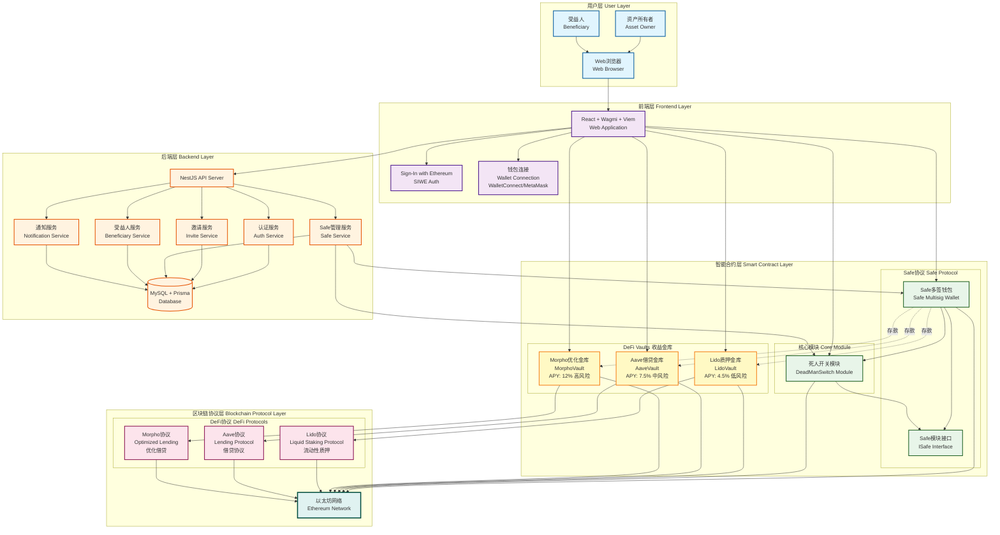

# Family Key

<div align="center">

**去中心化加密资产信托与继承解决方案**

[](https://www.typescriptlang.org/)
[](https://reactjs.org/)
[](https://vitejs.dev/)
[]()

</div>

---

> **语言：** 中文 | [English](README.en.md)

---

## 📖 项目简介

Family Key 是一个基于区块链技术的去中心化加密资产信托平台，致力于解决加密货币继承难题。通过智能合约和 Safe 多签钱包技术，实现了自动化、去中心化的资产继承机制。

### 核心特性

- 🔐 **安全可靠**：基于 Safe（原 Gnosis Safe）多签钱包，业界标准的资产保管方案
- ⏰ **心跳机制**：通过定期签到证明存活，确保继承机制的准确触发
- 🛡️ **挑战期保护**：给予委托人充足的时间取消误触发的继承流程
- 🌐 **完全去中心化**：无需信任第三方，所有逻辑由智能合约执行
- 🌍 **双语支持**：中文/英文界面自由切换
- 📱 **响应式设计**：支持桌面端和移动端访问

---

## 🏗️ 技术架构

### 技术栈

#### 前端框架
- **React 18.2** - 现代化的 UI 框架
- **TypeScript 5.4** - 类型安全的 JavaScript 超集
- **Vite 5.4** - 快速的前端构建工具

#### Web3 集成
- **Wagmi 2.10** - React Hooks for Ethereum
- **Viem 2.9** - 轻量级以太坊交互库
- **Ethers.js 5.7** - 以太坊钱包和合约交互
- **Safe Protocol Kit 5.2** - Safe 多签钱包 SDK

#### 认证与授权
- **Privy 1.74** - Web3 身份认证服务
- **SIWE 2.2** - Sign-In with Ethereum 协议

#### 其他依赖
- **@tanstack/react-query 5.51** - 数据获取和状态管理
- **Alchemy SDK 3.6** - 区块链数据服务
- **QRCode 1.5** - 二维码生成
- **MetaMask Delegation Toolkit 0.13** - 元数据委托工具

### 区块链网络

- **网络**：Base Sepolia 测试网
- **Chain ID**：84532
- **RPC URL**：配置在环境变量 `VITE_RPC_URL`

### 架构图



---

## 🚀 快速开始

### 前置要求

- **Node.js** >= 16.0.0
- **npm** 或 **yarn** 或 **pnpm**
- **MetaMask** 或其他 Web3 钱包浏览器扩展

### 安装步骤

1. **克隆仓库**

```bash
git clone <repository-url>
cd familykey-frontend
```

2. **安装依赖**

```bash
npm install
# 或
yarn install
# 或
pnpm install
```

3. **配置环境变量**

创建 `.env` 文件并配置以下变量：

```env
# RPC 节点 URL
VITE_RPC_URL=https://sepolia.base.org

# 后端 API 地址
VITE_API_URL=http://localhost:3000

# Privy 应用 ID（可选，用于增强认证）
VITE_PRIVY_APP_ID=your-privy-app-id
```

4. **启动开发服务器**

```bash
npm run dev
```

应用将在 `http://localhost:5173` 启动。

5. **构建生产版本**

```bash
npm run build
```

构建产物将生成在 `dist/` 目录。

6. **预览生产构建**

```bash
npm run preview
```

---

## 📁 项目结构

```
familykey-frontend/
├── public/                      # 静态资源
│   ├── eth.svg                 # 以太坊图标
│   ├── family_together*.png    # 家庭插图
│   └── *.png                   # 案例和功能截图
├── src/
│   ├── abi/                    # 智能合约 ABI
│   │   ├── deadmanSwitch.ts   # Dead Man's Switch 模块 ABI
│   │   └── safeContracts.ts   # Safe 合约 ABI
│   ├── config/                 # 配置文件
│   │   ├── api.ts             # API 配置
│   │   └── wagmi.ts           # Wagmi 配置
│   ├── ui/                     # UI 组件
│   │   ├── auth/              # 认证相关组件
│   │   │   └── SiweAuthProvider.tsx  # SIWE 认证提供者
│   │   ├── App.tsx            # 主应用组件
│   │   ├── Home.tsx           # 首页
│   │   ├── Owner.tsx          # 委托人管理页面
│   │   ├── Beneficiary.tsx    # 受益人页面
│   │   ├── Claim.tsx          # 继承索赔页面
│   │   ├── Notify.tsx         # 通知页面
│   │   ├── Logo.tsx           # Logo 组件
│   │   ├── NotificationToast.tsx  # 通知弹窗
│   │   ├── i18n.tsx           # 国际化
│   │   ├── wallets.ts         # 钱包检测
│   │   └── theme.css          # 主题样式
│   ├── main.tsx               # 应用入口
│   └── vite-env.d.ts          # Vite 环境类型定义
├── index.html                  # HTML 入口
├── deck.html                   # 项目介绍页面
├── logo.html                   # Logo 展示页面
├── package.json               # 项目依赖
├── tsconfig.json              # TypeScript 配置
├── vite.config.ts             # Vite 配置
├── vercel.json                # Vercel 部署配置
└── README.md                  # 项目文档
```

---

## 🎯 核心功能

### 1. 委托人（Settlor/Owner）功能

#### 连接钱包与登录
- 支持多种浏览器钱包（MetaMask、Coinbase Wallet 等）
- 使用 SIWE（Sign-In with Ethereum）协议进行安全登录
- 自动检测钱包并引导用户切换到 Base Sepolia 网络

#### 邀请受益人
- 生成唯一的邀请链接
- 自动生成带二维码的邀请海报
- 支持复制链接、下载和复制邀请图片
- 追踪邀请状态（待接受/已接受）

#### 创建家庭基金
1. 选择已注册的受益人
2. 配置心跳检测间隔（默认 7 天）
3. 设置挑战期时长（默认 2 天）
4. 一键部署 Safe 多签钱包和继承模块

**部署流程**：
- 步骤 1：部署 Safe Proxy（需要签名）
- 步骤 2：后端部署 Dead Man's Switch 模块
- 步骤 3：启用模块（需要签名）

#### 心跳签到
- 定期进行心跳签到以证明存活
- 实时显示剩余签到时间
- 状态指示器显示当前继承流程状态

#### 资金管理
- 查看基金余额（ETH 和 USD）
- 向基金存入加密资产
- 复制基金地址方便转账
- 实时资产价格更新（通过 CoinGecko API）

### 2. 受益人（Beneficiary）功能

#### 接受邀请
- 通过邀请链接访问平台
- 使用邮箱完成注册和登录
- 绑定钱包地址

#### 继承索赔
- 当委托人长期未签到时，自动进入继承流程
- 挑战期内委托人仍可签到取消继承
- 挑战期结束后完成资产继承

### 3. 通知系统

- 实时通知重要事件
- 浏览器推送通知支持
- 邮件通知（后端支持）

### 4. 多语言支持

- 中文简体
- 英文
- 一键切换语言

---

## 🔧 开发指南

### 代码规范

项目使用 TypeScript 严格模式，确保类型安全：

```typescript
{
  "strict": true,
  "target": "ES2020",
  "lib": ["ES2020", "DOM", "DOM.Iterable"]
}
```

### 组件开发

所有 UI 组件位于 `src/ui/` 目录，遵循以下约定：

- 使用函数式组件和 React Hooks
- 使用 TypeScript 定义 Props 类型
- 样式通过 CSS 类名管理（见 `theme.css`）

### 智能合约交互

智能合约交互通过以下方式进行：

1. **Wagmi Hooks** - 用于连接钱包和读取链上数据
2. **Ethers.js** - 用于构建和发送交易
3. **Safe Protocol Kit** - 用于 Safe 钱包操作

示例：
```typescript
import { useAccount, useConnect } from 'wagmi';
import { ethers } from 'ethers';

// 连接钱包
const { address, isConnected } = useAccount();
const { connectAsync, connectors } = useConnect();

// 发送交易
const provider = new ethers.providers.Web3Provider(window.ethereum);
const signer = provider.getSigner();
const tx = await contract.someMethod();
```

### 状态管理

使用 **TanStack Query**（原 React Query）进行数据获取和缓存：

```typescript
const overviewQuery = useQuery<OverviewResponse>({
  queryKey: ['owner-overview', ownerAddress],
  queryFn: async () => {
    const res = await fetch(`/api/safes/overview?owner=${ownerAddress}`);
    return res.json();
  },
  refetchInterval: 15000, // 每 15 秒自动刷新
});
```

---

## 🧪 测试

### 本地测试

1. **确保有测试网 ETH**
   - 访问 [Base Sepolia 水龙头](https://www.coinbase.com/faucets/base-ethereum-sepolia-faucet)
   - 或使用 [Alchemy 水龙头](https://sepoliafaucet.com/)

2. **测试完整流程**
   - 委托人：连接钱包 → 邀请受益人 → 创建基金 → 存入资产 → 心跳签到
   - 受益人：接受邀请 → 注册 → 等待继承条件 → 完成继承

### 调试技巧

- 打开浏览器开发者工具查看控制台日志
- 检查 Network 标签查看 API 请求
- 使用 [Base Sepolia 浏览器](https://sepolia.basescan.org/) 查看交易状态

---

## 📦 构建与部署

### 构建优化

项目使用 Vite 进行构建，配置了以下优化：

```typescript
{
  build: {
    minify: 'esbuild',            // 代码压缩
    rollupOptions: {
      output: {
        manualChunks: {
          'ethers': ['ethers']    // 单独打包大型依赖
        }
      }
    }
  }
}
```

### Vercel 部署

项目包含 `vercel.json` 配置，支持一键部署到 Vercel：

```json
{
  "rewrites": [
    { "source": "/(.*)", "destination": "/" }
  ]
}
```

部署步骤：
1. 连接 GitHub 仓库到 Vercel
2. 配置环境变量
3. 自动部署

### 自定义部署

构建后的静态文件位于 `dist/` 目录，可以部署到任何静态托管服务：

- Netlify
- GitHub Pages
- AWS S3 + CloudFront
- IPFS（去中心化托管）

---

## 🔐 安全考虑

### 智能合约安全

- 使用经过审计的 Safe 合约（业界标准）
- Dead Man's Switch 模块实现挑战期机制，防止误操作
- 所有关键操作需要链上签名确认

### 前端安全

- 不在前端存储私钥
- 使用 SIWE 协议进行身份验证
- API 请求使用 JWT 令牌认证
- 用户地址和签名本地验证

### 最佳实践

- 定期进行心跳签到
- 妥善保管钱包私钥
- 验证受益人地址准确性
- 测试网充分测试后再使用主网

---

## 🌐 环境变量

| 变量名 | 说明 | 必需 | 默认值 |
|--------|------|------|--------|
| `VITE_RPC_URL` | Base Sepolia RPC 节点地址 | 是 | `https://sepolia.base.org` |
| `VITE_API_URL` | 后端 API 地址 | 是 | `http://localhost:3000` |
| `VITE_PRIVY_APP_ID` | Privy 应用 ID | 否 | - |

---

## 📚 相关资源

### 官方文档
- [Safe 文档](https://docs.safe.global/)
- [Wagmi 文档](https://wagmi.sh/)
- [Viem 文档](https://viem.sh/)
- [Base 网络文档](https://docs.base.org/)

### 工具和服务
- [Base Sepolia 浏览器](https://sepolia.basescan.org/)
- [Base Sepolia 水龙头](https://www.coinbase.com/faucets/base-ethereum-sepolia-faucet)
- [Alchemy](https://www.alchemy.com/) - 区块链开发平台
- [Safe 应用](https://app.safe.global/) - Safe 多签钱包界面

### 学习资源
- [以太坊开发文档](https://ethereum.org/developers)
- [Solidity 文档](https://docs.soliditylang.org/)
- [Web3 大学](https://www.web3.university/)

---

## 🤝 贡献指南

欢迎贡献代码、报告问题或提出建议！

### 报告问题

请在 GitHub Issues 中提交问题，包含：
- 问题描述
- 复现步骤
- 预期行为
- 实际行为
- 环境信息（浏览器、钱包版本等）

### 提交代码

1. Fork 本仓库
2. 创建功能分支 (`git checkout -b feature/AmazingFeature`)
3. 提交更改 (`git commit -m 'Add some AmazingFeature'`)
4. 推送到分支 (`git push origin feature/AmazingFeature`)
5. 开启 Pull Request

---

## 📄 许可证

本项目为私有项目，版权所有。未经授权不得使用、复制或分发。

---


## 🙏 致谢

感谢以下开源项目和服务：

- [Safe](https://safe.global/) - 提供安全的多签钱包解决方案
- [Base](https://base.org/) - 提供高性能的 L2 网络
- [Wagmi](https://wagmi.sh/) - 提供优秀的 React Web3 开发体验
- [Vite](https://vitejs.dev/) - 提供快速的构建工具
- [React](https://reactjs.org/) - 提供强大的 UI 框架

---

<div align="center">

**Built with ❤️ for a decentralized future**

[⬆ 回到顶部](#family-key-前端)

</div>
