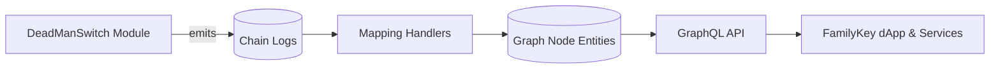

# FamilyKey Graph

<div align="center">

**The Graph subgraph that powers FamilyKey**

[](https://thegraph.com/)
[](https://graphql.org/)
[](https://nodejs.org/)
[](https://github.com/LimeChain/matchstick)
[](./LICENSE)

</div>

---

> **Language:** [中文](README.md) | English

---

## 📖 Overview

FamilyKey Graph is the on-chain indexing layer of the FamilyKey inheritance solution. It leverages The Graph protocol to synchronize DeadManSwitch module events and state changes in real time. With this subgraph, front-end and back-end services can query critical inheritance data through GraphQL without running custom indexers or scanning raw blockchain logs. The project focuses on the shared data surface across Safe modules and EOA flows, delivering a consistent experience on any supported network.

## ✨ Highlights

- 🔍 **Real-time indexing:** Automatically captures check-ins, claim start, cancellation, and finalization events.
- 📊 **Observability:** Preserves full history for timeline reconstruction and analytics.
- ⚡ **GraphQL API:** Unified schema with rich filtering, sorting, and pagination capabilities.
- 🧱 **Modular design:** Clean entity boundaries that make it simple to extend additional inheritance strategies or contract sources.
- 🛡️ **Data parity:** Mapping handlers mirror the contract state machine to keep off-chain queries aligned with on-chain truth.

## 🧱 Data Model

### Core Entities

| Entity | Key Fields | Description |
| --- | --- | --- |
| `DeadManSwitch` | `safe`, `beneficiary`, `heartbeatInterval`, `challengePeriod`, `lastCheckIn`, `claimReadyAt`, `currentOwner`, `isClaimActive`, `createdAt`, `updatedAt` | Stores the latest state and metadata for a single inheritance configuration |
| `CheckInEvent` | `deadManSwitch`, `timestamp`, `blockNumber`, `txHash` | Tracks each heartbeat check-in to monitor account activity |
| `ClaimStartedEvent` | `deadManSwitch`, `claimReadyAt`, `timestamp`, `blockNumber`, `txHash` | Captures when a claim begins and the corresponding challenge deadline |
| `ClaimCancelledEvent` | `deadManSwitch`, `timestamp`, `blockNumber`, `txHash` | Records claim cancellations initiated by owners or beneficiaries |
| `ClaimFinalizedEvent` | `deadManSwitch`, `oldOwner`, `newOwner`, `timestamp`, `blockNumber`, `txHash` | Marks successful inheritance and reflects ownership changes |

### Data Flow



## 🚀 Getting Started

### Prerequisites

- Node.js 18 or later
- npm or yarn
- Graph CLI (optional but recommended): `npm install -g @graphprotocol/graph-cli`

### Installation & Configuration

1. Install dependencies:

   ```bash
   npm install
   ```

2. Update `subgraph.yaml` with the target network, contract address, and start block:

   ```yaml
   dataSources:
     - kind: ethereum
       name: DeadManSwitchModule
       network: mainnet      # or sepolia, goerli, etc.
       source:
         address: "0x..."
         startBlock: 12345678
   ```

3. Ensure the ABI path points to the correct contract artifact:

   ```yaml
   abis:
     - name: DeadManSwitchModule
       file: ../contracts/out/DeadManSwitchModule.sol/DeadManSwitchModule.json
   ```

### Handy Scripts

| Command | Description |
| --- | --- |
| `npm run codegen` | Generate AssemblyScript types from `schema.graphql` and `subgraph.yaml` |
| `npm run build` | Compile the schema and mappings, producing deployment artifacts |
| `npm run deploy` | Deploy to The Graph Studio (requires prior `graph auth`) |
| `npm run create-local` | Register the subgraph on a local Graph Node |
| `npm run deploy-local` | Deploy to the local node (requires local IPFS and Graph Node) |
| `npm run remove-local` | Remove the subgraph from the local node |

## 🌐 Deployment

### The Graph Studio

1. Create a project in [The Graph Studio](https://thegraph.com/studio/) and note the subgraph slug.
2. Authenticate from your terminal:

   ```bash
   graph auth --studio <DEPLOY_KEY>
   ```

3. Build and deploy:

   ```bash
   npm run build
   npm run deploy
   ```

### Local Graph Node

1. Boot Graph Node, IPFS, and Postgres (the official Docker Compose setup works well).
2. Register and deploy:

   ```bash
   npm run create-local
   npm run deploy-local
   ```

3. Clean up the sandboxed environment when needed:

   ```bash
   npm run remove-local
   ```

## 🔎 Sample Queries

<details>
<summary>📦 Fetch the latest DeadManSwitch state for a Safe</summary>

```graphql
{
  deadManSwitch(id: "0xSAFE_ADDRESS") {
    id
    safe
    beneficiary
    lastCheckIn
    claimReadyAt
    isClaimActive
  }
}
```
</details>

<details>
<summary>🕒 Retrieve recent heartbeat check-ins</summary>

```graphql
{
  checkInEvents(first: 20, orderBy: timestamp, orderDirection: desc) {
    id
    deadManSwitch {
      id
      safe
    }
    timestamp
    blockNumber
    txHash
  }
}
```
</details>

<details>
<summary>⏳ List claims still inside the challenge window</summary>

```graphql
{
  deadManSwitches(where: { isClaimActive: true }) {
    id
    beneficiary
    claimReadyAt
    claimStartedEvents(first: 1, orderBy: timestamp, orderDirection: desc) {
      timestamp
      claimReadyAt
    }
  }
}
```
</details>

<details>
<summary>✅ Inspect the latest finalized inheritances</summary>

```graphql
{
  claimFinalizedEvents(first: 10, orderBy: timestamp, orderDirection: desc) {
    id
    deadManSwitch {
      id
      safe
    }
    oldOwner
    newOwner
    timestamp
    txHash
  }
}
```
</details>

## 🛠️ Development

Project layout:

```text
.
├── schema.graphql          # GraphQL entity definitions
├── subgraph.yaml           # Data sources and handler wiring
├── src/
│   └── mapping.ts          # Event mapping logic
├── package.json            # Scripts and dependencies
└── tsconfig.json           # TypeScript configuration
```

Suggested workflow for extending the subgraph:

1. Update or add entities in `schema.graphql`.
2. Run `npm run codegen` to regenerate types.
3. Implement or adjust handlers in `src/mapping.ts`.
4. Build with `npm run build` to validate compilation.
5. Redeploy to your target environment when ready.

## 🧪 Testing

This project uses Matchstick for subgraph unit testing:

```bash
npm install --save-dev matchstick-as
```

```bash
npm test
```

Set `MATCHSTICK_VERBOSE=true` for detailed diagnostics during test runs.

## 📚 Resources

- [The Graph Documentation](https://thegraph.com/docs/)
- [Graph CLI Reference](https://github.com/graphprotocol/graph-tooling/tree/main/packages/cli)
- [AssemblyScript Docs](https://www.assemblyscript.org/)
- [Matchstick Guide](https://thegraph.com/docs/en/developer/matchstick/)
- [FamilyKey Main Repository](https://github.com/yourusername/familykey)

## 🤝 Contributing

- Issues and pull requests are welcome—please include clear problem statements, expected outcomes, and reproduction steps.
- Run `npm run build` and relevant tests before submitting changes to ensure the subgraph compiles.
- Keep documentation and tests current whenever you evolve entities or handlers.

## 📄 License

Released under the [MIT](./LICENSE) license.

## 🔗 Key Links

- [The Graph Studio](https://thegraph.com/studio/)
- [Graph Explorer](https://thegraph.com/explorer/)
- [FamilyKey Repository](https://github.com/yourusername/familykey)

> ⚠️ Before promoting to production, double-check contract addresses, start blocks, and ABI integrity, and consider redundant indexers to avoid downtime.

<div align="center">

**Built with 💙 to keep inheritance data accessible**

[⬆ Back to top](#familykey-graph)

</div>

