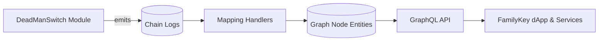

# FamilyKey Graph

<div align="center">

**FamilyKey 项目的 The Graph 子图**

[](https://thegraph.com/)
[](https://graphql.org/)
[](https://nodejs.org/)
[](https://github.com/LimeChain/matchstick)
[](./LICENSE)

</div>

---

> **语言：** 中文 | [English](README.en.md)

---

## 📖 项目简介

FamilyKey Graph 是 FamilyKey 资产继承方案的链上数据索引层，基于 The Graph 协议实时同步 DeadManSwitch 模块的事件与状态。借助 Subgraph，前端与服务端可以通过 GraphQL 快速查询继承流程的关键信息，而无需直接扫描区块链日志或维护自建索引服务。该子图聚焦 Safe 模块与 EOA 方案共享的核心数据，帮助产品在不同网络上保持一致的数据体验。

## ✨ 功能亮点

- 🔍 **实时索引**：自动监听心跳签到、继承发起、取消与完成等关键事件。
- 📊 **可观测性增强**：保留完整历史记录，支持时间线追踪与数据分析。
- ⚡ **GraphQL API**：统一的 schema，支持条件过滤、排序和分页查询。
- 🧱 **模块化结构**：实体模型清晰，可扩展更多继承策略或外部合约。
- 🛡️ **数据一致性**：在处理程序中复刻合约状态机，确保链上与链下视图保持同步。

## 🧱 数据模型

### 核心实体

| 实体 | 关键字段 | 说明 |
| --- | --- | --- |
| `DeadManSwitch` | `safe`, `beneficiary`, `heartbeatInterval`, `challengePeriod`, `lastCheckIn`, `claimReadyAt`, `currentOwner`, `isClaimActive`, `createdAt`, `updatedAt` | 表示单个继承配置的最新状态与元数据 |
| `CheckInEvent` | `deadManSwitch`, `timestamp`, `blockNumber`, `txHash` | 记录每次心跳签到，用于监控活跃状态 |
| `ClaimStartedEvent` | `deadManSwitch`, `claimReadyAt`, `timestamp`, `blockNumber`, `txHash` | 记录继承发起时间及挑战期就绪时间 |
| `ClaimCancelledEvent` | `deadManSwitch`, `timestamp`, `blockNumber`, `txHash` | 表示继承流程被撤回或取消 |
| `ClaimFinalizedEvent` | `deadManSwitch`, `oldOwner`, `newOwner`, `timestamp`, `blockNumber`, `txHash` | 表示继承流程完成并更新所有权 |

### 数据流



## 🚀 快速上手

### 环境要求

- Node.js 18 或更高版本
- npm 或 yarn
- Graph CLI（可选但推荐）：`npm install -g @graphprotocol/graph-cli`

### 安装与配置

1. 安装依赖：

   ```bash
   npm install
   ```

2. 更新 `subgraph.yaml`，填入部署网络、合约地址与起始区块：

   ```yaml
   dataSources:
     - kind: ethereum
       name: DeadManSwitchModule
       network: mainnet      # 或 sepolia、goerli 等测试网络
       source:
         address: "0x..."
         startBlock: 12345678
   ```

3. 确认 ABI 路径指向正确的合约编译输出：

   ```yaml
   abis:
     - name: DeadManSwitchModule
       file: ../contracts/out/DeadManSwitchModule.sol/DeadManSwitchModule.json
   ```

### 常用脚本

| 命令 | 说明 |
| --- | --- |
| `npm run codegen` | 根据 `schema.graphql` 与 `subgraph.yaml` 生成 AssemblyScript 类型 |
| `npm run build` | 编译 Schema 与映射，输出部署工件 |
| `npm run deploy` | 部署到 The Graph Studio（需提前 `graph auth`） |
| `npm run create-local` | 在本地 Graph Node 上注册子图 |
| `npm run deploy-local` | 将子图部署到本地节点（需本地 IPFS 与 Graph Node） |
| `npm run remove-local` | 从本地节点移除子图 |

## 🌐 部署

### The Graph Studio

1. 在 [The Graph Studio](https://thegraph.com/studio/) 创建项目并复制 Subgraph Slug。
2. 通过命令行完成身份认证：

   ```bash
   graph auth --studio <DEPLOY_KEY>
   ```

3. 构建并部署：

   ```bash
   npm run build
   npm run deploy
   ```

### 本地 Graph Node

1. 启动 Graph Node、IPFS 与 Postgres（可使用官方 Docker Compose）。
2. 注册并部署子图：

   ```bash
   npm run create-local
   npm run deploy-local
   ```

3. 清理测试环境：

   ```bash
   npm run remove-local
   ```

## 🔎 常用查询

<details>
<summary>📦 查询指定 Safe 的最新 DeadManSwitch 状态</summary>

```graphql
{
  deadManSwitch(id: "0xSAFE_ADDRESS") {
    id
    safe
    beneficiary
    lastCheckIn
    claimReadyAt
    isClaimActive
  }
}
```
</details>

<details>
<summary>🕒 获取最近的心跳签到事件</summary>

```graphql
{
  checkInEvents(first: 20, orderBy: timestamp, orderDirection: desc) {
    id
    deadManSwitch {
      id
      safe
    }
    timestamp
    blockNumber
    txHash
  }
}
```
</details>

<details>
<summary>⏳ 列出仍在挑战期内的继承流程</summary>

```graphql
{
  deadManSwitches(where: { isClaimActive: true }) {
    id
    beneficiary
    claimReadyAt
    claimStartedEvents(first: 1, orderBy: timestamp, orderDirection: desc) {
      timestamp
      claimReadyAt
    }
  }
}
```
</details>

<details>
<summary>✅ 查询最近完成的继承</summary>

```graphql
{
  claimFinalizedEvents(first: 10, orderBy: timestamp, orderDirection: desc) {
    id
    deadManSwitch {
      id
      safe
    }
    oldOwner
    newOwner
    timestamp
    txHash
  }
}
```
</details>

## 🛠️ 开发与扩展

项目结构概览：

```text
.
├── schema.graphql          # GraphQL 实体定义
├── subgraph.yaml           # 数据源与事件处理配置
├── src/
│   └── mapping.ts          # 事件映射处理逻辑
├── package.json            # 依赖与脚本
└── tsconfig.json           # TypeScript 配置
```

扩展步骤建议：

1. 在 `schema.graphql` 中新增或调整实体。
2. 执行 `npm run codegen` 生成新的类型定义。
3. 在 `src/mapping.ts` 中实现或更新对应的 handler。
4. 运行 `npm run build`，确保编译与类型检查通过。
5. 根据需要重新部署到目标环境。

## 🧪 测试

本项目使用 Matchstick 进行子图单元测试：

```bash
npm install --save-dev matchstick-as
```

```bash
npm test
```

测试时可通过 `MATCHSTICK_VERBOSE=true npm test` 获取更详细的调试日志。

## 📚 相关资源

- [The Graph 官方文档](https://thegraph.com/docs/)
- [Graph CLI 文档](https://github.com/graphprotocol/graph-tooling/tree/main/packages/cli)
- [AssemblyScript 文档](https://www.assemblyscript.org/)
- [Matchstick 测试指南](https://thegraph.com/docs/en/developer/matchstick/)

## 🤝 贡献指南

- 欢迎提交 Issue 或 PR，描述清晰问题、预期行为与复现方式。
- 提交前请运行 `npm run build` 与相关测试，确保子图能够成功编译。
- 更新数据模型或 handler 时，同步完善文档与测试用例。

## 📄 许可证

本项目基于 [MIT](./LICENSE) 许可发布。

## 🔗 关键链接

- [The Graph Studio](https://thegraph.com/studio/)
- [Graph Explorer](https://thegraph.com/explorer/)

> ⚠️ 在部署到生产网络前，请确认合约地址、起始区块与 ABI 完整一致，并准备备用索引节点以避免同步中断。

<div align="center">

**Built with 💙 to keep inheritance data accessible**

[⬆ 回到顶部](#familykey-graph)

</div>
