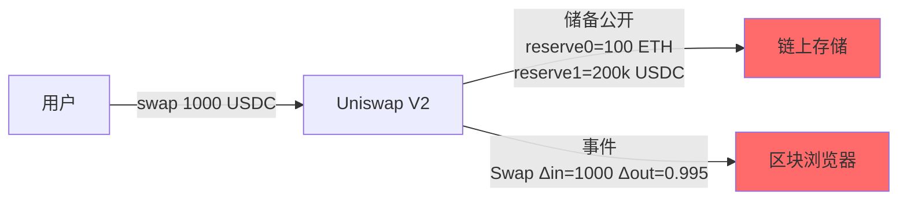
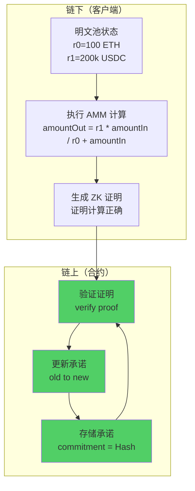
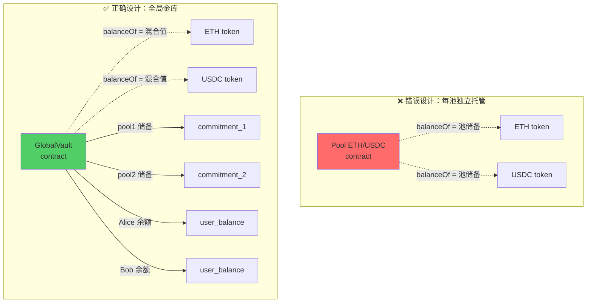
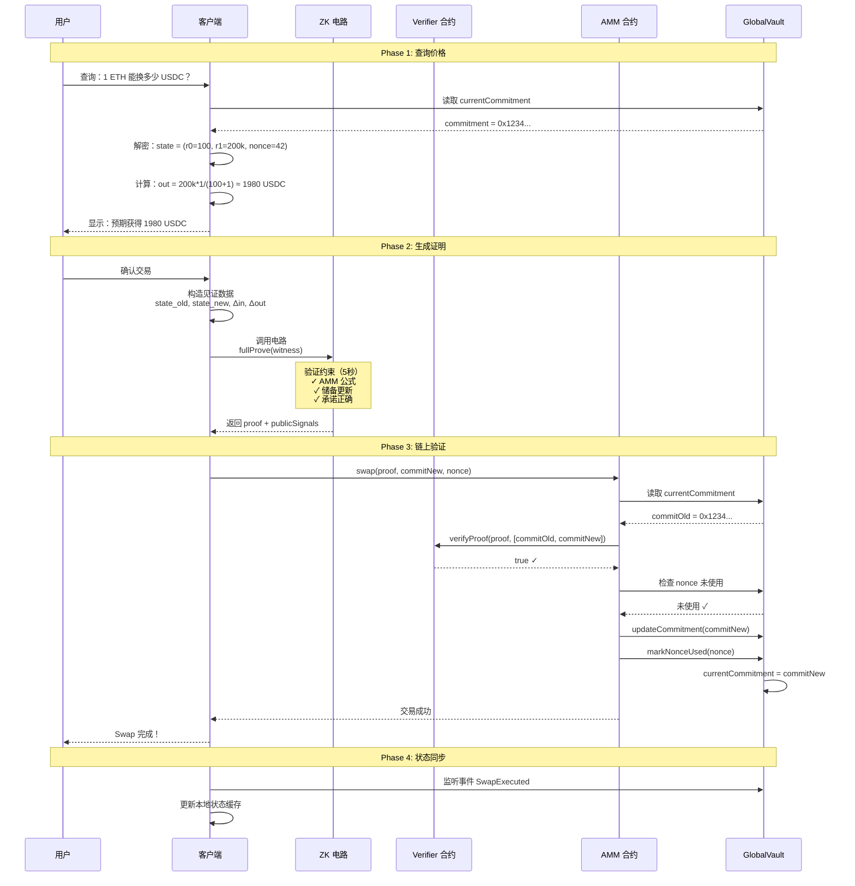
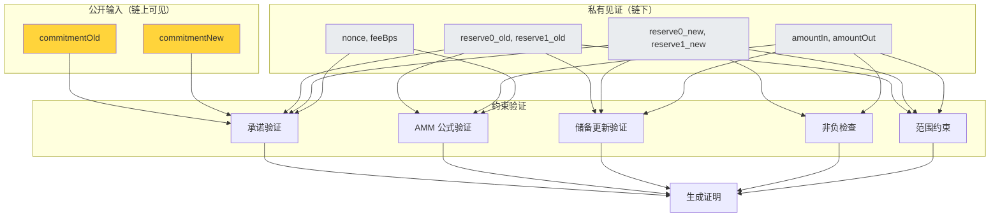
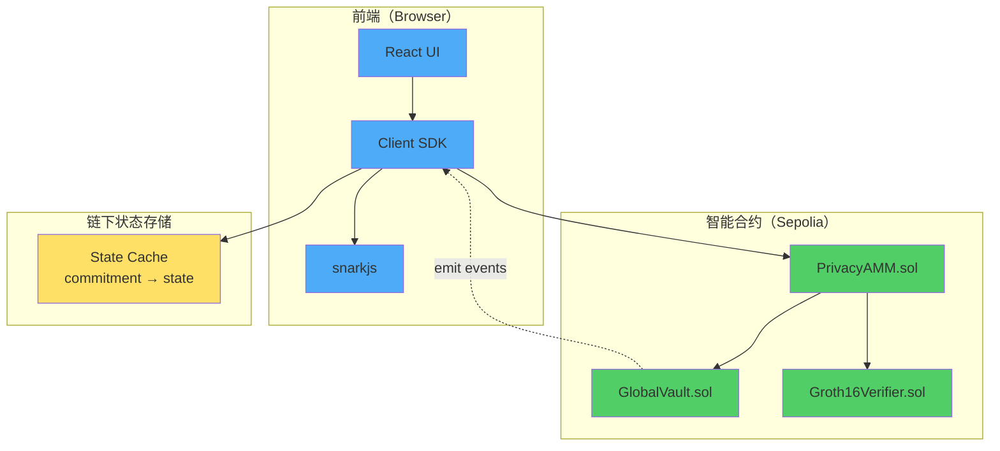
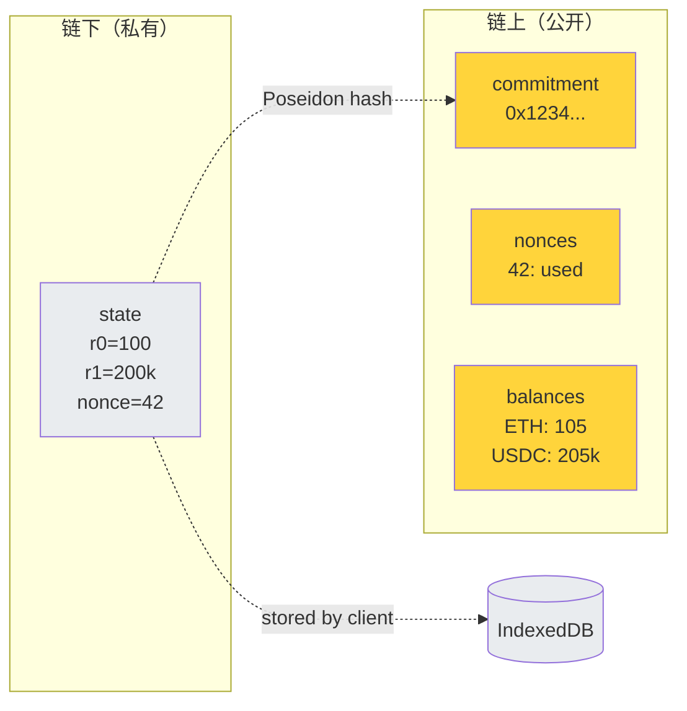

---

## 🎯 项目目标

构建一个最小可行的隐私AMM，核心价值：

- ✅ 池子储备（r0, r1）不公开存储
- ✅ 单笔交易金额（Δin, Δout）不公开
- ✅ AMM 定价算法在 ZK 电路内执行
- ✅ 链上合约只验证证明，不执行计算

**黑客松范围**：

- 单一交易对（ETH/USDC）
- 仅实现 Swap 功能
- 简化用户身份管理（地址可见）
- 接受状态并发限制

---

## 💡 核心技术原理

### 问题：传统 AMM 的隐私泄露



**问题**：

- 任何人都能看到池子精确储备
- 每笔交易的输入/输出金额完全透明
- 大户交易容易被识别和针对

### 解决方案：承诺 + ZK 证明



**关键设计**：

1. **链上不存储明文**：只存 `commitment = Poseidon(r0, r1, nonce, fee)`
2. **计算发生在电路**：AMM 公式在 ZK 电路约束中执行
3. **链上只验证**：合约验证证明有效性，不执行任何计算

## 全局隐藏金库 (GlobalShieldedVault)

**功能描述**:

托管所有 ERC-20 代币的真实余额，管理统一的 Merkle 树结构。

**功能点**:

- 充值 (Shield): 用户将 ERC-20 代币转入金库，生成余额 note
- 提现 (Unshield): 用户销毁余额 note，从金库提取 ERC-20 代币
- Merkle 树管理:
    - 维护全局 Merkle 树（深度 32-40）
    - 存储当前根 `currentRoot`
    - 维护历史根集合 `knownRoots`（支持过期根验证）
    - 管理 nullifiers 集合（防止双花）
- 事件日志: 发布新叶子承诺值（不含明文）用于客户端重建树

### 为什么需要全局金库？



**全局金库的作用**：

- **混淆资产归属**：`balanceOf(Vault)` = 所有池储备 + 所有用户余额
- **防止直接观察**：外部无法区分哪部分属于池子
- **统一托管**：所有 ERC-20 集中管理，简化授权

---

## 🔄 端到端交易流程

### 整体架构



### Phase 1: 价格查询（链下解密）

**客户端代码**：

```jsx
// 步骤 1: 获取当前承诺
const commitment = await globalVault.currentCommitment();
// commitment = 0x2a3f5b8c... (32 bytes)

// 步骤 2: 从本地存储/服务端获取对应的明文状态
// 简化版：viewing key 公开，任何人都能解密
const poolState = await decryptPoolState(commitment);
// poolState = {
//   reserve0: 100_000000000000000000n,  // 100 ETH (18 decimals)
//   reserve1: 200000_000000n,            // 200k USDC (6 decimals)
//   nonce: 42n,
//   feeBps: 30n                          // 0.3%
// }

// 步骤 3: 本地执行 AMM 计算
function calculateSwapOutput(reserve0, reserve1, amountIn, feeBps) {
    // 扣除手续费
    const amountInAfterFee = amountIn * (10000n - feeBps) / 10000n;

    // 恒定乘积公式：Δout = r1 * Δin / (r0 + Δin)
    const amountOut = reserve1 * amountInAfterFee / (reserve0 + amountInAfterFee);

    return amountOut;
}

const amountIn = ethers.parseEther("1.0");  // 1 ETH
const amountOut = calculateSwapOutput(
    poolState.reserve0,
    poolState.reserve1,
    amountIn,
    poolState.feeBps
);
// amountOut ≈ 1980198019 (1980.198019 USDC)

```

**为什么这样设计？**

- 链上不存明文，无法直接读取 r0、r1
- 客户端需要"视角"来解密状态
- 黑客松版本：viewing key 公开（任何人都能解密）
- 生产版本：viewing key 私有（只有 LP 或授权方能解密）

### Phase 2: ZK 证明生成（核心）

### 见证数据构造

```jsx
// 计算新状态
const newState = {
    reserve0: poolState.reserve0 + amountInAfterFee,
    reserve1: poolState.reserve1 - amountOut,
    nonce: poolState.nonce + 1n,
    feeBps: poolState.feeBps
};

// 计算承诺（使用 Poseidon hash）
function calculateCommitment(state) {
    return poseidon([
        state.reserve0,
        state.reserve1,
        state.nonce,
        state.feeBps
    ]);
}

const commitmentOld = calculateCommitment(poolState);
const commitmentNew = calculateCommitment(newState);

// 构造电路输入
const circuitInput = {
    // 公开输入（链上可见）
    commitmentOld: commitmentOld.toString(),
    commitmentNew: commitmentNew.toString(),

    // 私有见证（仅在证明中使用）
    reserve0_old: poolState.reserve0.toString(),
    reserve1_old: poolState.reserve1.toString(),
    reserve0_new: newState.reserve0.toString(),
    reserve1_new: newState.reserve1.toString(),
    nonce: poolState.nonce.toString(),
    feeBps: poolState.feeBps.toString(),
    amountIn: amountIn.toString(),
    amountOut: amountOut.toString(),
};

```

### 证明生成

```jsx
import { groth16 } from 'snarkjs';

// 生成完整证明（耗时 5-10 秒）
const { proof, publicSignals } = await groth16.fullProve(
    circuitInput,
    "/circuits/swap_circuit.wasm",
    "/circuits/swap_circuit_final.zkey"
);

// proof 结构：
// {
//   pi_a: [x, y, z],
//   pi_b: [[x1, y1], [x2, y2], [x3, y3]],
//   pi_c: [x, y, z],
//   protocol: "groth16",
//   curve: "bn128"
// }

// publicSignals = [commitmentOld, commitmentNew]

```

### Phase 3: 链上验证（Solidity）

### AMM 合约

```solidity
// SPDX-License-Identifier: MIT
pragma solidity ^0.8.20;

interface IGlobalVault {
    function currentCommitment() external view returns (bytes32);
    function updateCommitment(bytes32 newCommitment) external;
    function isNonceUsed(uint256 nonce) external view returns (bool);
    function markNonceUsed(uint256 nonce) external;
}

interface IGroth16Verifier {
    function verifyProof(
        uint[2] calldata _pA,
        uint[2][2] calldata _pB,
        uint[2] calldata _pC,
        uint[2] calldata _pubSignals
    ) external view returns (bool);
}

contract PrivacyAMM {
    IGlobalVault public immutable vault;
    IGroth16Verifier public immutable verifier;

    event SwapExecuted(
        bytes32 indexed commitmentOld,
        bytes32 indexed commitmentNew,
        uint256 nonce,
        address indexed trader
    );

    constructor(address _vault, address _verifier) {
        vault = IGlobalVault(_vault);
        verifier = IGroth16Verifier(_verifier);
    }

    function swap(
        uint[2] calldata pA,
        uint[2][2] calldata pB,
        uint[2] calldata pC,
        bytes32 commitmentNew,
        uint256 nonce
    ) external {
        // 1. 获取当前承诺
        bytes32 commitmentOld = vault.currentCommitment();

        // 2. 防重放检查
        require(!vault.isNonceUsed(nonce), "Nonce already used");

        // 3. 构造公开输入
        uint[2] memory publicSignals = [
            uint256(commitmentOld),
            uint256(commitmentNew)
        ];

        // 4. 验证 ZK 证明（核心）
        require(
            verifier.verifyProof(pA, pB, pC, publicSignals),
            "Invalid ZK proof"
        );

        // 5. 更新状态
        vault.updateCommitment(commitmentNew);
        vault.markNonceUsed(nonce);

        // 6. 发布事件（仅承诺值，无金额）
        emit SwapExecuted(commitmentOld, commitmentNew, nonce, msg.sender);

        // 注意：
        // - 没有任何 token.transfer()
        // - 没有读取/存储 reserve0、reserve1
        // - 完全依赖 ZK 证明的正确性
    }
}

```

**关键点**：

- 合约**不知道** r0、r1 是多少
- 合约**不执行**任何 AMM 计算
- 合约**只验证**证明的数学正确性
- 资产一直在 Vault，只是"账本"（承诺）变化

### 全局金库

```solidity
contract GlobalVault {
    // 状态存储
    bytes32 public currentCommitment;
    mapping(uint256 => bool) public usedNonces;

    // 简化版：直接记录用户余额（不用 notes）
    mapping(address => mapping(uint8 => uint256)) public userBalances;
    // userBalances[user][0] = ETH 余额
    // userBalances[user][1] = USDC 余额

    // ERC-20 引用
    IERC20 public immutable tokenETH;   // WETH
    IERC20 public immutable tokenUSDC;

    address public ammContract;

    modifier onlyAMM() {
        require(msg.sender == ammContract, "Only AMM");
        _;
    }

    // 初始化池子（仅一次）
    function initializePool(
        bytes32 initialCommitment,
        uint256 amount0,
        uint256 amount1
    ) external {
        require(currentCommitment == bytes32(0), "Already initialized");

        // 转入初始流动性
        tokenETH.transferFrom(msg.sender, address(this), amount0);
        tokenUSDC.transferFrom(msg.sender, address(this), amount1);

        currentCommitment = initialCommitment;

        emit PoolInitialized(initialCommitment, amount0, amount1);
    }

    // AMM 合约更新承诺
    function updateCommitment(bytes32 newCommitment) external onlyAMM {
        currentCommitment = newCommitment;
    }

    function markNonceUsed(uint256 nonce) external onlyAMM {
        usedNonces[nonce] = true;
    }

    function isNonceUsed(uint256 nonce) external view returns (bool) {
        return usedNonces[nonce];
    }

    // 用户充值
    function deposit(uint8 tokenId, uint256 amount) external payable {
        if (tokenId == 0) {
            require(msg.value == amount, "Incorrect ETH");
        } else {
            tokenUSDC.transferFrom(msg.sender, address(this), amount);
        }

        userBalances[msg.sender][tokenId] += amount;
        emit Deposit(msg.sender, tokenId, amount);
    }

    // 用户提现
    function withdraw(uint8 tokenId, uint256 amount) external {
        require(userBalances[msg.sender][tokenId] >= amount, "Insufficient balance");

        userBalances[msg.sender][tokenId] -= amount;

        if (tokenId == 0) {
            payable(msg.sender).transfer(amount);
        } else {
            tokenUSDC.transfer(msg.sender, amount);
        }

        emit Withdraw(msg.sender, tokenId, amount);
    }
}

```

**设计要点**：

- `currentCommitment`：唯一的链上池状态标识
- `usedNonces`：防止重放攻击
- `userBalances`：简化版用户余额（黑客松不实现完整 notes）
- 观察者看到的 `tokenETH.balanceOf(vault)` 是混合值

---

## ⚙️ ZK 电路设计

### 电路架构



### 电路约束详解

**约束 1 & 2：承诺验证**

- 目的：证明声称的旧/新状态确实对应声称的承诺
- 方法：重新计算 Poseidon 哈希，验证与公开输入一致
- 防止：伪造状态（如声称 r0=1, r1=1000000）

**约束 3：手续费计算**

- 目的：正确扣除手续费
- 公式：`amountInAfterFee = amountIn * (1 - feeBps/10000)`
- 实现：用乘法变形避免除法（电路中除法复杂）

**约束 4：储备更新**

- 目的：验证储备变化与交易金额一致
- 逻辑：`r0' = r0 + ΔinAfterFee`, `r1' = r1 - Δout`
- 防止：篡改储备（如声称输入 1 但储备增加 100）

**约束 5：AMM 定价（最核心）**

- 目的：强制执行恒定乘积公式
- 公式：`Δout * (r0 + ΔinAfterFee) ≈ r1 * ΔinAfterFee`
- 允许：±1 单位的取整误差（避免浮点）
- 这就是 AMM 算法的"执行位置"

**约束 6：常数乘积不减**

- 目的：验证手续费正确收取（k 应该增加）
- 逻辑：`k_new = r0' * r1' >= r0 * r1 = k_old`
- 防止：手续费计算错误

**约束 7：范围检查**

- 目的：防止溢出和负数
- 方法：分解为 128-bit 二进制表示
- 防止：整数溢出攻击

### 电路编译与密钥生成

```bash
# 1. 编译电路
circom swap_circuit.circom --r1cs --wasm --sym

# 2. 生成 Powers of Tau（可复用）
snarkjs powersoftau new bn128 14 pot14_0000.ptau
snarkjs powersoftau contribute pot14_0000.ptau pot14_0001.ptau

# 3. 准备 Phase 2
snarkjs powersoftau prepare phase2 pot14_0001.ptau pot14_final.ptau

# 4. 生成 zkey
snarkjs groth16 setup swap_circuit.r1cs pot14_final.ptau swap_0000.zkey

# 5. Contribute to Phase 2
snarkjs zkey contribute swap_0000.zkey swap_final.zkey

# 6. 导出验证密钥
snarkjs zkey export verificationkey swap_final.zkey verification_key.json

# 7. 生成 Solidity 验证器
snarkjs zkey export solidityverifier swap_final.zkey Groth16Verifier.sol

```

---

## 🏗️ 系统架构

### 组件关系图



### 数据流图



**关键点**：

- 链上只有"指纹"（commitment）
- 链下保留"明文"（state）
- 两者通过哈希函数单向关联

---

## 📦 技术栈

### 核心技术

**智能合约开发**：

- Foundry（forge, cast, anvil）
- Solidity ^0.8.20
- OpenZeppelin Contracts

**ZK 证明**：

- Circom
- SnarkJS（证明生成/验证）
- Groth16 证明系统
- Poseidon Hash（电路友好）
- circomlibjs（JavaScript 库）


### 项目结构

```
privacy-amm/
├── contracts/
│   ├── src/
│   │   ├── PrivacyAMM.sol
│   │   ├── GlobalVault.sol
│   │   └── interfaces/
│   ├── test/
│   │   ├── PrivacyAMM.t.sol
│   │   └── GlobalVault.t.sol
│   ├── script/
│   │   └── Deploy.s.sol
│   └── foundry.toml
│
├── circuits/
│   ├── swap_circuit.circom
│   ├── test/
│   │   └── swap_circuit.test.js
│   └── scripts/
│       ├── compile.sh
│       └── generate_keys.sh
├── client/
│   ├── src/
│   │   ├── components/
│   │   │   ├── SwapInterface.tsx
│   │   │   └── WalletConnect.tsx
│   │   ├── lib/
│   │   │   ├── prover.ts
│   │   │   ├── commitment.ts
│   │   │   └── state.ts
│   │   └── App.tsx
│   ├── public/
│   │   ├── circuits/
│   │   │   ├── swap_circuit.wasm
│   │   │   └── swap_circuit.zkey
│   │   └── index.html
│   └── vite.config.ts
│
└── README.md

```   
  