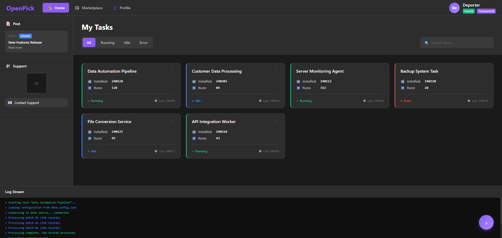
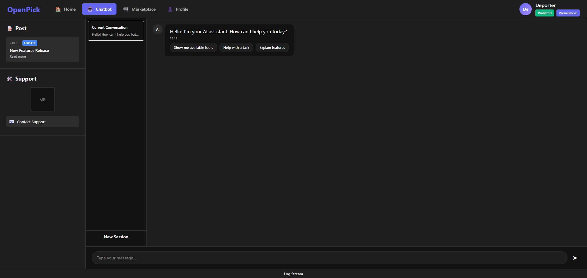
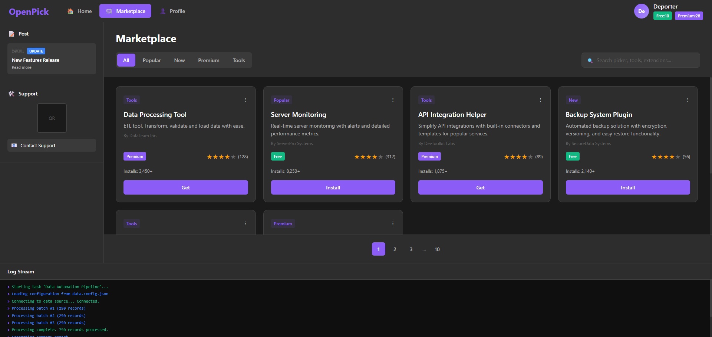
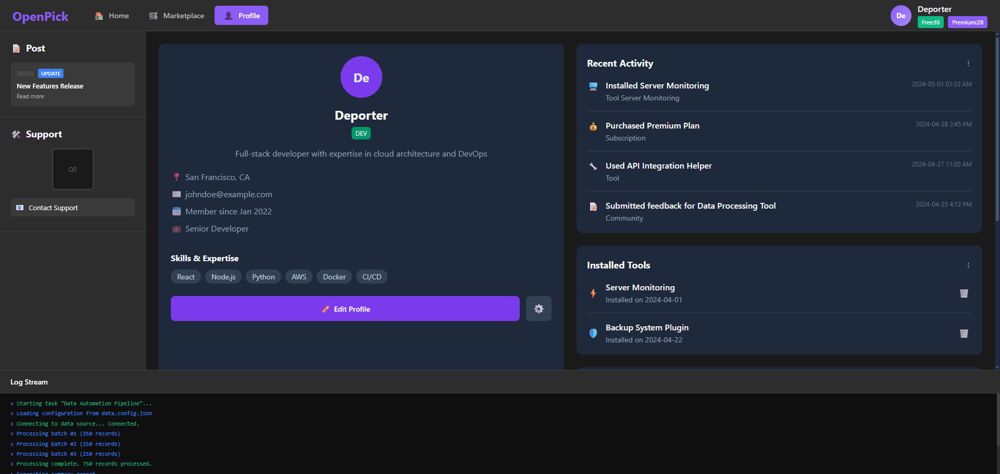

## Desktop 技术栈

Tauri 2.0 框架

UI 内嵌框架为 React，UI 如下图所示



Docs Link: 

https://tauri.app/start/project-structure/

https://tauri.app/start/create-project/

https://tauri.app/develop/

Github repo: 

https://github.com/tauri-apps/tauri


## Home 界面分析

整体布局：

深色主题的现代化界面
左侧边栏 + 主内容区域的经典布局
左侧边栏包含：

顶部导航：OpenPick logo，Home、Marketplace、Profile 菜单
用户信息：右上角显示用户头像和信息（Deporter, Wallet:10, Premium:28）
Post 区域：显示更新和新闻
Support 区域：包含二维码和联系支持信息
底部日志流：显示实时任务执行日志
主内容区域：

My Pickers 标题和搜索/筛选功能（All, Running, Idle, Error状态筛选）
任务卡片网格：6个任务卡片，每个显示：
任务名称
安装时间和运行次数
当前状态（Running/Idle/Error）
最后执行时间
添加按钮：右下角的紫色"+"按钮

## Home 界面实现计划
1. 整体架构设计
采用现代React + TypeScript + CSS Grid/Flexbox布局
实现响应式设计，适配桌面应用窗口
使用组件化开发，便于维护和扩展
2. 主要组件结构
App.tsx (主容器)
├── Sidebar.tsx (左侧边栏)
│   ├── Header.tsx (顶部导航 + 用户信息)
│   ├── PostSection.tsx (Post区域)
│   ├── SupportSection.tsx (Support区域)
│   └── LogStream.tsx (底部日志流)
└── MainContent.tsx (主内容区)
    ├── TaskHeader.tsx (My Tasks标题 + 筛选器)
    ├── TaskGrid.tsx (任务卡片网格)
    ├── TaskCard.tsx (单个任务卡片)
    └── AddButton.tsx (添加按钮)
3. 样式设计方案
深色主题：使用CSS变量管理颜色系统
现代化UI：圆角、阴影、渐变等视觉效果
状态指示：不同颜色表示Running/Idle/Error状态
交互反馈：悬停效果、点击动画等
4. 功能特性
任务状态筛选：All/Running/Idle/Error切换
搜索功能：任务名称搜索
实时状态显示：任务运行状态和时间信息
响应式交互：卡片悬停、按钮点击效果
5. 数据结构设计
interface Task {
  id: string;
  name: string;
  status: 'running' | 'idle' | 'error';
  installed: string;
  runs: number;
  last_run: string;
  picker_path: string;
}
6. 技术实现要点
使用CSS Grid实现任务卡片的响应式布局
实现状态筛选的交互逻辑
添加适当的TypeScript类型定义
保持代码简洁，注重性能优化
7. 视觉还原重点
精确还原UI设计图的配色方案
实现卡片的阴影和圆角效果
状态指示器的颜色和样式
左侧边栏的布局和间距
这个实现计划将创建一个功能完整、视觉精美的任务管理界面，完全符合您提供的UI设计图要求。


## Chatbot 界面分析



<!-- todo! -->

## Chatbot 界面实现计划

<!-- todo! -->

## Marketplace 界面分析



<!-- todo! -->

## Marketplace 界面实现计划

<!-- todo! -->

## Profile 界面分析



<!-- todo! -->

## Profile 界面实现计划

<!-- todo! -->

## src-tauri 后端设计

本地数据库 sqlite3

local_pickers数据： 主uuid(与picker uuid一致，如果是本地导入则随机生成)，开发者邮箱（如果是本地导入，则是当前user id），picker名称，安装时间，已运行次数，最近一次运行状态（Running Idle Error），最近一次运行的日期

本地 picker 任务地址：

C:\Users\username\.pickers\scripts\tintinland-run
C:\Users\username\.pickers\python\tintinland-run
C:\Users\username\.pickers\nodejs\tintinland-run

用户模块封装，调用后端邮箱账户注册，钱包账户生成，用生成云端用户数据，提供tauri command接口给 UI

市场Picker 商品模块，订单模块调用封装

## Linux 交叉编译打包

```bash
sudo apt install nsis
sudo apt install lld llvm
rustup target add x86_64-pc-windows-msvc
cargo install --locked cargo-xwin

cargo tauri build --no-bundle --config src-tauri/tauri.microsoftstore.conf.json --runner cargo-xwin --target x86_64-pc-windows-msvc
cargo tauri bundle --config src-tauri/tauri.microsoftstore.conf.json --target x86_64-pc-windows-msvc
```

## Windows 编译打包

```bash
cargo tauri build --no-bundle --config src-tauri/tauri.microsoftstore.conf.json
cargo tauri bundle --config src-tauri/tauri.microsoftstore.conf.json
```
