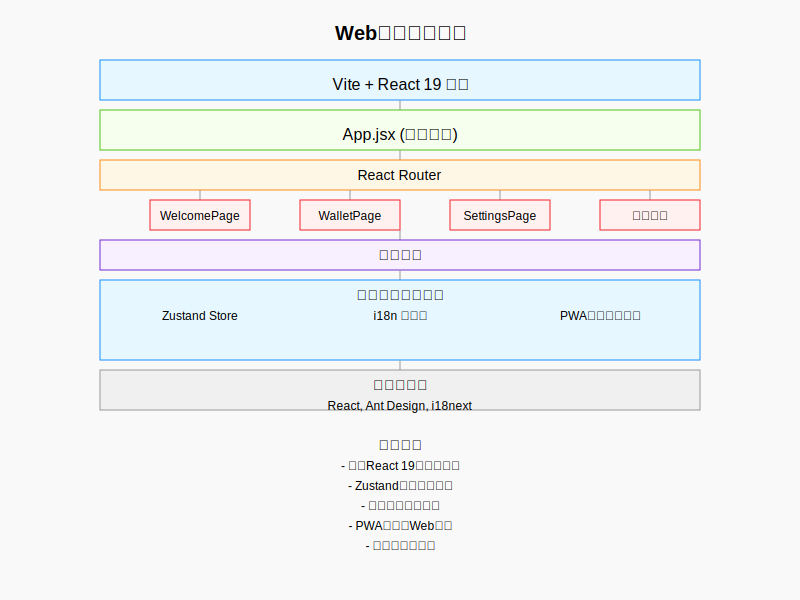

# Simple Crypto GUI

## 一、提交物清单 (Deliverables)

- [x] GitHub 仓库（公开或临时私有）：包含完整代码与本 README
      GitHub Repository (Public or temporarily private): Contains complete code and this README
- [x] Demo 视频（≤ 3 分钟，中文）：展示核心功能与流程
      Demo Video (≤ 3 minutes, in Chinese): Demonstrating core features and workflow
- [x] 在线演示链接（如有）：前端 Demo 或后端 API 文档
      Online Demo Link (if available): Frontend Demo or Backend API documentation
- [x] 合约部署信息（如有）：网络、地址、验证链接、最小复现脚本
      Contract Deployment Information (if available): Network, address, verification link, minimal reproduction script
- [ ] 可选材料：Pitch Deck（不计入评分权重）
      Optional Materials: Pitch Deck (not counted in scoring)

## 二、参赛队伍填写区 (Fill-in Template)

### 1) 项目概述 (Overview)

- **项目名称**：Simple Crypto GUI
  **Project Name**: Simple Crypto GUI

- **一句话介绍**：
  本应用让被复杂操作门槛挡在门外的没有任何技术背景的普通人，不用经历繁琐操就能轻松分享加密货币的发展红利，真正实现技术的普惠价值
  **One-sentence Introduction**:
  This application enables ordinary people without any technical background who are deterred by complex operational barriers to easily share in the development benefits of cryptocurrency without going through cumbersome operations, truly realizing the inclusive value of technology.

- **目标用户**：
  大多数没有任何技术背景但对加密货币感兴趣的普通人
  **Target Users**:
  Most ordinary people without any technical background but interested in cryptocurrency

- **核心问题与动机（Pain Points）**：
  当今Web3发展的最大问题是，很多普通用户对加密货币的发展很感兴趣，但没有任何技术背景和加密货币的知识，使用加密货币的技术门槛过高，对于普通人不具备可操作性。导致大量的普通人无法分享加密货币的发展红利。
  **Core Issues and Motivation (Pain Points)**:
  The biggest problem in today's Web3 development is that many ordinary users are interested in the development of cryptocurrency, but lack any technical background and knowledge about cryptocurrency. The technical threshold for using cryptocurrency is too high to be operable for ordinary people, resulting in a large number of ordinary people being unable to share in the development benefits of cryptocurrency.

- **解决方案（Solution）**：
  本应用整合多项前沿IT技术，大幅降低了普通用户使用加密货币的技术门槛，让更多人能轻松享加密货币的发展红利。普通人进入Web3的成本，从原来动辄几十分钟的连续复杂操作，直接压缩到几秒内即可轻松完成。
  **Solution**:
  This application integrates multiple cutting-edge IT technologies, significantly lowering the technical threshold for ordinary users to use cryptocurrency, allowing more people to easily enjoy the development benefits of cryptocurrency. The cost for ordinary people to enter Web3 has been compressed from dozens of minutes of continuous complex operations to a few seconds of easy completion.

### 2) 架构与实现 (Architecture & Implementation)

- **总览图（可贴图/链接）**：系统架构图
  **Overview Diagram (can post image/link)**：System Architecture Diagram
  

- **关键模块**：
  前端：WalletPage, SettingsPage, PWAUtils, ethUtils 等
  合约：Solidity 智能合约
  **Key Modules**:
  Frontend: WalletPage, SettingsPage, PWAUtils, ethUtils, etc.
  Contracts: Solidity smart contracts

- **依赖与技术栈**：
  前端：React, React Router, Vite, Ant Design, viem
  合约：Solidity
  部署：CloudFlare Arbitrum Sepolia 测试网
  **Dependencies and Technology Stack**:
  Frontend: React, React Router, Vite, Ant Design, viem
  Contracts: Solidity
  Deployment: CloudFlare Arbitrum Sepolia Testnet

### 3) 合约与部署 (Contracts & Deployment)

- **网络**：Arbitrum Sepolia 测试网
  **Network**: Arbitrum Sepolia Testnet

- **核心合约与地址**：
  ```
  Circle USDC Paymaster: 0x3BA9A96eE3eFf3A69E2B18886AcF52027EFF8966
  ```
  **Core Contracts and Addresses**:
  ```
  Circle USDC Paymaster: 0x3BA9A96eE3eFf3A69E2B18886AcF52027EFF8966
  ```

- **验证链接（Etherscan/BlockScout）**：[验证链接]
  **Verification Link (Etherscan/BlockScout)**: [Verification Link]

- **最小复现脚本**：
  **Minimal Reproduction Script**:


### 4) 运行与复现 (Run & Reproduce)

- **前置要求**：Node 18+, npm, Git
  **Prerequisites**: Node 18+, npm, Git

- **环境变量样例**：
  **Environment Variable Example**:

- **一键启动（本地示例）**：
  **One-click Startup (Local Example)**:

```bash
# 安装依赖
npm install

# 启动前端
npm run dev

# 打开 http://localhost:5173
```

```bash
# Install dependencies
npm install

# Start frontend
npm run dev

# Open http://localhost:5173
```

- **在线 Demo**：https://web3wallet.cc
  **Online Demo**: https://web3wallet.cc

- **账号与测试说明**：无需账号，完全匿名，完全去中心化
  **Account and Testing Instructions**: No account required, completely anonymous, fully decentralized

### 5) Demo 与关键用例 (Demo & Key Flows)

- **视频链接**：https://www.bilibili.com/video/BV1cwsuzgEgZ/
  **Video Link**: https://www.bilibili.com/video/BV1cwsuzgEgZ/

- **PPT 链接**：https://docs.qq.com/slide/DQ05La050UmxRamFh
  **PPT Link**: https://docs.qq.com/slide/DQ05La050UmxRamFh

- **关键用例步骤**：
  - 用例 1：用户直接打开网页即可访问不同区块链网络
  - 用例 2：用户可以通过Paymaster合约实现无Gas费转账
  - 用例 3：用户可以通过PWA技术将网页安装成桌面应用，即使网站下线仍可正常使用去中心化网络提供的所有功能
  **Key Use Case Steps**:
  - Use Case 1: Users can directly access different blockchain networks by opening the web page
  - Use Case 2: Users can implement gas-free transfers through Paymaster contracts
  - Use Case 3: Users can install the web page as a desktop application through PWA technology and still use all functions provided by the decentralized network normally even if the website is offline

### 6) 可验证边界 (Verifiable Scope)

- **可验证模块**：全部模块均可复现/验证
  **Verifiable Modules**: All modules can be reproduced/verified

- **未公开模块及原因**：无
  **Unpublished Modules and Reasons**: None

### 7) 路线图与影响 (Roadmap & Impact)

- **赛后 1-3 周**：增加更多功能，如交易记录查询、合约交互等。
  **1-3 Weeks After the Competition**: Add more features, such as transaction record query, contract interaction, etc.

- **赛后 1-3 个月**：逐渐让更多用户体验使用本应用，进一步挖掘用户痛点，针对性完善
  **1-3 Months After the Competition**: Gradually let more users experience using this application, further explore user pain points, and improve accordingly

- **预期对以太坊生态的价值**：大量普通人也可以享受到加密货币的发展红利，实现技术的普惠价值。极大地提高了使用便利性。
  **Expected Value to the Ethereum Ecosystem**: A large number of ordinary people can also enjoy the development benefits of cryptocurrency, realizing the inclusive value of technology. Greatly improving the convenience of use.

### 8) 团队与联系 (Team & Contacts)

- **团队名**：Simple Crypto GUI
  **Team Name**: Simple Crypto GUI

- **成员与分工**：
  - 奇想天外 - 队长 - 整体开发
  **Members and Responsibilities**:
  - Qixiang Tianwai - Team Leader - Overall Development

- **联系方式**：1093449248@qq.com
  **Contact Information**: 1093449248@qq.com

- **可演示时段**：根据需求安排
  **Available Demo Time**: Arranged according to requirements

## 三、快速自检清单 (Submission Checklist)

- [x] README 按模板填写完整（概述、架构、复现、Demo、边界）
      README filled out completely according to the template (Overview, Architecture, Reproduction, Demo, Scope)
- [x] 本地可一键运行，关键用例可复现
      Local one-click run, key use cases can be reproduced
- [x] 测试网合约地址与验证链接已提供
      Testnet contract addresses and verification links provided
- [x] Demo 视频链接可访问
      Demo video link accessible
- [x] 如未完全开源，已在"可验证边界"清晰说明
      If not fully open source, clearly explained in "Verifiable Scope"
- [x] 联系方式与可演示时段已填写
      Contact information and available demo time filled out
