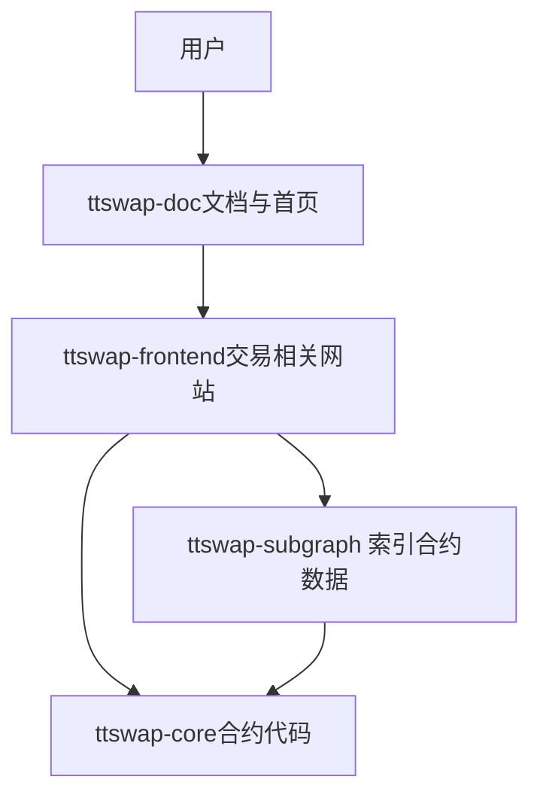
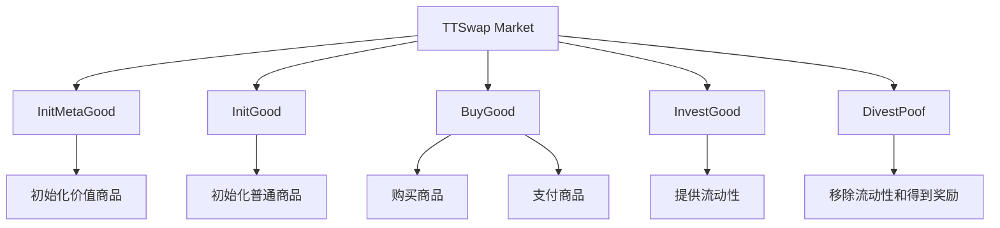
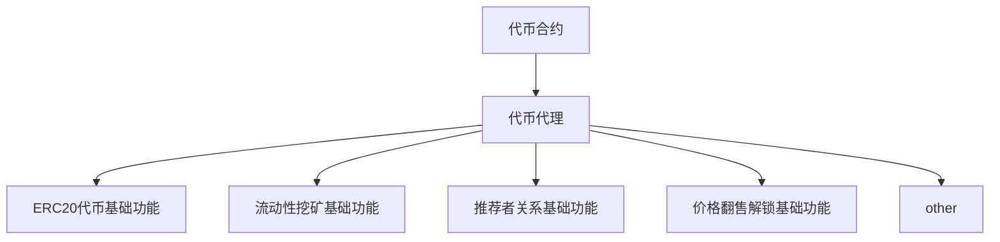

# ETHShanghai 2025 参赛选手操作流程指南
## 项目概述（名称、介绍、目标用户、问题与解决方案）

## 架构与实现（总览图、关键模块、技术栈）
### 总览图

### ttswap-core合约框架
#### 市场合约架构

#### 代币合约与代理合约架构

### 技术栈
前端:文档使用docu 和交易功能使用react
后端:subgraph索引数据
智能合约使用:foundry开发
## 合约与部署信息（网络、地址、验证链接）
### 官方网站
[ttswap.io](https://ttswap.io)
内部涵盖 可以切换语言查看白皮书,代币经济用户文档等相关文档

### MainNet:
WebSite:[app.ttswap.io](https://app.ttswap.io)
TTSwap Market: 0x29d57620E7aF733c43679818226e62Ae0F49db5b
TTSwap Token Proxy: 0x68069E8e051B79a6b4B40721823854E95a0C420E
TTSwap Token: 0x5274edaf131503fb6f4624194818a38a3add8b04
Subgraph Explorer: [subgraph](https://api.studio.thegraph.com/query/1685388/ttswap-ethereum/version/latest)

### TestNet:
WebSite:[app.ttswap.io,登录后切换测试网后可以领取测试代币和水](https://app.ttswap.io)
TTSwap Market: 0x5f06f5eCd628dbF79683e1e6fa8acdde8FA8C238
TTSwap Token Proxy: 0xA67d1648A061E2880c24a07C2F11b6316C0400bF
TTSwap Token: 0x107EE46c3063ab4291B1d85b07B5e7DAcAf729E0
Subgraph Explorer:[subgraph地址](https://thegraph.com/studio/subgraph/ttswap/endpoints/)

## 运行与复现说明（环境要求、启动命令）

## 团队与联系信息
leo:[bussiness@ttswap.io](bussiness@ttswap.io)
alberta:[bd@ttswap.io](bd@ttswap.io)
ray:[support@ttswap.io](support@ttswap.io)
bob:[bob@ttswap.io](bob@ttswap.io)