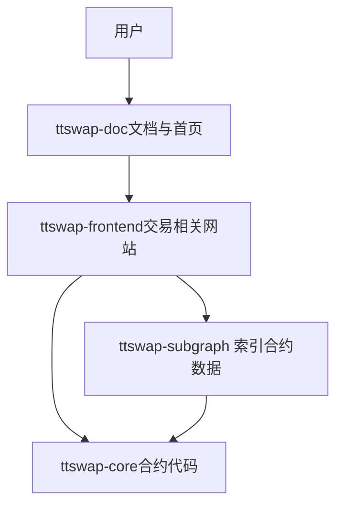
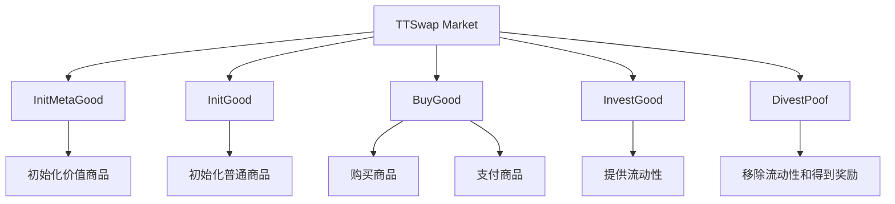
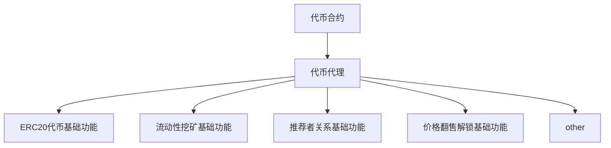

# ETHShanghai 2025 参赛选手操作流程指南
## 项目概述（名称、介绍、目标用户、问题与解决方案）
### 项目名称  
TTSWAP(Token to Token Decentralization Exchange)
### 项目介绍
TTSWAP(token-token swap)是建立在支持EVM的区块链上的自动做市协议，意味着它不依赖于中心化的机构或个人来进行交易。它的核心原理是根据用户的行为，自动触发市场价值的转移，形成新的价格，从而构建了一个基于恒定价值交易的自动做市协议。  

项目有如下特点:

1. 恒定价值交易协议  
  这个协议的核心思想是确保交易的价值在整个过程中保持恒定，这意味着无论交易何时进行，都能客观地反映出币种的市场价值，这可让Token自由、简单、快速地交易。

1. 集中流动性，直接交易  
无需在多个传统币对中添加，只需要给协议中代币添加流动性，流动性能与协议中其它任何代币共享，用户直接兑换代币，避免流动性碎片化，提升了交易体验。

1. 流动性放大  
  根据代币稳定性,动态设置流动放大倍数,用户使用提供一份流动性,实际产生多倍流动性的效果,获得多倍收益。

1. 低滑点交易  
  滑点是指在交易过程中由于市场价格波动导致的交易价格偏离预期的现象。在这个协议中，通过流动性增强和集中流动性,显著降低交易滑点。

1. 没有无常损失  
  无常损失是指流动性提供者在提供流动性时因市场波动而遭受的损失。这个交易协议通过其设计逻辑上避免了无常损失的问题，这意味着流动性提供者或者Token投资者在撤资时可以保持原有投资的价值，并且还能获得提供流动性所产生的收益。

1. 低Gas费用  
  Gas费用是在以太坊网络上执行智能合约时需要支付的费用。由于这个交易协议的逻辑相对简单且运算量较少，因此Gas消耗较低，用户在交易过程中可以节省大量的Gas费用，让交易更加经济高效。相比于其他交易协议，可以节省50%至90%的Gas费用。

1. 手续费按角色分配  
  在协议上，手续费根据参与者的不同角色进行分配，这包括商家(Token卖家)、Token投资者（流动性提供者）、门户、推荐者和普通用户。任何人都有机会参与到协议的运作中，并分享协议发展所带来的收益，从而激励更多的用户参与到协议建设中。

1. native ETH支持  
  协议中支持Native ETH直接兑换成任何代币。

1. 投资证明二次TTS挖矿  
  当用户投资了Token后，协议会根据投资价值自动为用户进行挖矿。

1. 价格导向型代币经济模型  
  TTS代币采用创新的价格导向型解锁模型，通过价格翻倍解锁机制和社区盈利销毁，确保代币价值与项目发展紧密绑定。同时，通过差异化的解锁规则，激励不同角色为生态做出贡献，实现多方共赢。  
### 目标用户  
希望在web3得到长期收益的用户  
### 问题与解决方案  

## 架构与实现（总览图、关键模块、技术栈）
### 总览图

### ttswap-frondend前羰框架
### ttswap-subgraph框架
### ttswap-core合约框架
#### 市场合约架构

#### 代币合约与代理合约架构

### 技术栈
前端:文档使用docu 和交易功能使用react
后端:subgraph索引数据  
智能合约使用:foundry开发  
## 合约与部署信息（网络、地址、验证链接）
### 官方网站
[ttswap.io](https://ttswap.io)  
内部涵盖 可以切换语言查看白皮书,代币经济用户文档等相关文档  

### ethernum mainnet:  
WebSite:[app.ttswap.io](https://app.ttswap.io)  
TTSwap Market: 0x29d57620E7aF733c43679818226e62Ae0F49db5b  
TTSwap Token Proxy: 0x68069E8e051B79a6b4B40721823854E95a0C420E  
TTSwap Token: 0x5274edaf131503fb6f4624194818a38a3add8b04  
Subgraph Explorer: [subgraph](https://api.studio.thegraph.com/query/1685388/ttswap-ethereum/version/latest)  

### ethernum testnet hoodi:
WebSite:[app.ttswap.io,登录后切换hoodi测试网后可以领取测试代币和水](https://app.ttswap.io)  
TTSwap Market: 0x5f06f5eCd628dbF79683e1e6fa8acdde8FA8C238  
TTSwap Token Proxy: 0xA67d1648A061E2880c24a07C2F11b6316C0400bF  
TTSwap Token: 0x107EE46c3063ab4291B1d85b07B5e7DAcAf729E0  
Subgraph Explorer:[subgraph地址](https://thegraph.com/studio/subgraph/ttswap/endpoints/)  

## 运行与复现说明（环境要求、启动命令）

## 团队与联系信息
leo:[leo@ttswap.io](leo@ttswap.io)  
alberta:[alberta@ttswap.io](alberta@ttswap.io)  
ray:[ray@ttswap.io](ray@ttswap.io)  
bob:[bob@ttswap.io](bob@ttswap.io)      