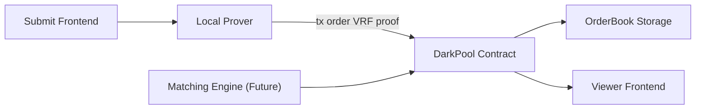

## Dark Pool Evolved: VRF using EIP 2537 (Precompile for BLS12-381)

### 1) 项目概述 (Overview)

* **项目名称**：Dark Pool Evolved: VRF using EIP 2537 (Precompile for BLS12-381)
* **一句话介绍**：基于 EIP-2537 原生 VRF 的去中心化暗池撮合协议，实现链上可验证随机排序，消除 MEV 干扰。
* **目标用户**：去中心化交易平台开发者、DeFi 基础设施研究者、以及希望构建隐私撮合系统的项目方。
* **核心问题与动机（Pain Points）**：

  * 传统 DEX 暗池虽能隐藏交易细节，但**交易顺序仍公开、易受 MEV 攻击**；
  * 当前链上缺乏**无需预言机的随机机制**，导致撮合无法做到真正公平；
  * 外部 VRF引入信任与延迟问题，不适合高频撮合场景。
  * 链上模拟**map-to-curve** 实现 VRF 的 gas 消耗非常大，不现实。
  * SNARK电路中模拟**map-to-curve**的计算，证明约束量大，不适合用户浏览器。
* **解决方案（Solution）**：

  * 借助 **EIP-2537（Prague 升级）** 的链上 precompile，利用 **map-to-curve** 实现 VRF；
  * 引入 **epoch-based 随机排序机制**：

    * 不同 epoch 间按时间优先；
    * 同一 epoch 内通过 **VRF** 计算随机顺序；
  * 构建 **无需 Oracle 的链上随机性**，实现可验证、公平的暗池撮合流程。

### 2) 架构与实现 (Architecture & Implementation)

* **总览图（可贴图/链接）**：


* **关键模块**：

  * 前端：React + Tailwind + Ethers.js，用于提交/展示订单与 epoch 状态
  * 合约：Solidity 智能合约（EIP-2537 调用 + VRF 验证 + 排序逻辑）

* **核心逻辑**:


详细查看[vrf.pdf](./vrf_research/docs/vrf.pdf)

参考文献：
- Burdges, Jeffrey, Oana Ciobotaru, Handan Kılınç Alper, Alistair Stewart, and Sergey Vasilyev. “Ring Verifiable Random Functions and Zero-Knowledge Continuations,” 2023. Cryptology ePrint Archive. https://eprint.iacr.org/2023/002.
- DeepSafe: A Cryptography Random Verification Layer. https://github.com/deepsafe/whitepaper/blob/main/DeepSafe_A_Cryptography_Random_Verification_Layer.pdf


### 3) 合约与部署 (Contracts & Deployment)

* **网络**：Sepolia 测试网
* **核心合约与地址**：

  ```text
  DarkPoolVRF: 0x...
  EpochManager: 0x...
  ```
* **验证链接（Etherscan/BlockScout）**：[部署后补充]
* **最小复现脚本**：

  ```bash
  forge script script/Deploy.s.sol --rpc-url $SEPOLIA_RPC_URL --broadcast
  forge test
  ```

### 4) 运行与复现 (Run & Reproduce)

* **前置要求**：Node 22+, npm, Git

* **环境变量样例**：

```bash
# frontend/.env.local
NEXT_PUBLIC_RPC_URL=https://sepolia.infura.io/v3/YOUR_KEY
NEXT_PUBLIC_CONTRACT_ADDRESS=0x...

# backend/.env
RPC_URL=https://sepolia.infura.io/v3/YOUR_KEY
PRIVATE_KEY=0x...
PORT=3001
```

* **一键启动（本地示例）**：

```bash
npm install
npm run dev
# 打开 http://localhost:3000
```

### 5) Demo 与关键用例 (Demo & Key Flows)

* **视频链接（≤3 分钟，中文）**： https://www.editool.cn/vrf.mp4
* **关键用例步骤**：

* **Use Case: Order Submission & Verification Display**

  * 用户 A 在前端提交订单，并在本地生成 VRF 证明。
  * 智能合约接收订单与证明，调用 EIP-2537 进行链上验证。
  * 验证通过后，订单被写入链上 Order Book。
  * 用户 B 打开前端，可实时看到新订单及其「VRF 已验证」状态。

### 6) 可验证边界 (Verifiable Scope)

* **可复现模块**：

  * Solidity 合约（VRF 验证）
  * 前端与后端交互逻辑

### 7) 路线图与影响 (Roadmap & Impact)

* **长期价值**：

  * 展示了EIP-2537的潜力，对于广泛应用该EIP，有积极意义。
  * 推动以太坊上 **原生随机性 DeFi 机制**；
  * 减少 MEV 干扰，构建更公平的链上市场；
  * 为隐私交易与 Layer2 DEX 提供基础组件。

### 8) 团队与联系 (Team & Contacts)

* **团队名**：VRF using EIP-2537
* **成员与分工**：

  * @wizicer — 架构设计 & 智能合约
  * @wenjin1997 — 密码学 & 智能合约
  * @JackLo111 — UI
  * Yuan — UI & 智能合约
* **联系方式**：@wizicer
* **可演示时段**：UTC+8 时区，工作日全天可协调