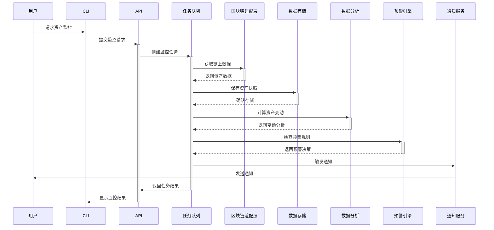
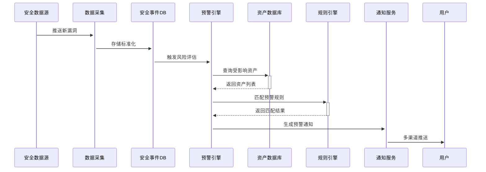
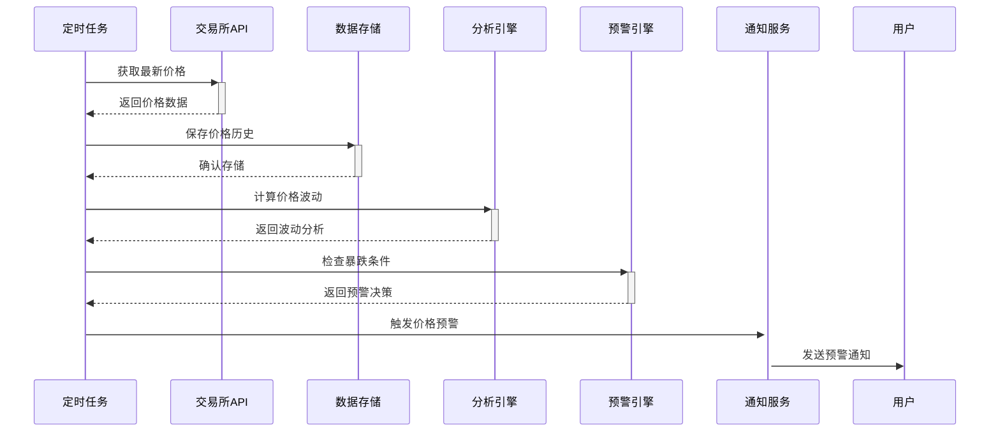

# w3hub 系统架构设计

## 1. 分层架构

### 1.1 用户界面层
- **命令行界面(CLI)**：提供基础交互功能
- **Web界面(规划)**：提供可视化操作界面

### 1.2 API服务层
- **REST API**：处理业务逻辑请求
- **WebSocket**：实时推送资产变动和安全事件

### 1.3 核心功能层
- **资产管理模块**：
  - 多链资产统一视图
  - 资产变动历史记录
  - 资产收益统计分析
  
- **安全监控模块**：
  - 交易行为分析
  - 合约安全审计
  - 漏洞数据库集成
  
- **预警通知模块**：
  - 邮件通知服务
  - Telegram机器人集成
  - 自定义预警规则引擎
  
- **数据分析模块**：
  - 价格波动分析
  - 资产流动性分析
  - 风险评估模型

### 1.4 区块链适配层
- **多链统一接口**：抽象通用区块链操作
- **各链专用适配器**：实现特定链的交互逻辑

### 1.5 数据存储层
- **SQLite**：存储用户配置和资产数据
- **Redis**：缓存高频访问数据
- **安全事件数据库**：存储漏洞和威胁情报

## 2. 核心模块交互流程

### 2.1 资产监控流程


### 2.2 安全预警流程


### 2.3 价格监控流程


## 3. 数据存储方案

### 3.1 数据库设计

#### 资产数据表
```sql
CREATE TABLE assets (
    id INTEGER PRIMARY KEY,
    chain_type TEXT NOT NULL,  -- 区块链类型
    address TEXT NOT NULL,     -- 钱包地址
    balance REAL NOT NULL,     -- 当前余额
    token_type TEXT,           -- 代币类型
    last_updated TIMESTAMP,    -- 最后更新时间
    UNIQUE(chain_type, address, token_type)
);

CREATE TABLE asset_history (
    id INTEGER PRIMARY KEY,
    asset_id INTEGER REFERENCES assets(id),
    balance REAL NOT NULL,
    timestamp TIMESTAMP DEFAULT CURRENT_TIMESTAMP
);
```

#### 安全事件表
```sql
CREATE TABLE security_events (
    id INTEGER PRIMARY KEY,
    event_type TEXT NOT NULL,   -- 漏洞/钓鱼/攻击等
    severity INTEGER,           -- 严重等级
    description TEXT,           -- 事件描述
    affected_chains TEXT,       -- 影响链类型
    reference_url TEXT,         -- 参考链接
    published_at TIMESTAMP      -- 发布时间
);

CREATE TABLE user_alerts (
    id INTEGER PRIMARY KEY,
    user_id INTEGER NOT NULL,
    event_id INTEGER REFERENCES security_events(id),
    notified BOOLEAN DEFAULT FALSE,
    notified_at TIMESTAMP
);
```

### 3.2 缓存设计
- **Redis数据结构**：
  - 资产最新状态：HSET asset:{chain}:{address} field value
  - 价格数据：ZSET price:{symbol} timestamp value
  - 预警规则缓存：STRING alert_rules:{user_id}

### 3.3 数据同步策略
1. **链上数据同步**：
   - 定时轮询 + 事件监听双机制
   - 失败重试策略：指数退避算法

2. **安全事件同步**：
   - 基于Webhook的实时推送
   - 每小时全量校验

3. **价格数据同步**：
   - 每5分钟从交易所API获取
   - 异常波动时自动提高频率

### 3.4 关键技术选型

| 组件 | 技术方案 | 说明 |
|------|----------|------|
| 开发语言 | Go 1.25+ | 高性能系统级语言 |
| 区块链交互 | go-ethereum等 | 各链官方SDK |
| 主数据库 | SQLite | 轻量级本地存储 |
| 缓存系统 | Redis | 高频数据缓存 |
| 消息队列 | NSQ | 内部事件处理 |
| API服务 | Gin框架 | 高性能HTTP服务 |
| 配置管理 | Viper | 灵活配置加载 |
| 任务调度 | Cron | 定时任务管理 |