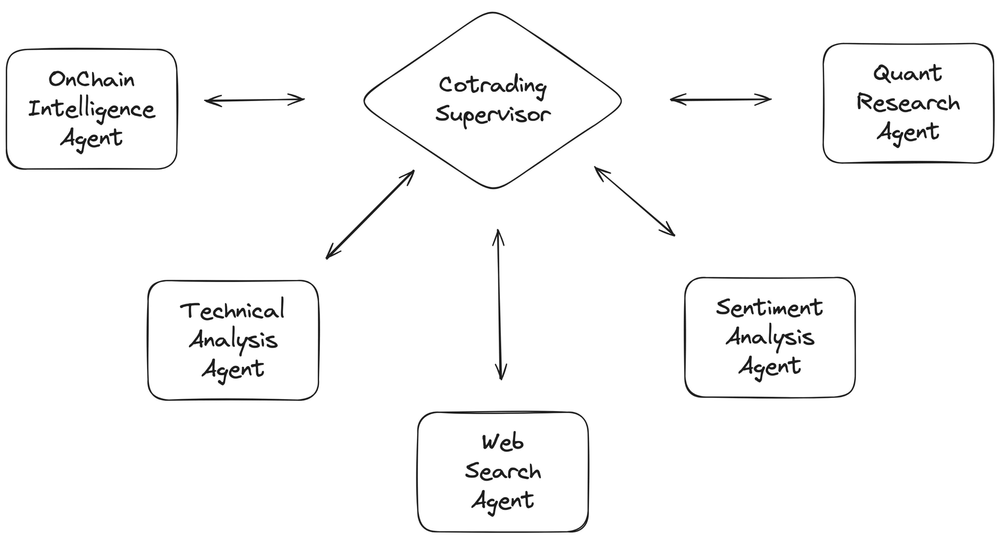

# CoTrading

## 项目概述与目标

Your AI Copilot for Smarter Crypto Trading

# 一句话说明
> 少聊天，多交易。CoTrading 用**画布**将智能无缝嵌入你的交易流程中，是既懂市场又懂你的交易员智能助手。

## 目标用户
- 专业/半专业加密交易员（手动或半自动执行）
- Crypto/Web3 行业学习者/研究者
- 需要输出可追溯观点与洞见的投研/社区运营者

## 核心问题与动机（Pain Points）
- 工具割裂与频繁上下文切换（终端、数据面板、脚本、笔记）
- 数据分散与时效不一（CEX/DEX/链上/新闻事件/舆情分析）难以对齐、解释与决策
- 策略从构想到执行路径长、复用差，回测与跟踪成本高
- 决策过程不可追溯，难以形成可复用的方法论沉淀

## 解决方案（Solution）
- 多智能体 SubAgents（链上/情绪/量化/技术/风险）协同生成多视角、可执行洞见
- 交易原生 UX：交互式 K 线、仪表盘与分析画布嵌入工作流，减少摩擦
- 个性化学习：基于偏好与历史交互输出定制化策略/提示，持续自适应
- 实时且可解释：关键因子、假设与置信度可追溯，支持复盘与审计
- 自动化接口：连接交易所与钱包，支持半自动执行与风控守护
- 协作与沉淀：将研究—回测—执行—复盘全链路串联

## 集成与数据源
- 钱包与链：MetaMask、Rainbow、OKX Wallet（通过 RainbowKit + wagmi）
- DEX/链上：Dune + Subgraph
- CEX：Binance
- 市场与情绪：CoinGecko + Nansen + Twitter 
- 执行接口：0xSwap




## 系统架构（草图）
```
            用户
             |
     交互界面 / 工作流
             |
      REST + SSE API
             |
   多智能体编排（Orchestrator）
     |       |        |        |        |
  On-chain  Sentiment Quant  Technical  Risk   <- SubAgents
     |         |        |        |        |
  DEX/链上   社媒/新闻   回测/特征  指标/形态   敞口/限额
     |         |                               
  viem/子图   数据网关                         风控策略
             |
    数据与状态存储
  (Postgres / Redis)
             |
      执行适配层
   CEX API / 钱包签名(viem)
```

## 技术栈与依赖说明
- 框架与语言：Next.js 15（App Router）、React 19 RC、TypeScript
- UI/状态：Tailwind CSS、Radix UI、TanStack Query
- 数据与鉴权：Drizzle ORM + Postgres、NextAuth、Redis（可选）
- Web3：wagmi、viem、RainbowKit
- 工具与质量：ESLint、Biome、Playwright E2E、@vercel/*（Analytics/Postgres/Blob 等）

## 部署与使用指南
环境要求：Node 18+、pnpm 9.x

本地开发
- 安装依赖：`pnpm i`
- 配置环境变量：创建 `.env.local`（示例见下）
- 初始化数据库：`pnpm db:migrate`
- 启动开发：`pnpm dev`（默认 http://localhost:3000）
- 测试与质量：`pnpm test`、`pnpm lint`、`pnpm format`

构建与部署
- 构建：`pnpm build`（先运行 DB 迁移再构建）
- 生产启动：`pnpm start`
- 部署建议：Vercel；或自托管 Node 环境，确保数据库与环境变量可用

数据库与工具（可选）
- 生成/迁移/可视化：`pnpm db:generate`、`pnpm db:migrate`、`pnpm db:studio`

## 环境变量示例
- `NEXT_PUBLIC_BACKEND_URL`（可选；不设时本地默认 `http://localhost:8000`）
- `DATABASE_URL`（Postgres 连接串）
- `NEXTAUTH_URL`、`NEXTAUTH_SECRET`
- `REDIS_URL`（可选）

## OpenAPI 客户端（可选）
- 生成：`pnpm openapi:client`（默认 predev/prebuild 跳过；在仓库根也可执行 `make -C .. codegen-frontend-client`）
