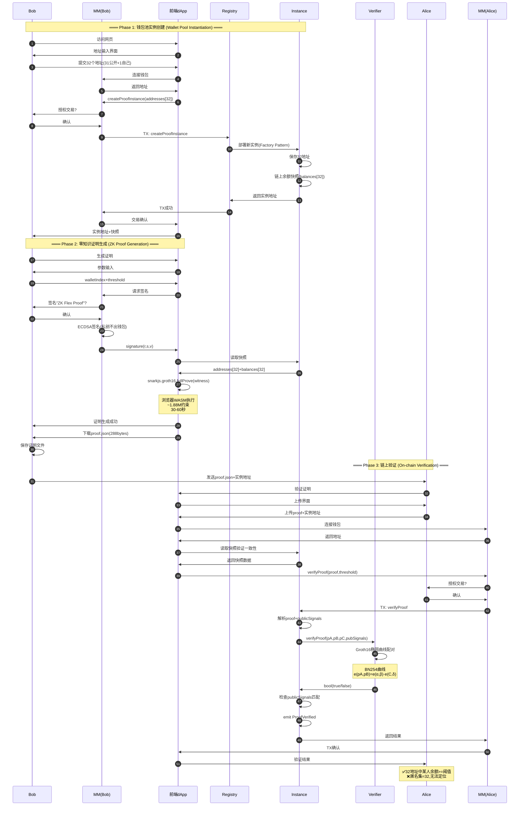
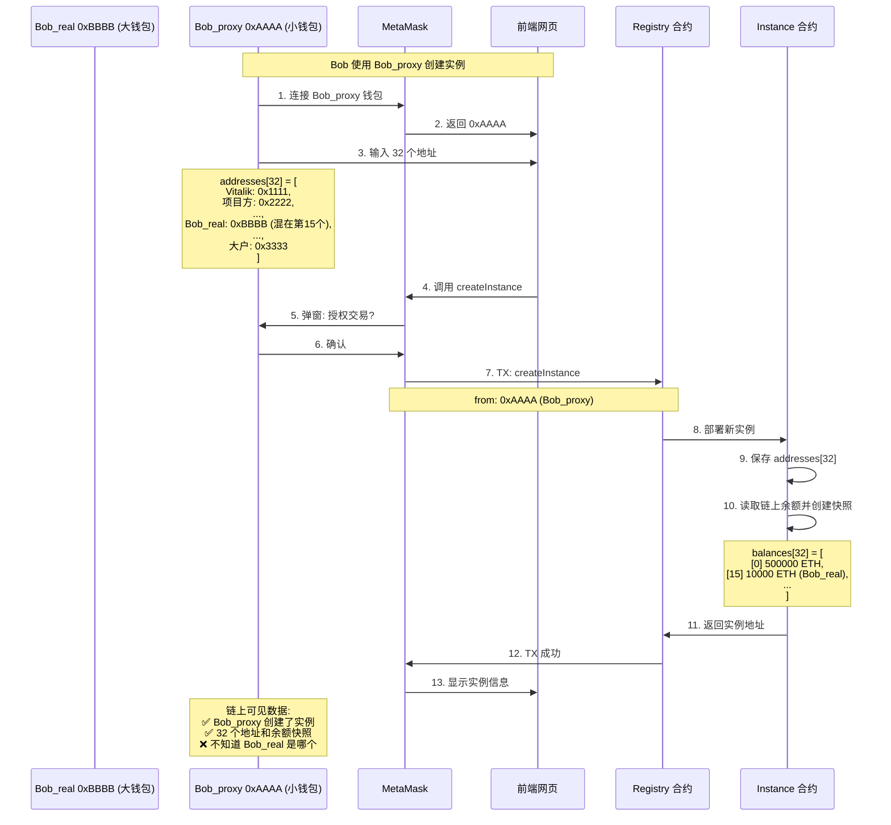
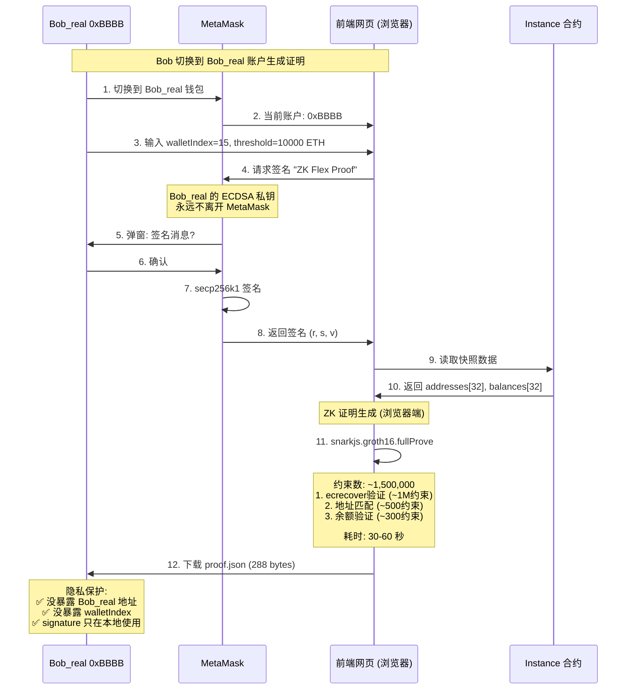
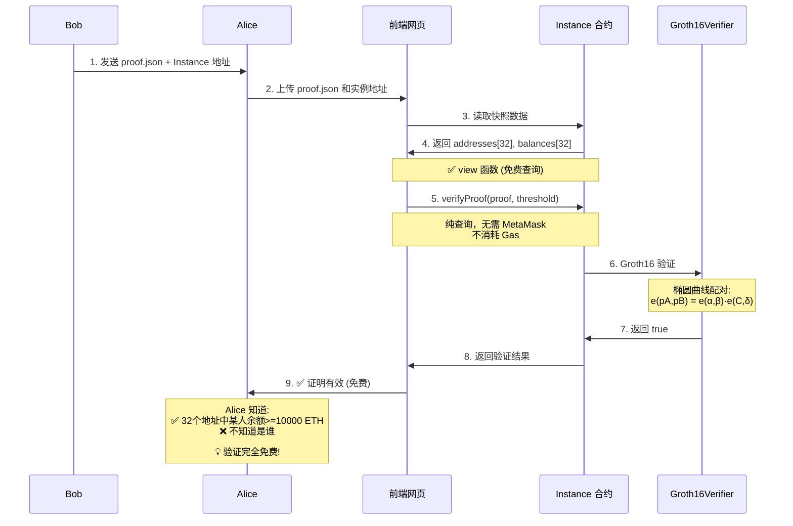

# ZK Flex - Product Specification

## 项目概述

ZK Flex 是一个基于零知识证明的链上隐私验资协议。允许用户证明自己拥有超过特定金额的资产，而不暴露具体钱包地址。

**核心价值**: 在 Web3 透明性与隐私需求之间找到平衡点。

## 🚀 立即开始（已有 WSL + Foundry）

```bash
# 在 WSL 终端中运行
cd ~
mkdir -p projects && cd projects
npx create-eth@latest
# 选择: zk-flex, foundry
cd zk-flex
yarn install
mkdir circuits

# 启动开发环境（开 3 个终端）
yarn chain   # Terminal 1
yarn deploy  # Terminal 2
yarn start   # Terminal 3

# 访问 http://localhost:3000
```

## 快速开始

### WSL 环境配置（Windows 用户必读）

**⚠️ Windows 用户必读**：Foundry 在 Windows 上需要通过 **WSL 2** 运行，直接在 PowerShell 中无法使用。

#### 如果已有 WSL 和 Foundry

跳过此节，直接到 [初始化项目](#初始化项目在-wsl-中)

#### 如果需要配置 WSL 环境

```bash
# === 在 PowerShell (管理员模式) 中 ===

# 1. 安装 WSL 2
wsl --install

# 2. 重启电脑

# 3. 打开 Ubuntu (开始菜单搜索)
# 首次启动会要求设置用户名和密码

# === 以下在 WSL (Ubuntu) 中操作 ===

# 4. 更新系统
sudo apt update && sudo apt upgrade -y

# 5. 安装 Node.js (使用 nvm 推荐)
curl -o- https://raw.githubusercontent.com/nvm-sh/nvm/v0.39.0/install.sh | bash
source ~/.bashrc
nvm install 20
nvm use 20

# 6. 安装 Yarn
npm install -g yarn

# 7. 安装 Foundry
curl -L https://foundry.paradigm.xyz | bash
source ~/.bashrc
foundryup

# 8. 验证安装
node --version    # v20.x.x
yarn --version    # 1.22.x
forge --version   # forge 0.x.x

# 9. 安装 Circom (可选，Phase 1 时再装)
# curl --proto '=https' --tlsv1.2 https://sh.rustup.rs -sSf | sh
# source ~/.bashrc
# git clone https://github.com/iden3/circom.git
# cd circom
# cargo build --release
# cargo install --path circom
```

### 环境要求

**⚠️ Windows 用户必读**：Foundry 在 Windows 上需要通过 **WSL 2** 运行，直接在 PowerShell 中无法使用。

#### WSL 2 环境（Windows 用户）

- **WSL 2** (Ubuntu 推荐)
- Node.js >= v20.18.3
- Yarn v1 或 v2+
- Git
- Foundry (foundryup)
- Circom 2.x

#### 原生环境（macOS/Linux 用户）

- Node.js >= v20.18.3
- Yarn v1 或 v2+
- Git
- Foundry (foundryup)
- Circom 2.x

### 初始化项目（在 WSL 中）

```bash
# 1. 打开 WSL 终端
# Windows: 开始菜单搜索 "Ubuntu" 或运行 "wsl"

# 2. 验证环境
node --version   # 应该 >= 20.18.3
yarn --version   # 应该 >= 1.0.0
forge --version  # 应该显示 foundry 版本

# 3. 创建项目目录（建议在 WSL 文件系统中，性能更好）
cd ~
mkdir projects
cd projects

# 4. 创建 Scaffold-ETH 2 项目
npx create-eth@latest
# ✔ Your project name: zk-flex
# ✔ What solidity framework do you want to use? → foundry

cd zk-flex

# 5. 安装依赖
yarn install

# 6. 创建电路目录
mkdir circuits
```

### 在 VS Code 中打开项目

```bash
# 在 WSL 中安装 VS Code 扩展（一次性设置）
# 1. 在 Windows 上安装 VS Code
# 2. 安装扩展: Remote - WSL

# 在 WSL 中打开项目
code .
# 这会自动在 VS Code 中打开，并连接到 WSL 环境
```

### 本地开发快速验证

```bash
# 在 WSL 中打开 3 个终端（VS Code 内置终端或 Windows Terminal）

# Terminal 1: 启动本地链
yarn chain

# Terminal 2: 部署合约（新终端）
yarn deploy

# Terminal 3: 启动前端（新终端）
yarn start
```

访问 http://localhost:3000 查看应用。

### 文件访问说明

**WSL 路径与 Windows 路径映射**：
- WSL 中: `~/projects/zk-flex`
- Windows 资源管理器: `\\wsl$\Ubuntu\home\<用户名>\projects\zk-flex`
- 或在 WSL 终端运行: `explorer.exe .` 打开当前目录

## 核心功能

### MVP 范围

1. **钱包池注册**: Bob 创建包含 32 个地址的钱包池（31 个公开地址 + 自己的地址）
2. **余额快照**: 实例创建时自动快照，可手动更新
3. **证明生成**: Bob 使用 MetaMask 签名 + 浏览器端生成 ZK 证明（证明拥有池中某地址且余额 >= 阈值）
4. **证明验证**: Alice 通过前端调用链上合约验证，无法得知具体地址

### 不在 MVP 范围

- 动态余额实时验证
- 多快照队列
- 跨链支持
- NFT/ERC20 资产
- 链下历史数据查询（Alchemy 等）

## 技术架构

### 系统组件

```
1. Smart Contracts (packages/foundry/)
   contracts/
   - WealthProofRegistry.sol      主注册合约
   - WealthProofInstance.sol      实例合约（工厂创建）
   - Groth16Verifier.sol          ZK 验证器（circom 生成）
   
   script/
   - Deploy.s.sol                 部署脚本
   
   test/
   - WealthProofRegistry.t.sol    合约测试

2. ZK Circuit (circuits/)
   - wealth_proof.circom          核心电路逻辑
   - 生成的文件会复制到 packages/foundry/contracts/

3. Frontend (packages/nextjs/)
   app/
   - page.tsx                     主页
   - bob/page.tsx                 Bob 界面（创建实例、生成证明）
   - alice/page.tsx               Alice 界面（验证证明）
   
   components/
   - CreateInstance.tsx           创建实例组件
   - GenerateProof.tsx            生成证明组件
   - VerifyProof.tsx              验证证明组件
   
   hooks/scaffold-eth/
   - 使用内置 hooks 与合约交互

4. Configuration
   - scaffold.config.ts           目标网络配置
   - packages/foundry/foundry.toml  Foundry 配置
```

### 核心设计决策

| 决策 | 选择 | 原因 |
|------|------|------|
| 钱包池大小 | 32 | 2^5 方便电路设计，隐私性足够（1/32 匿名集） |
| 钱包池来源 | 31 个公开地址 + Bob 的地址 | Bob 混入其他知名地址（Vitalik 等），不需要知道其私钥 |
| 地址验证方式 | ECDSA 签名验证 | MetaMask 不提供私钥，只能签名；符合 Web3 标准 |
| 快照策略 | 每个实例保留最新一个 | 简化存储，避免用户冲突 |
| 合约模式 | 工厂模式（三合约分离） | Registry + Instance + Verifier 分离，可复用 |
| 快照存储 | 链上 | MVP 阶段简化，无需集成 Alchemy |
| ZK 系统 | Groth16 | 成熟稳定，验证 gas 低 |
| 快照触发 | 手动 + 部署时自动 | 无需 Chainlink，成本可控 |

## 工作流程

### 1. 实例创建（Bob）

```
输入：32 个以太坊地址
  - 31 个公开地址（如 Vitalik、知名项目方等）
  - 1 个是 Bob 的地址（混在其中）
  - Bob 不需要知道其他 31 个地址的私钥
动作：通过前端调用 WealthProofRegistry.createProofInstance()
输出：实例合约地址
副作用：自动创建初始快照（读取 32 个地址的链上余额）
```

### 2. 证明生成（Bob，浏览器端）

```
步骤：
  1. Bob 通过 MetaMask 签名固定消息
     - MetaMask 弹窗："是否签名？"
     - 私钥不离开钱包，只返回签名 (r, s, v)
  
  2. 前端读取实例快照数据
  
  3. 浏览器端生成 ZK 证明
     私有输入：
       - signature (r, s, v): MetaMask 签名
       - walletIndex: Bob 在池中的位置（0-31）
       - bobAddress: Bob 的以太坊地址
     公开输入：
       - addresses[32]: 钱包池地址
       - balances[32]: 快照余额
       - threshold: 阈值
       - message: 固定签名消息
  
  4. 下载证明文件 (proof.json, 288 bytes)

时间：30-60 秒（浏览器端 snarkjs + WASM）
```

### 3. 验证（Alice，通过前端）

```
步骤：
  1. Alice 从 Bob 处获得：
     - proof.json (证明文件)
     - 实例合约地址
  
  2. Alice 访问前端，上传证明
  
  3. 前端读取实例快照数据验证一致性
  
  4. 前端调用 view 函数验证（免费）
     - 调用 instance.verifyProof(proof, threshold)
     - 不需要 MetaMask 签名
     - 不消耗 Gas
  
  5. 链上验证流程（纯计算）：
     - Instance 合约解析证明
     - 调用 Groth16Verifier 合约
     - 检查公开输入是否匹配快照
     - 返回验证结果
  
  6. 前端显示结果
  
  7. (可选) 如需链上记录验证历史：
     - 调用 verifyAndRecord(proof, threshold)
     - 需要 MetaMask 确认
     - Gas: ~100k

Gas：免费（view 函数）；可选记录 ~100k gas
```

## ZK 电路设计

### 私有输入（Witness）

- `signature`: ECDSA 签名 (r, s, v) - MetaMask 生成
- `walletIndex`: Bob 在池中的位置（0-31）
- `bobAddress`: Bob 的以太坊地址

### 公开输入（Public Signals）

- `addresses[32]`: 钱包池地址（真实以太坊地址）
- `balances[32]`: 快照余额
- `threshold`: 阈值
- `blockNumber`: 快照区块号
- `message`: 固定签名消息（如 "ZK Flex Proof"）

### 约束逻辑

```
C1: addr = ecrecover(message, signature)  // ECDSA 签名验证
C2: addr == bobAddress                    // 验证签名对应 Bob 的地址
C3: bobAddress == addresses[walletIndex]  // 验证 Bob 地址在池中
C4: balances[walletIndex] >= threshold    // 验证余额足够
C5: walletIndex ∈ [0, 31]                 // 验证索引有效
```

**关键**: 
- 电路不泄露 `walletIndex` 的具体值
- 私钥永不离开 MetaMask，只使用签名
- addresses[32] 是真实以太坊地址，不需要其他人的私钥

### 实际约束数

- R1CS 约束: ~1,500,000（ECDSA 签名验证）
- 公开输入: 67 个（32地址 + 32余额 + threshold + blockNumber + message）
- 私有输入: 4 个（signature 3个字段 + walletIndex）

**约束数分解**：
- ECDSA 签名验证 (ecrecover): ~1,000,000 约束
- 模运算和大整数运算: ~300,000 约束
- 椭圆曲线点运算: ~200,000 约束
- 业务逻辑（选择器、比较器）: ~1,000 约束

## 智能合约架构

### WealthProofRegistry（单例）

```solidity
主要功能：
- createProofInstance(address[32] walletPool) → address instance
- verify(address instance, bytes proof, uint256 threshold) → bool
- 记录验证历史
- 管理用户实例映射

存储：
- mapping(address => address[]) userInstances
- Verification[] verifications
- IGroth16Verifier immutable verifier
```

### WealthProofInstance（工厂创建）

```solidity
主要功能：
- constructor() 自动创建初始快照
- createSnapshot() 更新快照
- verifyProof(bytes proof, uint256 threshold) → bool

存储：
- address[32] walletPool（不可变）
- Snapshot latestSnapshot（只保留最新）
- address immutable owner
- IGroth16Verifier immutable verifier（共享）
```

### 快照结构

```solidity
struct Snapshot {
    uint256 blockNumber;
    uint256 timestamp;
    uint256[32] balances;
    bool exists;
}
```

## 前端界面

### Bob 视角

```
功能：
1. 创建实例
   - 输入 32 个以太坊地址（可使用地址簿或手动输入）
   - 其中 31 个是公开地址（Vitalik、项目方等）
   - 1 个是自己的地址（混在其中，不暴露位置）
   - 通过 MetaMask 部署实例合约
   
2. 查看快照
   - 显示当前快照数据（32 个地址的余额）
   - 手动触发快照更新
   
3. 生成证明
   - 通过 MetaMask 签名固定消息（私钥不离开钱包）
   - 输入参数：walletIndex（我在第几个位置）、threshold（阈值）
   - 浏览器端运行 snarkjs 生成证明（30-60 秒）
   - 下载证明文件（proof.json）
```

### Alice 视角

```
功能：
1. 验证证明
   - 上传 Bob 提供的 proof.json
   - 输入实例合约地址
   - 通过 MetaMask 发起链上验证交易
   - 查看验证结果：✅ 池中某人余额足够 / ❌ 证明无效
   
2. 查看信息
   - 查看钱包池的 32 个地址（公开）
   - 查看快照余额（公开）
   - 查看验证历史记录
   
Alice 知道什么：
  ✅ 32 个地址中某人余额 >= 阈值
  ❌ 不知道具体是谁
  ❌ 不知道具体余额多少
```

## 技术栈

### 合约开发

- Solidity 0.8.x
- Foundry（测试/部署/脚本）
- OpenZeppelin（如需工具库）

### ZK 工具链

- Circom 2.x
- snarkjs 0.7.x
- circomlib（标准库）
- Powers of Tau（Trusted Setup，使用公开 ptau 文件）

### 前端 (Scaffold-ETH 2)

- **框架**: Next.js 14+ (App Router)
- **语言**: TypeScript
- **样式**: Tailwind CSS + daisyUI
- **Web3**: 
  - RainbowKit（钱包连接）
  - wagmi/viem（链交互）
  - Scaffold-ETH 2 自定义 hooks
- **ZK**: snarkjs（浏览器端证明生成）

### 部署

- **本地开发**: Foundry Anvil
- **测试网**: Sepolia / Arbitrum Sepolia
- **前端托管**: Vercel（推荐，Next.js 官方）
- **合约部署**: Foundry + keystore

## 开发计划

### Phase 0: 项目初始化（0.5 天）

- [ ] 运行 `npx create-eth@latest` 初始化项目（选择 Foundry）
- [ ] 配置 `scaffold.config.ts`（设置目标网络）
- [ ] 创建 `circuits/` 目录用于 Circom 代码
- [ ] 配置 `.gitignore` 排除生成文件

### Phase 1: ZK 电路（2 天）

- [ ] 编写 `circuits/wealth_proof.circom`
- [ ] 实现地址推导逻辑（ECDSA -> Keccak -> Address）
- [ ] 实现选择器和比较器
- [ ] 编译电路生成 wasm 和 zkey
- [ ] 运行 Trusted Setup（或使用现有 ptau）
- [ ] 生成 `Groth16Verifier.sol` 并放入 `packages/foundry/contracts/`
- [ ] 编写电路测试

### Phase 2: 智能合约（1.5 天）

- [ ] 在 `packages/foundry/contracts/` 中实现合约：
  - [ ] `WealthProofRegistry.sol`
  - [ ] `WealthProofInstance.sol`
- [ ] 编写 `packages/foundry/script/Deploy.s.sol` 部署脚本
- [ ] 编写 Foundry 测试 (`packages/foundry/test/`)
- [ ] 本地测试：`yarn chain` + `yarn deploy`
- [ ] 部署到测试网：`yarn deploy --network sepolia`
- [ ] 验证合约：`yarn verify --network sepolia`

### Phase 3: 前端开发（2 天）

**3.1 基础设置**
- [ ] 在 `packages/nextjs/app/` 创建路由：
  - [ ] `bob/page.tsx` - Bob 界面
  - [ ] `alice/page.tsx` - Alice 界面
- [ ] 创建组件 (`packages/nextjs/components/`)：
  - [ ] `CreateInstance.tsx` - 创建实例表单
  - [ ] `SnapshotViewer.tsx` - 快照查看
  - [ ] `ProofGenerator.tsx` - 证明生成
  - [ ] `ProofVerifier.tsx` - 证明验证

**3.2 Bob 功能**
- [ ] 使用 `useScaffoldWriteContract` 创建实例
- [ ] 使用 `useScaffoldReadContract` 读取快照数据
- [ ] 集成 snarkjs 生成证明（浏览器端）
- [ ] 实现证明下载功能

**3.3 Alice 功能**
- [ ] 实现证明上传组件
- [ ] 使用 `useScaffoldWriteContract` 调用验证
- [ ] 使用 `useScaffoldEventHistory` 显示验证历史
- [ ] 美化 UI（使用 daisyUI 组件）

### Phase 4: 集成测试 & Demo（0.5 天）

- [ ] 端到端测试（本地链）
  - [ ] Bob 创建实例并生成证明
  - [ ] Alice 验证证明
- [ ] 准备演示数据（32 个测试地址）
- [ ] 测试网部署验证
- [ ] 录制演示视频
- [ ] 准备演示脚本和 PPT

**总计**: 6 天（可压缩到 4 天）

## 开发工作流

### 本地开发（WSL 环境）

```bash
# 确保在 WSL 终端中操作

# Terminal 1: 启动本地链
yarn chain

# Terminal 2: 部署合约（新开 WSL 终端）
yarn deploy

# Terminal 3: 启动前端（新开 WSL 终端）
yarn start
```

**💡 提示**：
- 在 VS Code 中可以直接打开多个 WSL 终端（Terminal → New Terminal）
- 或使用 Windows Terminal，选择 Ubuntu 配置文件，开多个标签

### 部署到测试网（WSL 环境）

```bash
# 在 WSL 中操作

# 1. 生成部署账户
yarn generate

# 2. 配置 packages/foundry/.env
ETH_KEYSTORE_ACCOUNT=scaffold-eth-custom

# 3. 部署到测试网
yarn deploy --network sepolia

# 4. 验证合约
yarn verify --network sepolia

# 5. 部署前端到 Vercel
yarn vercel
# 或连接 GitHub 仓库到 Vercel（推荐）
```

### WSL 性能优化建议

```bash
# 1. 项目应放在 WSL 文件系统中（~/ 路径下），不要放在 /mnt/c/ 下
#    ✅ 推荐: ~/projects/zk-flex
#    ❌ 避免: /mnt/c/Users/xxx/projects/zk-flex

# 2. Git 配置（在 WSL 中）
git config --global core.autocrlf input
git config --global core.eol lf

# 3. 查看 WSL 资源使用
# 在 PowerShell 中运行
wsl --status
```

## 关键技术挑战

### 1. 地址验证方案选择 ✅ 已决策

**问题**: 
- 方案 A（完整地址推导）：ECDSA + Keccak256 约束数 ~550,000，且 MetaMask 不提供私钥
- 方案 B（签名验证）：约束数 ~150,000，符合 Web3 标准

**最终方案**: ✅ **ECDSA 签名验证方案**
- Bob 通过 MetaMask 签名固定消息
- ZK 电路验证签名对应其声称的地址
- 该地址在钱包池中且余额足够
- 符合 Web3 安全最佳实践
- 用户体验好（标准的 MetaMask 签名流程）

**技术实现**:
- 使用 circom-ecdsa 库的签名验证组件 (ECDSAVerifyNoPubkeyCheck)
- 约束数 ~1,500,000
- 证明生成时间 30-60 秒
- 浏览器端完全本地生成，隐私得到保障

### 2. 浏览器端证明生成

**预期**: snarkjs 在浏览器运行约 30-60 秒（~1,500,000 约束）

**优化方案**:
- 显示 loading 状态和进度条
- 使用 Web Worker 避免阻塞主线程
- 提前加载电路文件（wasm, zkey）

### 3. Gas 优化

**快照创建**: 
- 批量读取 32 个地址余额（~500k gas）
- 仅在实例创建和手动更新时执行

**证明验证**:
- view 函数调用（免费）
- Groth16 椭圆曲线配对验证（纯计算）
- 公开输入匹配检查
- 可选：记录验证历史（~100k gas）

## 性能指标

| 操作 | 时间/Gas | 备注 |
|------|---------|------|
| 实例部署 | ~800k gas | 一次性成本，创建合约 + 初始快照 |
| 创建快照 | ~500k gas | 32 个地址的 `balance` 读取 |
| MetaMask 签名 | <1 秒 | 链下，用户点击确认 |
| 证明生成 | 30-60 秒 | 浏览器端，~1.5M 约束，使用 Web Worker |
| 证明验证 | **免费 (view)** | Groth16 验证，纯查询函数 |
| 验证并记录 | ~100k gas | 可选，如需链上记录验证历史 |
| 证明大小 | 288 bytes | Groth16 标准格式 |

## 隐私分析

### 匿名性

- **匿名集大小**: 32
- **熵**: log₂(32) = 5 bits
- **攻击者成功率**: 1/32 ≈ 3.125%（随机猜测）

### 信息泄露

- ✅ 合约不知道具体地址
- ✅ EVM trace 不泄露索引
- ✅ 零知识证明保证
- ⚠️ 侧信道：如果池中只有一个地址余额 > 阈值，则可推断

**缓解**: 建议池中至少 2-3 个地址满足条件

## 测试策略

### 单元测试 (Foundry)

```bash
# 运行所有测试
yarn foundry:test

# 运行特定测试
forge test --match-contract WealthProofRegistryTest

# 带 gas 报告
forge test --gas-report

# 带覆盖率
forge coverage
```

**测试文件**: `packages/foundry/test/WealthProofRegistry.t.sol`

```solidity
contract WealthProofRegistryTest is Test {
    function testCreateInstance() public { ... }
    function testVerifyProof() public { ... }
    function testSnapshotCreation() public { ... }
}
```

### ZK 电路测试

```bash
# 使用 circom witness calculator
node circuits/test/wealth_proof.test.js
```

### 集成测试

**完整流程**（使用 Foundry 脚本）:
- `packages/foundry/script/IntegrationTest.s.sol`

```solidity
// 1. 部署合约
// 2. 创建实例
// 3. 创建快照
// 4. （链下）生成证明
// 5. 验证证明
```

### 边界情况测试

- [ ] 余额刚好等于阈值
- [ ] 余额为 0
- [ ] 错误的签名（应该失败）
- [ ] 错误的索引（应该失败）
- [ ] 签名的地址不在钱包池中（应该失败）
- [ ] 重复验证同一证明（应该成功）
- [ ] 空钱包池（应该失败）
- [ ] 重复地址（应该失败）

## Scaffold-ETH 2 Hooks 使用指南

### 读取合约数据

```tsx
// 读取快照数据
const { data: snapshot } = useScaffoldReadContract({
  contractName: "WealthProofInstance",
  functionName: "latestSnapshot",
});

// 读取钱包池
const { data: walletPool } = useScaffoldReadContract({
  contractName: "WealthProofInstance",
  functionName: "walletPool",
  args: [index],
});
```

### 写入合约数据

```tsx
// 创建实例
const { writeContractAsync: createInstance } = useScaffoldWriteContract("WealthProofRegistry");

const handleCreate = async () => {
  await createInstance({
    functionName: "createProofInstance",
    args: [walletAddresses],
  });
};
```

### 监听事件

```tsx
// 监听实例创建事件
useScaffoldWatchContractEvent({
  contractName: "WealthProofRegistry",
  eventName: "InstanceCreated",
  onLogs: logs => {
    logs.forEach(log => {
      console.log("New instance:", log.args.instance);
    });
  },
});
```

### 读取历史事件

```tsx
// 获取验证历史
const { data: verifications } = useScaffoldEventHistory({
  contractName: "WealthProofRegistry",
  eventName: "ProofVerified",
  fromBlock: 0n,
  watch: true,
});
```

## 项目目录结构

```
zk-flex/
├── circuits/                      # ZK 电路
│   ├── wealth_proof.circom
│   └── build/                     # 编译输出
│       ├── wealth_proof.wasm
│       └── wealth_proof_final.zkey
│
├── packages/
│   ├── foundry/
│   │   ├── contracts/
│   │   │   ├── WealthProofRegistry.sol
│   │   │   ├── WealthProofInstance.sol
│   │   │   └── Groth16Verifier.sol
│   │   ├── script/
│   │   │   └── Deploy.s.sol
│   │   ├── test/
│   │   │   └── WealthProofRegistry.t.sol
│   │   └── foundry.toml
│   │
│   └── nextjs/
│       ├── app/
│       │   ├── page.tsx           # 首页
│       │   ├── bob/
│       │   │   └── page.tsx       # Bob 界面
│       │   └── alice/
│       │       └── page.tsx       # Alice 界面
│       ├── components/
│       │   ├── scaffold-eth/      # SE2 内置组件
│       │   ├── CreateInstance.tsx
│       │   ├── SnapshotViewer.tsx
│       │   ├── ProofGenerator.tsx
│       │   └── ProofVerifier.tsx
│       ├── contracts/
│       │   ├── deployedContracts.ts  # 自动生成
│       │   └── externalContracts.ts
│       ├── public/
│       │   └── circuits/          # 电路文件（wasm, zkey）
│       └── scaffold.config.ts
│
├── .gitignore
├── package.json
└── README.md
```

## 常见问题 (FAQ)

### Q: 为什么必须在 WSL 中开发？

A: Foundry 是用 Rust 编写的，依赖 Unix/Linux 环境。在 Windows 上直接运行会遇到兼容性问题。WSL 2 提供了完整的 Linux 内核，是最佳解决方案。

### Q: 如何在 Windows 和 WSL 之间共享文件？

A: 
- **方法 1**：在 Windows 资源管理器地址栏输入 `\\wsl$\Ubuntu` 访问 WSL 文件
- **方法 2**：在 WSL 中运行 `explorer.exe .` 打开当前目录
- **注意**：建议文件放在 WSL 内（`~/` 路径），性能更好

### Q: VS Code 如何连接到 WSL？

A: 
1. 安装 VS Code 扩展：`Remote - WSL`
2. 在 WSL 终端中进入项目目录，运行 `code .`
3. VS Code 会自动连接 WSL 环境，左下角显示 "WSL: Ubuntu"

### Q: WSL 环境下如何访问 localhost:3000？

A: WSL 2 的网络是透明的，在 Windows 浏览器中直接访问 `http://localhost:3000` 即可。

### Q: 如何在前端调用 Foundry 部署的合约？

A: Scaffold-ETH 2 会自动生成 `deployedContracts.ts`，只需使用 `useScaffoldReadContract` 和 `useScaffoldWriteContract` hooks 即可。

### Q: 电路文件（wasm, zkey）应该放在哪里？

A: 放在 `packages/nextjs/public/circuits/` 目录下，通过 `/circuits/wealth_proof.wasm` 访问。

### Q: snarkjs 在浏览器端运行很慢怎么办？

A: 可以考虑：
1. 使用 Web Worker 避免阻塞主线程
2. 添加进度条提示用户
3. 或者提供后端 API 生成证明（但会牺牲隐私）

### Q: 如何确保合约和前端使用的是同一份 Verifier？

A: Foundry 部署后，Scaffold-ETH 2 会自动更新 `deployedContracts.ts`，前端自动使用最新部署的合约。

### Q: 如何在测试网获取测试币？

A: 
- Sepolia: https://sepoliafaucet.com/
- Arbitrum Sepolia: https://faucet.quicknode.com/arbitrum/sepolia

### Q: WSL 出现端口占用怎么办？

A: 
```bash
# 查看占用端口的进程
lsof -i :3000

# 杀死进程
kill -9 <PID>

# 或重启 WSL（在 PowerShell 中）
wsl --shutdown
```

## 技术决策记录

### ✅ 最终技术方案（经密码学专家确认）

**方案：ECDSA 签名验证**

经过深入探索（4 个方案）和密码学专家咨询，确认这是唯一可行方案。

**技术参数**：
- ZK 系统：Groth16 (BN254 曲线)
- 电路库：circom-ecdsa (0xPARC)
- 约束数：~1,500,000
- 证明生成时间：30-60 秒（浏览器端）
- 证明大小：288 bytes
- 验证 Gas：免费（view 函数）

**为什么约束数这么高**：
```
根本原因：Non-Native Field Arithmetic
- BN254 电路域：~2^254
- secp256k1 曲线域：~2^256
- 每次 secp256k1 运算需在 BN254 中用大整数模拟
- 椭圆曲线点乘：256 次点运算 × 4k 约束 ≈ 1M 约束
```

**其他方案的根本缺陷**：
1. **EdDSA 混合**: Bob_real 必须链上授权 EdDSA 公钥 → 暴露地址 → 隐私失败
2. **承诺方案**: 无需签名 → 无法证明地址所有权 → Bob 可复制大户地址作弊
3. **私钥输入**: 需要用户输入私钥 → 违背 Web3 安全原则 → 用户不会接受

**专家建议**：
- ✅ Hackathon 短期：接受 30-60 秒，优化用户体验（Web Worker、进度条）
- ✅ 生产长期：迁移到 Halo2 + halo2-ecc（可降至 ~200k 约束，5-10 秒）
- ✅ Pitch 策略：强调技术深度和未来路线图

**技术升级路径**：
```
v1.0 (MVP): Circom + Groth16
  └─ 约束：~1.5M
  └─ 时间：30-60s
  └─ 状态：Hackathon 实现

v2.0 (优化): Halo2 + Lookup Tables  
  └─ 约束：~200k
  └─ 时间：5-10s
  └─ 状态：Hackathon 后升级

v3.0 (极致): Halo2 + Custom Gates
  └─ 约束：<100k
  └─ 时间：<5s
  └─ 状态：长期路线图
```

2. **Trusted Setup**: 使用 Powers of Tau 28 Final 20
   - 文件：powersOfTau28_hez_final_20.ptau (1.2GB)
   - 容量：2^20 = 1,048,576 约束（当前 ~1.5M 约束需要 2^21）
   - 需要升级到 Powers of Tau 21 for 生产环境

3. **钱包池构成**: 31 个公开地址 + Bob 的地址
   - Bob 不需要知道其他 31 个地址的私钥
   - 可从链上选择知名地址（Vitalik、项目方等）

### ⏳ 待定问题

1. **错误处理**: 证明生成失败如何提示用户？
2. **电路文件部署**: 考虑使用 CDN 加速大文件加载（wasm, zkey）
3. **签名消息格式**: 使用 EIP-191 还是 EIP-712？

## Scaffold-ETH 2 配置

### scaffold.config.ts

```typescript
import { defineChain } from "viem";
import type { ScaffoldConfig } from "~~/utils/scaffold-eth/contract";

// 如果需要自定义链，在这里定义
// export const customChain = defineChain({ ... });

const scaffoldConfig = {
  // 目标网络
  targetNetworks: [chains.sepolia, chains.arbitrumSepolia],
  
  // 轮询间隔（毫秒）
  pollingInterval: 30000,
  
  // Alchemy API Key（建议使用环境变量）
  alchemyApiKey: process.env.NEXT_PUBLIC_ALCHEMY_API_KEY || "",
  
  // WalletConnect Project ID
  walletConnectProjectId: process.env.NEXT_PUBLIC_WALLET_CONNECT_PROJECT_ID || "",
  
  // 仅在本地网络使用 Burner Wallet
  onlyLocalBurnerWallet: true,
  
  // 自动连接钱包
  walletAutoConnect: true,
} as const satisfies ScaffoldConfig;

export default scaffoldConfig;
```

### packages/foundry/foundry.toml

```toml
[profile.default]
src = "contracts"
out = "out"
libs = ["lib"]
solc_version = "0.8.20"

[rpc_endpoints]
sepolia = "${SEPOLIA_RPC_URL}"
arbitrumSepolia = "${ARBITRUM_SEPOLIA_RPC_URL}"

[etherscan]
sepolia = { key = "${ETHERSCAN_API_KEY}" }
arbitrumSepolia = { key = "${ARBISCAN_API_KEY}" }
```

### .env 文件配置

```bash
# packages/foundry/.env
SEPOLIA_RPC_URL=https://eth-sepolia.g.alchemy.com/v2/YOUR_KEY
ARBITRUM_SEPOLIA_RPC_URL=https://arb-sepolia.g.alchemy.com/v2/YOUR_KEY
ETHERSCAN_API_KEY=your_etherscan_key
ARBISCAN_API_KEY=your_arbiscan_key
ETH_KEYSTORE_ACCOUNT=scaffold-eth-custom

# packages/nextjs/.env.local
NEXT_PUBLIC_ALCHEMY_API_KEY=your_alchemy_key
NEXT_PUBLIC_WALLET_CONNECT_PROJECT_ID=your_walletconnect_id
```

## 参考资源

### 框架与工具

- **Scaffold-ETH 2**: https://docs.scaffoldeth.io/
- **Foundry**: https://book.getfoundry.sh/
- **Next.js**: https://nextjs.org/docs
- **RainbowKit**: https://www.rainbowkit.com/docs
- **wagmi**: https://wagmi.sh/react/getting-started
- **viem**: https://viem.sh/docs/getting-started

### ZK 相关

- **Circom 文档**: https://docs.circom.io/
- **snarkjs**: https://github.com/iden3/snarkjs
- **circomlib**: https://github.com/iden3/circomlib
- **Groth16 论文**: https://eprint.iacr.org/2016/260
- **Powers of Tau**: https://github.com/iden3/snarkjs#7-prepare-phase-2
- **Tornado Cash 电路**（参考）: https://github.com/tornadocash/tornado-core

### 示例项目

- **Semaphore**: https://github.com/semaphore-protocol/semaphore
- **zkSNARK 入门**: https://github.com/0xPARC/circom-ecdsa

---

## 系统完整流程图

### 完整流程总览（适合演示/宣传）

> 💡 **提示**：此图表展示完整的 51 步端到端流程，包含所有关键技术组件。  
> 适合用于技术分享、项目演示、融资路演等场景。  
> 如需详细理解每个阶段，请参考上方拆分的 3 个图表。



**技术亮点标注**：
- Factory Pattern（工厂模式）
- ECDSA Signature（签名验证）
- Groth16 zkSNARK（零知识证明）
- BN254 Elliptic Curve Pairing（椭圆曲线配对）
- ~1.5M constraints（约束数）
- Anonymity Set = 32（匿名集）

---

### 分阶段详细流程

#### 阶段 1：Bob 创建钱包池实例



**要点**：
- Bob_proxy 发交易（可见但无所谓）
- Bob_real 混在 32 个地址中（隐藏）
- 实例自动创建余额快照

---

#### 阶段 2：Bob 生成 ZK 证明



**要点**：
- Bob_real 在 MetaMask 中签名（标准流程）
- 签名只在浏览器本地使用，不上链
- 30-60 秒生成证明（用于保护隐私）

---

#### 阶段 3：Alice 验证证明



**要点**：
- verifyProof 是 view 函数（免费）
- 浏览器直接调用，无需 MetaMask 签名
- Alice 可以免费验证任意多次

---

### 关键设计说明

#### 1. 隐私保护机制
- **Bob 的隐私**：
  - 钱包地址混在 32 个地址中，无法区分
  - walletIndex 是私有输入，不会暴露
  - 签名在浏览器本地生成证明，不上链
  - ZK 证明不泄露任何私有信息

- **匿名集大小**：32 (1/32 ≈ 3.125% 猜中概率)

#### 2. 合约分离设计
- **工厂合约 (Registry)**：
  - 管理所有实例
  - 提供统一入口
  - 记录验证历史（可选）

- **实例合约 (Instance)**：
  - 每个用户独立的钱包池
  - 保存快照数据
  - 隔离风险

- **验证器合约 (Verifier)**：
  - 纯数学验证逻辑
  - 可升级（如果需要）
  - 可复用（多个实例共享）

#### 3. 前端职责
- 用户交互界面
- MetaMask 集成
- **零知识证明生成（浏览器端）**
  - 使用 snarkjs + WASM
  - 完全客户端执行
  - 不依赖后端服务器
- 数据展示和验证

#### 4. 安全特性
- ✅ 私钥永不离开 MetaMask
- ✅ 签名在浏览器本地使用
- ✅ 零知识证明不泄露私有信息
- ✅ 链上数据公开透明
- ✅ 验证过程可审计

---

**版本**: v0.6  
**最后更新**: 2025-10-19  
**维护者**: ZK Flex Team  
**框架**: Scaffold-ETH 2 + Foundry + Next.js  
**开发环境**: WSL 2 (Windows) / 原生 (macOS/Linux)


