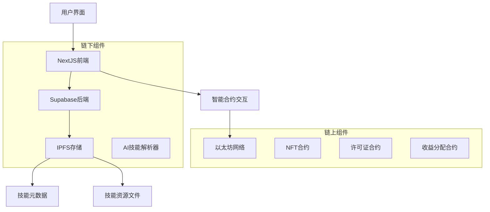
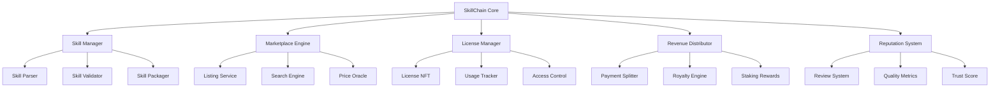
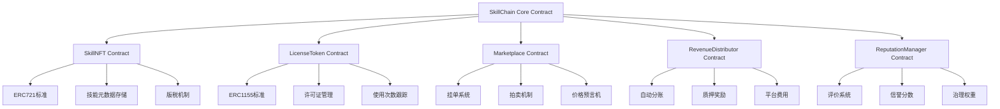
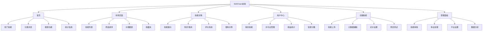
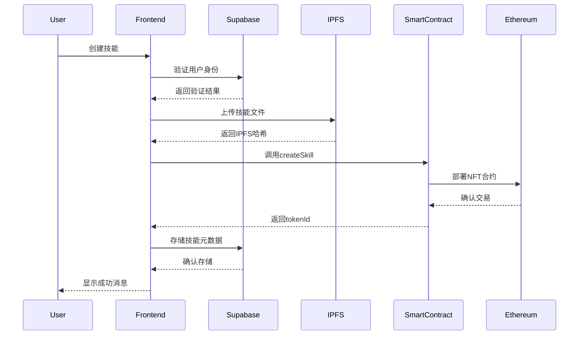
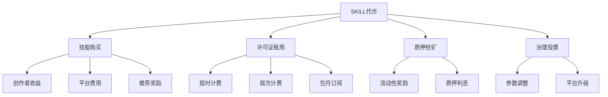
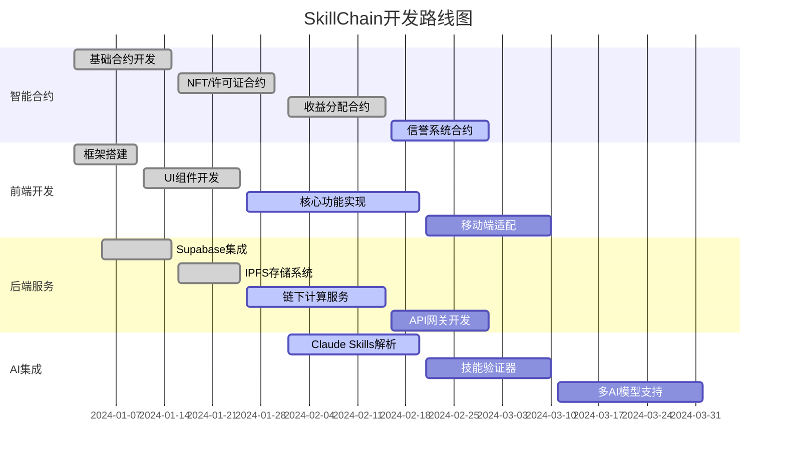

# SkillChain 开发文档

## 1. 项目概述

### 1.1 项目定位
SkillChain是一个革命性的去中心化AI技能市场平台，让开发者、团队和个人能够创建、打包、上链并交易AI Skills（技能包）。每个Skill都是包含指令、配置和资源的结构化文件夹，能让AI模型（如Claude、GPT等）快速成为特定任务的专家。

### 1.2 核心价值主张
- **技能资产化**：将AI技能转化为可交易的链上资产（NFT/License Token）
- **收益分配**：通过智能合约实现自动化的收益分配与版税机制
- **信誉积累**：建立去中心化的技能质量评价和信誉体系
- **可组合性**：支持技能的模块化组合和复用
- **跨平台兼容**：基于标准化格式，支持多种AI模型

### 1.3 市场机遇
基于最新Claude Skills发展趋势<mcurl name="Anthropic Skills" url="https://www.anthropic.com/news/skills"></mcurl>，AI技能市场正经历快速增长：
- Claude Skills采用渐进式披露架构，支持技能动态加载
- 企业级应用显示8倍生产力提升
- 技能组合性和可移植性成为关键优势

## 2. 技术架构设计

### 2.1 整体架构


### 2.2 技术栈选择
- **前端**：NextJS + TypeScript + Tailwind CSS + daisyUI
- **后端**：Supabase（认证+数据库+存储）
- **区块链**：Ethereum + Scaffold-ETH 2框架
- **存储**：IPFS + Filecoin（技能文件）
- **AI集成**：Claude API + OpenAI API

### 2.3 核心组件


## 3. AI Skills结构和标准化格式

### 3.1 技能包结构
基于Claude Skills最佳实践<mcurl name="Agent Skills Engineering" url="https://www.anthropic.com/engineering/equipping-agents-for-the-real-world-with-agent-skills"></mcurl>，采用标准化文件夹结构：

```
skill-package/
├── SKILL.md              # 核心技能定义文件
├── manifest.json         # 技能元数据
├── instructions/         # 指令文件夹
│   ├── system-prompt.md
│   ├── examples.md
│   └── best-practices.md
├── resources/           # 资源文件夹
│   ├── templates/
│   ├── datasets/
│   └── references/
├── scripts/             # 可执行脚本
│   ├── preprocess.py
│   └── postprocess.js
├── tests/               # 测试用例
└── config.yaml          # 配置文件
```

### 3.2 SKILL.md格式
采用YAML Frontmatter标准：

```yaml
---
name: "Excel数据分析专家"
description: "专业的Excel数据分析和可视化技能包"
version: "1.0.0"
author: "DataPro Team"
category: "data-analysis"
tags: ["excel", "data-viz", "analytics"]
ai_models: ["claude", "gpt-4"]
pricing:
  type: "subscription"
  price: 0.1
  currency: "ETH"
license: "commercial"
difficulty: "intermediate"
estimated_time: "30-60分钟"
---

# Excel数据分析专家

## 技能概述
此技能包让AI成为Excel数据分析专家，能够处理复杂的数据集、创建高级图表、执行统计分析等。

## 核心能力
- 数据清洗和预处理
- 高级公式和函数应用
- 数据透视表创建
- 图表和仪表板设计
- 统计分析

## 使用场景
- 商业报告制作
- 销售数据分析
- 财务报表生成
- 市场趋势分析
```

### 3.3 技能元数据标准
```json
{
  "id": "skill_unique_identifier",
  "name": "技能名称",
  "description": "技能描述",
  "version": "1.0.0",
  "author": {
    "name": "作者名称",
    "address": "0x...",
    "reputation": 95
  },
  "category": "技能分类",
  "tags": ["标签1", "标签2"],
  "ai_compatibility": {
    "claude": "3.5+",
    "gpt": "4.0+",
    "gemini": "1.5+"
  },
  "requirements": {
    "context_window": "8k",
    "tools": ["code_execution", "file_access"],
    "skills": ["基础编程", "数据分析"]
  },
  "pricing": {
    "model": "subscription",
    "price": 0.1,
    "currency": "ETH",
    "billing_cycle": "monthly"
  },
  "quality_metrics": {
    "success_rate": 0.95,
    "user_rating": 4.8,
    "usage_count": 1250
  },
  "dependencies": [],
  "created_at": "2024-01-01T00:00:00Z",
  "updated_at": "2024-01-15T00:00:00Z"
}
```

## 4. 智能合约设计

### 4.1 合约架构


### 4.2 SkillNFT合约
```solidity
// SPDX-License-Identifier: MIT
pragma solidity ^0.8.19;

import "@openzeppelin/contracts/token/ERC721/ERC721.sol";
import "@openzeppelin/contracts/token/ERC721/extensions/ERC721URIStorage.sol";
import "@openzeppelin/contracts/token/ERC721/extensions/ERC721Royalty.sol";
import "@openzeppelin/contracts/access/Ownable.sol";

contract SkillNFT is ERC721, ERC721URIStorage, ERC721Royalty, Ownable {
    uint256 private _tokenIdCounter;
    
    struct SkillMetadata {
        string skillId;
        string name;
        string category;
        string[] tags;
        address creator;
        uint256 createdAt;
        uint256 price;
        string currency;
        uint256 royaltyPercentage;
        bool isActive;
    }
    
    mapping(uint256 => SkillMetadata) public skillMetadata;
    mapping(string => uint256) public skillIdToTokenId;
    mapping(address => uint256[]) public creatorSkills;
    
    event SkillCreated(uint256 indexed tokenId, string skillId, address creator);
    event SkillPriceUpdated(uint256 indexed tokenId, uint256 newPrice);
    
    constructor() ERC721("SkillChain Skill NFT", "SKILL") {}
    
    function createSkill(
        string memory skillId,
        string memory name,
        string memory category,
        string[] memory tags,
        string memory tokenURI,
        uint256 price,
        string memory currency,
        uint256 royaltyPercentage
    ) public returns (uint256) {
        require(skillIdToTokenId[skillId] == 0, "Skill ID already exists");
        require(royaltyPercentage <= 10000, "Royalty too high"); // 10000 = 100%
        
        uint256 tokenId = _tokenIdCounter;
        _tokenIdCounter++;
        
        _safeMint(msg.sender, tokenId);
        _setTokenURI(tokenId, tokenURI);
        _setDefaultRoyalty(msg.sender, uint96(royaltyPercentage));
        
        skillMetadata[tokenId] = SkillMetadata({
            skillId: skillId,
            name: name,
            category: category,
            tags: tags,
            creator: msg.sender,
            createdAt: block.timestamp,
            price: price,
            currency: currency,
            royaltyPercentage: royaltyPercentage,
            isActive: true
        });
        
        skillIdToTokenId[skillId] = tokenId;
        creatorSkills[msg.sender].push(tokenId);
        
        emit SkillCreated(tokenId, skillId, msg.sender);
        return tokenId;
    }
    
    function updateSkillPrice(uint256 tokenId, uint256 newPrice) public {
        require(_exists(tokenId), "Skill does not exist");
        require(ownerOf(tokenId) == msg.sender, "Not skill owner");
        
        skillMetadata[tokenId].price = newPrice;
        emit SkillPriceUpdated(tokenId, newPrice);
    }
    
    function getCreatorSkills(address creator) public view returns (uint256[] memory) {
        return creatorSkills[creator];
    }
    
    function searchSkillsByCategory(string memory category) public view returns (uint256[] memory) {
        uint256[] memory categorySkills = new uint256[](_tokenIdCounter);
        uint256 count = 0;
        
        for (uint256 i = 0; i < _tokenIdCounter; i++) {
            if (skillMetadata[i].isActive && 
                keccak256(bytes(skillMetadata[i].category)) == keccak256(bytes(category))) {
                categorySkills[count] = i;
                count++;
            }
        }
        
        uint256[] memory result = new uint256[](count);
        for (uint256 i = 0; i < count; i++) {
            result[i] = categorySkills[i];
        }
        
        return result;
    }
    
    // Override required functions
    function _burn(uint256 tokenId) internal override(ERC721, ERC721URIStorage, ERC721Royalty) {
        super._burn(tokenId);
    }
    
    function tokenURI(uint256 tokenId) public view override(ERC721, ERC721URIStorage) returns (string memory) {
        return super.tokenURI(tokenId);
    }
    
    function supportsInterface(bytes4 interfaceId) public view override(ERC721, ERC721URIStorage, ERC721Royalty) returns (bool) {
        return super.supportsInterface(interfaceId);
    }
}
```

### 4.3 LicenseToken合约
```solidity
// SPDX-License-Identifier: MIT
pragma solidity ^0.8.19;

import "@openzeppelin/contracts/token/ERC1155/ERC1155.sol";
import "@openzeppelin/contracts/access/Ownable.sol";
import "@openzeppelin/contracts/token/ERC1155/extensions/ERC1155Supply.sol";

contract LicenseToken is ERC1155, ERC1155Supply, Ownable {
    
    struct LicenseMetadata {
        uint256 skillTokenId;
        address licensee;
        uint256 expiryTime;
        uint256 usageLimit;
        uint256 usageCount;
        bool isActive;
        string licenseType; // "subscription", "one-time", "limited"
    }
    
    mapping(uint256 => LicenseMetadata) public licenseMetadata;
    mapping(address => uint256[]) public userLicenses;
    mapping(uint256 => mapping(address => uint256)) public skillUserLicense;
    
    uint256 private _licenseIdCounter;
    
    event LicenseCreated(uint256 indexed licenseId, address indexed licensee, uint256 skillTokenId);
    event LicenseUsed(uint256 indexed licenseId, address indexed user);
    event LicenseExpired(uint256 indexed licenseId);
    
    constructor() ERC1155("") {}
    
    function createLicense(
        address licensee,
        uint256 skillTokenId,
        uint256 amount,
        uint256 duration,
        uint256 usageLimit,
        string memory licenseType
    ) public returns (uint256) {
        uint256 licenseId = _licenseIdCounter;
        _licenseIdCounter++;
        
        uint256 expiryTime = duration > 0 ? block.timestamp + duration : 0;
        
        licenseMetadata[licenseId] = LicenseMetadata({
            skillTokenId: skillTokenId,
            licensee: licensee,
            expiryTime: expiryTime,
            usageLimit: usageLimit,
            usageCount: 0,
            isActive: true,
            licenseType: licenseType
        });
        
        _mint(licensee, licenseId, amount, "");
        
        userLicenses[licensee].push(licenseId);
        skillUserLicense[skillTokenId][licensee] = licenseId;
        
        emit LicenseCreated(licenseId, licensee, skillTokenId);
        return licenseId;
    }
    
    function useLicense(uint256 licenseId, address user) public {
        require(balanceOf(user, licenseId) > 0, "No license balance");
        
        LicenseMetadata storage license = licenseMetadata[licenseId];
        require(license.isActive, "License not active");
        
        if (license.expiryTime > 0) {
            require(block.timestamp <= license.expiryTime, "License expired");
        }
        
        if (license.usageLimit > 0) {
            require(license.usageCount < license.usageLimit, "Usage limit exceeded");
            license.usageCount++;
        }
        
        emit LicenseUsed(licenseId, user);
    }
    
    function checkLicenseValidity(uint256 licenseId, address user) public view returns (bool) {
        if (balanceOf(user, licenseId) == 0) return false;
        
        LicenseMetadata memory license = licenseMetadata[licenseId];
        if (!license.isActive) return false;
        
        if (license.expiryTime > 0 && block.timestamp > license.expiryTime) return false;
        if (license.usageLimit > 0 && license.usageCount >= license.usageLimit) return false;
        
        return true;
    }
    
    function getUserLicenses(address user) public view returns (uint256[] memory) {
        return userLicenses[user];
    }
    
    function _beforeTokenTransfer(
        address operator,
        address from,
        address to,
        uint256[] memory ids,
        uint256[] memory amounts,
        bytes memory data
    ) internal override(ERC1155, ERC1155Supply) {
        super._beforeTokenTransfer(operator, from, to, ids, amounts, data);
    }
}
```

## 5. 前端功能模块

### 5.1 页面结构


### 5.2 核心组件

#### 技能卡片组件
```tsx
// components/skill-card.tsx
import { Skill } from "~~/types/skill";
import { Address } from "~~/components/scaffold-eth";

interface SkillCardProps {
  skill: Skill;
  onPurchase: (skillId: string) => void;
  onRent: (skillId: string) => void;
}

export function SkillCard({ skill, onPurchase, onRent }: SkillCardProps) {
  return (
    <div className="card bg-base-100 shadow-xl hover:shadow-2xl transition-shadow">
      <figure className="px-4 pt-4">
        <div className="w-full h-48 bg-gradient-to-br from-primary to-secondary rounded-lg flex items-center justify-center">
          <span className="text-4xl">{skill.icon || "🎯"}</span>
        </div>
      </figure>
      <div className="card-body">
        <h2 className="card-title">{skill.name}</h2>
        <p className="text-sm text-base-content/70">{skill.description}</p>
        
        <div className="flex items-center gap-2 mt-2">
          <Address address={skill.creator} format="short" />
          <div className="badge badge-primary">{skill.category}</div>
        </div>
        
        <div className="flex items-center justify-between mt-4">
          <div className="flex items-center gap-1">
            <span className="text-lg font-bold">{skill.price}</span>
            <span className="text-sm text-base-content/70">{skill.currency}</span>
          </div>
          <div className="flex items-center gap-1">
            <span className="text-yellow-500">⭐</span>
            <span className="text-sm">{skill.rating}</span>
          </div>
        </div>
        
        <div className="card-actions justify-end mt-4">
          <button 
            className="btn btn-primary btn-sm"
            onClick={() => onPurchase(skill.id)}
          >
            购买
          </button>
          <button 
            className="btn btn-outline btn-primary btn-sm"
            onClick={() => onRent(skill.id)}
          >
            租用
          </button>
        </div>
      </div>
    </div>
  );
}
```

#### 技能创建向导
```tsx
// components/create-skill-wizard.tsx
import { useState } from "react";
import { useScaffoldWriteContract } from "~~/hooks/scaffold-eth";

interface SkillFormData {
  name: string;
  description: string;
  category: string;
  tags: string[];
  price: string;
  currency: string;
  royalty: number;
  aiModels: string[];
  requirements: {
    contextWindow: string;
    tools: string[];
  };
}

export function CreateSkillWizard() {
  const [step, setStep] = useState(1);
  const [formData, setFormData] = useState<SkillFormData>({
    name: "",
    description: "",
    category: "",
    tags: [],
    price: "0.1",
    currency: "ETH",
    royalty: 5,
    aiModels: [],
    requirements: {
      contextWindow: "8k",
      tools: []
    }
  });
  
  const { writeContractAsync: createSkill } = useScaffoldWriteContract("SkillNFT");
  
  const handleSubmit = async () => {
    try {
      // 1. 上传技能文件到IPFS
      const skillId = generateSkillId(formData.name);
      const metadata = {
        ...formData,
        createdAt: new Date().toISOString(),
        version: "1.0.0"
      };
      
      const ipfsHash = await uploadToIPFS(metadata);
      
      // 2. 创建NFT
      await createSkill({
        functionName: "createSkill",
        args: [
          skillId,
          formData.name,
          formData.category,
          formData.tags,
          `ipfs://${ipfsHash}`,
          parseEther(formData.price),
          formData.currency,
          formData.royalty * 100 // 转换为基点
        ]
      });
      
      alert("技能创建成功！");
    } catch (error) {
      console.error("创建技能失败:", error);
      alert("创建失败，请重试");
    }
  };
  
  return (
    <div className="container mx-auto p-6">
      <div className="steps">
        <ul className="steps steps-horizontal">
          <li className={`step ${step >= 1 ? "step-primary" : ""}`}>基本信息</li>
          <li className={`step ${step >= 2 ? "step-primary" : ""}`}>技能配置</li>
          <li className={`step ${step >= 3 ? "step-primary" : ""}`}>定价设置</li>
          <li className={`step ${step >= 4 ? "step-primary" : ""}`}>文件上传</li>
        </ul>
      </div>
      
      <div className="mt-8">
        {step === 1 && <BasicInfoStep data={formData} onChange={setFormData} />}
        {step === 2 && <SkillConfigStep data={formData} onChange={setFormData} />}
        {step === 3 && <PricingStep data={formData} onChange={setFormData} />}
        {step === 4 && <FileUploadStep data={formData} onSubmit={handleSubmit} />}
      </div>
      
      <div className="flex justify-between mt-8">
        <button 
          className="btn btn-outline"
          onClick={() => setStep(Math.max(1, step - 1))}
          disabled={step === 1}
        >
          上一步
        </button>
        <button 
          className="btn btn-primary"
          onClick={() => setStep(Math.min(4, step + 1))}
          disabled={step === 4}
        >
          下一步
        </button>
      </div>
    </div>
  );
}
```

## 6. 链上链下数据流

### 6.1 数据流架构


### 6.2 数据同步机制

#### 实时同步
```typescript
// hooks/useSkillSync.ts
import { useScaffoldEventHistory } from "~~/hooks/scaffold-eth";
import { useEffect, useState } from "react";

export function useSkillSync() {
  const [skills, setSkills] = useState([]);
  const [loading, setLoading] = useState(true);
  
  // 监听链上事件
  const { data: events, isLoading } = useScaffoldEventHistory({
    contractName: "SkillNFT",
    eventName: "SkillCreated",
    fromBlock: 0n,
  });
  
  useEffect(() => {
    if (!isLoading && events) {
      syncSkillsWithDatabase(events);
    }
  }, [events, isLoading]);
  
  const syncSkillsWithDatabase = async (chainEvents: any[]) => {
    try {
      // 1. 获取链上技能数据
      const chainSkills = await Promise.all(
        chainEvents.map(async (event) => {
          const tokenId = event.args.tokenId;
          const metadata = await readContract({
            contractName: "SkillNFT",
            functionName: "skillMetadata",
            args: [tokenId]
          });
          return { tokenId, ...metadata };
        })
      );
      
      // 2. 与数据库同步
      const response = await fetch("/api/sync-skills", {
        method: "POST",
        headers: { "Content-Type": "application/json" },
        body: JSON.stringify({ skills: chainSkills })
      });
      
      if (response.ok) {
        const syncedSkills = await response.json();
        setSkills(syncedSkills);
      }
      
      setLoading(false);
    } catch (error) {
      console.error("技能同步失败:", error);
      setLoading(false);
    }
  };
  
  return { skills, loading, refetch: syncSkillsWithDatabase };
}
```

## 7. 经济模型和收益分配机制

### 7.1 经济模型设计


### 7.2 收益分配合约
```solidity
// SPDX-License-Identifier: MIT
pragma solidity ^0.8.19;

import "@openzeppelin/contracts/token/ERC20/IERC20.sol";
import "@openzeppelin/contracts/access/Ownable.sol";

contract RevenueDistributor is Ownable {
    
    struct RevenueShare {
        address creator;
        uint256 creatorShare; // 基点 (10000 = 100%)
        address platform;
        uint256 platformShare;
        address[] affiliates;
        uint256[] affiliateShares;
    }
    
    struct Transaction {
        uint256 amount;
        address payer;
        uint256 timestamp;
        RevenueShare shares;
    }
    
    mapping(uint256 => Transaction[]) public skillTransactions;
    mapping(address => uint256) public pendingWithdrawals;
    mapping(address => uint256) public totalEarned;
    
    uint256 public platformFee = 250; // 2.5%
    uint256 public affiliateReward = 100; // 1%
    
    event RevenueDistributed(
        uint256 indexed skillId,
        uint256 amount,
        address indexed creator,
        address indexed platform
    );
    
    event Withdrawal(address indexed recipient, uint256 amount);
    
    constructor() {}
    
    function distributeRevenue(
        uint256 skillId,
        uint256 amount,
        address creator,
        address[] memory affiliates
    ) external payable {
        require(amount > 0, "Amount must be positive");
        
        // 计算分配比例
        uint256 creatorShare = amount * (10000 - platformFee - affiliateReward) / 10000;
        uint256 platformShare = amount * platformFee / 10000;
        uint256 totalAffiliateShare = amount * affiliateReward / 10000;
        
        // 处理推荐人奖励
        uint256[] memory affiliateShares = new uint256[](affiliates.length);
        if (affiliates.length > 0) {
            uint256 sharePerAffiliate = totalAffiliateShare / affiliates.length;
            for (uint256 i = 0; i < affiliates.length; i++) {
                affiliateShares[i] = sharePerAffiliate;
                pendingWithdrawals[affiliates[i]] += sharePerAffiliate;
            }
        }
        
        // 更新待提取金额
        pendingWithdrawals[creator] += creatorShare;
        pendingWithdrawals[owner()] += platformShare;
        
        // 记录交易
        RevenueShare memory shares = RevenueShare({
            creator: creator,
            creatorShare: creatorShare,
            platform: owner(),
            platformShare: platformShare,
            affiliates: affiliates,
            affiliateShares: affiliateShares
        });
        
        skillTransactions[skillId].push(Transaction({
            amount: amount,
            payer: msg.sender,
            timestamp: block.timestamp,
            shares: shares
        }));
        
        emit RevenueDistributed(skillId, amount, creator, owner());
    }
    
    function withdraw() external {
        uint256 amount = pendingWithdrawals[msg.sender];
        require(amount > 0, "No pending withdrawal");
        
        pendingWithdrawals[msg.sender] = 0;
        totalEarned[msg.sender] += amount;
        
        // 转账ETH
        (bool success, ) = payable(msg.sender).call{value: amount}("");
        require(success, "Transfer failed");
        
        emit Withdrawal(msg.sender, amount);
    }
    
    function getPendingWithdrawal(address account) external view returns (uint256) {
        return pendingWithdrawals[account];
    }
    
    function getTotalEarned(address account) external view returns (uint256) {
        return totalEarned[account];
    }
    
    function updatePlatformFee(uint256 newFee) external onlyOwner {
        require(newFee <= 1000, "Fee too high"); // Max 10%
        platformFee = newFee;
    }
    
    function updateAffiliateReward(uint256 newReward) external onlyOwner {
        require(newReward <= 500, "Reward too high"); // Max 5%
        affiliateReward = newReward;
    }
}
```

## 8. 信誉系统实现

### 8.1 信誉评分算法
```typescript
// utils/reputation.ts
export interface ReputationFactors {
  skillQuality: number;      // 技能质量评分 (1-5)
  transactionVolume: number; // 交易数量
  successfulTransactions: number; // 成功交易数
  disputeCount: number;      // 争议次数
  responseTime: number;       // 响应时间 (小时)
  userReviews: Review[];     // 用户评价
  platformContribution: number; // 平台贡献度
  stakingAmount: number;     // 质押数量
}

export interface Review {
  reviewer: string;
  rating: number;
  comment: string;
  timestamp: number;
  verified: boolean;
}

export class ReputationCalculator {
  private static readonly WEIGHTS = {
    skillQuality: 0.25,
    transactionReliability: 0.20,
    userSatisfaction: 0.20,
    platformContribution: 0.15,
    stakingCommitment: 0.10,
    responseEfficiency: 0.10
  };

  static calculateReputation(factors: ReputationFactors): number {
    const skillScore = this.calculateSkillScore(factors);
    const transactionScore = this.calculateTransactionScore(factors);
    const satisfactionScore = this.calculateSatisfactionScore(factors);
    const contributionScore = this.calculateContributionScore(factors);
    const stakingScore = this.calculateStakingScore(factors);
    const responseScore = this.calculateResponseScore(factors);

    const totalScore = 
      skillScore * this.WEIGHTS.skillQuality +
      transactionScore * this.WEIGHTS.transactionReliability +
      satisfactionScore * this.WEIGHTS.userSatisfaction +
      contributionScore * this.WEIGHTS.platformContribution +
      stakingScore * this.WEIGHTS.stakingCommitment +
      responseScore * this.WEIGHTS.responseEfficiency;

    return Math.min(100, Math.max(0, totalScore));
  }

  private static calculateSkillScore(factors: ReputationFactors): number {
    const baseScore = factors.skillQuality;
    const reviewScore = this.calculateAverageRating(factors.userReviews);
    return (baseScore + reviewScore) / 2 * 20; // 转换为0-100
  }

  private static calculateTransactionScore(factors: ReputationFactors): number {
    if (factors.transactionVolume === 0) return 0;
    
    const successRate = factors.successfulTransactions / factors.transactionVolume;
    const volumeBonus = Math.min(10, factors.transactionVolume / 10); // 交易量奖励
    
    return Math.min(100, successRate * 90 + volumeBonus);
  }

  private static calculateSatisfactionScore(factors: ReputationFactors): number {
    if (factors.userReviews.length === 0) return 50;
    
    const avgRating = this.calculateAverageRating(factors.userReviews);
    const verifiedReviews = factors.userReviews.filter(r => r.verified).length;
    const verificationBonus = (verifiedReviews / factors.userReviews.length) * 10;
    
    return avgRating * 20 + verificationBonus;
  }

  private static calculateContributionScore(factors: ReputationFactors): number {
    // 基于平台贡献度的评分
    return Math.min(100, factors.platformContribution * 10);
  }

  private static calculateStakingScore(factors: ReputationFactors): number {
    // 质押数量评分，假设最大质押1000代币
    const maxStaking = 1000;
    return Math.min(100, (factors.stakingAmount / maxStaking) * 100);
  }

  private static calculateResponseScore(factors: ReputationFactors): number {
    // 响应时间评分，24小时内为满分
    const idealResponseTime = 24;
    const responseScore = Math.max(0, 100 - (factors.responseTime - idealResponseTime) * 2);
    return Math.max(0, responseScore);
  }

  private static calculateAverageRating(reviews: Review[]): number {
    if (reviews.length === 0) return 0;
    const sum = reviews.reduce((acc, review) => acc + review.rating, 0);
    return sum / reviews.length;
  }
}
```

### 8.2 信誉管理合约
```solidity
// SPDX-License-Identifier: MIT
pragma solidity ^0.8.19;

import "@openzeppelin/contracts/access/Ownable.sol";

contract ReputationManager is Ownable {
    
    struct ReputationData {
        uint256 totalScore;
        uint256 transactionCount;
        uint256 successfulTransactions;
        uint256 disputeCount;
        uint256 lastUpdated;
        uint256 reviewCount;
        uint256 totalRating;
        bool isVerified;
    }
    
    mapping(address => ReputationData) public userReputation;
    mapping(address => mapping(address => bool)) public hasReviewed;
    
    uint256 public constant MAX_REPUTATION = 1000;
    uint256 public constant MIN_REPUTATION_FOR_VERIFICATION = 700;
    
    event ReputationUpdated(address indexed user, uint256 newScore);
    event UserVerified(address indexed user);
    event ReviewSubmitted(address indexed reviewer, address indexed target, uint256 rating);
    
    constructor() {}
    
    function updateReputation(
        address user,
        uint256 skillQuality,
        uint256 transactionVolume,
        uint256 successfulTransactions,
        uint256 disputeCount,
        uint256 responseTime
    ) external {
        ReputationData storage reputation = userReputation[user];
        
        // 更新基础数据
        reputation.transactionCount += transactionVolume;
        reputation.successfulTransactions += successfulTransactions;
        reputation.disputeCount += disputeCount;
        reputation.lastUpdated = block.timestamp;
        
        // 计算新的信誉分数
        uint256 newScore = calculateReputationScore(
            skillQuality,
            reputation.transactionCount,
            reputation.successfulTransactions,
            reputation.disputeCount,
            responseTime,
            reputation.reviewCount,
            reputation.totalRating
        );
        
        reputation.totalScore = newScore;
        
        // 检查是否达到验证标准
        if (!reputation.isVerified && newScore >= MIN_REPUTATION_FOR_VERIFICATION) {
            reputation.isVerified = true;
            emit UserVerified(user);
        }
        
        emit ReputationUpdated(user, newScore);
    }
    
    function submitReview(
        address target,
        uint256 rating,
        string memory comment
    ) external {
        require(rating >= 1 && rating <= 5, "Invalid rating");
        require(!hasReviewed[msg.sender][target], "Already reviewed");
        
        ReputationData storage reputation = userReputation[target];
        reputation.reviewCount++;
        reputation.totalRating += rating;
        hasReviewed[msg.sender][target] = true;
        
        // 重新计算信誉分数
        uint256 newScore = calculateReputationScore(
            0, // skillQuality 不更新
            reputation.transactionCount,
            reputation.successfulTransactions,
            reputation.disputeCount,
            0, // responseTime 不更新
            reputation.reviewCount,
            reputation.totalRating
        );
        
        reputation.totalScore = newScore;
        
        emit ReviewSubmitted(msg.sender, target, rating);
        emit ReputationUpdated(target, newScore);
    }
    
    function calculateReputationScore(
        uint256 skillQuality,
        uint256 transactionCount,
        uint256 successfulTransactions,
        uint256 disputeCount,
        uint256 responseTime,
        uint256 reviewCount,
        uint256 totalRating
    ) internal pure returns (uint256) {
        // 基础分数
        uint256 baseScore = 500;
        
        // 技能质量分数 (0-200)
        uint256 skillScore = skillQuality * 40;
        
        // 交易可靠性分数 (0-200)
        uint256 transactionScore = 0;
        if (transactionCount > 0) {
            uint256 successRate = (successfulTransactions * 100) / transactionCount;
            transactionScore = successRate * 2;
        }
        
        // 用户满意度分数 (0-100)
        uint256 satisfactionScore = 0;
        if (reviewCount > 0) {
            uint256 avgRating = totalRating / reviewCount;
            satisfactionScore = avgRating * 20;
        }
        
        // 争议惩罚 (-100 to 0)
        uint256 disputePenalty = 0;
        if (transactionCount > 0) {
            uint256 disputeRate = (disputeCount * 100) / transactionCount;
            disputePenalty = disputeRate > 10 ? 100 : disputeRate * 10;
        }
        
        uint256 totalScore = baseScore + skillScore + transactionScore + satisfactionScore - disputePenalty;
        return Math.min(MAX_REPUTATION, totalScore);
    }
    
    function getUserReputation(address user) external view returns (
        uint256 totalScore,
        uint256 transactionCount,
        uint256 successfulTransactions,
        uint256 disputeCount,
        bool isVerified
    ) {
        ReputationData memory reputation = userReputation[user];
        return (
            reputation.totalScore,
            reputation.transactionCount,
            reputation.successfulTransactions,
            reputation.disputeCount,
            reputation.isVerified
        );
    }
    
    function isUserVerified(address user) external view returns (bool) {
        return userReputation[user].isVerified;
    }
}
```

## 9. 开发路线图和里程碑

### 9.1 第一阶段：MVP开发（1-2个月）
- ✅ 基础智能合约开发
- ✅ 前端框架搭建
- ✅ 用户认证系统
- ✅ 技能上传和展示
- ✅ 基础购买/租用功能

### 9.2 第二阶段：核心功能（2-3个月）
- 🔄 高级搜索和推荐
- 🔄 完整的经济模型
- 🔄 信誉系统
- 🔄 多链支持
- 🔄 移动端适配

### 9.3 第三阶段：生态系统（3-4个月）
- 📋 AI技能验证器
- 📋 批量操作工具
- 📋 企业级API
- 📋 社区治理
- 📋 跨平台SDK

### 9.4 第四阶段：扩展功能（4-6个月）
- 📋 技能组合市场
- 📋 订阅服务模式
- 📋 白标解决方案
- 📋 全球合规框架
- 📋 DAO治理

### 9.5 技术里程碑


## 10. 风险控制和合规

### 10.1 技术风险
- **智能合约安全**：多重审计 + 形式化验证
- **数据隐私**：零知识证明 + 同态加密
- **系统可用性**：分布式架构 + 故障转移

### 10.2 法律合规
- **KYC/AML**：集成合规服务提供商
- **知识产权**：DMCA流程 + 争议解决
- **税务合规**：自动税务报告生成

### 10.3 经济安全
- **价格操纵防护**：时间加权平均价格
- **闪电贷攻击**：重入保护 + 检查-生效-交互
- **流动性风险**：多DEX集成 + 保险基金

---

这份开发文档为SkillChain项目提供了完整的技术实现方案，结合了最新的Claude Skills发展趋势和区块链技术最佳实践。文档涵盖了从架构设计到具体实现的各个方面，为开发团队提供了清晰的开发指导。

需要我详细解释任何特定部分，或者根据你的具体需求进行调整吗？