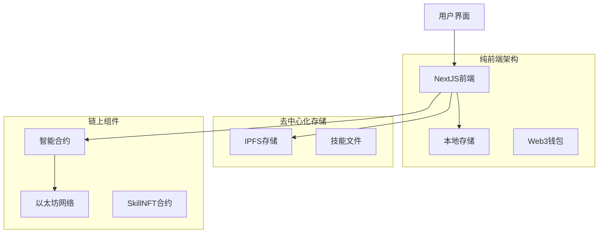
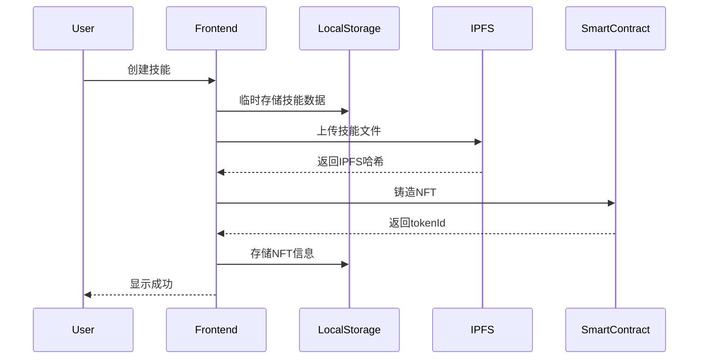

# SkillChain MVP 开发文档

## 1. 项目概述

### 1.1 MVP定位
SkillChain MVP是一个去中心化AI技能市场的最小可行产品，专注于核心功能：AI技能的创建、上链和交易。通过纯前端架构实现快速原型验证。

### 1.2 核心价值主张
- **技能资产化**：将AI技能转化为链上NFT资产
- **去中心化交易**：无需后端服务器的P2P技能交易
- **标准化格式**：基于Claude Skills的标准化技能包格式
- **即时部署**：纯前端应用，快速部署和迭代

### 1.3 MVP范围限定
**包含功能：**
- 技能创建和上传
- 技能NFT铸造
- 基础市场浏览
- 技能购买/转让
- 钱包连接

**暂不包含：**
- 用户认证系统
- 复杂的搜索和筛选
- 评价和信誉系统
- 收益分配机制
- 高级许可证管理

## 2. 简化技术架构

### 2.1 整体架构


### 2.2 优化技术栈（基于Scaffold-ETH 2）

#### 2.2.1 核心框架
- **前端框架**：NextJS 14 + TypeScript（Scaffold-ETH 2内置）
- **Web3集成**：完全基于Scaffold-ETH 2生态
  - Wagmi + Viem（自动配置）
  - RainbowKit（定制化连接组件）
  - 自动合约类型生成
  - 内置网络切换和错误处理

#### 2.2.2 Scaffold-ETH 2内置功能利用
**自定义Hooks（直接使用）：**
- `useScaffoldReadContract` - 智能合约读取
- `useScaffoldWriteContract` - 智能合约写入
- `useScaffoldWatchContractEvent` - 事件监听
- `useScaffoldEventHistory` - 历史事件查询
- `useDeployedContractInfo` - 合约信息获取
- `useTargetNetwork` - 网络管理
- `useWatchBalance` - 余额监控

**内置UI组件（直接使用）：**
- `Address` - 地址显示和复制
- `Balance` - 余额显示
- `BlockieAvatar` - 用户头像
- `Faucet` / `FaucetButton` - 测试网水龙头
- `EtherInput` - ETH金额输入
- `AddressInput` - 地址输入验证
- `RainbowKitCustomConnectButton` - 定制钱包连接

**工具函数（直接使用）：**
- 网络配置和切换
- 交易通知系统
- 错误解析和处理
- 区块数据获取

#### 2.2.3 UI和样式
- **样式系统**：Tailwind CSS（Scaffold-ETH 2预配置）
- **组件库**：daisyUI + Scaffold-ETH 2组件
- **响应式设计**：内置移动端适配
- **主题系统**：支持深色/浅色模式切换

#### 2.2.4 存储和数据
- **本地存储**：localStorage + React状态管理
- **去中心化存储**：IPFS集成（通过Pinata）
- **合约数据**：通过Scaffold-ETH 2 hooks自动同步
- **缓存策略**：Wagmi内置查询缓存

#### 2.2.5 开发和部署
- **开发环境**：Scaffold-ETH 2内置热重载
- **合约开发**：Hardhat + 自动类型生成
- **测试框架**：内置测试套件
- **部署工具**：一键部署脚本
- **调试工具**：内置合约调试界面

### 2.3 数据流简化


## 3. AI Skills标准化格式（简化版）

### 3.1 技能包结构
```
skill-package/
├── skill.md              # 核心技能定义
├── manifest.json         # 基础元数据
├── instructions/         # 指令文件夹
│   └── system-prompt.md
├── examples/            # 示例文件夹
│   └── usage-examples.md
└── config.json          # 简化配置
```

### 3.2 skill.md格式
```yaml
---
name: "Excel数据分析助手"
description: "帮助用户进行Excel数据分析和可视化"
version: "1.0.0"
author: "技能创作者"
category: "data-analysis"
tags: ["excel", "data", "analysis"]
price: "0.01"
currency: "ETH"
---

# Excel数据分析助手

## 技能描述
这个技能包让AI成为Excel数据分析专家，能够：
- 数据清洗和整理
- 创建数据透视表
- 生成图表和报告
- 执行基础统计分析

## 使用方法
1. 上传Excel文件或描述数据结构
2. 说明分析需求
3. AI将提供详细的分析步骤和结果

## 示例对话
用户：我有一个销售数据表，想分析各地区的销售趋势
AI：我来帮您分析销售数据...
```

### 3.3 manifest.json（简化版）
```json
{
  "id": "excel-data-analyst-v1",
  "name": "Excel数据分析助手",
  "version": "1.0.0",
  "description": "专业的Excel数据分析技能包",
  "author": "0x...",
  "category": "data-analysis",
  "tags": ["excel", "data", "analysis"],
  "created_at": "2024-01-01T00:00:00Z",
  "price": {
    "amount": "0.01",
    "currency": "ETH"
  },
  "files": [
    "skill.md",
    "instructions/system-prompt.md",
    "examples/usage-examples.md"
  ]
}
```

## 4. 智能合约设计（简化版）

### 4.1 SkillNFT合约
```solidity
// SPDX-License-Identifier: MIT
pragma solidity ^0.8.19;

import "@openzeppelin/contracts/token/ERC721/ERC721.sol";
import "@openzeppelin/contracts/token/ERC721/extensions/ERC721URIStorage.sol";
import "@openzeppelin/contracts/access/Ownable.sol";

contract SkillNFT is ERC721, ERC721URIStorage, Ownable {
    uint256 private _tokenIdCounter;
    
    struct Skill {
        string name;
        string category;
        address creator;
        uint256 price;
        uint256 createdAt;
        bool isActive;
    }
    
    mapping(uint256 => Skill) public skills;
    mapping(address => uint256[]) public creatorSkills;
    
    event SkillCreated(uint256 indexed tokenId, string name, address creator, uint256 price);
    event SkillPurchased(uint256 indexed tokenId, address buyer, uint256 price);
    
    constructor() ERC721("SkillChain NFT", "SKILL") {}
    
    function createSkill(
        string memory name,
        string memory category,
        string memory tokenURI,
        uint256 price
    ) public returns (uint256) {
        uint256 tokenId = _tokenIdCounter++;
        
        _safeMint(msg.sender, tokenId);
        _setTokenURI(tokenId, tokenURI);
        
        skills[tokenId] = Skill({
            name: name,
            category: category,
            creator: msg.sender,
            price: price,
            createdAt: block.timestamp,
            isActive: true
        });
        
        creatorSkills[msg.sender].push(tokenId);
        
        emit SkillCreated(tokenId, name, msg.sender, price);
        return tokenId;
    }
    
    function purchaseSkill(uint256 tokenId) public payable {
        require(_exists(tokenId), "Skill does not exist");
        require(skills[tokenId].isActive, "Skill not active");
        require(msg.value >= skills[tokenId].price, "Insufficient payment");
        
        address creator = skills[tokenId].creator;
        address currentOwner = ownerOf(tokenId);
        
        // 转账给当前拥有者
        payable(currentOwner).transfer(msg.value);
        
        // 转移NFT
        _transfer(currentOwner, msg.sender, tokenId);
        
        emit SkillPurchased(tokenId, msg.sender, msg.value);
    }
    
    function getCreatorSkills(address creator) public view returns (uint256[] memory) {
        return creatorSkills[creator];
    }
    
    function getAllSkills() public view returns (uint256[] memory) {
        uint256[] memory activeSkills = new uint256[](_tokenIdCounter);
        uint256 count = 0;
        
        for (uint256 i = 0; i < _tokenIdCounter; i++) {
            if (skills[i].isActive) {
                activeSkills[count] = i;
                count++;
            }
        }
        
        uint256[] memory result = new uint256[](count);
        for (uint256 i = 0; i < count; i++) {
            result[i] = activeSkills[i];
        }
        
        return result;
    }
    
    // Override functions
    function _burn(uint256 tokenId) internal override(ERC721, ERC721URIStorage) {
        super._burn(tokenId);
    }
    
    function tokenURI(uint256 tokenId) public view override(ERC721, ERC721URIStorage) returns (string memory) {
        return super.tokenURI(tokenId);
    }
    
    function supportsInterface(bytes4 interfaceId) public view override(ERC721, ERC721URIStorage) returns (bool) {
        return super.supportsInterface(interfaceId);
    }
}
```

## 5. 前端架构（基于Scaffold-ETH 2优化）

### 5.1 项目结构（基于Scaffold-ETH 2）
```
packages/nextjs/
├── app/                   # App Router (NextJS 14)
│   ├── page.tsx          # 首页 - 技能市场
│   ├── create/           # 创建技能页面
│   │   └── page.tsx
│   ├── skill/            # 技能详情页面
│   │   └── [id]/page.tsx
│   ├── profile/          # 用户资料页面
│   │   └── page.tsx
│   └── layout.tsx        # 根布局
├── components/
│   ├── scaffold-eth/     # Scaffold-ETH 2内置组件
│   └── skillchain/       # SkillChain自定义组件
│       ├── SkillCard.tsx
│       ├── SkillList.tsx
│       ├── CreateSkillForm.tsx
│       └── SkillMarketplace.tsx
├── hooks/
│   ├── scaffold-eth/     # Scaffold-ETH 2内置hooks
│   └── skillchain/       # SkillChain自定义hooks
│       ├── useSkillData.ts
│       ├── useIPFSUpload.ts
│       └── useSkillMarket.ts
└── utils/
    ├── scaffold-eth/     # Scaffold-ETH 2内置工具
    └── skillchain/       # SkillChain工具函数
        ├── ipfs.ts
        └── skillFormat.ts
```

### 5.2 核心组件（使用Scaffold-ETH 2组件）

#### 技能卡片组件（优化版）
```tsx
// components/skillchain/SkillCard.tsx
import { useState } from "react";
import { useScaffoldWriteContract } from "~~/hooks/scaffold-eth";
import { Address, Balance, EtherInput } from "~~/components/scaffold-eth";
import { formatEther } from "viem";
import { notification } from "~~/utils/scaffold-eth";

interface SkillCardProps {
  tokenId: number;
  name: string;
  category: string;
  creator: string;
  price: bigint;
  tokenURI: string;
  onPurchase?: () => void;
}

export function SkillCard({ tokenId, name, category, creator, price, tokenURI, onPurchase }: SkillCardProps) {
  const [isLoading, setIsLoading] = useState(false);
  
  const { writeContractAsync: purchaseSkill } = useScaffoldWriteContract("SkillNFT");
  
  const handlePurchase = async () => {
    try {
      setIsLoading(true);
      
      const result = await purchaseSkill({
        functionName: "purchaseSkill",
        args: [BigInt(tokenId)],
        value: price,
      });
      
      notification.success("技能购买成功！");
      onPurchase?.();
      
    } catch (error: any) {
      console.error("购买失败:", error);
      notification.error(`购买失败: ${error.message}`);
    } finally {
      setIsLoading(false);
    }
  };
  
  return (
    <div className="card bg-base-100 shadow-xl hover:shadow-2xl transition-all duration-300">
      <div className="card-body">
        <h2 className="card-title text-primary">{name}</h2>
        <div className="badge badge-secondary">{category}</div>
        
        <div className="flex items-center gap-2 mt-2">
          <span className="text-sm">创建者:</span>
          <Address address={creator} size="sm" />
        </div>
        
        <div className="divider"></div>
        
        <div className="flex items-center justify-between">
          <div className="flex items-center gap-2">
            <span className="text-lg font-bold">
              <Balance address={creator} className="text-primary" />
            </span>
            <span className="text-sm text-base-content/70">ETH</span>
          </div>
          
          <button 
            className={`btn btn-primary ${isLoading ? 'loading' : ''}`}
            onClick={handlePurchase}
            disabled={isLoading}
          >
            {isLoading ? '购买中...' : '购买技能'}
          </button>
        </div>
      </div>
    </div>
  );
}
```

#### 创建技能表单（优化版）
```tsx
// components/skillchain/CreateSkillForm.tsx
import { useState } from "react";
import { useScaffoldWriteContract } from "~~/hooks/scaffold-eth";
import { EtherInput, AddressInput } from "~~/components/scaffold-eth";
import { parseEther } from "viem";
import { notification } from "~~/utils/scaffold-eth";
import { useAccount } from "wagmi";

interface SkillFormData {
  name: string;
  description: string;
  category: string;
  price: string;
  systemPrompt: string;
  examples: string;
}

export function CreateSkillForm() {
  const { address: connectedAddress } = useAccount();
  const [formData, setFormData] = useState<SkillFormData>({
    name: "",
    description: "",
    category: "",
    price: "0.01",
    systemPrompt: "",
    examples: ""
  });
  const [isUploading, setIsUploading] = useState(false);
  
  const { writeContractAsync: createSkill } = useScaffoldWriteContract("SkillNFT");
  
  const uploadToIPFS = async (skillData: any) => {
    try {
      // 使用Pinata API上传到IPFS
      const response = await fetch('/api/upload-to-ipfs', {
        method: 'POST',
        headers: { 'Content-Type': 'application/json' },
        body: JSON.stringify(skillData)
      });
      
      if (!response.ok) {
        throw new Error('IPFS上传失败');
      }
      
      const { hash } = await response.json();
      return hash;
    } catch (error) {
      console.error('IPFS上传错误:', error);
      throw error;
    }
  };
  
  const handleSubmit = async (e: React.FormEvent) => {
    e.preventDefault();
    
    if (!connectedAddress) {
      notification.error("请先连接钱包");
      return;
    }
    
    try {
      setIsUploading(true);
      notification.info("正在创建技能...");
      
      // 1. 准备技能数据
      const skillData = {
        name: formData.name,
        description: formData.description,
        category: formData.category,
        systemPrompt: formData.systemPrompt,
        examples: formData.examples,
        creator: connectedAddress,
        createdAt: new Date().toISOString(),
        version: "1.0.0"
      };
      
      // 2. 上传到IPFS
      const ipfsHash = await uploadToIPFS(skillData);
      const tokenURI = `ipfs://${ipfsHash}`;
      
      // 3. 创建NFT
      const result = await createSkill({
        functionName: "createSkill",
        args: [
          formData.name,
          formData.category,
          tokenURI,
          parseEther(formData.price)
        ]
      });
      
      notification.success("技能创建成功！");
      
      // 重置表单
      setFormData({
        name: "",
        description: "",
        category: "",
        price: "0.01",
        systemPrompt: "",
        examples: ""
      });
      
    } catch (error: any) {
      console.error("创建失败:", error);
      notification.error(`创建失败: ${error.message}`);
    } finally {
      setIsUploading(false);
    }
  };
  
  return (
    <div className="max-w-2xl mx-auto">
      <div className="card bg-base-100 shadow-xl">
        <div className="card-body">
          <h2 className="card-title text-2xl mb-6">创建AI技能</h2>
          
          <form onSubmit={handleSubmit} className="space-y-6">
            {/* 基础信息 */}
            <div className="form-control">
              <label className="label">
                <span className="label-text font-semibold">技能名称</span>
              </label>
              <input
                type="text"
                className="input input-bordered focus:input-primary"
                placeholder="例如：Excel数据分析助手"
                value={formData.name}
                onChange={(e) => setFormData({...formData, name: e.target.value})}
                required
              />
            </div>
            
            <div className="form-control">
              <label className="label">
                <span className="label-text font-semibold">技能描述</span>
              </label>
              <textarea
                className="textarea textarea-bordered focus:textarea-primary h-24"
                placeholder="详细描述这个AI技能的功能和用途..."
                value={formData.description}
                onChange={(e) => setFormData({...formData, description: e.target.value})}
                required
              />
            </div>
            
            <div className="grid grid-cols-1 md:grid-cols-2 gap-4">
              <div className="form-control">
                <label className="label">
                  <span className="label-text font-semibold">分类</span>
                </label>
                <select
                  className="select select-bordered focus:select-primary"
                  value={formData.category}
                  onChange={(e) => setFormData({...formData, category: e.target.value})}
                  required
                >
                  <option value="">选择分类</option>
                  <option value="data-analysis">数据分析</option>
                  <option value="programming">编程开发</option>
                  <option value="writing">写作助手</option>
                  <option value="design">设计创意</option>
                  <option value="business">商业咨询</option>
                  <option value="education">教育培训</option>
                </select>
              </div>
              
              <div className="form-control">
                <label className="label">
                  <span className="label-text font-semibold">价格</span>
                </label>
                <EtherInput
                  value={formData.price}
                  onChange={(value) => setFormData({...formData, price: value})}
                  placeholder="0.01"
                />
              </div>
            </div>
            
            {/* 技能内容 */}
            <div className="divider">技能内容</div>
            
            <div className="form-control">
              <label className="label">
                <span className="label-text font-semibold">系统提示词</span>
                <span className="label-text-alt">定义AI的角色和行为</span>
              </label>
              <textarea
                className="textarea textarea-bordered focus:textarea-primary h-32"
                placeholder="你是一个专业的Excel数据分析师，擅长数据清洗、分析和可视化..."
                value={formData.systemPrompt}
                onChange={(e) => setFormData({...formData, systemPrompt: e.target.value})}
                required
              />
            </div>
            
            <div className="form-control">
              <label className="label">
                <span className="label-text font-semibold">使用示例</span>
                <span className="label-text-alt">提供具体的使用场景</span>
              </label>
              <textarea
                className="textarea textarea-bordered focus:textarea-primary h-32"
                placeholder="示例1：分析销售数据趋势&#10;示例2：创建数据透视表&#10;示例3：生成图表报告"
                value={formData.examples}
                onChange={(e) => setFormData({...formData, examples: e.target.value})}
                required
              />
            </div>
            
            <div className="card-actions justify-end pt-6">
              <button 
                type="submit"
                className={`btn btn-primary btn-lg ${isUploading ? 'loading' : ''}`}
                disabled={isUploading || !connectedAddress}
              >
                {isUploading ? '创建中...' : '创建技能'}
              </button>
            </div>
          </form>
        </div>
      </div>
    </div>
  );
}
```

```

## 6. 智能合约集成（基于Scaffold-ETH 2优化）

### 6.1 合约部署和配置

#### 6.1.1 Hardhat配置（使用Scaffold-ETH 2模板）
```typescript
// packages/hardhat/hardhat.config.ts
import * as dotenv from "dotenv";
dotenv.config();
import { HardhatUserConfig } from "hardhat/config";
import "@nomicfoundation/hardhat-ethers";
import "@nomicfoundation/hardhat-chai-matchers";
import "@typechain/hardhat";
import "hardhat-gas-reporter";
import "solidity-coverage";
import "@nomicfoundation/hardhat-verify";
import "hardhat-deploy";
import "hardhat-deploy-ethers";

const config: HardhatUserConfig = {
  solidity: {
    version: "0.8.19",
    settings: {
      optimizer: {
        enabled: true,
        runs: 200,
      },
    },
  },
  defaultNetwork: "localhost",
  namedAccounts: {
    deployer: {
      default: 0,
    },
  },
  networks: {
    // Scaffold-ETH 2内置网络配置
    localhost: {
      url: "http://127.0.0.1:8545",
    },
    sepolia: {
      url: process.env.SEPOLIA_RPC_URL,
      accounts: process.env.DEPLOYER_PRIVATE_KEY ? [process.env.DEPLOYER_PRIVATE_KEY] : [],
    },
  },
  // 自动生成TypeScript类型
  typechain: {
    outDir: "../nextjs/types/typechain",
    target: "ethers-v6",
  },
};

export default config;
```

#### 6.1.2 部署脚本（Scaffold-ETH 2风格）
```typescript
// packages/hardhat/deploy/00_deploy_skill_nft.ts
import { HardhatRuntimeEnvironment } from "hardhat/types";
import { DeployFunction } from "hardhat-deploy/types";
import { Contract } from "ethers";

const deploySkillNFT: DeployFunction = async function (hre: HardhatRuntimeEnvironment) {
  const { deployer } = await hre.getNamedAccounts();
  const { deploy } = hre.deployments;

  await deploy("SkillNFT", {
    from: deployer,
    args: [], // 构造函数参数
    log: true,
    autoMine: true, // 在本地网络上自动挖矿
  });

  // 获取部署的合约实例
  const skillNFT = await hre.ethers.getContract<Contract>("SkillNFT", deployer);
  console.log("👋 SkillNFT deployed to:", await skillNFT.getAddress());
};

export default deploySkillNFT;
deploySkillNFT.tags = ["SkillNFT"];
```

### 6.2 自动化类型生成和Hook集成

#### 6.2.1 合约配置文件
```typescript
// packages/nextjs/contracts/deployedContracts.ts
// 这个文件由Scaffold-ETH 2自动生成
import { GenericContractsDeclaration } from "~~/utils/scaffold-eth/contract";

const deployedContracts = {
  31337: {
    SkillNFT: {
      address: "0x...", // 自动填充部署地址
      abi: [
        // 自动生成的ABI
        {
          "inputs": [],
          "name": "name",
          "outputs": [{"internalType": "string", "name": "", "type": "string"}],
          "stateMutability": "view",
          "type": "function"
        },
        // ... 更多ABI条目
      ],
    },
  },
} as const;

export default deployedContracts satisfies GenericContractsDeclaration;
```

#### 6.2.2 自定义Hook（基于Scaffold-ETH 2）
```typescript
// packages/nextjs/hooks/skillchain/useSkillMarket.ts
import { useScaffoldReadContract, useScaffoldWriteContract, useScaffoldEventHistory } from "~~/hooks/scaffold-eth";
import { useAccount } from "wagmi";
import { notification } from "~~/utils/scaffold-eth";

export function useSkillMarket() {
  const { address } = useAccount();

  // 读取技能总数
  const { data: totalSkills } = useScaffoldReadContract({
    contractName: "SkillNFT",
    functionName: "totalSupply",
  });

  // 读取用户创建的技能
  const { data: userSkills } = useScaffoldReadContract({
    contractName: "SkillNFT",
    functionName: "creatorSkills",
    args: [address],
    enabled: !!address,
  });

  // 创建技能的写入函数
  const { writeContractAsync: createSkill, isMining: isCreating } = useScaffoldWriteContract("SkillNFT");

  // 购买技能的写入函数
  const { writeContractAsync: purchaseSkill, isMining: isPurchasing } = useScaffoldWriteContract("SkillNFT");

  // 监听技能创建事件
  const {
    data: skillCreatedEvents,
    isLoading: isLoadingEvents,
    error: eventsError,
  } = useScaffoldEventHistory({
    contractName: "SkillNFT",
    eventName: "SkillCreated",
    fromBlock: 0n,
  });

  // 创建技能函数
  const handleCreateSkill = async (name: string, category: string, tokenURI: string, price: bigint) => {
    try {
      const result = await createSkill({
        functionName: "createSkill",
        args: [name, category, tokenURI, price],
      });
      
      notification.success("技能创建成功！");
      return result;
    } catch (error: any) {
      notification.error(`创建失败: ${error.message}`);
      throw error;
    }
  };

  // 购买技能函数
  const handlePurchaseSkill = async (tokenId: bigint, price: bigint) => {
    try {
      const result = await purchaseSkill({
        functionName: "purchaseSkill",
        args: [tokenId],
        value: price,
      });
      
      notification.success("技能购买成功！");
      return result;
    } catch (error: any) {
      notification.error(`购买失败: ${error.message}`);
      throw error;
    }
  };

  return {
    // 数据
    totalSkills,
    userSkills,
    skillCreatedEvents,
    
    // 状态
    isCreating,
    isPurchasing,
    isLoadingEvents,
    eventsError,
    
    // 函数
    handleCreateSkill,
    handlePurchaseSkill,
  };
}
```

### 6.3 数据存储方案（优化版）

#### 6.3.1 本地存储（使用React状态管理）
```typescript
// packages/nextjs/hooks/skillchain/useSkillData.ts
import { useState, useEffect } from "react";
import { useLocalStorage } from "usehooks-ts";

interface SkillCache {
  tokenId: number;
  name: string;
  category: string;
  creator: string;
  price: string;
  tokenURI: string;
  metadata?: any;
  cachedAt: number;
}

export function useSkillData() {
  const [skillsCache, setSkillsCache] = useLocalStorage<SkillCache[]>("skillchain_skills", []);
  const [isLoading, setIsLoading] = useState(false);
  
  // 缓存技能数据
  const cacheSkill = (skill: Omit<SkillCache, 'cachedAt'>) => {
    const skillWithTimestamp = {
      ...skill,
      cachedAt: Date.now(),
    };
    
    setSkillsCache(prev => {
      const existing = prev.findIndex(s => s.tokenId === skill.tokenId);
      if (existing >= 0) {
        const updated = [...prev];
        updated[existing] = skillWithTimestamp;
        return updated;
      }
      return [...prev, skillWithTimestamp];
    });
  };
  
  // 获取缓存的技能
  const getCachedSkill = (tokenId: number): SkillCache | null => {
    const skill = skillsCache.find(s => s.tokenId === tokenId);
    if (!skill) return null;
    
    // 检查缓存是否过期（5分钟）
    const isExpired = Date.now() - skill.cachedAt > 5 * 60 * 1000;
    return isExpired ? null : skill;
  };
  
  // 清理过期缓存
  const cleanExpiredCache = () => {
    const now = Date.now();
    const validSkills = skillsCache.filter(skill => 
      now - skill.cachedAt <= 5 * 60 * 1000
    );
    setSkillsCache(validSkills);
  };
  
  useEffect(() => {
    // 定期清理过期缓存
    const interval = setInterval(cleanExpiredCache, 60 * 1000); // 每分钟清理一次
    return () => clearInterval(interval);
  }, [skillsCache]);
  
  return {
    skillsCache,
    isLoading,
    cacheSkill,
    getCachedSkill,
    cleanExpiredCache,
  };
}
```
  
  static async fetchFromIPFS(hash: string): Promise<any> {
    const response = await fetch(`https://gateway.pinata.cloud/ipfs/${hash}`);
    return response.json();
  }
}
```

## 7. 开发工作流

### 7.1 快速启动
```bash
# 1. 克隆Scaffold-ETH 2
git clone https://github.com/scaffold-eth/scaffold-eth-2.git skillchain-mvp
cd skillchain-mvp

# 2. 安装依赖
yarn install

# 3. 启动本地区块链
yarn chain

# 4. 部署合约
yarn deploy

# 5. 启动前端
yarn start
```

### 7.2 项目结构
```
skillchain-mvp/
├── packages/
│   ├── hardhat/
│   │   ├── contracts/
│   │   │   └── SkillNFT.sol
│   │   └── deploy/
│   │       └── 00_deploy_skill_nft.ts
│   └── nextjs/
│       ├── pages/
│       │   ├── index.tsx
│       │   ├── create.tsx
│       │   └── skill/[id].tsx
│       ├── components/
│       │   └── skill/
│       └── utils/
│           ├── localStorage.ts
│           └── ipfs.ts
├── package.json
└── README.md
```

### 7.3 部署脚本
```typescript
// packages/hardhat/deploy/00_deploy_skill_nft.ts
import { HardhatRuntimeEnvironment } from "hardhat/types";
import { DeployFunction } from "hardhat-deploy/types";

const deploySkillNFT: DeployFunction = async function (hre: HardhatRuntimeEnvironment) {
  const { deployer } = await hre.getNamedAccounts();
  const { deploy } = hre.deployments;

  await deploy("SkillNFT", {
    from: deployer,
    args: [],
    log: true,
    autoMine: true,
  });
};

export default deploySkillNFT;
deploySkillNFT.tags = ["SkillNFT"];
```

## 8. MVP测试计划

### 8.1 智能合约测试
```typescript
// packages/hardhat/test/SkillNFT.test.ts
import { expect } from "chai";
import { ethers } from "hardhat";
import { SkillNFT } from "../typechain-types";

describe("SkillNFT", function () {
  let skillNFT: SkillNFT;
  let owner: any;
  let buyer: any;

  beforeEach(async function () {
    [owner, buyer] = await ethers.getSigners();
    const SkillNFTFactory = await ethers.getContractFactory("SkillNFT");
    skillNFT = await SkillNFTFactory.deploy();
  });

  describe("技能创建", function () {
    it("应该能够创建新技能", async function () {
      const tx = await skillNFT.createSkill(
        "AI助手",
        "AI",
        "ipfs://QmTest",
        ethers.parseEther("0.1")
      );
      
      await expect(tx)
        .to.emit(skillNFT, "SkillCreated")
        .withArgs(1, owner.address, "AI助手", "AI", ethers.parseEther("0.1"));
    });

    it("应该正确设置技能信息", async function () {
      await skillNFT.createSkill("AI助手", "AI", "ipfs://QmTest", ethers.parseEther("0.1"));
      
      const skill = await skillNFT.getSkill(1);
      expect(skill.name).to.equal("AI助手");
      expect(skill.category).to.equal("AI");
      expect(skill.creator).to.equal(owner.address);
      expect(skill.price).to.equal(ethers.parseEther("0.1"));
    });
  });

  describe("技能购买", function () {
    beforeEach(async function () {
      await skillNFT.createSkill("AI助手", "AI", "ipfs://QmTest", ethers.parseEther("0.1"));
    });

    it("应该能够购买技能", async function () {
      const tx = await skillNFT.connect(buyer).purchaseSkill(1, {
        value: ethers.parseEther("0.1")
      });
      
      await expect(tx)
        .to.emit(skillNFT, "SkillPurchased")
        .withArgs(1, buyer.address, ethers.parseEther("0.1"));
    });

    it("购买后应该转移NFT所有权", async function () {
      await skillNFT.connect(buyer).purchaseSkill(1, {
        value: ethers.parseEther("0.1")
      });
      
      expect(await skillNFT.ownerOf(1)).to.equal(buyer.address);
    });

    it("应该拒绝价格不足的购买", async function () {
      await expect(
        skillNFT.connect(buyer).purchaseSkill(1, {
          value: ethers.parseEther("0.05")
        })
      ).to.be.revertedWith("Insufficient payment");
    });
  });
});
```

### 8.2 前端组件测试
```typescript
// packages/nextjs/__tests__/components/SkillCard.test.tsx
import { render, screen, fireEvent } from "@testing-library/react";
import { SkillCard } from "~~/components/skill/SkillCard";

const mockSkill = {
  tokenId: 1,
  name: "AI助手",
  category: "AI",
  creator: "0x1234...5678",
  price: "0.1",
  description: "智能AI助手技能",
};

describe("SkillCard", () => {
  it("应该显示技能信息", () => {
    render(<SkillCard skill={mockSkill} />);
    
    expect(screen.getByText("AI助手")).toBeInTheDocument();
    expect(screen.getByText("AI")).toBeInTheDocument();
    expect(screen.getByText("0.1 ETH")).toBeInTheDocument();
  });

  it("应该处理购买点击", () => {
    const onPurchase = jest.fn();
    render(<SkillCard skill={mockSkill} onPurchase={onPurchase} />);
    
    fireEvent.click(screen.getByText("购买技能"));
    expect(onPurchase).toHaveBeenCalledWith(1, "0.1");
  });
});
```

### 8.3 集成测试
```typescript
// packages/nextjs/__tests__/integration/skill-flow.test.tsx
import { render, screen, fireEvent, waitFor } from "@testing-library/react";
import { CreateSkillForm } from "~~/components/skill/CreateSkillForm";

describe("技能创建流程", () => {
  it("应该完成完整的技能创建流程", async () => {
    render(<CreateSkillForm />);
    
    // 填写表单
    fireEvent.change(screen.getByLabelText("技能名称"), {
      target: { value: "测试技能" }
    });
    fireEvent.change(screen.getByLabelText("描述"), {
      target: { value: "这是一个测试技能" }
    });
    
    // 提交表单
    fireEvent.click(screen.getByText("创建技能"));
    
    // 等待成功消息
    await waitFor(() => {
      expect(screen.getByText("技能创建成功！")).toBeInTheDocument();
    });
  });
});
```

## 9. 部署指南

### 9.1 本地开发环境
```bash
# 1. 启动本地区块链
yarn chain

# 2. 部署合约到本地网络
yarn deploy --network localhost

# 3. 启动前端开发服务器
yarn start

# 4. 访问应用
# http://localhost:3000
```

### 9.2 测试网部署
```bash
# 1. 配置环境变量
cp .env.example .env
# 编辑 .env 文件，添加：
# DEPLOYER_PRIVATE_KEY=your_private_key
# ALCHEMY_API_KEY=your_alchemy_key

# 2. 部署到Sepolia测试网
yarn deploy --network sepolia

# 3. 验证合约
yarn verify --network sepolia
```

### 9.3 生产环境部署
```bash
# 1. 构建前端
yarn build

# 2. 部署到Vercel
vercel --prod

# 3. 配置环境变量
# 在Vercel控制台中设置：
# NEXT_PUBLIC_ALCHEMY_API_KEY
# NEXT_PUBLIC_WALLET_CONNECT_PROJECT_ID
```

## 10. 最佳实践

### 10.1 Scaffold-ETH 2 最佳实践

#### 10.1.1 合约开发
- 使用Scaffold-ETH 2的合约模板作为起点
- 利用内置的部署脚本和验证工具
- 使用TypeChain生成的类型定义确保类型安全

#### 10.1.2 前端开发
- 最大化使用Scaffold-ETH 2的内置组件和hooks
- 遵循项目的文件结构约定
- 使用内置的通知系统提供用户反馈

#### 10.1.3 测试策略
- 使用Hardhat的测试框架进行合约测试
- 利用Scaffold-ETH 2的测试工具和模拟
- 实施端到端测试覆盖关键用户流程

### 10.2 性能优化
- 使用React.memo优化组件渲染
- 实施适当的缓存策略
- 优化IPFS数据获取和存储

### 10.3 安全考虑
- 实施适当的输入验证
- 使用Scaffold-ETH 2的安全最佳实践
- 定期更新依赖项和安全补丁

## 11. 后续扩展计划

### 11.1 Phase 2 功能
- 技能搜索和筛选
- 用户评价系统
- 技能使用统计
- 价格历史图表

### 11.2 Phase 3 功能
- 技能组合和依赖
- 许可证管理
- 收益分配机制
- 治理代币

### 11.3 技术优化
- 更好的IPFS集成
- 链下索引服务
- 性能优化
- 安全审计

## 12. 总结

本MVP文档详细描述了如何最大化利用Scaffold-ETH 2构建SkillChain项目。通过充分利用Scaffold-ETH 2的内置功能，我们能够：

1. **快速开发**：利用预构建的组件和hooks加速开发
2. **类型安全**：通过TypeChain和TypeScript确保代码质量
3. **最佳实践**：遵循经过验证的Web3开发模式
4. **易于维护**：使用标准化的项目结构和工具

这个优化后的技术栈将显著减少开发时间，提高代码质量，并确保项目的可扩展性和可维护性。